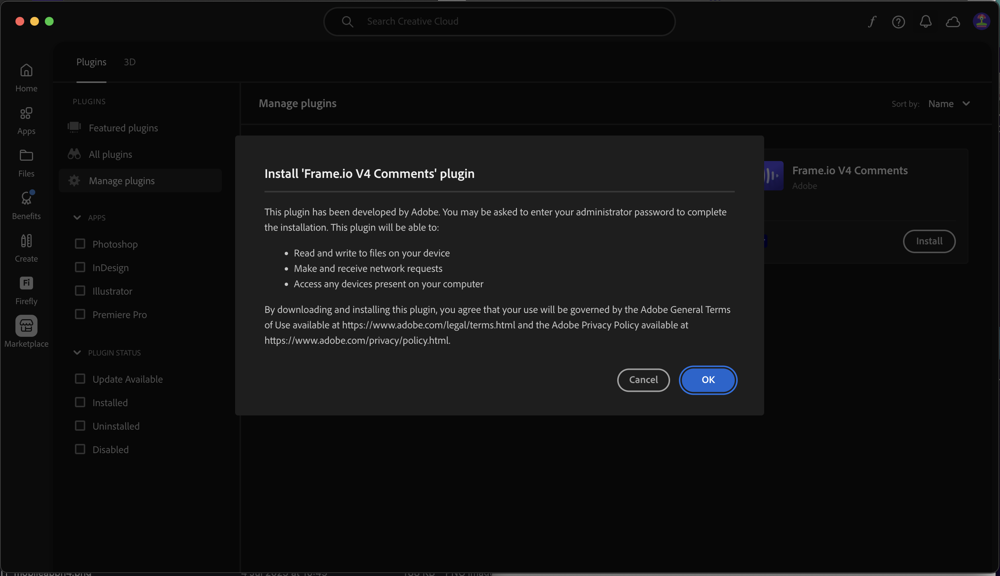

# 1.5.3 Frame.io e Premiere Pro

>[!NOTE]
>
> A captura de tela abaixo mostra um ambiente específico que está sendo usado. Quando você estiver assistindo a este tutorial, é muito provável que seu ambiente tenha um nome diferente. Quando se inscreveu neste tutorial, você recebeu os detalhes do ambiente que devem ser usados. Siga estas instruções.

Ir para [https://next.frame.io/](https://next.frame.io/). Verifique se você está conectado ao ambiente `--aepImsOrgName--`.

Caso não esteja conectado ao ambiente direito, clique no logotipo no canto inferior esquerdo e clique para selecionar o ambiente que precisa usar.

## 1.5.3.1 Configurar o Adobe Premiere Pro Beta

Você já instalou o Adobe Premiere Pro Beta como parte do módulo Introdução. Para usar o Frame.io em combinação com o Adobe Premiere Pro Beta, você pode usar o plug-in que foi desenvolvido para essa integração.

Abra o aplicativo Creative Cloud e procure por `frame.io`.

Role para baixo nos resultados da pesquisa para localizar os **Comentários de Frame.io V4** do plug-in. Clique nele.

Você deverá ver isso. Clique em **Instalar**.

Se o Adobe Premiere Pro Beta estiver aberto, será necessário **Fechar** primeiro antes de instalar o plug-in.

Clique em **OK**. O plug-in está sendo instalado.

Depois que o plug-in for instalado, abra o Adobe Premiere Pro Beta no computador.

## Próximas etapas

Ir para [Resumo e Benefícios](./summary.md){target="_blank"}

Volte para [Simplifique seu fluxo de trabalho com o Frame.io](./frameio.md){target="_blank"}

Voltar para [Todos os Módulos](./../../../overview.md){target="_blank"}
