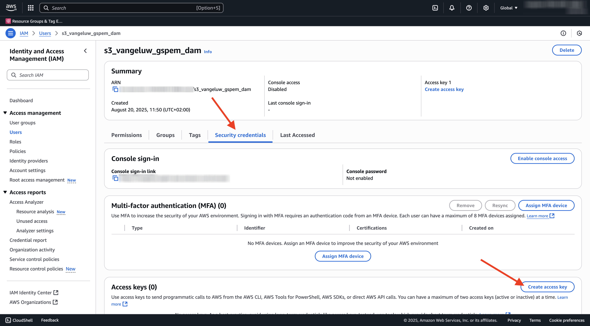
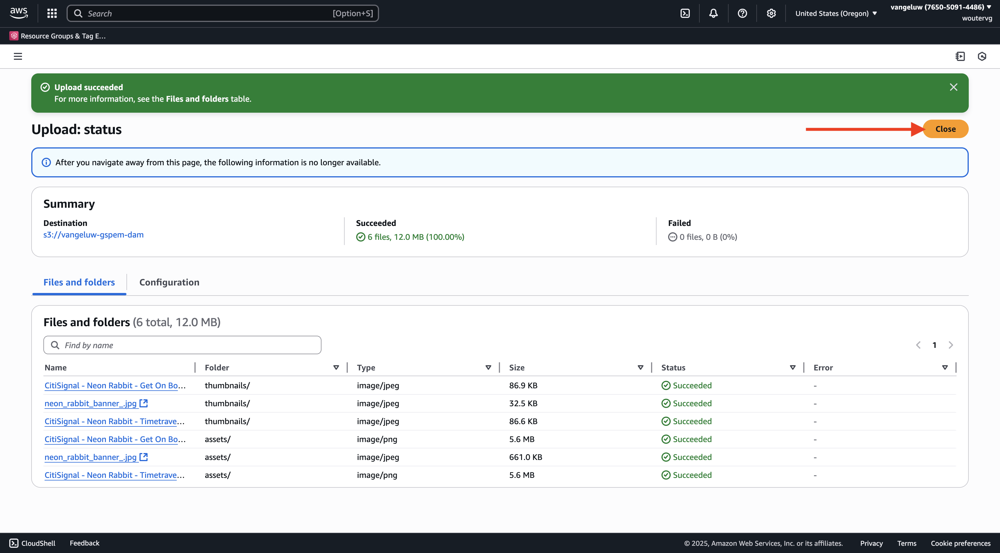

# 1.6.2 Criar o bucket do AWS S3

## 1.6.2.1 Crie seu bucket do S3

Vá para [https://console.aws.amazon.com](https://console.aws.amazon.com) e entre.

>[!NOTE]
>
>Se você ainda não tiver uma conta do AWS, crie uma nova conta do AWS usando seu endereço de email pessoal.

Depois de fazer logon, você será redirecionado para o **Console de Gerenciamento do AWS**.

Na barra de pesquisa, procure por **s3**. Clique no primeiro resultado da pesquisa: **S3 - Armazenamento Escalável na Nuvem**.

Você verá a página inicial do **Amazon S3**. Clique em **Criar bloco**.

Na tela **Criar Compartimento**, use o nome `--aepUserLdap---gspem-dam`.

Deixe todas as outras configurações padrão como estão. Role para baixo e clique em **Criar bloco**.

Você verá seu bucket ser criado e será redirecionado para a página inicial do Amazon S3.

## Definir permissões para acessar seu bucket do S3

A próxima etapa é configurar o acesso ao seu bucket do S3.

Para fazer isso, vá para [https://console.aws.amazon.com/iam/home](https://console.aws.amazon.com/iam/home).

O acesso aos recursos do AWS é controlado pelo Amazon Identity and Access Management (IAM).

Agora você verá esta página.

No menu esquerdo, clique em **Usuários**. Você verá a tela **Usuários**. Clique em **Criar usuário**.

Em seguida, configure o usuário:

- Nome de Usuário: use `s3_--aepUserLdap--_gspem_dam`

Clique em **Next**.

Em seguida, você verá essa tela de permissões. Clique em **Anexar políticas diretamente**.

Insira o termo de pesquisa **s3** para ver todas as políticas S3 relacionadas. Selecione a política **AmazonS3FullAccess**. Role para baixo e clique em **Próximo**.

Revise sua configuração. Clique em **Criar Usuário**.

Você verá isso. Clique em **Exibir Usuário**.

Clique em **Credenciais de segurança** e em **Criar chave de acesso**.

Selecione o **Aplicativo em execução fora do AWS**. Role para baixo e clique em **Próximo**.

Clique em **Criar chave de acesso**

Você verá isso. Clique em **Mostrar** para ver sua chave de acesso secreta:

Sua **Chave de acesso secreta** está sendo mostrada agora.

>[!IMPORTANT]
>
>Armazene suas credenciais em um arquivo de texto no computador.
>
> - ID da chave de acesso: ...
> - Chave de acesso secreta: ...
>
> Depois de clicar em **Concluído**, você nunca verá suas credenciais novamente!

Clique em **Concluído**.

Agora você criou um bucket do AWS S3 com êxito e um usuário com permissões para acessá-lo.

## 1.6.2.2 Carregue o Assets no seu bucket do S3

Na barra de pesquisa, procure por **s3**. Clique no primeiro resultado da pesquisa: **S3 - Armazenamento Escalável na Nuvem**.

Clique para abrir o bucket do S3 recém-criado, que deve ser nomeado como `--aepUserLdap---gspem-dam`.

Clique em **Carregar**.

Você deverá ver isso.

Você pode baixar arquivos de imagem CitiSignal [aqui](./images/package.zip){target="_blank"}.

Exporte os arquivos para a área de trabalho.

Clique em **Adicionar pasta**.

Selecione a pasta **assets** da pasta de download **package**. Clique em **Carregar**.

Você deverá ver isso. Clique novamente em **Adicionar pasta**.

Selecione a pasta **miniaturas** da pasta de download **pacote**. Clique em **Carregar**.

Você deverá ver isso. Clique em **Carregar**.

O upload foi concluído. Clique em **Fechar**.

Agora você deve ter essa estrutura de pastas no seu bucket do S3.

## Próximas etapas

Ir para [Criar seu aplicativo DAM externo](./ex3.md){target="_blank"}

Voltar para [GenStudio for Performance Marketing - Extensibilidade](./genstudioext.md){target="_blank"}

Voltar para [Todos os Módulos](./../../../overview.md){target="_blank"}
