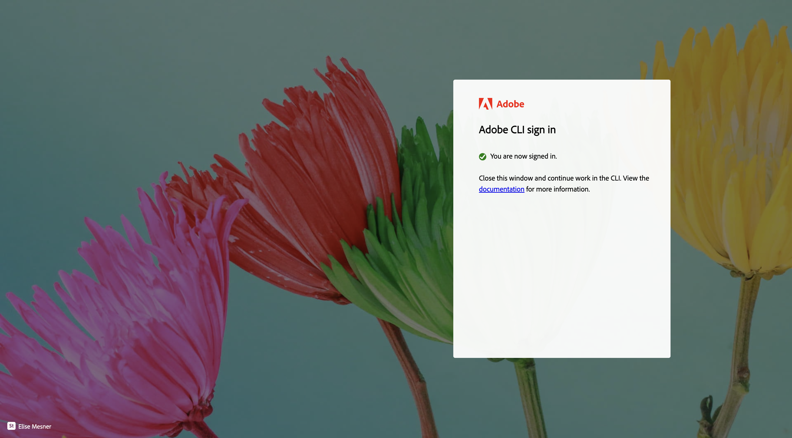
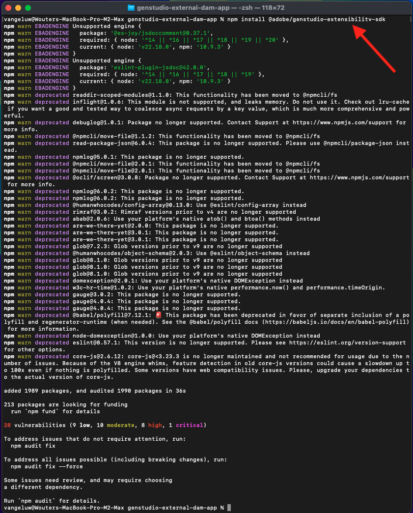

# 1.6.3 Criar e implantar o aplicativo DAM externo

## 1.6.3.1 Baixar arquivos de aplicativo de exemplo

Ir para [https://github.com/woutervangeluwe/genstudio-external-dam-app](https://github.com/woutervangeluwe/genstudio-external-dam-app). Clique em **Código** e selecione **Baixar ZIP**.


Descompacte o arquivo zip na área de trabalho.


## 1.6.3.2 Configurar a interface de linha de comando do Adobe Developer

Clique com o botão direito do mouse na pasta **genstudio-external-dam-app-main** e selecione **Novo terminal na pasta**.


Você deverá ver isso. Digite o comando `aio login`. Esse comando redirecionará para o navegador e espera que você faça logon.


Depois de fazer logon, você deve ver isso no navegador.



O navegador será redirecionado de volta para a janela do terminal. Você deve ver uma mensagem que diz **Logon bem-sucedido** e um token longo retornado pelo navegador.


A próxima etapa é configurar a instância e o projeto do Adobe IO que você usará para o aplicativo DAM externo.

Para fazer isso, é necessário baixar um arquivo do projeto do Adobe IO configurado anteriormente.

Vá para [https://developer.adobe.com/console/home](https://developer.adobe.com/console/home){target="_blank"} e abra o projeto criado anteriormente, denominado `--aepUserLdap-- GSPeM EXT`. Abra o espaço de trabalho **Produção**.


Clique em **Baixar tudo**. Isso baixará um arquivo JSON.


Copie o arquivo JSON do diretório **Downloads** para o diretório raiz do aplicativo DAM externo.


Volte para a janela do terminal. Digite o comando `aio app use XXX-YYY-Production.json`.

>[!NOTE]
>
>É necessário alterar o nome do arquivo no comando acima para corresponder ao nome do arquivo.

Depois que o comando for executado, o aplicativo DAM externo será conectado ao projeto do Adobe IO com o App Builder que você criou antes.


## 1.6.3.3 Instalar o GenStudio Extensibility SDK

Em seguida, você precisa instalar o **GenStudio Extensibility SDK**. Você pode encontrar mais detalhes sobre a SDK aqui: [https://github.com/adobe/genstudio-extensibility-sdk](https://github.com/adobe/genstudio-extensibility-sdk).

Para instalar o SDK, execute este comando na janela do terminal:

`npm install @adobe/genstudio-extensibility-sdk`


Após alguns minutos, o SDK será instalado.



## 1.6.3.4 Revise o aplicativo DAM externo no Visual Studio Code

Abra o Visual Studio Code. Clique em **Abrir...** para abrir uma pasta.


Selecione a pasta **genstudio-external-dam-app-main** que contém o aplicativo que você baixou antes. Clique em **Abrir**.


Clique para abrir o arquivo **.env**.


O arquivo **.env** foi criado pelo comando `aio app use` que você executou na etapa anterior e contém as informações necessárias para se conectar ao seu projeto do Adobe IO com o App Builder.


Agora é necessário adicionar os seguintes detalhes ao arquivo **.env**, para que o aplicativo DAM externo possa se conectar ao bucket do AWS S3 criado anteriormente.

```
AWS_ACCESS_KEY_ID=
AWS_SECRET_ACCESS_KEY=
AWS_REGION=
AWS_BUCKET_NAME=
```

Os campos **`AWS_ACCESS_KEY_ID`** e **`AWS_SECRET_ACCESS_KEY`** estavam disponíveis após a criação do usuário IAM no exercício anterior. Você foi solicitado a anotá-los, agora é possível copiar os valores.


O campo **`AWS_REGION`** pode ser retirado do modo de exibição Início do AWS S3, ao lado do nome do seu bucket. Neste exemplo, a região é **us-west-2**.


O campo **`AWS_BUCKET_NAME`** deve ser `--aepUserLdap---gspem-dam`.

Essas informações permitem atualizar os valores de cada uma dessas variáveis.

```
AWS_ACCESS_KEY_ID=XXX
AWS_SECRET_ACCESS_KEY=YYY
AWS_REGION=us-west-2
AWS_BUCKET_NAME=--aepUserLdap---gspem-dam
```

Agora você deve colar esse texto no arquivo `.env`. Não se esqueça de salvar suas alterações.


Em seguida, volte para a janela do terminal. Execute este comando:

`export $(grep -v '^#' .env | xargs)`


Por fim, é necessário alterar o rótulo que será exibido no GenStudio for Performance Marketing para poder distinguir o aplicativo DAM externo de outras integrações. Para fazer isso, abra o arquivo **Constants.ts**, que você pode encontrar aprofundando no explorador em **src/genstudiopem > web-src > src**.

A linha 14 precisa ser alterada para

`export const extensionLabel: string = "--aepUserLdap-- - External S3 DAM";`

Não se esqueça de salvar suas alterações.


## 1.6.3.5 Execute seu aplicativo DAM externo

Na janela do terminal, execute o comando `aio app run`. Você deve ver isso após 1-2 minutos.

>[!NOTE]
>
>Quando você executa o `aio app run` pela primeira vez, pode ser redirecionado para o navegador para aceitar um novo certificado. Se isso acontecer, aceite o certificado e você poderá continuar com as etapas abaixo.


Agora você confirmou que seu aplicativo está em execução. A próxima etapa é implantá-lo.

Primeiro, pressione **CTRL+C** para interromper a execução do aplicativo. Em seguida, insira o comando `aio app deploy`. Esse comando implantará seu código no Adobe IO.

Como resultado, você receberá um URL semelhante para acessar o aplicativo implantado:

`https://133309-201burgundyguan.adobeio-static.net/index.html`


Para fins de teste, agora você pode usar essa URL como um parâmetro de cadeia de caracteres de consulta adicionando `?ext=` como prefixo à URL acima. Isso resulta no seguinte parâmetro da cadeia de caracteres de consulta:

`?ext=https://133309-201burgundyguan.adobeio-static.net/index.html`

Ir para [https://experience.adobe.com/genstudio/create](https://experience.adobe.com/genstudio/create).


Em seguida, adicione o parâmetro da cadeia de caracteres de consulta antes de **#**. O novo URL deve ter esta aparência:

`https://experience.adobe.com/?ext=https://133309-201burgundyguan.adobeio-static.net/index.html#/@experienceplatform/genstudio/create`

A página será carregada normalmente. Clique em **Banners** para começar a criar um novo banner.


Selecione um modelo e clique em **Usar**.


Clique em **Selecionar do conteúdo**.


Você poderá selecionar seu DAM externo, que deve ser nomeado como `--aepUserLdap-- - External S3 DAM` na lista suspensa.


Você deverá ver isso. Selecione a imagem **neon_rabbit_banner.jpg** e clique em **Usar**.


Agora você selecionou uma imagem de seu DAM externo em execução em um bucket do S3. Com a imagem selecionada, agora é possível seguir o fluxo de trabalho normal documentado no exercício [1.3.3.4 Criar e aprovar Meta anúncio](./../module1.3/ex3.md#create--approve-meta-ad).


Ao fazer alterações no código em seu computador local, será necessário reimplantar seu aplicativo. Ao implantar novamente, use este comando de terminal:

`aio app deploy --force-build --force-deploy`


Seu aplicativo está pronto para ser publicado.

## Próximas etapas

Ir para [Publicar seu aplicativo de forma privada](./ex4.md){target="_blank"}

Voltar para [GenStudio for Performance Marketing - Extensibilidade](./genstudioext.md){target="_blank"}

Voltar para [Todos os Módulos](./../../../overview.md){target="_blank"}
