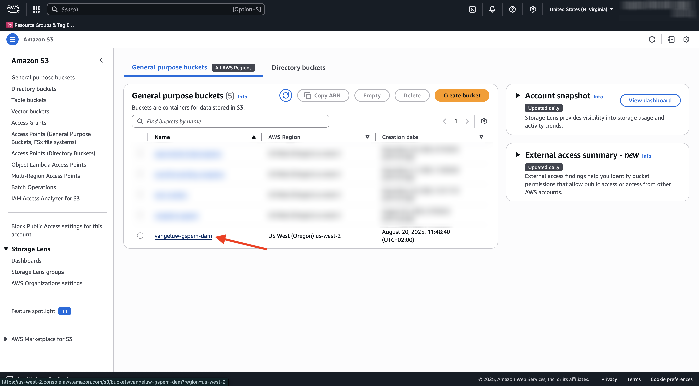
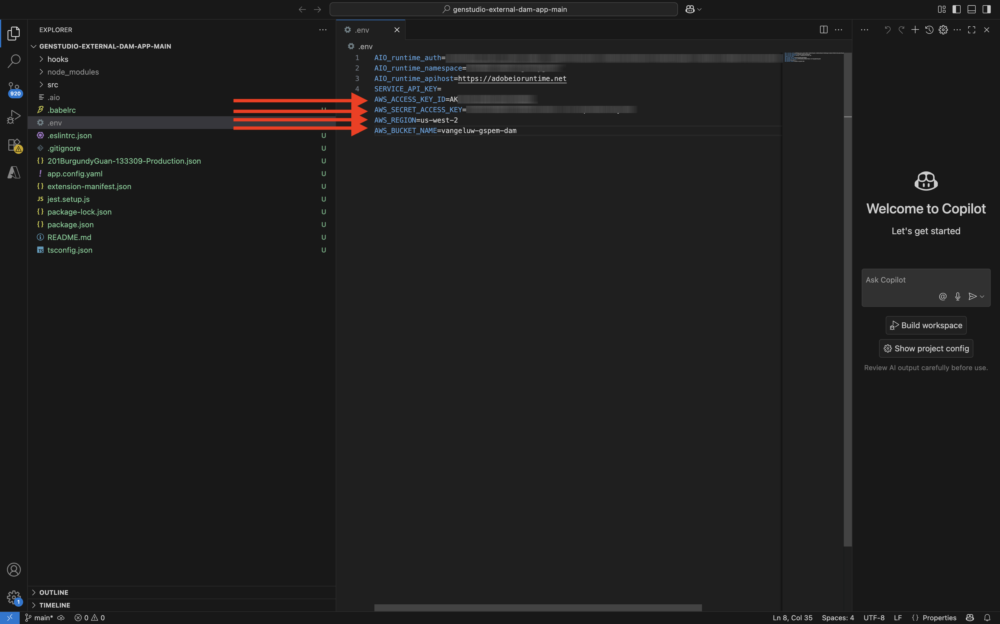

# 1.6.3 Criar aplicativo DAM externo

## 1.6.3.1 Baixar arquivos de aplicativo de exemplo

Ir para [https://github.com/adobe/genstudio-extensibility-examples](https://github.com/adobe/genstudio-extensibility-examples). Clique em **Código** e selecione **Baixar ZIP**.


Descompacte o arquivo zip na área de trabalho.


Abra a pasta **genstudio-extensibility-examples-main**. Você verá vários aplicativos de amostra. A pessoa de interesse para este exercício é o **genstudio-external-dam-app**.

Copie esse diretório e cole-o na área de trabalho.


Agora você deve ter isto em sua área de trabalho:


Para os próximos exercícios, você usará somente a pasta **genstudio-external-dam-app**.

## 1.6.3.2 Configurar a interface de linha de comando do Adobe Developer

Clique com o botão direito do mouse na pasta **genstudio-external-dam-app** e selecione **Novo terminal na pasta**.


Você deverá ver isso. Digite o comando `aio login`. Esse comando redirecionará para o navegador e espera que você faça logon.


Depois de fazer logon, você deve ver isso no navegador.


O navegador será redirecionado de volta para a janela do terminal. Você deve ver uma mensagem que diz **Logon bem-sucedido** e um token longo retornado pelo navegador.


A próxima etapa é configurar a instância e o projeto do Adobe IO que você usará para o aplicativo DAM externo.

Para fazer isso, é necessário baixar um arquivo do projeto do Adobe IO configurado anteriormente.

Vá para [https://developer.adobe.com/console/home](https://developer.adobe.com/console/home){target="_blank"} e abra o projeto criado anteriormente, denominado `--aepUserLdap-- GSPeM EXT`. Abra o espaço de trabalho **Produção**.


Clique em **Baixar tudo**. Isso baixará um arquivo JSON.


Copie o arquivo JSON do diretório **Downloads** para o diretório raiz do aplicativo DAM externo.


Volte para a janela do terminal. Digite o comando `aio app use XXX-YYY-Production.json`.

>[!NOTE]
>
>É necessário alterar o nome do arquivo para corresponder ao nome do seu arquivo.

Depois que o comando for executado, o aplicativo DAM externo será conectado ao projeto do Adobe IO com o App Builder que você criou antes.


## 1.6.3.3 Instalar o GenStudio Extensibility SDK

Em seguida, você precisa instalar o **GenStudio Extensibility SDK**. Você pode encontrar mais detalhes sobre a SDK aqui: [https://github.com/adobe/genstudio-extensibility-sdk](https://github.com/adobe/genstudio-extensibility-sdk).

Para instalar o SDK, execute este comando na janela do terminal:

`npm install @adobe/genstudio-extensibility-sdk`


Após alguns minutos, o SDK será instalado.


## 1.6.3.4 Revise o aplicativo DAM externo no Visual Studio Code

Abra o Visual Studio Code. Clique em **Abrir...** para abrir uma pasta.


Selecione a pasta **genstudio-external-dam-app** que contém o aplicativo que você baixou antes.


Clique para abrir o arquivo **.env**.


O arquivo **.env** foi criado pelo comando `aio app use` que você executou na etapa anterior e contém as informações necessárias para se conectar ao seu projeto do Adobe IO com o App Builder.


Agora é necessário criar dois novos arquivos na raiz da pasta:

- `.env.dev`. Clique no botão **Novo Arquivo** e digite o nome de arquivo `.env.dev`.


- `.env.prod`.  Clique no botão **Novo Arquivo** e digite o nome de arquivo `.env.prod`.


Esses arquivos conterão as credenciais necessárias para se conectar ao AWS S3 bucket criado anteriormente.

```
AWS_ACCESS_KEY_ID=
AWS_SECRET_ACCESS_KEY=
AWS_REGION=
AWS_BUCKET_NAME=
```

Os campos **AWS_ACCESS_KEY_ID** e **AWS_SECRET_ACCESS_KEY** estavam disponíveis após a criação do usuário IAM no exercício anterior. Você foi solicitado a anotá-los, agora é possível copiar os valores.


O campo **AWS_REGION** pode ser retirado do modo de exibição Início do AWS S3, ao lado do nome do seu bucket. Neste exemplo, a região é **us-west-2**.



O campo **AWS_BUCKET_NAME** deve ser `--aepUserLdap---gspem-dam`.

Essas informações permitem atualizar os valores de cada uma dessas variáveis.

```
AWS_ACCESS_KEY_ID=XXX
AWS_SECRET_ACCESS_KEY=YYY
AWS_REGION=us-west-2
AWS_BUCKET_NAME=--aepUserLdap---gspem-dam
```

Agora você deve colar esse texto em ambos os arquivos, `.env.dev` e `.env.prod`. Não se esqueça de salvar suas alterações.




Em seguida, volte para a janela do terminal. Execute este comando:

`export $(grep -v '^#' .env.dev | xargs)`


## 1.6.3.5 Execute seu aplicativo DAM externo

Na janela do terminal, execute o comando `aio app run`. Você deve ver isso após 1-2 minutos.


## Próximas etapas

Vá para [Implante seu código e publique seu aplicativo de forma privada](./ex4.md){target="_blank"}

Voltar para [GenStudio for Performance Marketing - Extensibilidade](./genstudioext.md){target="_blank"}

Voltar para [Todos os Módulos](./../../../overview.md){target="_blank"}
