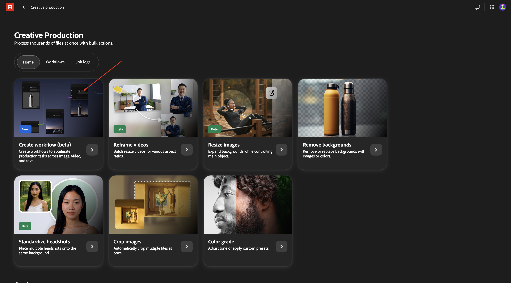
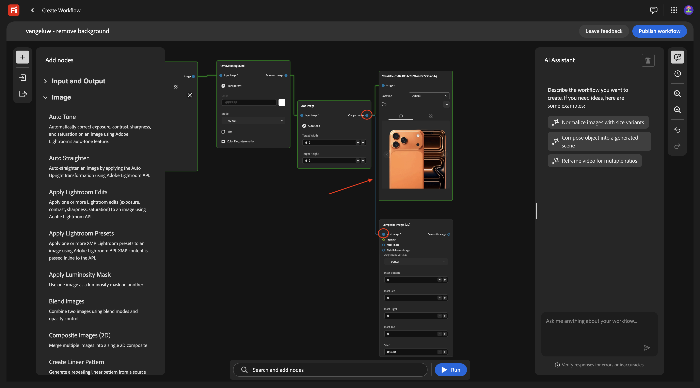
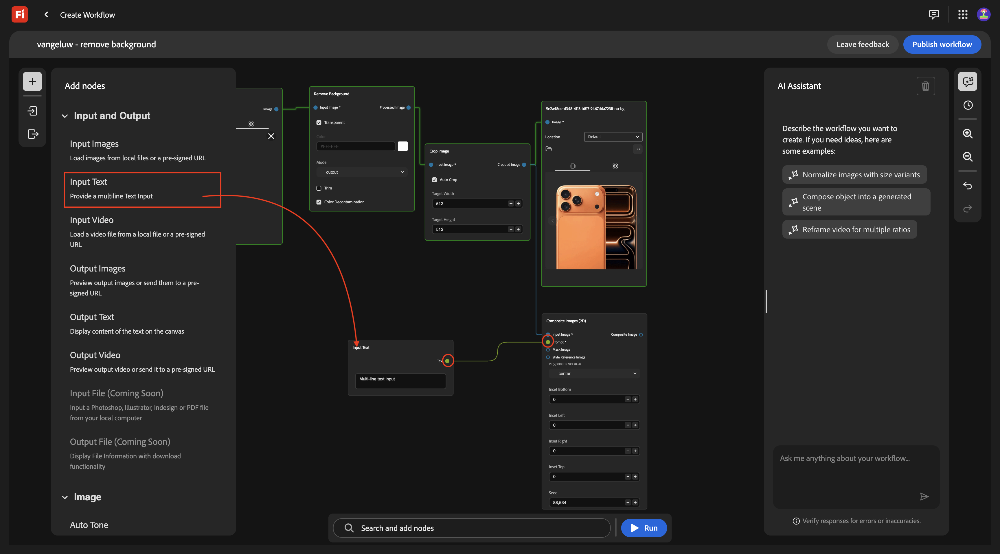
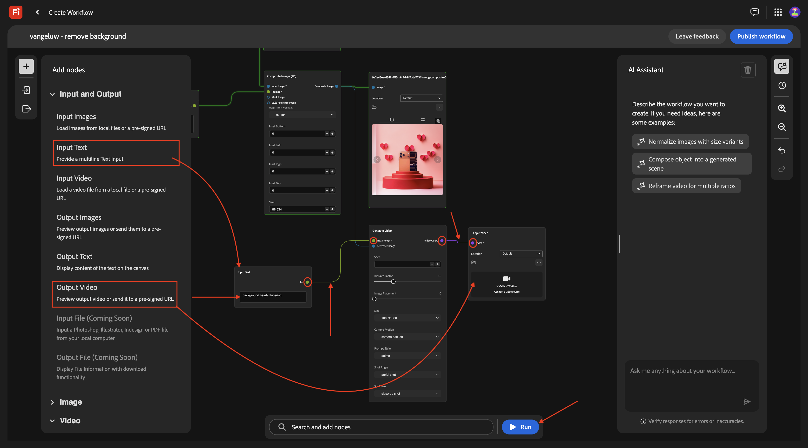
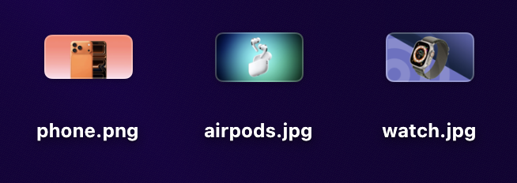
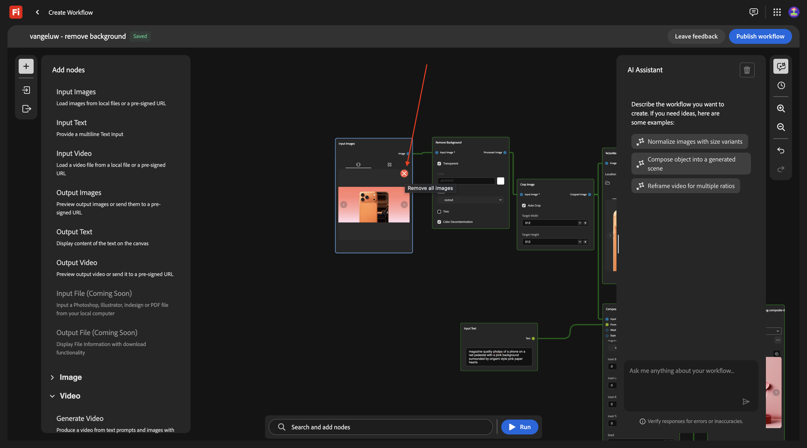
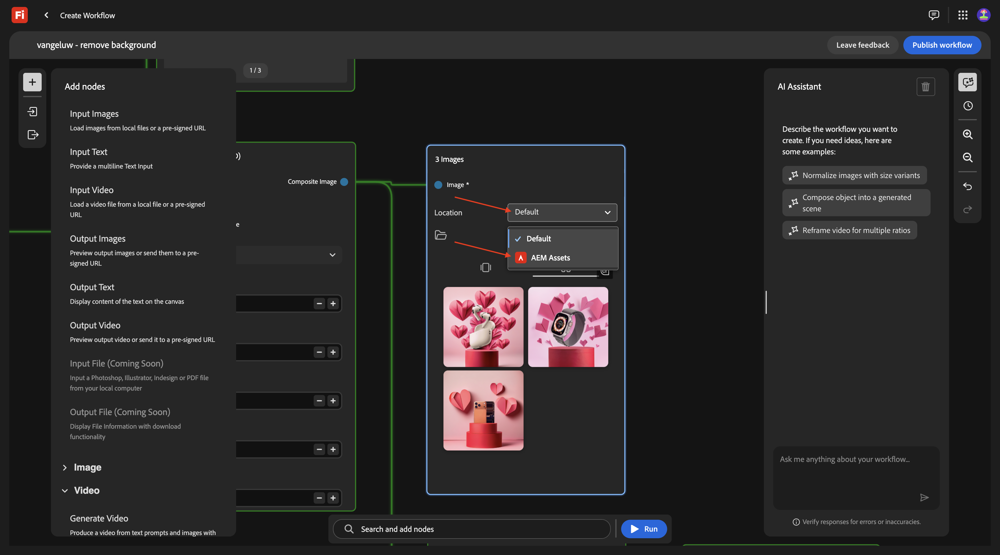

# 1.7.1 Introdução ao Firefly Creative Production for Enterprise

Ir para [https://firefly.adobe.com](https://firefly.adobe.com). Clique no ícone de perfil no canto superior direito e verifique se você selecionou a instância correta, que deve ser `--aepImsOrgName--`.

Ir para **Produção**.

Você deverá ver isso. Clique em **Criar workflow (beta)**.

## 1.7.1.1 Remover plano de fundo

Para conhecer o Firefly Creative Production for Enterprise, agora você implementará um caso de uso básico que se concentra na remoção do plano de fundo de uma imagem específica.

Altere o nome do fluxo de trabalho para `vangeluw - remove background`.

Abra a **Imagem**

Selecione **Remover Plano de Fundo** e arraste e solte este nó na tela.

Agora é necessário conectar um nó de imagem de entrada e um nó de imagem de saída ao **Remover Plano de Fundo**.

Role para cima e vá para **Entrada e Saída**. Clique no nó **Imagens de Entrada** e arraste-o para a tela.

Você deveria ficar com isso. Conecte o nó **Imagens de Entrada** ao nó **Remover Plano de Fundo** passando o cursor sobre o ponto azul ao lado de **Imagem** no nó **Imagens de Entrada** e desenhando uma linha para o ponto azul ao lado de **Imagem de Entrada** no nó **Remover Plano de Fundo**.

Você deveria ficar com isso. Em seguida, clique no nó **Imagens de saída** e arraste-o para a tela.

Você deveria ficar com isso. Conecte o nó **Remover Plano de Fundo** ao nó **Imagens de Saída** passando o cursor sobre o ponto azul ao lado de **Imagem de Saída** no nó **Remover Plano de Fundo** e desenhando uma linha para o ponto azul ao lado de **Imagem** no nó **Imagens de Saída**.

Você deveria ficar com isso.

O fluxo de trabalho básico agora está pronto para teste. Baixe a imagem [phone.png](./assets/phone.png) na área de trabalho.

Volte para o seu fluxo de trabalho. Clique na área **Arrastar e soltar** do nó **Imagens de Entrada**.

Selecione o arquivo **phone.png**. Clique em **Abrir**.

Você deverá ver isso. Clique em **Executar**.

Após 1-2 minutos, você deve ver esse resultado.

## 1.7.1.2 Remover plano de fundo + Cortar

Agora você deve adicionar um nó **Cortar** à tela. No menu, vá para **Imagem** e role para baixo até encontrar **Recortar**. Arraste-o para a tela.

Posicione o nó **Cortar** entre o nó **Remover Plano de Fundo** e o nó **Imagem de Saída**.

Agora é necessário remover a conexão entre o nó **Remover Plano de Fundo** e o nó **Imagem de Saída**. Você pode fazer isso clicando duas vezes na linha entre os dois nós.

Você deveria ficar com isso. Conecte o nó **Remover Plano de Fundo** ao nó **Cortar** e conecte o nó **Cortar** ao nó **Imagem de Saída**.

Marque a caixa de seleção para **Cortar automaticamente** e teste seu fluxo de trabalho clicando em **Executar**.

Após 1-2 minutos, você deve ver isso, que mostra uma imagem com uma resolução diferente agora.

## 1.7.1.3 Remover plano de fundo + Cortar + Imagem composta

No menu, em **Imagem**, selecione um nó **Imagens Compostas (2D)** e arraste-o para a tela.

Adicione uma segunda conexão ao nó **Cortar**, conectando o ponto azul ao lado da **Imagem cortada** ao ponto azul ao lado da **Imagem de entrada** no nó **Imagens Compostas (2D)**.

No menu, em **Entrada e Saída**, selecione um nó **Texto de Entrada** e arraste-o para a tela.

Conecte o ponto verde ao lado de **Texto** no nó **Texto de Entrada** ao ponto verde ao lado de **Prompt** no nó **Imagens Compostas (2D)**.

Você deveria ficar com isso. Digite o prompt abaixo no nó **Texto de Entrada**.

`magazine quality photo of a phone on a red pedestal with a pink background surrounded by origami style pink paper hearts`

No menu, em **Entrada e Saída**, selecione um nó **Imagens de Saída** e arraste-o para a tela.

Conecte o ponto azul ao lado de **Imagem composta** no nó **Imagens compostas (2D)** ao ponto azul ao lado de **Imagem de entrada** no nó **Imagem de saída**.

Clique em **Executar**.

Após alguns minutos, você verá algo como isso, que mostra sua imagem original em uma composição com base no prompt fornecido, em uma resolução específica.

## 1.7.1.4 Remover plano de fundo + Cortar + Imagem composta + Gerar vídeo

No menu, vá para **Vídeo**. Selecione o nó **Gerar vídeo** e arraste-o para a tela.

Conecte o ponto azul ao lado de **Imagem composta** do nó **Imagens compostas (2D)** ao ponto azul ao lado de **Imagem de entrada** do nó **Gerar vídeo**.

No menu, vá para **Entrada e Saída**. Selecione o nó **Texto de Entrada** e arraste-o para a tela.

Conecte o ponto verde ao lado de **Texto** no nó **Texto de Entrada** ao ponto verde ao lado de **Prompt** do nó **Gerar Vídeo**.

Digite o prompt `background hearts fluttering` no nó **Texto de entrada**.

No menu, vá para **Entrada e Saída**. Selecione o nó **Vídeo de saída** e arraste-o para a tela.

Conecte o ponto violeta ao lado de **Saída de Vídeo** do nó **Gerar Vídeo** ao ponto violeta ao lado de **Vídeo** no nó **Vídeo de Saída**.

Clique em **Executar**.

Depois de alguns vídeos, você verá isto, que mostra um vídeo com base na combinação da imagem e do prompt fornecidos.

## Escala de 1.7.1.5

Você fez isso para 1 imagem. Agora vamos usar esse fluxo de trabalho, só que para várias imagens.

Baixe estas imagens no seu desktop:

- [watch.jpg](./assets/watch.jpg)
- [airpods.jpg](./assets/airpods.jpg)

No seu fluxo de trabalho, volte para o primeiro nó, **Imagens de Entrada**. Remove a imagem atualmente selecionada.

Clique na área **Arrastar e soltar**.

Selecione as 3 imagens que você baixou. Clique em **Abrir**.

Você deverá ver isso. clique em **Executar**.

Após vários minutos, você deve ver uma saída semelhante, com 3 imagens sendo geradas e 3 vídeos.

## 1.7.1.5 Armazenamento no AEM Assets CS

Neste exercício, você armazenará os ativos criados como parte do fluxo de trabalho personalizado no AEM Assets CS.

Primeiro, você deve criar uma nova pasta no ambiente do AEM Assets CS.

Para fazer isso, vá para [https://experience.adobe.com](https://experience.adobe.com). Clique para abrir o **Experience Manager Assets**.

Selecione o ambiente do AEM Assets CS, que deve se chamar `--aepUserLdap-- - CitiSignal AEM + ACCS`.

Vá para **Assets** e clique em **Criar Pasta**.

Digite o nome: `--aepUserLdap-- - Firefly Creative Production for Enterprise`. Clique em **Criar**.

Volte para o seu fluxo de trabalho personalizado e vá para o nó **Imagens de saída**. Clique em **Padrão** e selecione **AEM Assets**.

Você deverá ver esse pop-up. Selecione o repositório do AEM Assets CS e a pasta que acabou de criar, que deve se chamar: `--aepUserLdap-- - Firefly Creative Production for Enterprise`. Clique em **Selecionar**.

Vá para o nó **Vídeo de Saída**. Clique em **Padrão** e selecione **AEM Assets**.

Você deverá ver esse pop-up. Selecione o repositório do AEM Assets CS e a pasta que acabou de criar, que deve se chamar: `--aepUserLdap-- - Firefly Creative Production for Enterprise`. Clique em **Selecionar**.

Você deveria ficar com isso. Clique em **Executar**.

Após alguns minutos, você deve ver os ativos criados se tornarem disponíveis na pasta no AEM Assets CS.

Volte para o seu fluxo de trabalho. Clique em **Publicar**.

Você deverá ver isso.

Seu fluxo de trabalho agora está publicado e pode ser executado programaticamente como parte do próximo exercício.

## Próximas etapas

Ir para [1.7.2 Executar o fluxo de trabalho personalizado programaticamente](./ex2.md){target="_blank"}

Voltar para [Firefly Creative Production for Enterprise](./workflowbuilder.md){target="_blank"}

Voltar para [Todos os Módulos](./../../../overview.md){target="_blank"}
