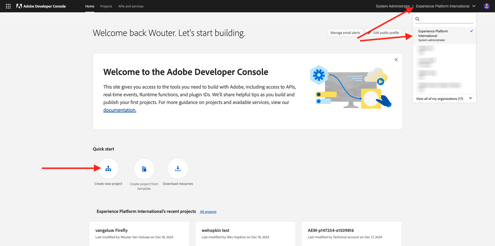
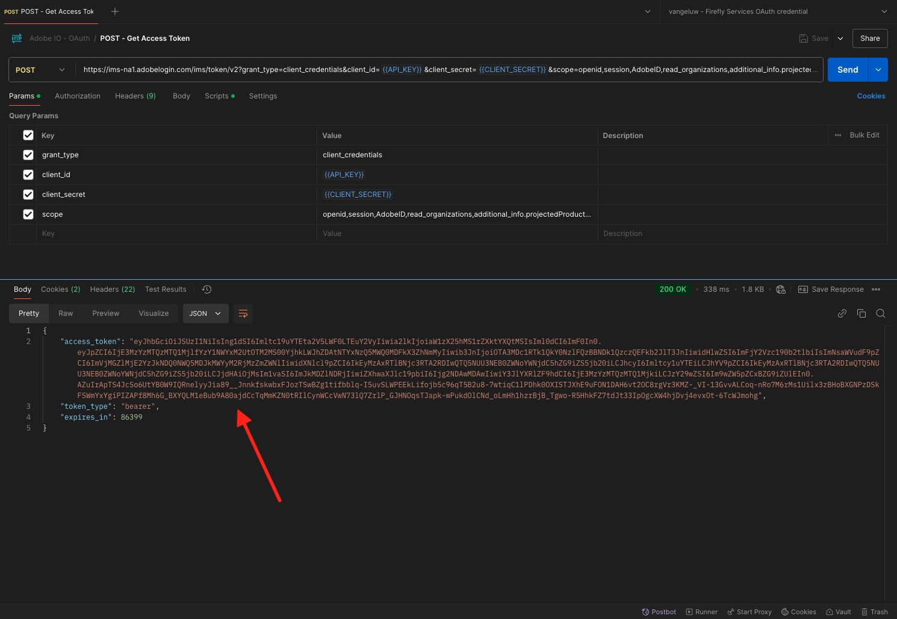

# 1.1.1 Introdução aos serviços Firefly

Neste exercício, você usará o Postman e o Adobe I/O para consultar APIs de serviços de Adobe Firefly.

## Configurar o projeto do Adobe I/O

Neste exercício, você usará o Adobe I/O de forma bastante intensa para consultar as APIs de serviços do Firefly. Siga as etapas abaixo para configurar o Adobe I/O.

Ir para [https://developer.adobe.com/console/home](https://developer.adobe.com/console/home)

Selecione a instância correta no canto superior direito da tela. Sua instância é `--aepImsOrgName--`. Clique em **Criar novo projeto**.

Selecione **+ Adicionar ao Projeto** e selecione **API**.

Você verá isto:

Selecione **Creative Cloud** e clique em **Firefly - Firefly Services**. Clique em **Next**.

Agora vocês verão isto. Forneça um nome para a credencial: `--aepUserLdap-- - Firefly Services OAuth credential`. Clique em **Next**.

Em seguida, é necessário selecionar um perfil de produto que definirá quais permissões estão disponíveis para essa integração.

Selecione o perfil **Configuração de serviços de Firefly padrão**.

Clique em **Salvar API configurada**.

Sua integração de Adobe I/O está pronta.

Clique no botão **Baixar para Postman** e em **OAuth Server-to-Server** para baixar um ambiente do Postman.

Seu projeto IO atualmente tem um nome genérico. É necessário dar um nome amigável à integração. Clique em **Projeto X** (ou nome semelhante) conforme indicado

Clique em **Editar projeto**.

Digite um nome para sua integração: `--aepUserLdap-- Firefly`.

Clique em **Salvar**.

A configuração da integração do Adobe I/O foi concluída.

## Autenticação Postman para Adobe I/O

Ir para [https://www.postman.com/downloads/](https://www.postman.com/downloads/).

Baixe e instale a versão relevante do Postman para seu sistema operacional.

Após a instalação do Postman, inicie o aplicativo.

No Postman, há dois conceitos: Ambientes e Coleções.

- O arquivo de ambiente contém todas as variáveis de ambiente mais ou menos consistentes. No ambiente, você encontrará informações como o IMSOrg do seu ambiente Adobe, além de credenciais de segurança como a ID do cliente e outras. O arquivo de ambiente é o que você baixou durante a configuração do Adobe I/O no exercício anterior, ele é nomeado assim: **`oauth_server_to_server.postman_environment.json`**.

- A coleção contém várias solicitações de API que podem ser usadas. Usaremos 2 coleções
   - 1 coleção para autenticação no Adobe I/O
   - 1 Coleta para os exercícios neste módulo

Baixe o arquivo [postman.zip](./../../../assets/postman/postman-ff.zip) no desktop local.

Neste arquivo **postman.zip**, você encontrará os seguintes arquivos:

- `Adobe IO - OAuth.postman_collection.json`
- `FF - Firefly Services Tech Insiders.postman_collection.json`

Descompacte o arquivo **postman-ff.zip** e armazene esses 2 arquivos em uma pasta em seu desktop, juntamente com o ambiente Postman baixado do Adobe I/O, que é o arquivo `oauth_server_to_server.postman_environment.json`. Você precisa ter estes três arquivos nessa pasta:

Volte para o Postman. Clique em **Importar**.

Clique em **arquivos**.

Navegue até a pasta na área de trabalho em que você extraiu os 2 arquivos baixados. Selecione estes 3 arquivos ao mesmo tempo e clique em **Abrir**.

Depois de clicar em **Abrir**, o Postman mostrará uma visão geral do Ambiente e das Coleções que você está prestes a importar. Clique em **Importar**.

Agora você tem tudo o que precisa no Postman para começar a interagir com os Serviços Firefly por meio das APIs.

A primeira coisa a fazer é verificar se você está autenticado corretamente. Para ser autenticado, é necessário solicitar um token de acesso.

Verifique se você selecionou o ambiente correto antes de executar qualquer solicitação. Você pode verificar o Ambiente selecionado no momento verificando a lista suspensa Ambiente no canto superior direito.

O Ambiente selecionado deve ter um nome semelhante a este, `--aepUserLdap-- Firefly Services OAuth Credential`.

O ambiente e as coleções do Postman agora estão configurados e funcionando. Agora você pode autenticar do Postman para o Adobe I/O.

Na coleção **Adobe IO - OAuth**, selecione a solicitação com o nome **POST - Obter Token de Acesso**. Você verificará que em **Params**, 2 variáveis estão sendo referenciadas, `API_KEY` e `CLIENT_SECRET`. Essas variáveis foram obtidas do ambiente selecionado, `--aepUserLdap-- Firefly Services OAuth Credential`.

Clique em **Enviar**.

Depois de clicar em **Enviar**, você verá uma resposta exibida na seção **Corpo** do Postman:

Se a configuração tiver sido bem-sucedida, você verá uma resposta semelhante que contém as seguintes informações:

| Chave | Valor |
|:-------------:| :---------------:| 
| token_type | **portador** |
| access_token | **keyJhbGciOiJSU...** |
| expires_in | **86399** |

O Adobe I/O deu a você um **bearer**-token, com um valor específico (o access_token muito longo) e uma janela de expiração.

O token que recebemos agora é válido por 24 horas. Isso significa que, após 24 horas, se você quiser usar o Postman para autenticar no Adobe I/O, precisará gerar um novo token executando essa solicitação novamente.

## API de serviços do Firefly, imagem de texto 2

Agora é possível enviar sua primeira solicitação para as APIs de serviços do Firefly.

Na coleção **FF - Firefly Services Tech Insiders**, selecione a solicitação com o nome **POST - Firefly - T2I V3**. Na seção **Corpo**, você verá um prompt padrão informando `Horses in a field`. Clique em **Enviar** para que os Serviços Firefly gerem essa imagem.

Você verá uma resposta semelhante, contendo um URL de imagem. Copie o URL da imagem e abra-o no navegador da Web.

Você verá uma bela imagem representando `horses in a field`.

Fique à vontade para brincar com a solicitação da API antes de continuar com o próximo exercício.

Próxima Etapa: [1.1.2 Solicitar imagens com especificações](./ex2.md)

[Voltar ao módulo 1.1](./firefly-services.md)

[Voltar a todos os módulos](./../../../overview.md)
