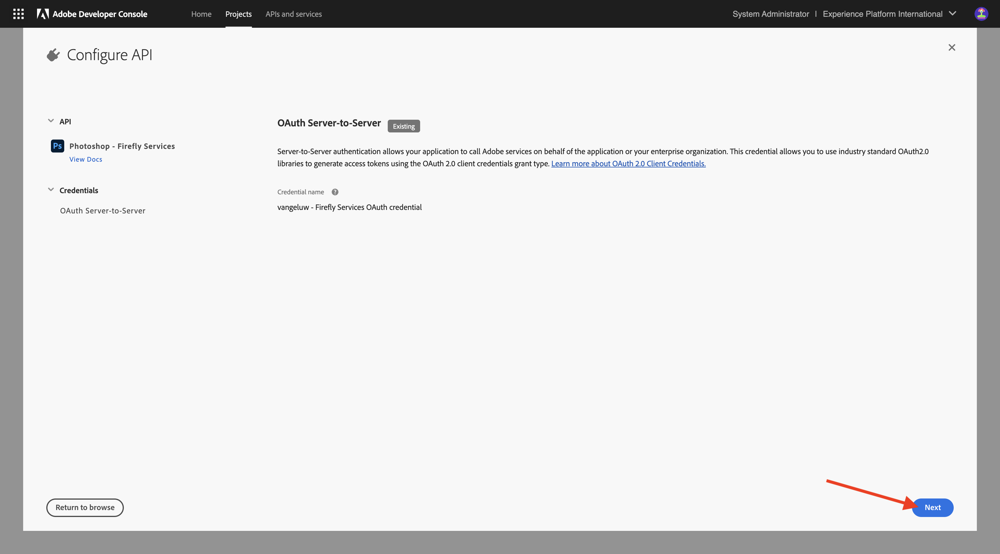

# Trabalho com APIs do Photoshop

Saiba como trabalhar com as APIs da Photoshop e os Serviços de Firefly.

## Atualizar a integração do Adobe I/O

1. Ir para [https://developer.adobe.com/console/home](https://developer.adobe.com/console/home){target="_blank"}.


1. Vá para **Projetos** e selecione o projeto criado no exercício anterior, chamado `--aepUserLdap-- Firefly`.


1. Selecione **+ Adicionar ao Projeto** e **API**.


1. Selecione **Creative Cloud** e escolha **Photoshop - Firefly Services**. Selecione **Próximo**.


1. Selecione **Próximo**.



Em seguida, é necessário selecionar um perfil de produto que defina quais permissões estão disponíveis para essa integração.

1. Selecione **Configuração padrão dos serviços de Firefly** e **Configuração padrão dos serviços de automação de Creative Cloud**.

1. Selecione **Salvar API configurada**.


Seu projeto Adobe I/O foi atualizado para funcionar com as APIs de serviços Photoshop e Firefly.


## Interagir programaticamente com um arquivo PSD

1. Baixe o [citisignal-fiber.psd](./../../../assets/ff/citisignal-fiber.psd){target="_blank"} na área de trabalho.

1. Abra **citisignal-fiber.psd** no Photoshop.


No painel **Camadas**, o designer do arquivo deu um nome exclusivo a cada camada. Você pode ver as informações da camada abrindo o arquivo PSD no Photoshop, mas também pode fazer isso de forma programática.

Vamos enviar sua primeira solicitação de API para APIs do Photoshop.

1. No Postman, antes de enviar solicitações de API para o Photoshop, é necessário autenticar no Adobe I/O. Abra a solicitação anterior com o nome **POST - Obter Token de Acesso**.

1. Vá para **Params** e verifique se o parâmetro **Scope** está definido corretamente. O **Valor** para **Escopo** deve ser semelhante a:

`openid,session,AdobeID,read_organizations,additional_info.projectedProductContext, ff_apis, firefly_api`

1. Selecione **Enviar**.


Agora você tem um token de acesso válido para interagir com as APIs do Photoshop.


### API do Photoshop - Hello World

Em seguida, vamos dizer olá para as APIs do Photoshop para testar se todas as permissões e o acesso estão definidos corretamente.

1. Na coleção **Photoshop**, abra a solicitação **Photoshop Hello (Test Auth.)**. Selecione **Enviar**.


Você deve receber a resposta **Bem-vindo à API do Photoshop!**.


Em seguida, para interagir programaticamente com o arquivo PSD **citisignal-fiber.psd**, você precisa carregá-lo na sua conta de armazenamento. Você pode fazer isso manualmente — arrastando e soltando-o no contêiner usando o Azure Storage Explorer — mas dessa vez você deve fazer isso por meio da API.

### Carregar PSD para o Azure

1. No Postman, abra a solicitação **Fazer upload do PSD para a conta de armazenamento do Azure**. No exercício anterior, você configurou essas variáveis de ambiente no Postman, que serão usadas agora:

- `AZURE_STORAGE_URL`
- `AZURE_STORAGE_CONTAINER`
- `AZURE_STORAGE_SAS_READ`
- `AZURE_STORAGE_SAS_WRITE`

Como você pode ver na solicitação **Carregar PSD para a Conta de Armazenamento do Azure**, a URL está configurada para usar essas variáveis.


1. Em **Body**, selecione o arquivo **citisignal-fiber.psd**.


1. Sua tela deve ter esta aparência. Selecione **Enviar**.


Você deve obter essa resposta vazia do Azure, o que significa que seu arquivo está armazenado no contêiner na sua conta de Armazenamento do Azure.


Se você usar o Azure Storage Explorer para examinar seu arquivo, atualize sua pasta.


### API do Photoshop - Obter manifesto

Em seguida, é necessário obter o arquivo de manifesto do arquivo PSD.

1. No Postman, abra a solicitação **Photoshop - Obter Manifesto de PSD**. Ir para **Corpo**.

O corpo deve ter esta aparência:

```json
{
  "inputs": [
    {
      "storage": "external",
      "href": "{{AZURE_STORAGE_URL}}/{{AZURE_STORAGE_CONTAINER}}/citisignal-fiber.psd{{AZURE_STORAGE_SAS_READ}}"
    }
  ],
  "options": {
    "thumbnails": {
      "type": "image/jpeg"
    }
  }
}
```

1. Selecione **Enviar**.

Na resposta, agora você vê um link. Como as operações no Photoshop às vezes podem levar algum tempo para serem concluídas, o Photoshop fornece um arquivo de status como resposta à maioria das solicitações recebidas. Para entender o que está acontecendo com sua solicitação, você precisa ler o arquivo de status.


1. Para ler o arquivo de status, abra a solicitação **Photoshop - Obter Status PS**. Você pode ver que esta solicitação está usando uma variável como URL, que é uma variável definida pela solicitação anterior enviada, **Photoshop - Obter Manifesto de PSD**. As variáveis estão definidas nos **Scripts** de cada solicitação. Selecione **Enviar**.


Sua tela deve ter esta aparência. Atualmente, o status está definido como **pendente**, o que significa que o processo ainda não foi concluído.


1. Selecione para enviar mais algumas vezes no **Photoshop - Obter Status PS**, até que o status seja alterado para **bem-sucedido**. Isso pode levar alguns minutos.

Quando a resposta estiver disponível, você poderá ver que o arquivo json contém informações sobre todas as camadas do arquivo PSD. Essas informações são úteis, pois é possível identificar o nome ou a ID da camada.


Como exemplo, pesquise pelo texto `2048x2048-cta`. Sua tela deve ter esta aparência:


### API do Photoshop - Alterar texto

Em seguida, é necessário alterar o texto da chamada para ação usando as APIs.

1. No Postman, abra a solicitação **Photoshop - Alterar Texto** e vá para **Corpo**.

Sua tela deve ter esta aparência:

- primeiro, um arquivo de entrada é especificado: `citisignal-fiber.psd`
- segundo, a camada a ser alterada é especificada, com o texto a ser alterado para
- terceiro, um arquivo de saída foi especificado: `citisignal-fiber-changed-text.psd`

```json
{
  "inputs": [
    {
      "storage": "external",
      "href": "{{AZURE_STORAGE_URL}}/{{AZURE_STORAGE_CONTAINER}}/citisignal-fiber.psd{{AZURE_STORAGE_SAS_READ}}"
    }
  ],
  "options": {
    "layers": [
      {
        "name": "2048x2048-cta",
        "text": {
          "content": "Get Fiber now!"
        }
      }
    ]
  },
  "outputs": [
    {
      "storage": "azure",
      "href": "{{AZURE_STORAGE_URL}}/{{AZURE_STORAGE_CONTAINER}}/citisignal-fiber-changed-text.psd{{AZURE_STORAGE_SAS_WRITE}}",
      "type": "vnd.adobe.photoshop",
      "overwrite": true
    }
  ]
}
```

O arquivo de saída tem um nome diferente, porque você não deseja substituir o arquivo de entrada original.

1. Selecione **Enviar**.


Assim como antes, a resposta contém um link que aponta para o arquivo de status que acompanha o progresso.


1. Para ler o arquivo de status, abra a solicitação **Photoshop - Obter Status PS** e selecione **Enviar**. Se o status não estiver definido como **êxito** imediatamente, aguarde alguns segundos e selecione **Enviar** novamente.

1. Selecione o URL para baixar o arquivo de saída.


1. Abra **citisignal-fiber-changed-text.psd** depois de baixar o arquivo no computador. Você deve ver que o espaço reservado para a chamada à ação foi substituído pelo texto **Obter fibra agora!**.


Você também pode ver esse arquivo em seu contêiner usando o explorador do Armazenamento do Azure.


## Próximas etapas

Ir para [API de Modelos Personalizados do Firefly](./ex4.md){target="_blank"}

Retorne para [Visão Geral dos Serviços Adobe Firefly](./firefly-services.md){target="_blank"}

Voltar para [Todos os Módulos](./../../../overview.md){target="_blank"}