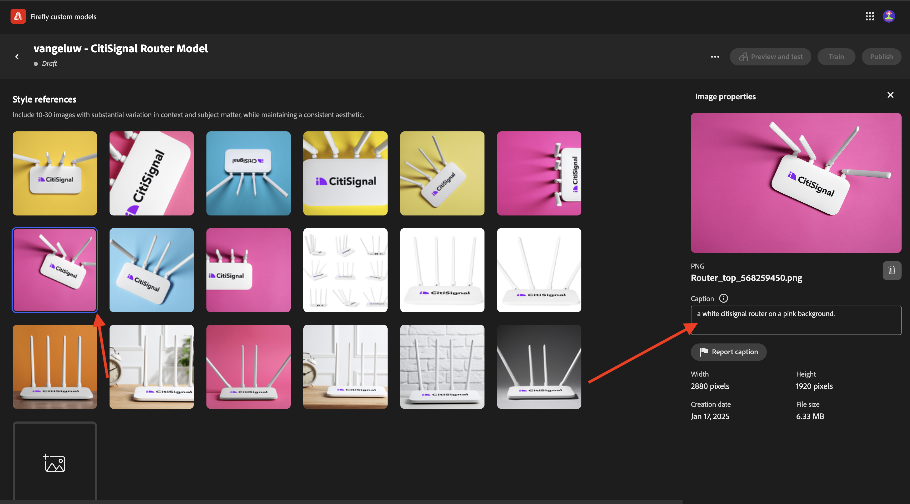

# Modelos personalizados de Firefly 1.1.4

Ir para [https://firefly.adobe.com](https://firefly.adobe.com){target="_blank"}. Ir para **Modelos Personalizados**.

**Concordo** com as condições de uso dos Modelos Personalizados do Firefly.

Clique em **Treinar um modelo**.

Use o nome `--aepUserLdap-- - CitiSignal Router Model`. Selecione **Estilo** e clique em **+ Criar novo projeto**.

Use o nome `--aepUserLdap-- - CitiSignal Custom Model`. Clique em **Criar**.

Clique em **Continuar**.

Clique em **Selecionar imagens do computador**.

Você pode usar esses ativos. Baixe-os no computador e extraia o arquivo zip em uma pasta na área de trabalho.

Selecione todas as imagens e clique em **Abrir**.

As imagens serão carregadas. Isso pode levar algum tempo.

Você concluiu este exercício agora.

Próxima etapa: [Resumo e benefícios](./summary.md){target="_blank"}

[Retornar ao Módulo 1.1](./firefly-services.md){target="_blank"}

[Voltar para Todos os Módulos](./../../../overview.md){target="_blank"}
