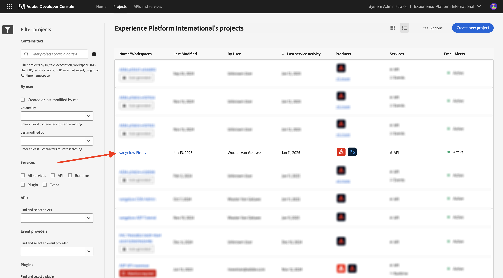

# 1.2.1 Introdução ao Workfront Fusion

Neste exercício, você usará o Workfront Fusion e o Adobe I/O para consultar APIs de serviços de Adobe Firefly.

## 1.2.1.1 Criar novo cenário

Ir para [https://experience.adobe.com/](https://experience.adobe.com/). Clique para abrir o **Workfront Fusion**.

Você deverá ver isso. Vá para **Cenários**.

Clique em **Criar novo cenário**.

Você verá um cenário vazio. Clique no ícone **ferramentas** e selecione **Definir várias variáveis**.

Agora é necessário mover o ícone **relógio** para a **Definir várias variáveis** recém-adicionada.

Você verá isso.

Em seguida, clique com o botão direito no ponto de interrogação e selecione **Excluir módulo**.

Em seguida, clique com o botão direito no objeto **Definir várias variáveis** e selecione **Configurações**.

## 1.2.1.2 Configurar autenticação de Adobe I/O

Agora, é necessário configurar as variáveis necessárias para a autenticação no Adobe I/O. No exercício anterior, você criou um projeto Adobe I/O. As variáveis desse projeto Adobe I/O agora precisam ser definidas no Workfront Fusion.

As seguintes variáveis precisam ser definidas:

| Chave | Valor |
|:-------------:| :---------------:| 
| `CONST_client_id` | a ID do cliente do projeto Adobe I/O |
| `CONST_client_secret` | Segredo do cliente do seu projeto Adobe I/O |
| `CONST_scope` | seu escopo do projeto Adobe I/O |

Você pode encontrar essas variáveis acessando [https://developer.adobe.com/console/projects](https://developer.adobe.com/console/projects) e abrindo o projeto Adobe I/O, denominado `--aepUserLdap-- Firefly`.

Em seu projeto, clique em **Servidor-Servidor-OAuth** para ver os valores das chaves acima.

Com as chaves e os valores acima, você pode configurar o objeto **Definir várias variáveis**. Clique em **Adicionar item**.

Insira o **Nome da variável**: **CONST_client_id** e seu **Valor da variável**, clique em **Adicionar**.

Clique em **Adicionar item**.

Insira o **nome da variável**: **CONST_client_secret** e seu **valor da variável**, clique em **Adicionar**.

Clique em **Adicionar item**.

Insira o **Nome da variável**: **CONST_scope** e seu **Valor da variável**, clique em **Adicionar**.

Clique em **OK**.

Passe o mouse sobre o objeto **Definir várias variáveis** e clique no ícone grande **+** para adicionar outro módulo.

Você deverá ver isso.

Na barra de pesquisa, digite **http**. Selecione **HTTP** para abri-lo.

e selecione **Fazer uma solicitação**.

| Chave | Valor |
|:-------------:| :---------------:| 
| `URL` | `https://ims-na1.adobelogin.com/ims/token/v3` |
| `Method` | `POST` |
| `Body Type` | `x-www-form-urlencoded` |

Clique em **Adicionar item**.

Adicione itens para cada um dos valores abaixo:

| Chave | Valor |
|:-------------:| :---------------:| 
| `client_id` | sua variável predefinida para `CONST_client_id` |
| `client_secret` | sua variável predefinida para `CONST_client_secret` |
| `scope` | sua variável predefinida para `CONST_scope` |
| `grant_type` | `client_credentials` |

Configuração para `client_id`.

Configuração para `client_secret`.

Configuração para `scope`.

Configuração para `grant_type`.

Visão geral da configuração. Role para baixo e marque a caixa de seleção para **Analisar resposta**. Clique em **OK**.

Você deverá ver isso. Clique em **Executar uma vez**.

Depois que o cenário for executado, você deverá ver isso.

Clique no ícone de **ponto de interrogação** no objeto **Definir várias variáveis** para ver o que aconteceu quando esse objeto foi executado.

Clique no ícone de **ponto de interrogação** no objeto **HTTP - Fazer uma solicitação** para ver o que aconteceu quando esse objeto foi executado. Na **SAÍDA**, você verá o **access_token** sendo retornado pelo Adobe I/O.

Passe o mouse sobre o objeto **HTTP - Fazer uma solicitação** e clique no ícone **+** para adicionar outro módulo.

Na barra de pesquisa, procure por `tools`. Selecione **Ferramentas**.

Selecione **Definir várias variáveis**.

Selecione **Adicionar item**.

Defina o **Nome da variável** como `bearer_token`. Selecione `access_token` como o **Valor da variável** dinâmica. Clique em **Adicionar**.

Você deveria ficar com isso. Clique em **OK**.

Clique novamente em **Executar uma vez**.

Depois que o cenário for executado, clique no ícone **ponto de interrogação** no último objeto **Definir várias variáveis**. Você deverá ver que o access_token está sendo armazenado na variável `bearer_token`.

Em seguida, clique com o botão direito no primeiro objeto **Definir vários valores** e selecione **Renomear**.

Defina o nome como **Inicializar constantes**. Clique em **OK**.

Renomeie o segundo objeto e defina o nome como **Autenticar para Adobe I/O**. Clique em **OK**.

Renomeie o terceiro objeto e defina o nome como **Definir Token de Portador**. Clique em **OK**.

Você deveria ficar com isso.

Em seguida, altere o nome do cenário para `--aepUSerLdap-- - Adobe I/O Authentication`.

Clique em **Salvar**.

Próxima etapa: [1.2.2 Usar APIs Adobe no Workfront Fusion](./ex2.md)

[Voltar ao módulo 1.2](./automation.md)

[Voltar a todos os módulos](./../../../overview.md)
