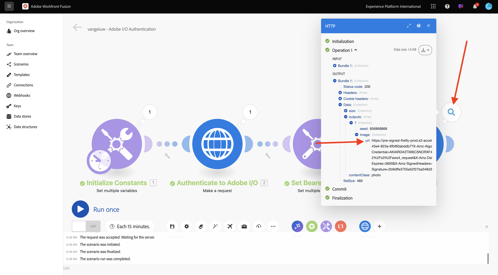
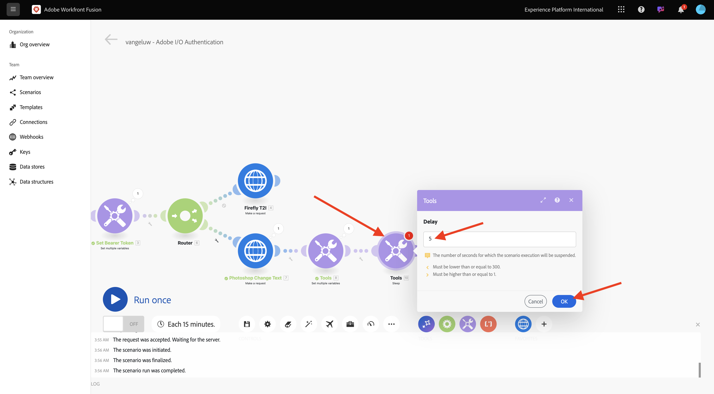
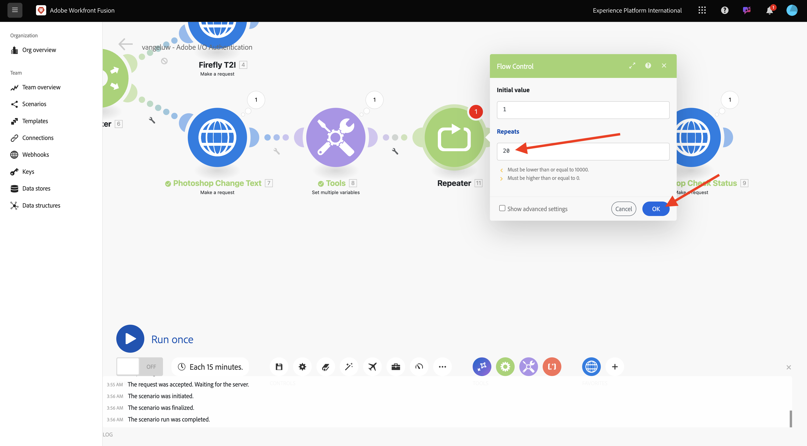
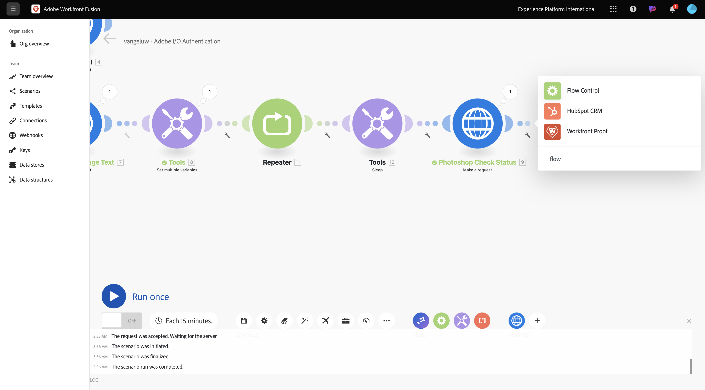
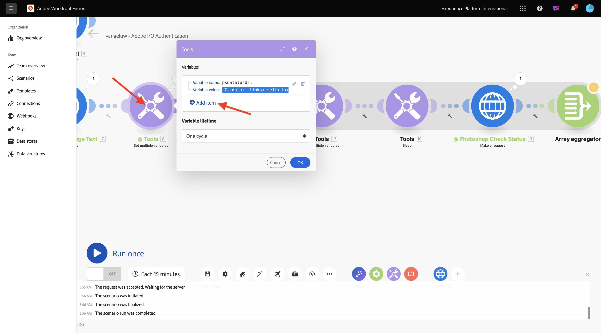
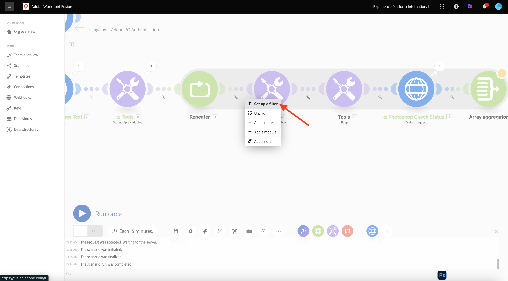
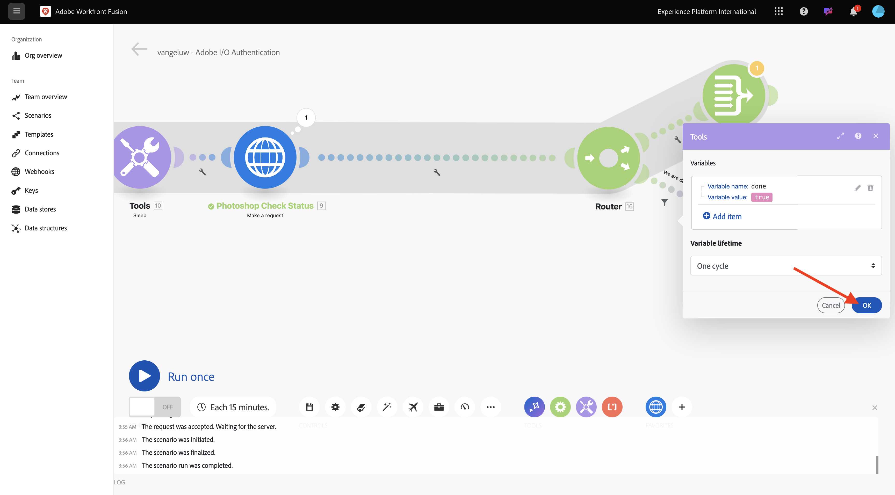

# 1.2.2 Uso de APIs Adobe no Workfront Fusion

## 1.2.2.1 Usar a API de texto para imagem do Firefly com o Workfront Fusion

Passe o mouse sobre o segundo nó **Definir várias variáveis** e clique em **+** para adicionar outro módulo.


Pesquise por **http** e selecione **HTTP**.


Selecione **Fazer uma solicitação**.


Selecione estas variáveis:

- **URL**: `https://firefly-api.adobe.io/v3/images/generate`
- **Método**: `POST`

Clique em **Adicionar um cabeçalho**.


Você precisa inserir os seguintes cabeçalhos:

| Chave | Valor |
|:-------------:| :---------------:| 
| `x-api-key` | sua variável armazenada para `CONST_client_id` |
| `Authorization` | `Bearer ` + sua variável armazenada para `bearer_token` |
| `Content-Type` | `application/json` |
| `Accept` | `*/*` |

Insira os detalhes de `x-api-key`. Clique em **Adicionar**.


Clique em **Adicionar um cabeçalho**.


Insira os detalhes de `Authorization`. Clique em **Adicionar**.


Clique em **Adicionar um cabeçalho**. Insira os detalhes de `Content-Type`. Clique em **Adicionar**.


Clique em **Adicionar um cabeçalho**. Insira os detalhes de `Accept`. Clique em **Adicionar**.


Defina o **Tipo de corpo** como **Bruto**. Para **Tipo de conteúdo**, selecione **JSON (application/json)**.


Cole esta carga no campo **Solicitar conteúdo**.

```json
{
  "numVariations": 1,
  "size": {
    "width": 2048,
    "height": 2048
  },
  "prompt": "Horses in a field",
  "promptBiasingLocaleCode": "en-US"
}
```

Marque a caixa de seleção de **Analisar resposta**. Clique em **OK**.


Clique em **Executar uma vez**.


Depois que o cenário for executado, você deverá ver isso.


Clique no **?Ícone** no quarto nó, HTTP, para ver a resposta. Você deve ver um arquivo de imagem na resposta.



Copie o URL da imagem e abra-o em uma janela do navegador. Você deverá ver algo assim:


Clique com o botão direito do mouse no objeto **HTTP** e renomeie-o para **Firefly T2I**.


Clique em **Salvar** para salvar as alterações.


## 1.2.2.2 Usar a API do Photoshop com o Workfront Fusion

Clique na **chave inglesa** entre os nós **Set Bearer Token** e **Firefly T2I**. Selecione **Adicionar um roteador**.


Clique com o botão direito do mouse no objeto **Firefly T2I** e selecione **Clone**.


Arraste e solte o objeto clonado próximo ao objeto **Roteador** e ele se conectará automaticamente ao **Roteador**. Você deveria ficar com isso.


Agora você tem uma cópia idêntica baseada na solicitação HTTP **Firefly T2I**. Algumas das configurações da solicitação HTTP **Firefly T2I** são semelhantes ao que você precisa para interagir com a **API Photoshop**, o que economiza tempo. Agora, basta alterar as variáveis que não são as mesmas, como o URL da solicitação e a carga.

Altere a **URL** para `https://image.adobe.io/pie/psdService/text`.


Substitua o **Conteúdo da solicitação** pela carga abaixo:

```json
{
  "inputs": [
    {
      "storage": "external",
      "href": "{{AZURE_STORAGE_URL}}/{{AZURE_STORAGE_CONTAINER}}/sevoi-psd.psd{{AZURE_STORAGE_SAS_READ}}"
    }
  ],
  "options": {
    "layers": [
      {
        "name": "2048x2048-button",
        "text": {
          "content": "Click here"
        }
      },
      {
        "name": "2048x2048-cta",
        "text": {
          "content": "Buy this stuff"
        }
      }
    ]
  },
  "outputs": [
    {
      "storage": "azure",
      "href": "{{AZURE_STORAGE_URL}}/{{AZURE_STORAGE_CONTAINER}}/sevoi-psd-changed-text.psd{{AZURE_STORAGE_SAS_WRITE}}",
      "type": "vnd.adobe.photoshop",
      "overwrite": true
    }
  ]
}
```


Para que este **Solicitar conteúdo** funcione corretamente, algumas variáveis estão ausentes:

- `AZURE_STORAGE_URL`
- `AZURE_STORAGE_CONTAINER`
- `AZURE_STORAGE_SAS_READ`
- `AZURE_STORAGE_SAS_WRITE`

Volte para o primeiro nó, clique em **Inicializar constantes** e selecione **Adicionar item** para cada uma dessas variáveis.


| Chave | Exemplo de valor |
|:-------------:| :---------------:| 
| `AZURE_STORAGE_URL` | `https://vangeluw.blob.core.windows.net` |
| `AZURE_STORAGE_CONTAINER` | `vangeluw` |
| `AZURE_STORAGE_SAS_READ` | `?sv=2023-01-03&st=2025-01-13T07%3A36%3A35Z&se=2026-01-14T07%3A36%3A00Z&sr=c&sp=rl&sig=4r%2FcSJLlt%2BSt9HdFdN0VzWURxRK6UqhB8TEvbWkmAag%3D` |
| `AZURE_STORAGE_SAS_WRITE` | `?sv=2023-01-03&st=2025-01-13T17%3A21%3A09Z&se=2025-01-14T17%3A21%3A09Z&sr=c&sp=racwl&sig=FD4m0YyyqUj%2B5T8YyTFJDi55RiTDC9xKtLTgW0CShps%3D` |

Você pode encontrar suas variáveis voltando ao Postman e abrindo suas **Variáveis de ambiente**.


Copie esses valores no Workfront Fusion e adicione um novo item para cada uma dessas 4 variáveis.

Você deveria ficar com isso. Clique em **OK**.


Em seguida, volte para a solicitação HTTP clonada para atualizar o **Conteúdo da solicitação**. Você observará essas variáveis pretas no **Solicitar conteúdo**, que são as variáveis que você copiou do Postman. Agora é necessário alterá-los para as variáveis recém-definidas no Workfront Fusion. Substitua cada variável uma por uma excluindo o texto em preto e substituindo-o pela variável correta.


Há 3 alterações a serem feitas na seção **entradas**.


Também há 3 alterações a serem feitas na seção **saídas**. Clique em **OK**.


Clique com o botão direito no nó clonado e selecione **Renomear**. Altere o nome para **Photoshop Change Text**.


Você deveria ficar com isso.


Clique em **Executar uma vez**.


Clique no ícone **search** no nó **Photoshop Change Text** para ver a resposta. Você deve ter uma resposta semelhante a esta, com um link para um arquivo de status.


Antes de continuar com as interações da API do Photoshop, vamos desabilitar a rota para o nó **Firefly T2I** para não enviar chamadas de API desnecessárias para esse ponto de extremidade de API. Clique na **chave inglesa** e selecione **Desabilitar rota**.


Você deveria ficar com isso.


Em seguida, adicione outro nó **Definir várias variáveis**.


Coloque-o depois do nó **Photoshop Change Text**.


Clique no nó **Definir várias variáveis** e selecione **Adicionar item**. Selecione o valor da variável na resposta da solicitação anterior.

| Nome da variável | Valor da variável |
|:-------------:| :---------------:| 
| `psdStatusUrl` | `data > _links > self > href` |

Clique em **Adicionar**.


Clique em **OK**.


Clique com o botão direito do mouse no nó **Photoshop Change Text** e selecione **Clone**.


Arraste a solicitação HTTP clonada após o nó **Definir várias variáveis** que você acabou de criar.


Clique com o botão direito na solicitação HTTP clonada, selecione **Renomear** e altere o nome para **Status de verificação do Photoshop**.


Clique em para abrir a solicitação HTTP. Altere a URL para que ela faça referência à variável criada na etapa anterior e defina o **Método** como **GET**.


Remova o **Corpo** selecionando a opção vazia.


Clique em **OK**.


Clique em **Executar uma vez**.


Em seguida, você deve obter uma resposta que contenha o campo **status**, com o status definido como **em execução**. O Photoshop leva alguns segundos para concluir o processo.


Agora que você sabe que a resposta precisa de um pouco mais de tempo para ser concluída, talvez seja uma boa ideia adicionar um cronômetro na frente dessa solicitação HTTP para que ela não seja executada imediatamente.

Clique no nó **Ferramentas** e selecione **Suspender**.


Posicione o nó **Suspensão** entre **Definir várias variáveis** e **Verificar Status do Photoshop**. Defina o **Atraso** para **5** segundos. Clique em **OK**.



Então você terá isto. O desafio com a configuração abaixo é que 5 segundos de espera podem ser suficientes, mas talvez não sejam suficientes. Na realidade, seria melhor ter uma solução mais inteligente, como um loop do...while que verifica o status a cada 5 segundos até que o status seja igual a **bem-sucedido**. Agora, você implementará essa tática nas próximas etapas.


Clique na **chave inglesa** entre **Definir várias variáveis** e **Suspender**. Selecione **Adicionar módulo**.


Pesquise por `flow` e selecione **Controle de Fluxo**.


Selecione **Repetidor**.


Definir as **Repetições** a **20**. Clique em **OK**.



Em seguida, clique em **+** no **Photoshop Check Status** para adicionar outro módulo.


Pesquise por **flow** e selecione **Flow Control**.



Selecione **Agregador de Matriz**.


Definir **Módulo Source** como **Repetidor**. Clique em **OK**.


Você deve ter isto:


Clique na **chave inglesa** e selecione **Adicionar um módulo**.


Pesquise por **ferramentas** e selecione **Ferramentas**.


Selecione **Obter várias variáveis**.


Clique em **+ Adicionar item** e defina o **Nome da variável** como `done`.


Clique em **OK**.


Clique no nó **Definir várias variáveis** que você configurou anteriormente. Para inicializar a variável **concluído**, é necessário defini-la aqui como `false`. Clique em **+ Adicionar item**.



Para o **nome da variável**, use `done`. Para definir o status, é necessário um valor booleano. Para localizar o valor booleano, clique no ícone de **engrenagem** e selecione `false`. Clique em **Adicionar**.


Clique em **OK**.


Em seguida, clique no ícone **chave inglesa** depois do nó **Get multiple variables** que você configurou.


Selecione **Configurar um filtro**. Agora é necessário verificar o valor da variável **concluído**. Se o valor for definido como **false**, a próxima parte do loop deverá ser executada. Se o valor estiver definido como **true**, significa que o processo já foi concluído com êxito, portanto, não há necessidade de continuar com a próxima parte do loop.



Para o rótulo, use **Concluído?**. Defina a **Condição** usando a variável já existente **concluída**, o operador deve ser definido como **Igual a** e o valor deve ser a variável booleana `false`. Clique em **OK**.


Em seguida, libere espaço entre os nós **Status de verificação do Photoshop** e **Agregador de matriz**. Em seguida, clique no ícone **chave inglesa** e selecione **Adicionar um roteador**. Você está fazendo isso porque, após verificar o status do arquivo Photoshop, deve haver dois caminhos. Se o status for `succeeded`, a variável de **concluído** deverá ser definida como `true`. Se o status não for igual a `succeeded`, o loop deve continuar. O roteador permitirá verificar e definir isso.


Depois de adicionar o roteador, clique no ícone **chave inglesa** e selecione **Configurar um filtro**.


Para o rótulo, use **Concluído**. Defina a **Condição** usando a resposta do nó **Verificar Status do Photoshop** escolhendo o campo de resposta **dados.saídas[].status**. O operador deve ser definido como **Igual a** e o valor deve ser `succeeded`. Clique em **OK**.


Em seguida, clique no nó vazio com o ponto de interrogação e procure **ferramentas**. Em seguida, selecione **Ferramentas**.


Selecione **Definir várias variáveis**.


Quando essa ramificação do roteador é usada, significa que o status da criação do arquivo Photoshop foi concluído com êxito. Isso significa que o loop do...while não precisa mais continuar verificando o status no Photoshop, então você deve definir a variável `done` como `true`.

Para o **nome da variável**, use `done`. Para o **valor de variável**, você deve usar o valor booleano `true`. Clique no ícone de **engrenagem** e selecione `true`. Clique em **Adicionar**.


Clique em **OK**.



Em seguida, clique com o botão direito do mouse no nó **Definir várias variáveis** que acabou de criar e selecione **Clonar**.


Arraste o nó clonado para que ele se conecte com o **agregador de matriz**. Em seguida, clique com o botão direito do mouse no nó e selecione **Renomear** e altere o nome para `Placeholder End`.


Remova a variável existente e clique em **+ Adicionar item**. Para o **Nome da variável**, use `placeholder`, para o **Valor da variável**, use `end`. Clique em **Adicionar** e em **OK**.


Clique em **Salvar** para salvar seu cenário. Em seguida, clique em **Executar uma vez**.


Seu cenário será executado e deve ser concluído com êxito. Você observará que o loop do...while que você configurou funcionou bem. Na execução abaixo, você pode ver que o **Repetidor** foi executado 20 vezes com base na bolha no nó **Ferramentas > Obter várias variáveis**. Depois desse nó, você configurou um filtro que verificou o status e, somente se o status não for igual a **bem-sucedido**, os próximos nós serão executados. Nesta execução, a parte após o filtro foi executada apenas uma vez, pois o status já era **bem-sucedido** na primeira execução.


Você pode verificar o status da criação do novo arquivo do Photoshop clicando na bolha da solicitação HTTP **Verificar status** do Photoshop e detalhando o campo **status**.


Agora você configurou a versão básica de um cenário repetível que automatiza várias etapas. No próximo exercício, você vai iterar nisso adicionando complexidade.

Próxima etapa: [1.2.3 Automação de processos com o Workfront Fusion](./ex3.md)

[Voltar ao módulo 1.2](./automation.md)

[Voltar a todos os módulos](./../../../overview.md)
