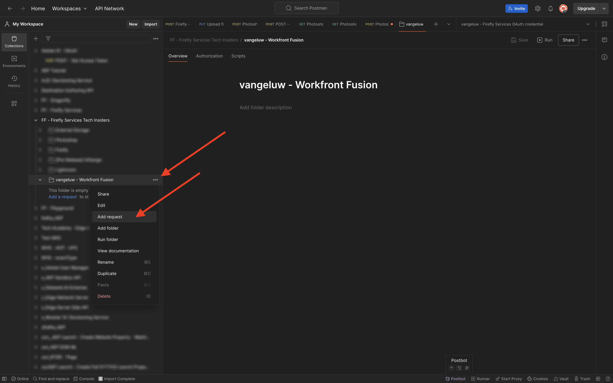

# 1.2.3 Automação de processos com o Workfront Fusion

Agora, seu cenário fica assim.


## 1.2.3.1 Iteração em vários valores

Até agora, você alterou o texto em um arquivo Photoshop por um valor estático. Para dimensionar e automatizar os fluxos de trabalho de criação de conteúdo, é necessário iterar sobre uma lista de valores e inserir esses valores dinamicamente no arquivo do Photoshop. Nas próximas etapas, você adicionará um o que iterar sobre os valores no cenário existente.

Entre o nó **Roteador** e o nó **Photoshop Change Text**, clique no ícone **chave inglesa** e selecione **Adicionar um módulo**.


Pesquise por `flow` e selecione **Controle de Fluxo**.


Selecione **Iterador**.


Você deveria ficar com isso.


Embora seja possível ler arquivos de entrada como arquivos CSV, por enquanto, é necessário usar uma versão básica de um arquivo CSV definindo uma sequência de caracteres de texto e dividindo esse arquivo de texto.

Você pode encontrar a função **split** clicando no ícone **T**, onde você vê todas as funções disponíveis para manipular valores de texto. Clique na função **split** e você deverá vê-la.


A função de divisão espera uma matriz de valores antes do ponto e vírgula e espera que você especifique o separador após o ponto e vírgula. Para este teste, você deve usar uma matriz simples com 2 campos, **Comprar agora** e **Clique aqui**, e o separador a ser usado é **,**.

Insira isso no campo **Matriz** substituindo a função **dividida** atualmente vazia: `{{split("Buy now, Click here "; ",")}}`. Clique em **OK**.


O iterador agora está configurado e, se você executar seu cenário agora, ele o executará duas vezes. Entretanto, ainda há um problema, pois você está usando valores estáticos no nó **Texto de alteração do Photoshop**. Clique em **Photoshop Change Text** para adicionar algumas variáveis em vez de valores estáticos para os campos de entrada e saída.


Na **Solicitar conteúdo**, você verá o texto **Clique aqui**. Esse texto precisa ser substituído pelos valores provenientes da matriz.


Exclua o texto **Clique aqui** e substitua-o selecionando a variável **Valor** do nó **Iterador**. Isso garantirá que o texto do botão no documento do Photoshop seja atualizado dinamicamente.


Você também precisa atualizar o nome de arquivo usado para gravar o arquivo em sua Conta de Armazenamento do Azure. Se o nome do arquivo for estático, cada nova iteração simplesmente substituirá o arquivo anterior e, como tal, você perderá os arquivos personalizados. O nome de arquivo estático atual é **sevoi-psd-changed-text.psd**, e você precisa atualizá-lo agora. Coloque o cursor atrás da palavra `text`.


Primeiro, adicione um hífen `-` e depois selecione o valor **Posição da Ordem do Pacote**. Isso garantirá que, para a primeira iteração, o Workfront Fusion adicione `-1` ao nome do arquivo, para a segunda iteração `-2` e assim por diante. Clique em **OK**.


Salve seu cenário e clique em **Executar uma vez**.


Depois que o cenário for executado, volte para o Azure Storage Explorer e atualize a pasta. Você deverá ver os 2 arquivos recém-criados.


Baixe e abra cada arquivo. Você deverá ver os vários textos nos botões. Este é o arquivo `sevoi-psd-changed-text-1.psd`.


Este é o arquivo `sevoi-psd-changed-text-2.psd`.


## 1.2.3.2 Ative seu cenário usando um webhook

Até o momento, você executou o cenário manualmente para testar. Agora vamos atualizar seu cenário com um webhook, para que ele possa ser ativado de um ambiente externo.

Clique no ícone **+**, procure por **webhook** e selecione **Webhooks**.


Selecione **Webhook personalizado**.

Arraste e conecte o nó **Webhook personalizado** para que ele se conecte ao primeiro nó na tela, que é chamado **Inicializar Constantes**.


Clique no nó **Webhook personalizado**. Em seguida, clique em **Adicionar**.


Defina o **nome do Webhook** para `--aepUserLdap-- - Tutorial 1.2`.


Marque a caixa de seleção para **Obter cabeçalhos de solicitação**. Clique em **Salvar**.


O URL do webhook está disponível. Copie o URL.


Abra o Postman e adicione uma nova pasta à coleção **FF - Firefly Services Tech Insiders**.


Nomeie sua pasta `--aepUserLdap-- - Workfront Fusion`.


Na pasta que você acabou de criar, clique nos 3 pontos **...** e selecione **Adicionar solicitação**.



Defina o **Tipo de método** como **POST** e cole a URL do seu webhook na barra de endereços.


É necessário enviar um corpo personalizado, para que os elementos variáveis possam ser fornecidos de uma fonte externa para o cenário do Workfront Fusion. Vá para **Corpo** e selecione **bruto**.


Cole o texto abaixo no corpo da solicitação. Clique em **Enviar**.

```json
{
    "psdTemplate": "placeholder",
    "xlsFile": "placeholder"
}
```


Volte para o Workfront Fusion. Você verá uma mensagem no seu webhook personalizado que diz: **Determinado com êxito**.


Clique em **Salvar** e em **Executar uma vez**. Seu cenário ficará ativo agora, mas não será executado até que você clique em **Enviar** novamente no Postman.


Vá para o Postman e clique em **Enviar** novamente.


Seu cenário será executado novamente e criará os 2 arquivos como antes.


Por fim, altere o nome da sua solicitação Postman para `POST - Send Request to Workfront Fusion Webhook`.


Próxima etapa: [Resumo e benefícios](./summary.md)

[Voltar ao módulo 1.2](./automation.md)

[Voltar a todos os módulos](./../../../overview.md)
