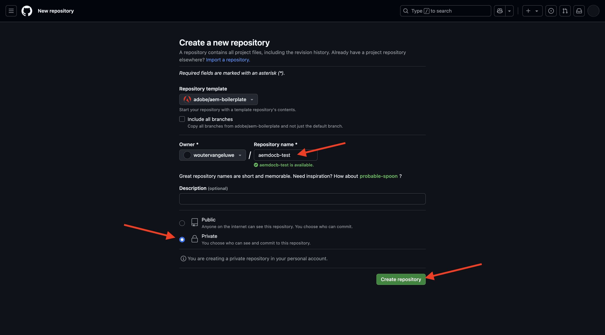
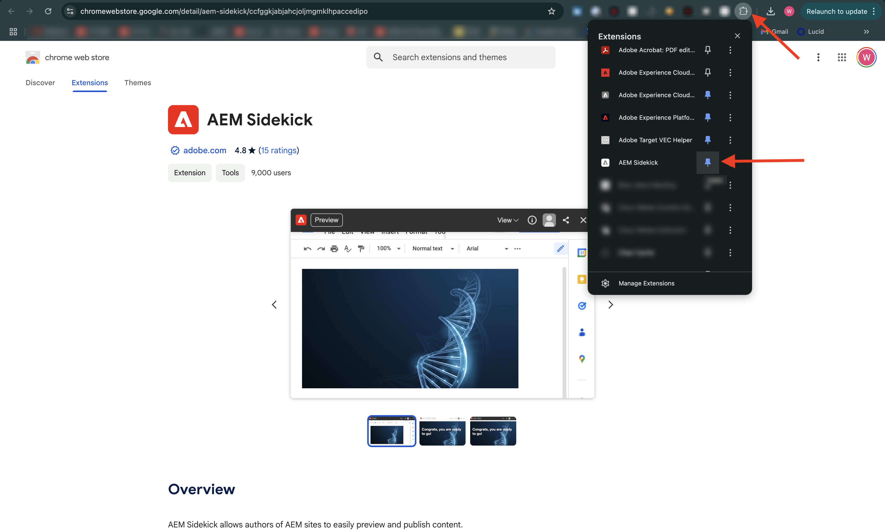
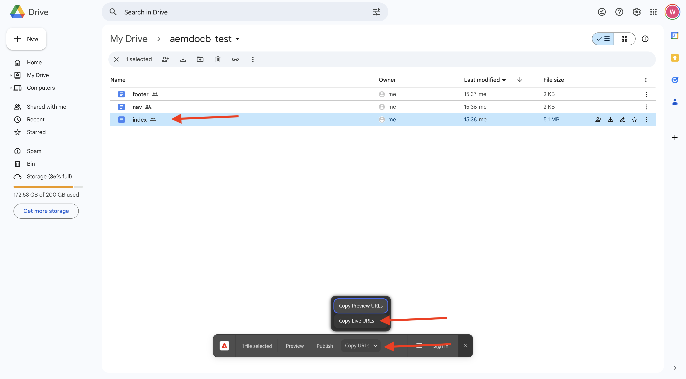

# 2.1.2 Criar o site com base em documento

Enquanto aguarda a criação de seu Programa Cloud Manager, você tem tempo suficiente para configurar seu primeiro site de criação baseado em documento. O exercício abaixo é baseado no [Tutorial do desenvolvedor do aem.live](https://www.aem.live/developer/tutorial){target="_blank"}. Siga as etapas abaixo para começar.

## 2.1.2.1 Configurar o Google Drive

Ir para [https://drive.google.com](https://drive.google.com){target="_blank"}. Clique em **+ Nova** e em **Nova Pasta**.

Nomeie sua pasta `aemdocb-test`. Clique em **Criar**.

Baixe o arquivo [aemboilerplate.zip](./../../../assets/aem/aemboilerplate.zip){target="_blank"} e extraia-o no computador.

Você verá três arquivos nessa pasta. Copie esses arquivos na nova pasta Google Drive.

Agora é necessário converter esses arquivos em um arquivo Google nativo. Para fazer isso, abra cada arquivo e vá para **Arquivo** > **Salvar como Google Docs**.

Você deve fazer isso para todos os 3 arquivos e depois verá 6 arquivos na pasta Google Drive.

Você tem isso na sua pasta.

Para que a demonstração de criação baseada em documentos funcione, agora você precisa compartilhar sua pasta do Google Drive com o endereço de email **helix@adobe.com**. Clique no nome da sua pasta, clique em **Compartilhar** e em **Compartilhar** novamente.

Insira o endereço de email **helix@adobe.com** e clique em **Enviar**.

Em seguida, copie e anote o URL da pasta Google Drive conforme necessário no próximo exercício. Clique no nome da sua pasta, clique em **Compartilhar** e em **Copiar link**.

`https://drive.google.com/drive/folders/1PNIOFeptIfszSebawT-Y_bwB4_anQWk5?usp=drive_link`

Você deve remover o parâmetro da cadeia de caracteres de consulta `?usp=drive_link` para que a URL fique com esta aparência:

`https://drive.google.com/drive/folders/1PNIOFeptIfszSebawT-Y_bwB4_anQWk5`

## 2.1.2.2 Configurar o repositório GitHub

Ir para [https://github.com](https://github.com){target="_blank"}. Clique em **Fazer logon**.

Insira suas credenciais. Clique em **Fazer logon**.

Depois de fazer logon, você verá seu Painel do GitHub.

Ir para [https://github.com/adobe/aem-boilerplate](https://github.com/adobe/aem-boilerplate){target="_blank"}. Você verá isso. Clique em **Usar este modelo** e em **Criar um novo repositório**.

Para o **Nome do repositório**, use `aemdocb-test`. Defina a visibilidade como **Particular**. Clique em **Criar repositório**.

Após alguns segundos, o repositório será criado.

Em seguida, vá para [https://github.com/apps/aem-code-sync](https://github.com/apps/aem-code-sync){target="_blank"}. Clique em **Configurar**.

Clique em sua conta GitHub.

Clique em **Selecionar apenas repositórios** e, em seguida, adicionar o repositório que você acabou de criar. Em seguida, clique em **Instalar**.

Você receberá essa confirmação.

## 2.1.2.3 Arquivo de atualização fstab.yaml

No repositório do GitHub, clique em para abrir o arquivo `fstab.yaml`.

Clique no ícone **editar**.

Agora é necessário atualizar o valor do campo **url** na linha 2.

É necessário substituir o valor atual pelo URL do seu ambiente AEM CS específico em combinação com as configurações do seu repositório GitHub.

Este é o valor atual da URL: `https://drive.google.com/drive/u/0/folders/1MGzOt7ubUh3gu7zhZIPb7R7dyRzG371j`.

Substitua esse valor pela URL copiada da pasta Unidade Google, `https://drive.google.com/drive/folders/1PNIOFeptIfszSebawT-Y_bwB4_anQWk5`. Clique em **Confirmar alterações...**.

Clique em **Confirmar alterações**.

## 2.1.2.4 Instalar extensão do AEM Sidekick

Ir para [https://chromewebstore.google.com/detail/aem-sidekick/ccfggkjabjahcjoljmgmklhpaccedipo](https://chromewebstore.google.com/detail/aem-sidekick/ccfggkjabjahcjoljmgmklhpaccedipo){target="_blank"}. Clique em **Adicionar ao Chrome**.

Fixar a extensão **AEM Sidekick**.

## 2.1.2.5 Visualize e Publish seu site baseado em documento

Volte para a pasta Google Drive. Na barra de tarefas, clique na extensão **AEM Sidekick**. Você então vê um pop-up, barra de AEM Sidekick, em sua pasta.

Selecione os 3 arquivos na pasta Google Drive. Clique em **Visualizar**.

Clique novamente em **Visualizar**.

Clique para fechar a janela pop-up verde.

Selecione os 3 arquivos na pasta Google Drive novamente. Agora, clique em **Publish**.

Clique em **Publish**.

Clique para fechar a caixa de diálogo verde novamente. Agora, selecione o arquivo **índice**, clique em **Copiar URLs** e em **Copiar URLs em tempo real**.

A URL copiada terá esta aparência: `https://main--aemdocb-test--woutervangeluwe.aem.live/`.

No URL acima:

- **principal** refere-se à ramificação no seu repositório GitHub
- **aemdocb-test** refere-se ao nome do repositório GitHub
- **woutervangeluwe** refere-se ao nome da conta de usuário do GitHub
- **.live** refere-se ao ambiente ativo da sua instância do AEM
- Você pode substituir **.live** por **.page** para abrir o ambiente de visualização da sua instância do AEM

Abra uma nova janela do navegador e navegue até o URL.

## 2.1.2.6 Faça uma alteração e publique-a

Volte para a sua Unidade Google e abra o filtro **índice** no Google.

Substitua o texto **Testing** por qualquer outro texto de sua escolha. Clique em **Visualizar**.

A versão de visualização do site será aberta. Revise sua alteração e clique em **Publish**.

Você verá a versão ao vivo do site.

O exercício acima foi uma boa maneira de começar e experimentar a criação baseada em documentos. Agora você pode continuar com o próximo exercício, onde você configurará seu próprio site de demonstração usando o CitiSignal como uma marca de demonstração.

Próxima etapa: [2.1.3 Configurar o ambiente AEM CS](./ex3.md){target="_blank"}

[Retornar ao Módulo 2.1](./aemcs.md){target="_blank"}

[Voltar para Todos os Módulos](./../../../overview.md){target="_blank"}
