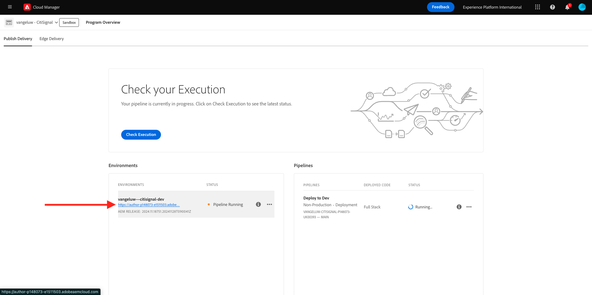
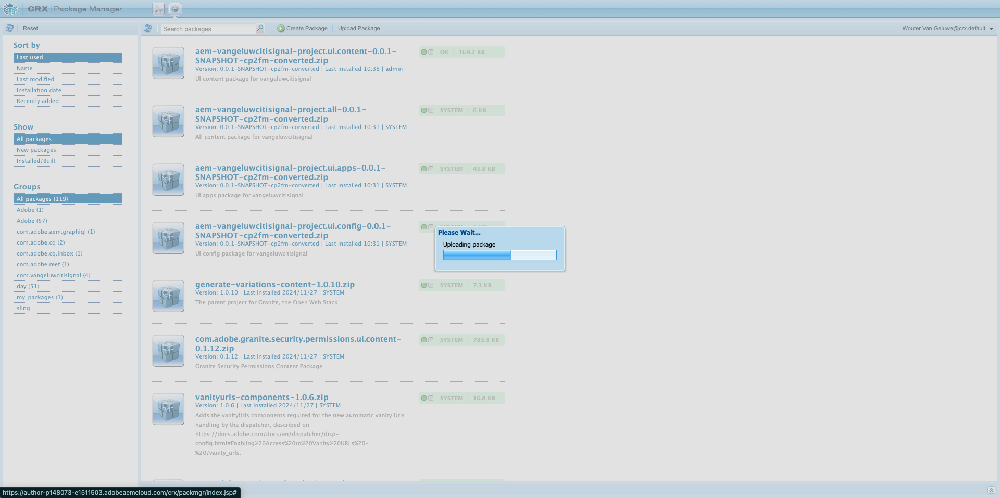
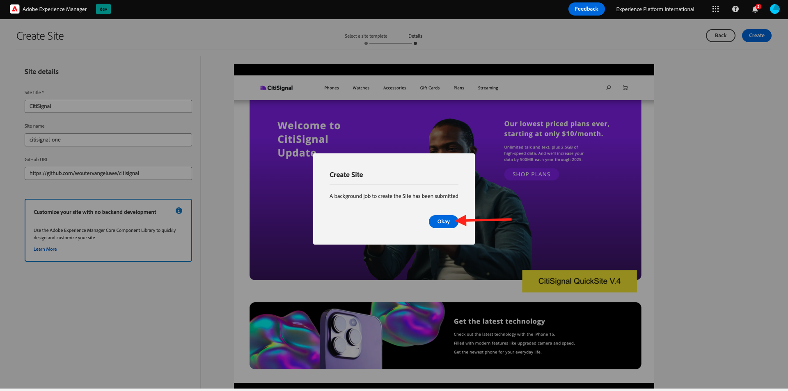
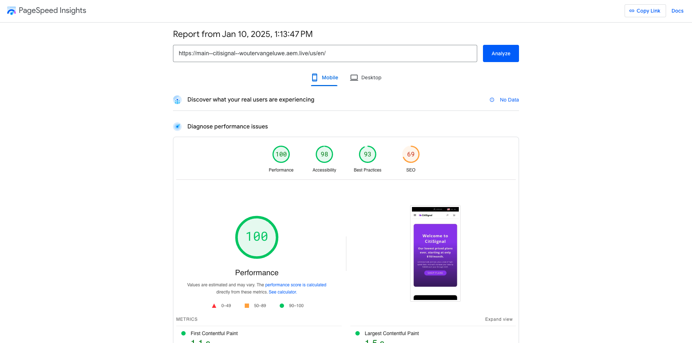

# 2.1.3 Configurar o ambiente AEM CS

## 2.1.3.1 Configurar o repositório GitHub

Ir para [https://github.com](https://github.com){target="_blank"}. Clique em **Fazer logon**.

{zoomable="yes"}

Insira suas credenciais. Clique em **Fazer logon**.

{zoomable="yes"}

Depois de fazer logon, você verá seu Painel do GitHub.

{zoomable="yes"}

Ir para [https://github.com/AdobeDevXSC/citisignal-one](https://github.com/AdobeDevXSC/citisignal-one){target="_blank"}. Você verá isso. Clique em **Usar este modelo** e em **Criar um novo repositório**.

{zoomable="yes"}

Para o **Nome do repositório**, use `citisignal`. Defina a visibilidade como **Particular**. Clique em **Criar repositório**.

{zoomable="yes"}

Após alguns segundos, o repositório será criado.

{zoomable="yes"}

Em seguida, vá para [https://github.com/apps/aem-code-sync](https://github.com/apps/aem-code-sync){target="_blank"}. Clique em **Configurar**.

{zoomable="yes"}

Clique em sua conta GitHub.

{zoomable="yes"}

Clique em **Selecionar apenas repositórios** e, em seguida, adicionar o repositório que você acabou de criar. Em seguida, clique em **Instalar**.

{zoomable="yes"}

Você receberá essa confirmação.

{zoomable="yes"}

## 2.1.3.2 Atualizar o arquivo fstab.yaml

No repositório do GitHub, clique em para abrir o arquivo `fstab.yaml`.

{zoomable="yes"}

Clique no ícone **editar**.

{zoomable="yes"}

Agora é necessário atualizar o valor do campo **url** na linha 4.

{zoomable="yes"}

É necessário substituir o valor atual pelo URL do seu ambiente AEM CS específico em combinação com as configurações do seu repositório GitHub.

Este é o valor atual da URL: `https://author-p131639-e1282833.adobeaemcloud.com/bin/franklin.delivery/adobedevxsc/citisignal-one/main`.

Há 3 partes do URL que precisam ser atualizadas

`https://XXX/bin/franklin.delivery/YYY/ZZZ/main`

XXX deve ser substituído pelo URL do ambiente do AEM CS Author.

AAAA deve ser substituído pela conta de usuário do GitHub.

ZZZ deve ser substituído pelo nome do repositório GitHub usado no exercício anterior.

Você pode encontrar a URL do seu ambiente de autor AEM CS acessando [https://my.cloudmanager.adobe.com](https://my.cloudmanager.adobe.com){target="_blank"}. Clique no **Programa** para abri-lo.

{zoomable="yes"}

Em seguida, clique nos 3 pontos **...** na guia **Ambientes** e clique em **Exibir Detalhes**.

{zoomable="yes"}

Você verá os detalhes do seu ambiente, incluindo a URL do seu ambiente **Autor**. Copie o URL.

{zoomable="yes"}

XXX = `author-p148073-e1511503.adobeaemcloud.com`

Para o nome da conta de usuário do GitHub, você pode encontrá-lo facilmente no URL do seu navegador. Neste exemplo, o nome da conta de usuário é `woutervangeluwe`.

AAAA = `woutervangeluwe`

{zoomable="yes"}

Para o nome do repositório GitHub, você também pode encontrá-lo na janela do navegador aberta no GitHub. Nesse caso, o nome do repositório é `citisignal`.

ZZ = `citisignal`

{zoomable="yes"}

Esses 3 valores combinados levam a esta nova URL que precisa ser configurada no arquivo `fstab.yaml`.

`https://author-p148073-e1511503.adobeaemcloud.com/bin/franklin.delivery/woutervangeluwe/citisignal/main`

Clique em **Confirmar alterações...**.

{zoomable="yes"}

Clique em **Confirmar alterações**.

{zoomable="yes"}

O arquivo `fstab.yaml` foi atualizado.

## 2.1.3.3 Fazer upload de ativos do CitiSignal

Ir para [https://my.cloudmanager.adobe.com](https://my.cloudmanager.adobe.com){target="_blank"}. Clique no **Programa** para abri-lo.

{zoomable="yes"}

Em seguida, clique no URL do ambiente do autor.

{zoomable="yes"}

Clique em **Entrar com o Adobe**.

{zoomable="yes"}

Em seguida, você verá seu ambiente de Autor.

{zoomable="yes"}

Sua URL será assim: `https://author-p148073-e1511503.adobeaemcloud.com/ui#/aem/aem/start.html?appId=aemshell`

Agora é necessário acessar o ambiente **CRX Package Manager** do AEM. Para fazer isso, remova `ui#/aem/aem/start.html?appId=aemshell` da URL e substitua-a por `crx/packmgr`, o que significa que sua URL deve ficar semelhante a esta agora:
`https://author-p148073-e1511503.adobeaemcloud.com/crx/packmgr`.
Clique em **Enter** para carregar o ambiente do gerenciador de pacotes

{zoomable="yes"}

Em seguida, clique em **Carregar pacote**.

{zoomable="yes"}

Clique em **Procurar** para localizar o pacote a ser carregado.

O pacote a ser carregado é chamado de **citisignal-assets.zip** e pode ser baixado aqui: [https://tech-insiders.s3.us-west-2.amazonaws.com/one-adobe/citisignal-assets.zip](https://tech-insiders.s3.us-west-2.amazonaws.com/one-adobe/citisignal-assets.zip){target="_blank"}.

{zoomable="yes"}

Selecione o pacote e clique em **Abrir**.

{zoomable="yes"}

Em seguida, clique em **OK**.

{zoomable="yes"}

O pacote será carregado.

{zoomable="yes"}

Em seguida, clique em **Instalar** no pacote que acabou de carregar.

{zoomable="yes"}

Clique em **Instalar**.

{zoomable="yes"}

Após alguns minutos, o pacote será instalado.

{zoomable="yes"}

Agora você pode fechar esta janela.

## 2.1.3.4 Ativos do Publish CitiSignal

Ir para [https://my.cloudmanager.adobe.com](https://my.cloudmanager.adobe.com){target="_blank"}. Clique no **Programa** para abri-lo.

{zoomable="yes"}

Em seguida, clique no URL do ambiente do autor.

{zoomable="yes"}

Clique em **Entrar com o Adobe**.

{zoomable="yes"}

Em seguida, você verá seu ambiente de Autor. Clique em **Sites**.

{zoomable="yes"}

Clique em **Arquivos**.

{zoomable="yes"}

Clique para selecionar a pasta **CitiSignal** e clique em **Gerenciar Publicação**.

{zoomable="yes"}

Clique em **Next**.

{zoomable="yes"}

Clique em **Publish**.

{zoomable="yes"}

Seus ativos foram publicados.

## 2.1.3.5 Criar site do CitiSignal

Ir para [https://my.cloudmanager.adobe.com](https://my.cloudmanager.adobe.com){target="_blank"}. Clique no **Programa** para abri-lo.

{zoomable="yes"}

Em seguida, clique no URL do ambiente do autor.

{zoomable="yes"}

Clique em **Entrar com o Adobe**.

{zoomable="yes"}

Em seguida, você verá seu ambiente de Autor. Clique em **Sites**.

{zoomable="yes"}

Clique em **Criar** e em **Site do modelo**.

{zoomable="yes"}

Clique em **Importar**.

{zoomable="yes"}

Agora é necessário importar um modelo pré-configurado para o site. Você pode baixar o modelo [aqui](./../../../assets/aem/citisignal-edge-delivery-services-template-0.0.4.zip){target="_blank"}. Salve o arquivo na área de trabalho.

Em seguida, selecione o arquivo `citisignal-edge-delivery-services-template-0.0.4.zip` e clique em **Abrir**.

{zoomable="yes"}

Você verá isso. Clique para selecionar o modelo que acabou de carregar e clique em **Avançar**.

{zoomable="yes"}

Agora você precisa preencher alguns detalhes.

- Título do site: use **CitiSignal**
- Nome do site: use **citisignal-one**
- URL do GitHub: copie o URL do repositório GitHub que você estava usando antes

{zoomable="yes"}

Então você terá isto. Clique em **Criar**.

{zoomable="yes"}

Seu site está sendo criado. Isso pode levar alguns minutos. Clique em **OK**.

{zoomable="yes"}

Atualize a tela após alguns minutos. Você verá o site do CitiSignal recém-criado.

{zoomable="yes"}

## 2.1.3.6 Site do Publish CitiSignal

Em seguida, clique na caixa de seleção na frente de **CitiSignal**. Em seguida, clique em **Gerenciar publicação**.

{zoomable="yes"}

Clique em **Next**.

{zoomable="yes"}

Clique em **Incluir configurações secundárias**.

{zoomable="yes"}

Clique para marcar a caixa de seleção **Incluir filhos** e clique para desmarcar as outras caixas de seleção. Clique em **OK**.

{zoomable="yes"}

Clique em **Publish**.

{zoomable="yes"}

Você será enviado de volta para cá. Navegue até **CitiSignal** > **us** > **en**. Clique na caixa de seleção na frente do **índice** e clique em **Editar**.

{zoomable="yes"}

Seu site será aberto no **Editor Universal**.

{zoomable="yes"}

Agora você pode acessar seu site indo até `main--citisignal--XXX.aem.page/us/en` e/ou `main--citisignal--XXX.aem.live/us/en`, depois de substituir XXX pela sua conta de usuário do GitHub, que neste exemplo é `woutervangeluwe`.

Neste exemplo, o URL completo torna-se isto:
`https://main--citisignal--woutervangeluwe.aem.page/us/en` e/ou `https://main--citisignal--woutervangeluwe.aem.live/us/en`.

Pode levar algum tempo até que todos os ativos sejam exibidos corretamente, pois precisam ser publicados primeiro.

Você verá isto:

{zoomable="yes"}

Após alguns minutos, todos os ativos serão carregados corretamente.

{zoomable="yes"}

## 2.1.3.7 Desempenho da página de teste

Ir para [https://pagespeed.web.dev/](https://pagespeed.web.dev/){target="_blank"}. Insira sua URL e clique em **Analisar**.

{zoomable="yes"}

Em seguida, você verá que seu site, em uma visualização para dispositivos móveis e desktop, obtém uma pontuação alta:

**Celular**:

{zoomable="yes"}

**Área de Trabalho**:

{zoomable="yes"}

Próxima Etapa: [2.1.4 Configurar um bloco personalizado](./ex4.md){target="_blank"}

[Retornar ao Módulo 2.1](./aemcs.md){target="_blank"}

[Voltar para Todos os Módulos](./../../../overview.md){target="_blank"}
