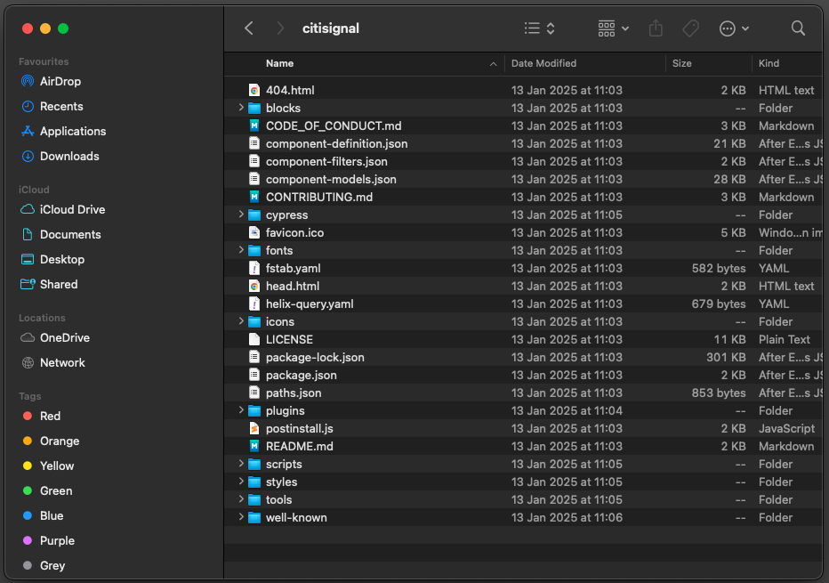
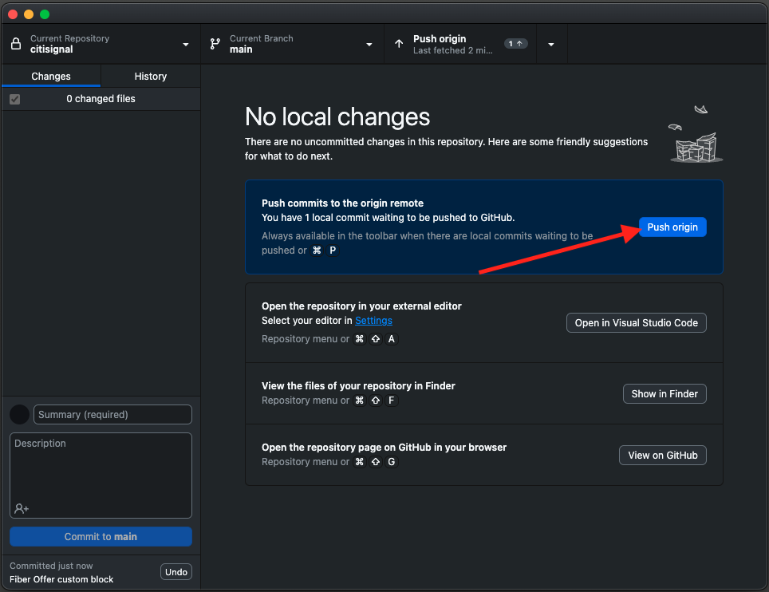
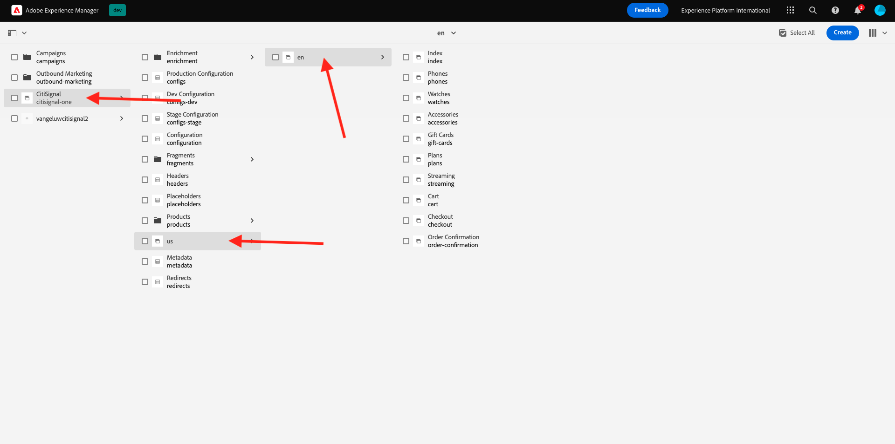
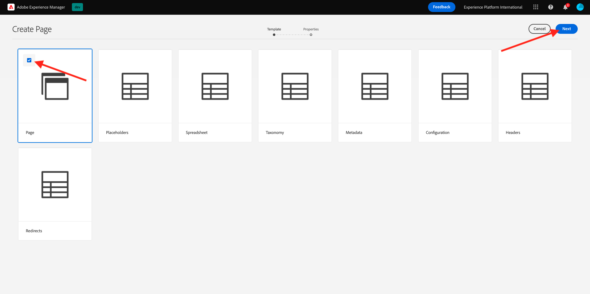
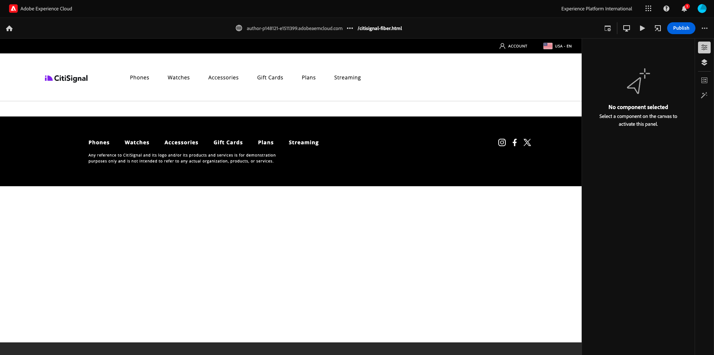
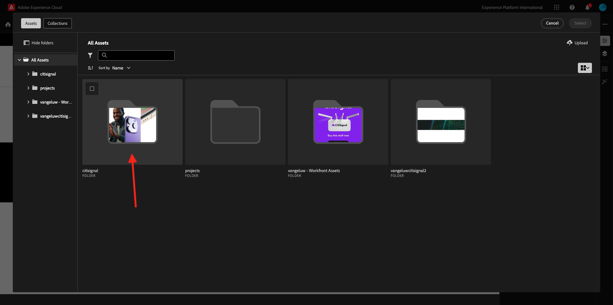
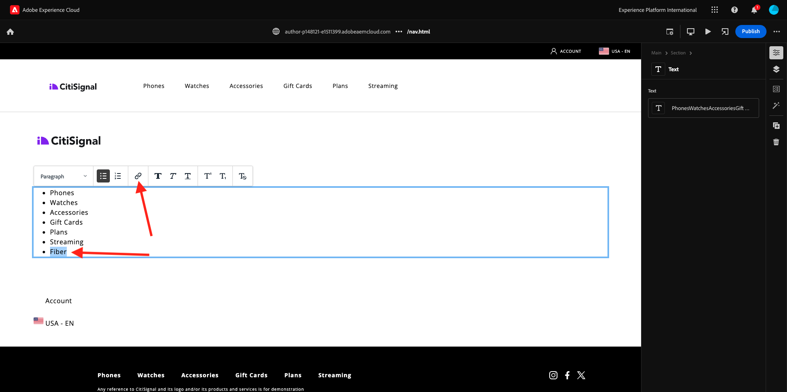

# 2.1.4 Desenvolver um bloco personalizado básico

## 2.1.4.1 Configurar o ambiente de desenvolvimento local

Vá para [https://desktop.github.com/download/](https://desktop.github.com/download/){target="_blank"}, baixe e instale o **Github Desktop**.


Depois que o Github Desktop for instalado, acesse o repositório GitHub criado no exercício anterior. Clique em **&lt;> Código** e em **Abrir com o GitHub Desktop**.


Seu repositório GitHub será aberto no GitHub Desktop. Você pode alterar o **Caminho Local**. Clique em **Clonar**.


Uma pasta local será criada.



Abra o Visual Studio Code. Ir para **Arquivo** > **Abrir pasta**.


Selecione a pasta usada pela configuração do GitHub para **citisignal**.


Você verá agora que a pasta está aberta no Visual Studio Code e está pronto para criar um novo bloco.


## 2.1.4.2 Criar um bloco personalizado básico

A Adobe recomenda que você desenvolva blocos em uma abordagem de três fases:

- Crie a definição e o modelo do bloco, revise-o e leve-o para produção.
- Crie conteúdo com o novo bloco.
- Implemente a decoração e os estilos do novo bloco.

### component-definition.json

No Visual Studio Code, abra o arquivo **component-definition.json**.


Role para baixo até ver o componente **Quote**. Coloque o cursor próximo ao colchete do último componente.


Cole esse código e insira uma vírgula **,** após o bloco de código:

```json
{
  "title": "FiberOffer",
  "id": "fiberoffer",
  "plugins": {
    "xwalk": {
      "page": {
        "resourceType": "core/franklin/components/block/v1/block",
        "template": {
          "name": "FiberOffer",
          "model": "fiberoffer",
          "offerText": "<p>Fiber will soon be available in your region!</p>",
          "offerCallToAction": "Get your offer now!",
          "offerImage": ""
        }
      }
    }
  }
}
```

Salve as alterações.


### component-models.json

No Visual Studio Code, abra o arquivo **component-models.json**.


Role para baixo até ver o último item. Coloque o cursor próximo ao colchete do último componente.


Insira uma vírgula **,**, e, por push, insira e, na próxima linha, cole este código:

```json
{
  "id": "fiberoffer",
  "fields": [
     {
       "component": "richtext",
       "name": "offerText",
       "value": "",
       "label": "Offer Text",
       "valueType": "string"
     },
     {
       "component": "richtext",
       "valueType": "string",
       "name": "offerCallToAction",
       "label": "Offer CTA",
       "value": ""
     },
     {
       "component": "reference",
       "valueType": "string",
       "name": "offerImage",
       "label": "Offer Image",
        "multi": false
     }
   ]
}
```

Salve as alterações.


### component-filters.json

No Visual Studio Code, abra o arquivo **component-filters.json**.


Em **seção**, insira uma vírgula **,** e a ID do seu componente **fiberoffer** após a última linha atual.

Salve as alterações.


## 2.1.4.3 Confirmar as alterações

Agora você fez várias alterações em seu projeto que precisam ser enviadas de volta ao repositório do GitHub. Para fazer isso, abra o **GitHub Desktop**.

Você deverá ver os 3 arquivos que acabou de editar em **Alterações**. Revise suas alterações.


Digite um nome para a sua PR, `Fiber Offer custom block`. Clique em **Confirmar para principal**.


Você deverá ver isso. Clique em **Origem de push**.



Após alguns segundos, suas alterações foram enviadas para o repositório do GitHub.


No navegador, vá para a conta GitHub e para o repositório criado para o CitiSignal. Você deverá ver algo assim, mostrando que suas alterações foram recebidas.


## 2.1.4.4 Adicionar o bloco a uma página

Agora que seu bloco básico de cotações está definido e comprometido com o projeto CitiSignal, você pode adicionar um bloco **fiberoffer** a uma página existente.

Ir para [https://my.cloudmanager.adobe.com](https://my.cloudmanager.adobe.com){target="_blank"}. Clique no **Programa** para abri-lo.


Em seguida, clique nos 3 pontos **...** na guia **Ambientes** e clique em **Exibir Detalhes**.


Você verá os detalhes do ambiente. Clique na URL do seu ambiente **Author**.

>[!NOTE]
>
>É possível que seu ambiente esteja hibernado. Se esse for o caso, será necessário cancelar a hibernação do ambiente primeiro.


Você deverá ver seu ambiente de autor do AEM. Ir para **Sites**.


Vá para **CitiSignal** > **us** > **en**.



Clique em **Criar** e selecione **Página**.


Selecione **Página** e clique em **Avançar**.



Insira os seguintes valores:

- Título: **Fibra de CitiSignal**
- Nome: **citisignal-fiber**
- Título da página: **Fibra de CitiSignal**

Clique em **Criar**.


Você deverá ver isso.



Clique na área em branco para selecionar o componente **seção**. Em seguida, clique no ícone de mais **+** no menu direito.


Em seguida, você deve ver seu bloco personalizado mostrado na lista de blocos disponíveis. Clique para selecioná-la.


Você verá campos como **Texto da oferta**, **CTA da oferta** e **Imagem da oferta** sendo adicionados ao editor. Clique em **+ Adicionar** no campo **Imagem da oferta** para selecionar uma imagem.


Você deverá ver isso. Clique para abrir a pasta **citisignal**.



Selecione a imagem **product-enrichment-1.png**. Clique em **Selecionar**.


Você deveria ficar com isso. Clique em **Publish**.


Clique novamente em **Publish**.


Sua nova página foi publicada.

## 2.1.4.5 Adicionar sua nova página ao menu de navegação

Na visão geral do AEM Sites, vá para **CitiSignal** > **Fragmentos** e marque a caixa de seleção para **Cabeçalho**. Clique em **Edit**.


Adicione uma opção de menu ao menu de navegação com o texto `Fiber`. Selecione o texto **Fibra** e clique no ícone **link**.



Digite isto para o **URL** `/us/en/citisignal-fiber` e clique no ícone **V** para confirmar.


Você deveria ficar com isso. Clique em **Publish**.


Clique novamente em **Publish**.


Agora é possível exibir as alterações em seu site indo para `main--citisignal--XXX.aem.page/us/en` e/ou `main--citisignal--XXX.aem.live/us/en`, depois de substituir XXX pela sua conta de usuário do GitHub, que neste exemplo é `woutervangeluwe`.

Neste exemplo, o URL completo torna-se isto:
`https://main--citisignal--woutervangeluwe.aem.page/us/en` e/ou `https://main--citisignal--woutervangeluwe.aem.live/us/en`.

Você deverá ver isso. Clique em **Fibra**.


Aqui está seu bloco personalizado básico, mas agora renderizado no site.


Próxima Etapa: [2.1.5 Bloco Personalizado Avançado](./ex5.md){target="_blank"}

[Retornar ao Módulo 2.1](./aemcs.md){target="_blank"}

[Voltar para Todos os Módulos](./../../../overview.md){target="_blank"}
