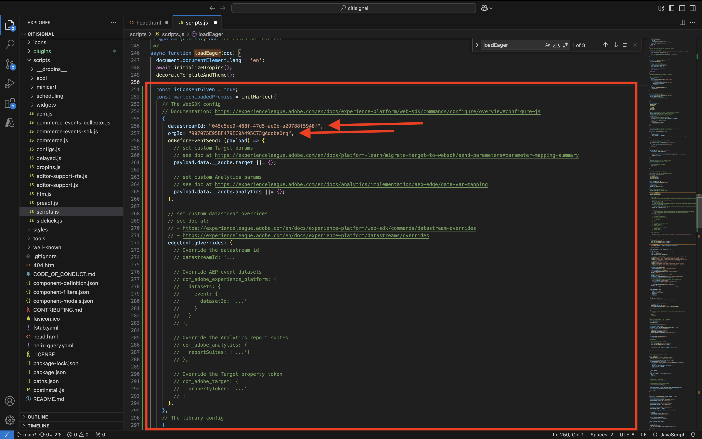
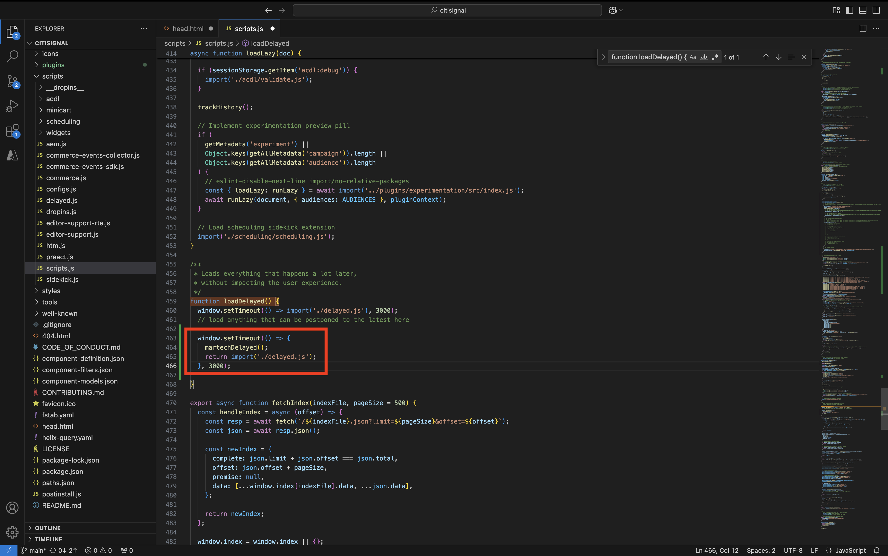

# 2.1.6 Plug-in AEM Edge Delivery Services MarTech

O plug-in AEM MarTech ajuda você a configurar rapidamente uma pilha completa de MarTech para seu projeto AEM.

>[!NOTE]
>
>Este plug-in está atualmente disponível para clientes em colaboração com a engenharia AEM por meio de projetos de coinovação. Você pode encontrar mais informações em [https://github.com/adobe-rnd/aem-martech](https://github.com/adobe-rnd/aem-martech).

Navegue até a pasta que você está usando para o seu **citisignal** repositório GitHub. Clique com o botão direito no nome da pasta e selecione **Novo Terminal na Pasta**.


Você verá isso. Cole o seguinte comando e pressione **enter**.

```
git subtree add --squash --prefix plugins/martech https://github.com/adobe/aem-experimentation.git main
```

Você deverá ver isso.


Navegue até a pasta que você está usando para o seu **citisignal** repositório GitHub, abra a pasta **plugins**. Agora você deve ver uma pasta chamada **martech**.


No Visual Studio Code, abra o arquivo **head.html**. Copie o código abaixo e cole-o no arquivo **head.html**.

```javascript
<link rel="preload" as="script" crossorigin="anonymous" href="/plugins/martech/src/index.js"/>
<link rel="preload" as="script" crossorigin="anonymous" href="/plugins/martech/src/alloy.min.js"/>
<link rel="preconnect" href="https://edge.adobedc.net"/>
<!-- change to adobedc.demdex.net if you enable third party cookies -->
```

Salve as alterações.


No Visual Studio Code, vá para a pasta **scripts** e abra o arquivo **scripts.js**. Copie o código abaixo e cole-o no arquivo **scripts.js**, nos scripts de importação existentes.

```javascript
import {
  initMartech,
  updateUserConsent,
  martechEager,
  martechLazy,
  martechDelayed,
} from '../plugins/martech/src/index.js';
```

Salve as alterações.


```javascript
const isConsentGiven = true;
  const martechLoadedPromise = initMartech(
    // The WebSDK config
    // Documentation: https://experienceleague.adobe.com/en/docs/experience-platform/web-sdk/commands/configure/overview#configure-js
    {
      datastreamId: "045c5ee9-468f-47d5-ae9b-a29788f5948f",
      orgId: "907075E95BF479EC0A495C73@AdobeOrg",
      onBeforeEventSend: (payload) => {
        // set custom Target params 
        // see doc at https://experienceleague.adobe.com/en/docs/platform-learn/migrate-target-to-websdk/send-parameters#parameter-mapping-summary
        payload.data.__adobe.target ||= {};

        // set custom Analytics params
        // see doc at https://experienceleague.adobe.com/en/docs/analytics/implementation/aep-edge/data-var-mapping
        payload.data.__adobe.analytics ||= {};
      },

      // set custom datastream overrides
      // see doc at:
      // - https://experienceleague.adobe.com/en/docs/experience-platform/web-sdk/commands/datastream-overrides
      // - https://experienceleague.adobe.com/en/docs/experience-platform/datastreams/overrides
      edgeConfigOverrides: {
        // Override the datastream id
        // datastreamId: '...'

        // Override AEP event datasets
        // com_adobe_experience_platform: {
        //   datasets: {
        //     event: {
        //       datasetId: '...'
        //     }
        //   }
        // },

        // Override the Analytics report suites
        // com_adobe_analytics: {
        //   reportSuites: ['...']
        // },

        // Override the Target property token
        // com_adobe_target: {
        //   propertyToken: '...'
        // }
      },
    },
    // The library config
    {
      launchUrls: ["https://assets.adobedtm.com/b754ed1bed61/b9f7c7c484de/launch-28b548849fb9.min.js"],
      personalization: !!getMetadata('target') && isConsentGiven,
    },
  );
```




```javascript
if (main) {
    decorateMain(main);
    await Promise.all([
      martechLoadedPromise.then(martechEager),
      waitForLCP(LCP_BLOCKS),
    ]);
  }
```


```javascript
await martechLazy();
```


```javascript
window.setTimeout(() => {
    martechDelayed();
    return import('./delayed.js');
  }, 3000);
```




Agora é possível exibir as alterações em seu site indo para `main--citisignal--XXX.aem.page/us/en` e/ou `main--citisignal--XXX.aem.live/us/en`, depois de substituir XXX pela sua conta de usuário do GitHub, que neste exemplo é `woutervangeluwe`.

Neste exemplo, o URL completo torna-se isto:
`https://main--citisignal--woutervangeluwe.aem.page/us/en` e/ou `https://main--citisignal--woutervangeluwe.aem.live/us/en`.

Próxima etapa: [Resumo e benefícios](./summary.md){target="_blank"}

[Retornar ao Módulo 2.1](./aemcs.md){target="_blank"}

[Voltar para Todos os Módulos](./../../../overview.md){target="_blank"}
