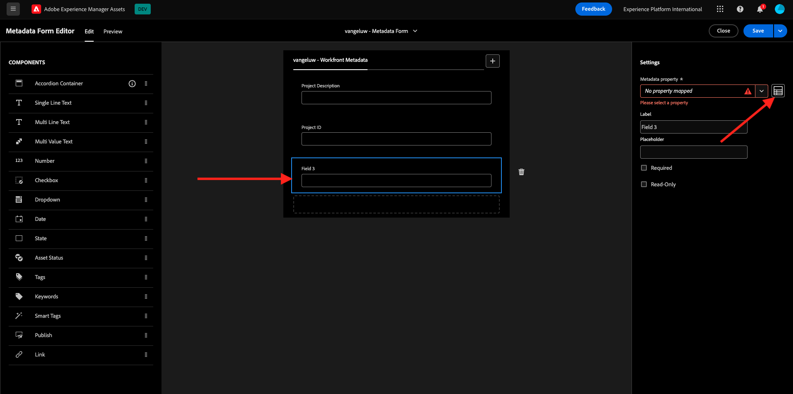

# 2.2.1 Introdução ao Workfront

Faça logon no Adobe Workfront em [https://experienceplatform.my.workfront.com/](https://experienceplatform.my.workfront.com/){target="_blank"}.

Então você vê isso.

## 2.2.1.1 Configurar a integração do AEM Assets

Clique no ícone de 9 pontos **hambúrguer** e selecione **Instalação**.

No menu esquerdo, role até **Documentos** e clique em **Experience Manager Assets**.

Clique em **+ Adicionar integração de Experience Manager**.

Para o nome da sua integração, use `--aepUserLdap-- - Citi Signal AEM`.

Abra a lista suspensa **repositório de Experience Manager** e selecione sua instância AEM CS, que deve ser chamada de `--aepUserLdap-- - Citi Signal`.

Em **Metadados**, configure o seguinte mapeamento:

| Campo do Workfront | Campo do Experience Manager Assets |
| --------------- | ------------------------------ | 
| **Documento** > **Nome** | **wm:documentName** |
| **Projeto** > **Descrição** | **wm:descriçãoDoProjeto** |
| **Tarefa** > **Nome** | **wm:taskName** |
| **Tarefa** > **Descrição** | **wm:taskDescription** |

Habilite o comutador para **Sincronizar metadados do objeto**.

Clique em **Salvar**.

Sua integração do Workfront com o AEM Assets CS está configurada.

## 2.2.1.2 Configurar a integração de metadados com o AEM Assets

Em seguida, é necessário configurar o AEM Assets para que os campos de metadados do ativo no Workfront sejam compartilhados com o AEM.

Para fazer isso, vá para [https://experience.adobe.com/](https://experience.adobe.com/). Clique em **Experience Manager Assets**.

Clique para selecionar seu ambiente AEM Assets, que deve ser nomeado como `--aepUserLdap-- - Citi Signal dev`.

Você deverá ver isso. No menu esquerdo, vá para **Assets** e clique em **Criar Pasta**.

Nomeie sua pasta `--aepUserLdap-- - Workfront Assets` e clique em **Criar**.

Em seguida, vá para **Metadata Forms** no menu esquerdo e clique em **Criar**.

Use o nome `--aepUserLdap-- - Metadata Form` e clique em **Criar**.

Adicione 3 novos campos **Texto de linha única** ao formulário e selecione o primeiro campo. Em seguida, clique no ícone **Esquema** ao lado do campo **Propriedade de metadados**.

No campo de pesquisa, insira `wm:project` e selecione o campo **Descrição do Projeto**. Clique em **Selecionar**.

Altere o rótulo do campo para **Descrição do Projeto**.

Em seguida, selecione o campo 2ª **Texto de linha única** e clique novamente no ícone **Esquema** ao lado do campo **Propriedade de metadados**.

Você verá esse pop-up novamente. No campo de pesquisa, digite `wm:project` e selecione o campo **ID do Projeto**. Clique em **Selecionar**.

Altere o rótulo do campo para **ID do projeto**.

Selecione o campo 3ª **Texto de linha única** e clique novamente no ícone **Esquema** ao lado do campo **Propriedade de metadados**.

Você verá esse pop-up novamente. No campo de pesquisa, digite `wm:project` e selecione o campo **Nome do Projeto**. Clique em **Selecionar**.

Altere o rótulo do campo para **Nome do Projeto**. Clique em **Salvar**.

Altere o **Nome da guia** no formulário para `--aepUserLdap-- - Workfront Metadata`. Clique em **Salvar** e **Fechar**.

Seu **Formulário de Metadados** está configurado.

Em seguida, é necessário atribuir o Formulário de metadados à pasta criada anteriormente. Marque a caixa de seleção do formulário de metadados e clique em **Atribuir às pastas**.

Selecione sua pasta, que deve se chamar `--aepUserLdap-- - Workfront Assets`. Clique em **Atribuir**.

O formulário de metadados agora está atribuído à sua pasta com sucesso.

## 2.2.1.2 Configurar a integração do AEM Sites

>[!NOTE]
>
>Este plug-in está atualmente no modo **Acesso antecipado** e ainda não está disponível para o público geral.
>
>Este plug-in pode já estar instalado na instância do Workfront que você está usando. Se ele já estiver instalado, você poderá revisar as instruções abaixo, mas não será necessário alterar nada em sua configuração.

Ir para [https://experience.adobe.com/#/@experienceplatform/aem/extension-manager/universal-editor](https://experience.adobe.com/#/@experienceplatform/aem/extension-manager/universal-editor){target="_blank"}.

Verifique se a **alternância** deste plug-in está definida como **Habilitada**. Em seguida, clique no ícone de **engrenagem**.

Você verá um pop-up de **Configuração de extensão**. Configure os campos a seguir para usar este plug-in.

| Chave | Valor |
| --------------- | ------------------------------ | 
| **`IMS_ENV`** | **PRODUÇÃO** |
| **`WORKFRONT_INSTANCE_URL`** | **https://experienceplatform.my.workfront.com** |
| **`SHOW_CUSTOM_FORMS`** | **&#39;{&quot;previewUrl&quot;: true, &quot;publishUrl&quot;: true}&#39;** |

Clique em **Salvar**.

Volte para a interface do usuário do Workfront e clique no ícone de 9 pontos **hambúrguer**. Selecione **Instalação**.

No menu esquerdo, vá para **Forms Personalizado** e selecione **Formulário**. Clique em **+ Novo formulário personalizado**.

Selecione **Tarefa** e clique em **Continuar**.

Você verá um formulário personalizado vazio. Insira o nome do formulário `Content Fragment & Integration ID`.

Arraste e solte um novo campo **Texto de linha única** sobre a tela.

Configure o novo campo da seguinte maneira:

- **Rótulo**: **Fragmento do conteúdo**
- **Nome**: **`aem_workfront_integration_content_fragment`**

Adicione um novo campo **Texto de linha única** à tela e configure o novo campo desta forma:

- **Rótulo**: **ID de Integração**
- **Nome**: **`aem_workfront_integration_id`**

Clique em **Aplicar**.

Agora é necessário configurar um segundo formulário personalizado. Clique em **+ Novo formulário personalizado**.

Selecione **Tarefa** e clique em **Continuar**.

Você verá um formulário personalizado vazio. Insira o nome do formulário `Preview & Publish URL`.

Arraste e solte um novo campo **Texto de linha única** sobre a tela.

Configure o novo campo da seguinte maneira:

- **Rótulo**: **Visualizar URL**
- **Nome**: **`aem_workfront_integration_preview_url`**

Adicione um novo campo **Texto de linha única** à tela e configure o novo campo desta forma:

- **Rótulo**: **URL do Publish**
- **Nome**: **`aem_workfront_integration_publish_url`**

Clique em **Aplicar**.

Em seguida, você deve ter dois formulários personalizados disponíveis.

Próxima Etapa: [2.2.2 Revisão com o Workfront](./ex2.md){target="_blank"}

[Retornar ao Módulo 2.2](./workfront.md){target="_blank"}

[Voltar para Todos os Módulos](./../../../overview.md){target="_blank"}
