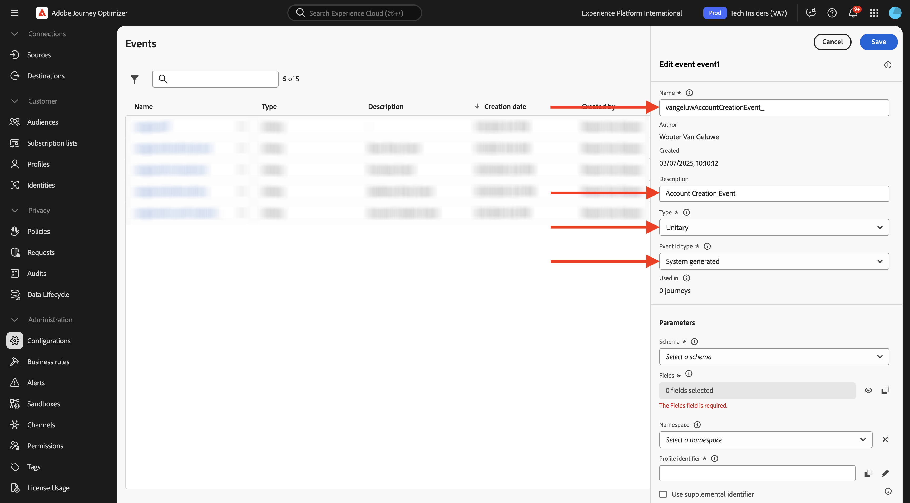
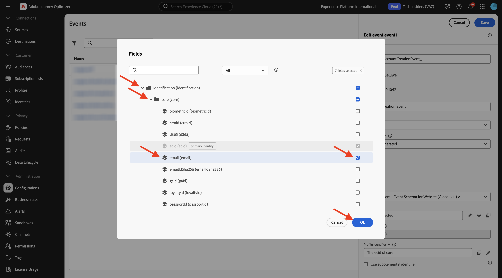

# 3.1.1 Criar o evento

Faça login no Adobe Journey Optimizer em [Adobe Experience Cloud](https://experience.adobe.com). Clique em **Journey Optimizer**.

Você será redirecionado para a exibição **Página inicial** no Journey Optimizer. Primeiro, verifique se você está usando a sandbox correta. A sandbox a ser usada é chamada `--aepSandboxName--`.

No menu esquerdo, role para baixo e clique em **Configurações**. Em seguida, clique no botão **Gerenciar** em **Eventos**.

Você verá uma visão geral de todos os eventos disponíveis. Clique em **Criar evento** para começar a criar seu próprio evento.

Uma nova janela de evento vazia será exibida.

Primeiro, dê ao seu Evento um Nome como este: `--aepUserLdap--AccountCreationEvent`.
Defina a descrição como `Account Creation Event`, verifique se **Type** está definido como **Unitary** e para a seleção **Tipo de ID de Evento**, selecione **Gerado pelo Sistema**.

O próximo é a seleção Esquema. Use o esquema `Demo System - Event Schema for Website (Global v1.1) v.1`.

Depois de selecionar o esquema, você verá vários campos sendo selecionados na seção **Carga**. Agora você deve passar o mouse sobre a seção **Carga** e verá três ícones pop-up. Clique no ícone **Editar**.

Você verá um pop-up de janela **Campos**, no qual é necessário selecionar alguns dos campos necessários para personalizar o email.  Você escolherá outros atributos de perfil posteriormente, usando os dados já existentes no Adobe Experience Platform.

No objeto `--aepTenantId--.demoEnvironment`, selecione os campos **brandLogo** e **brandName**.

No objeto `--aepTenantId--.identification.core`, certifique-se de selecionar o campo **email**. Clique em **Ok** para salvar suas alterações.

Você deverá ver isso. Verifique se o **Namespace** está definido como **ECID (ECID)**. Clique em **Salvar**.

Seu evento agora está configurado e salvo.

Clique no evento novamente para abrir a tela **Editar Evento** novamente. Passe o mouse sobre o campo **Carga** novamente para ver os 3 ícones novamente. Clique no ícone **Exibir carga**.

Agora você verá um exemplo da carga útil esperada.

Seu Evento tem uma eventID de orquestração exclusiva, que você pode encontrar rolando para baixo nessa carga até ver `_experience.campaign.orchestration.eventID`.

A ID de evento é o que precisa ser enviado para o Adobe Experience Platform para acionar a jornada que você criará a seguir. Lembre-se dessa eventID, pois ela será necessária em um dos próximos exercícios.
`"eventID": "d40815dbcd6ffd813035b4b590b181be21f5305328e16c5b75e4f32fd9e98557"`

Clique em **Ok**.

Clique em **Cancelar** para fechar esta janela.

## Próximas etapas

Ir para [3.1.2 Criar fragmentos a serem usados na sua mensagem](./ex2.md){target="_blank"}

Voltar para [Adobe Journey Optimizer: Orquestração](./journey-orchestration-create-account.md){target="_blank"}

Voltar para [Todos os módulos](./../../../../overview.md){target="_blank"}
