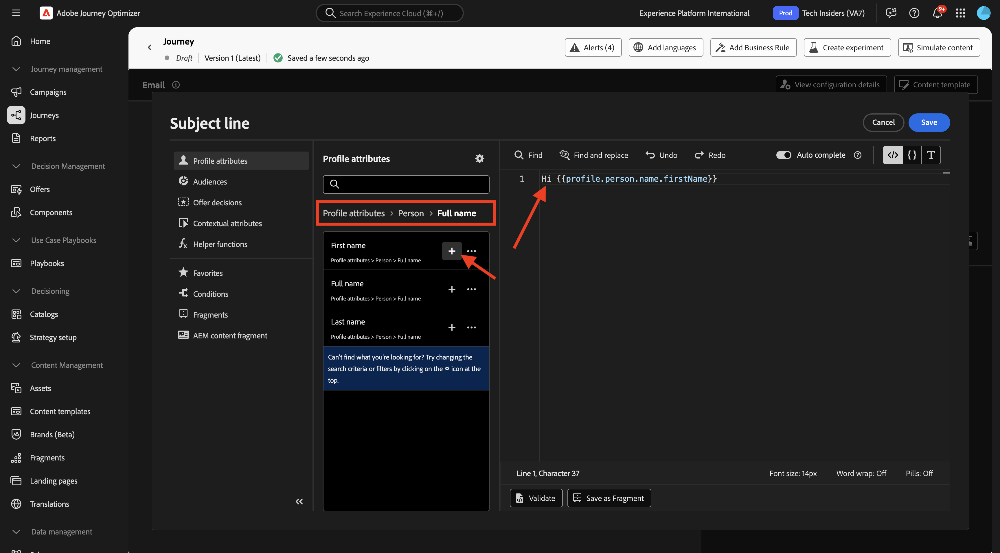
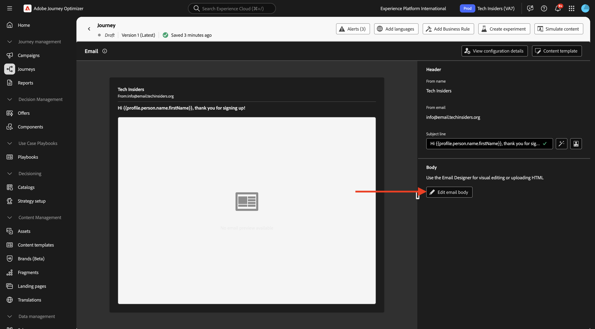
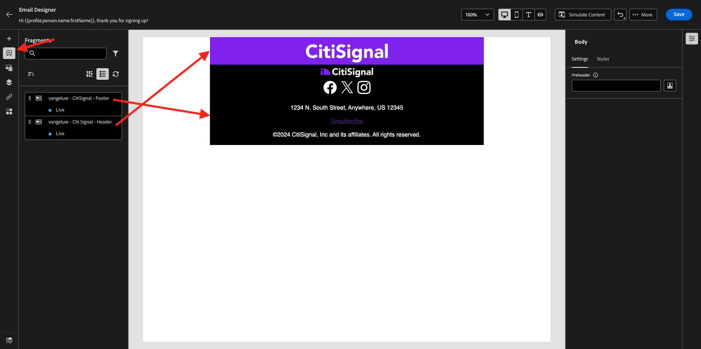
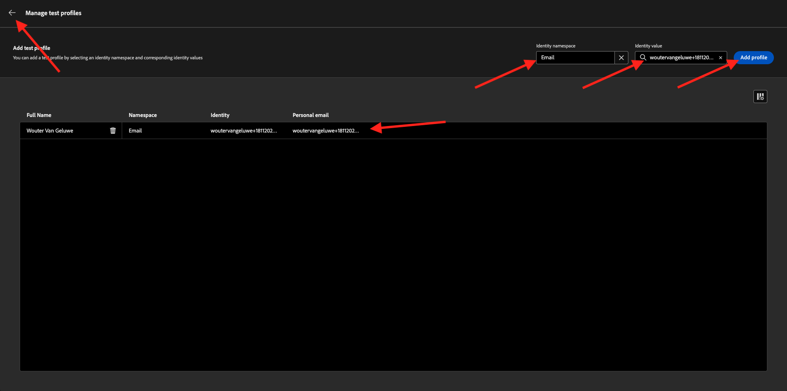
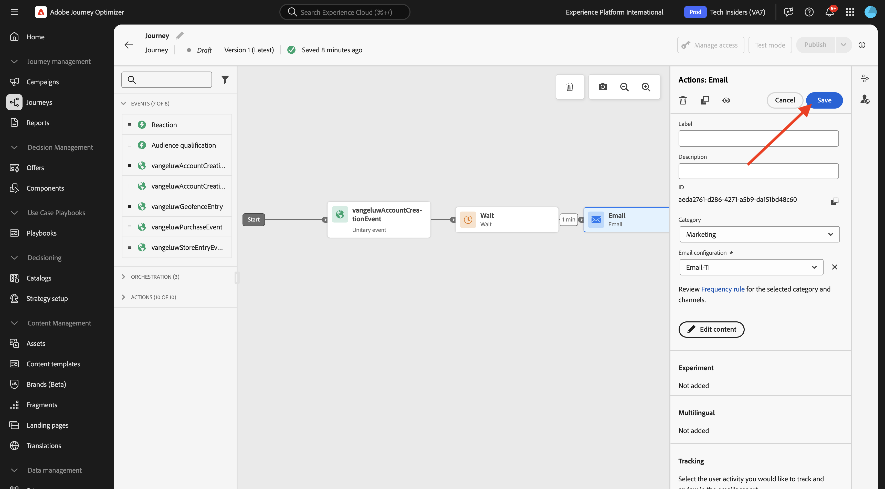

# 3.1.3 Criar a jornada e a mensagem de email

Neste exercício, você configurará a jornada e a mensagem que precisa ser acionada quando alguém criar uma conta no site de demonstração.

Faça login no Adobe Journey Optimizer em [Adobe Experience Cloud](https://experience.adobe.com). Clique em **Journey Optimizer**.


Você será redirecionado para a exibição **Página inicial** no Journey Optimizer. Primeiro, verifique se você está usando a sandbox correta. A sandbox a ser usada é chamada `--aepSandboxName--`.


## 3.1.3.1 Crie sua Jornada

No menu esquerdo, clique em **Jornadas**. Em seguida, clique em **Criar Jornada** para criar uma nova jornada.


Você verá uma tela de jornada vazia.


No exercício anterior, você criou um novo **Evento**. Você o nomeou desta forma `--aepUserLdap--AccountCreationEvent`. Este foi o resultado da criação do Evento:


Agora, é necessário tomar este evento como o início desta Jornada. Você pode fazer isso indo para o lado esquerdo da tela e procurando seu evento na lista de eventos.


Selecione o evento, arraste e solte-o na tela de jornada. Agora a jornada tem esta aparência:


Como a segunda etapa da jornada, você precisa adicionar uma pequena etapa **Aguardar**. Vá para o lado esquerdo da tela para a seção **Orquestração** para encontrar isso. Você estará usando atributos de perfil e precisa verificar se eles estão preenchidos no Perfil do cliente em tempo real.


Sua jornada agora está assim. No lado direito da tela, é necessário configurar o tempo de espera. Defina-o como 1 minuto. Isso dará bastante tempo para que os atributos de perfil estejam disponíveis após o acionamento do evento. Clique em **Salvar** para salvar as alterações.


Como terceira etapa da jornada, você precisa adicionar uma ação **Email**. Vá para o lado esquerdo da tela para **Ações**, selecione a ação **Email** e arraste-a e solte-a no segundo nó da jornada. Agora vocês podem ver isso.


Defina a **Categoria** como **Marketing** e selecione uma configuração de email que permita o envio de emails. Nesse caso, a configuração de email a ser selecionada é **Email-TI**.


## 3.1.3.2 Crie sua Mensagem

Para criar sua mensagem, clique em **Editar conteúdo**.


Agora vocês podem ver isso.


Clique no ícone **Abrir caixa de diálogo de personalização**.


Escreva o texto `Hi `. Em seguida, você precisa trazer o token de personalização para o campo **Nome**, que é armazenado em `profile.person.name.firstName`. No menu esquerdo, navegue até o campo **Pessoa > Nome completo > Nome** e clique no ícone **+**. Você verá o token de personalização aparecer no campo de texto.



Em seguida, adicione o texto **, obrigado por se inscrever!**. Clique em **Salvar**.


Agora você pode começar a configurar o corpo do email. Clique em **Editar corpo do email**.



Antes de começar a criar o conteúdo da própria mensagem, é uma boa ideia pensar no conteúdo da mensagem. Parte do conteúdo da mensagem é exclusiva da própria mensagem, mas outras partes são componentes padrão que provavelmente serão os mesmos para cada email que você enviará aos clientes.

No exercício anterior, você já criou esses componentes padrão como Fragmentos no Journey Optimizer, que agora pode ser referenciado nesta mensagem e em todas as outras mensagens futuras que você criará.

Na próxima tela, 3 métodos diferentes serão exibidos para fornecer o conteúdo do email:

- **Criar do zero**: comece com uma tela em branco e use o editor de WYSIWYG para arrastar e soltar componentes de estrutura e conteúdo para criar visualmente o conteúdo do email.
- **Codifique o seu próprio**: crie seu próprio modelo de email codificando-o usando o HTML
- **Importar HTML**: importe um modelo existente do HTML, que você poderá editar.

Clique em **Design do zero**.


No menu esquerdo, você encontrará os componentes de estrutura que podem ser usados para definir a estrutura do email (linhas e colunas).


Você também encontrará **Fragmentos** no menu esquerdo, onde verá os fragmentos criados anteriormente.


Antes de adicionar o cabeçalho e o rodapé à tela, é necessário adicionar duas estruturas ao email. Clique no ícone **+** no menu à esquerda e arraste 2 componentes da coluna **1:1** para a tela.


No menu esquerdo, volte para **Fragmentos**. Arraste e solte o fragmento de cabeçalho no primeiro componente e o fragmento de rodapé no segundo componente. Você verá isso.



Clique no ícone **+** no menu à esquerda e arraste e solte mais 2 componentes de **coluna:1** na tela, entre o cabeçalho e o rodapé.


Arraste e solte um componente **Imagem** no primeiro componente **da coluna** 1:1. Clique em **Procurar**.


Na pasta **citi-signal-images**. Selecione a imagem **`welcome_email_image.png`** e clique em **Selecionar**.


Você terá isto:


Em seguida, vá para **Conteúdo** e arraste e solte um componente **Texto** no componente de estrutura na quarta linha.


Selecione o texto padrão **Digite o texto aqui.** como faria com qualquer editor de texto. Em vez disso, escreva **Bem-vindo à família**. Na barra de ferramentas, clique no ícone **Adicionar personalização**.


Em seguida, você precisa trazer o token de personalização de **Nome**, que é armazenado em `profile.person.name.firstName`. No menu, localize o elemento **Pessoa**, vá para o elemento **Nome Completo** e clique no ícone **+** para adicionar o campo Nome ao editor de expressão.

Clique em **Salvar**.


Agora você observará como o campo de personalização foi adicionado ao seu texto.


No mesmo campo de texto, pressione **Enter** duas vezes para adicionar duas linhas e copiar e colar o seguinte texto:

```
Welcome aboard! We're thrilled to have you join the CitiSignal family. 
As a valued member of our community, you're now poised to experience top-notch telecommunications services that cater to your every need.

At CitiSignal, we understand that staying connected is more than just a convenience - it's a necessity. Whether you're browsing the web, streaming your favourite content, or keeping in touch with loved ones, we're here to ensure you have the best tools and resources at your fingertips.
```


Defina o **Alinhamento do texto** para ser centralizado e fique à vontade para ajustar a aparência da mensagem de acordo com suas necessidades. Quando terminar, clique em **Salvar**.


A verificação final a ser executada para garantir que seu email está pronto é visualizá-lo, clique no botão **Simular Conteúdo**.


Antes de simular a mensagem de email, é necessário adicionar um perfil de teste. Clique em **Gerenciar perfis de teste**.


Selecione o namespace de **email** clicando no ícone ao lado do campo **Inserir namespace de identidade**.

Na lista de namespaces de identidade, selecione o namespace **Email**. No campo **Valor de identidade**, insira o endereço de email de um perfil anterior que você usou em um exercício anterior e que já está armazenado no Adobe Experience Platform. Clique em **Adicionar perfil**. Voltar para a tela anterior.



Você verá sua mensagem de email, agora simulada para este perfil de cliente. Agora você pode validar a personalização na linha de assunto e no corpo da mensagem e enviar um email de prova, se desejar.

Clique em **Fechar** para fechar a visualização.


Clique em **Salvar** para salvar sua mensagem e voltar para o painel de mensagens clicando na **seta** ao lado do texto da linha de assunto no canto superior esquerdo.


Clique na **seta** para voltar para a jornada.


## 3.1.3.3 Publique sua jornada

Clique em **Salvar**.



Você ainda precisa dar um nome à sua jornada. Você pode fazer isso clicando no ícone **Propriedades** na parte superior direita da tela.


Em seguida, você pode inserir o nome da jornada aqui. Use `--aepUserLdap-- - Registration Journey`. Clique em **Salvar**.


Agora você pode publicar sua jornada clicando em **Publicar**.


Clique novamente em **Publicar**.


Após alguns minutos, o status da sua jornada mudará para **Live** e você verá um painel do desempenho da sua jornada em tempo real.


Você terminou este exercício agora.

## Próximas etapas

Ir para [3.1.4 Atualize sua propriedade de Coleção de Dados e teste sua jornada](./ex4.md){target="_blank"}

Voltar para [Adobe Journey Optimizer: Orquestração](./journey-orchestration-create-account.md){target="_blank"}

Voltar para [Todos os módulos](./../../../../overview.md){target="_blank"}
