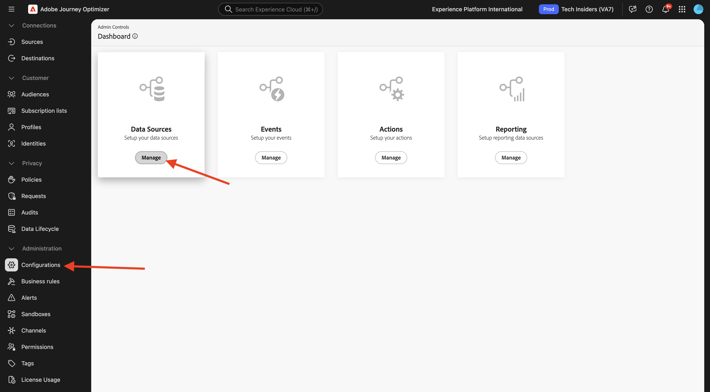
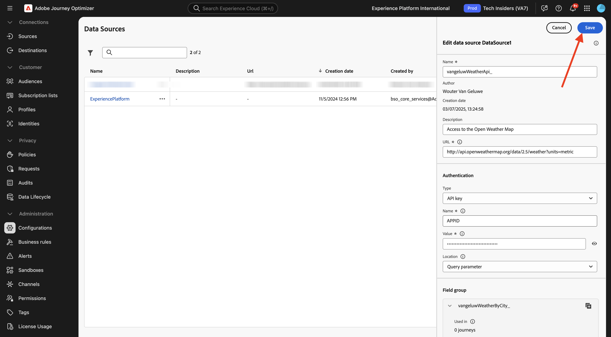

# 3.2.2 Definir uma fonte de dados externa

Neste exercício, você criará uma fonte de dados externa personalizada usando o Adobe Journey Optimizer.

Faça login no Adobe Journey Optimizer em [Adobe Experience Cloud](https://experience.adobe.com). Clique em **Journey Optimizer**.


Você será redirecionado para a exibição **Página inicial** no Journey Optimizer. Primeiro, verifique se você está usando a sandbox correta. A sandbox a ser usada é chamada `--aepSandboxName--`. Você estará na exibição **Página inicial** da sua sandbox `--aepSandboxName--`.


No menu esquerdo, role para baixo e clique em **Configurações**. Em seguida, clique no botão **Gerenciar** em **Fontes de Dados**.



Você verá a lista **Fontes de Dados**.
Clique em **Criar Source de Dados** para começar a adicionar sua fonte de dados.


Você verá um pop-up vazio da fonte de dados.


Antes de começar a configurar isso, você precisará de uma conta com o serviço **Abrir Mapa Meteorológico**. Siga estas etapas para criar sua conta e obter sua chave de API.

Ir para [https://openweathermap.org/](https://openweathermap.org/). Na página inicial, clique em **Entrar**.


Clique em **Criar uma Conta**.


Preencha os detalhes. Clique em **Criar Conta**.


Você será redirecionado para a Página da sua conta.


No menu, clique em **Chaves de API** para recuperar sua Chave de API, que você precisará para configurar sua fonte de dados externa personalizada.


Uma **Chave de API** tem esta aparência: `b2c4c36b6bb59c3458d6686b05311dc3`.

Você pode encontrar a **Documentação da API** para a **Previsão atual** [aqui](https://openweathermap.org/current).

Neste caso de uso, você implementará a conexão com o Open Weather Map com base na cidade em que o cliente está, usando a **Solicitação de API interna por nome de cidade**.


Volte para o **Adobe Journey Optimizer**, para o pop-up **External Data Source** vazio.


Como um Nome para a fonte de dados, use `--aepUserLdap--WeatherApi`.

Defina a Descrição como: `Access to the Open Weather Map`.

A URL para a API Abrir Mapa Meteorológico é: `http://api.openweathermap.org/data/2.5/weather?units=metric`.


Em seguida, é necessário selecionar a Autenticação a ser usada.

Use estas variáveis:

| Campo | Valor |
|:-----------------------:| :-----------------------|
| Tipo | **Chave de API** |
| Nome | **APPID** |
| Valor | **sua chave de API** |
| Localização | **Parâmetro de consulta** |


Finalmente, você precisa definir um **FieldGroup**, que é basicamente a solicitação que você enviará para a API do clima. Em nosso caso, queremos usar o nome da cidade para solicitar o Tempo Atual para essa cidade.


De acordo com a Documentação da API do Tempo, você precisa enviar um parâmetro `q=City`.


Para corresponder à Solicitação de API esperada, configure seu FieldGroup da seguinte maneira:

>[!IMPORTANT]
>
>O nome do grupo de campos deve ser exclusivo, use esta convenção de nomenclatura: `--aepUserLdap--WeatherByCity`


Para a Carga de resposta, é necessário colar um exemplo da Resposta que será enviada pela API de Tempo.

Você pode encontrar a Resposta JSON da API esperada na página Documentação da API [aqui](https://openweathermap.org/current), no assunto **JSON**.


Ou você pode copiar a Resposta JSON daqui:

```json
{
   "coord": {
      "lon": 7.367,
      "lat": 45.133
   },
   "weather": [
      {
         "id": 501,
         "main": "Rain",
         "description": "moderate rain",
         "icon": "10d"
      }
   ],
   "base": "stations",
   "main": {
      "temp": 284.2,
      "feels_like": 282.93,
      "temp_min": 283.06,
      "temp_max": 286.82,
      "pressure": 1021,
      "humidity": 60,
      "sea_level": 1021,
      "grnd_level": 910
   },
   "visibility": 10000,
   "wind": {
      "speed": 4.09,
      "deg": 121,
      "gust": 3.47
   },
   "rain": {
      "1h": 2.73
   },
   "clouds": {
      "all": 83
   },
   "dt": 1726660758,
   "sys": {
      "type": 1,
      "id": 6736,
      "country": "IT",
      "sunrise": 1726636384,
      "sunset": 1726680975
   },
   "timezone": 7200,
   "id": 3165523,
   "name": "Province of Turin",
   "cod": 200
}    
```

Copie a Resposta JSON acima para a área de transferência e vá para a tela de configuração da fonte de dados personalizada.

Clique no ícone **Editar Carga**.


Você verá um pop-up no qual terá que colar a Resposta JSON acima.


Cole sua resposta JSON, e você verá isso depois. Clique em **Salvar**.


A configuração da fonte de dados personalizada está concluída. Role para cima e clique em **Salvar**.



Sua fonte de dados foi criada com êxito e faz parte da lista **Fontes de Dados**.


## Próximas etapas

Ir para [3.2.3 Definir uma ação personalizada](./ex3.md){target="_blank"}

Voltar para [Adobe Journey Optimizer: Fontes de dados externas e ações personalizadas](journey-orchestration-external-weather-api-sms.md){target="_blank"}

Voltar para [Todos os módulos](./../../../../overview.md){target="_blank"}
