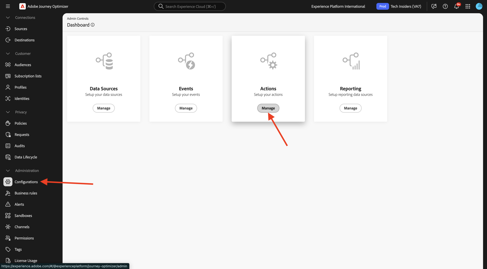

# 3.2.3 Definir uma ação personalizada

Neste exercício, você criará uma ação personalizada para enviar uma mensagem a um canal do Slack.

Faça login no Adobe Journey Optimizer em [Adobe Experience Cloud](https://experience.adobe.com). Clique em **Journey Optimizer**.


Você será redirecionado para a exibição **Página inicial** no Journey Optimizer. Primeiro, verifique se você está usando a sandbox correta. A sandbox a ser usada é chamada `--aepSandboxName--`. Você estará na exibição **Página inicial** da sua sandbox `--aepSandboxName--`.


Agora você usará um canal existente do Slack e enviará mensagens para esse canal do Slack. O Slack tem uma API fácil de usar e você usará o Adobe Journey Optimizer para acionar a API.


No menu esquerdo, role para baixo e clique em **Configurações**. Em seguida, clique no botão **Gerenciar** em **Ações**.



Você verá a lista **Ações**. Clique em **Criar ação**.


Você verá um pop-up Ação vazio.


Como Nome da Ação, use `--aepUserLdap--TextSlack`.

Defina a Descrição como: `Send Message to Slack`.

Para a **Configuração de URL**, use este:

- URL: `https://2mnbfjyrre.execute-api.us-west-2.amazonaws.com/prod`
- Método: **POST**

>[!NOTE]
>
>O URL acima se refere a uma função AWS Lambda que encaminhará sua solicitação para o canal do Slack, como mencionado acima. Isso é feito para proteger o acesso a um canal do Slack de propriedade da Adobe. Se você tiver seu próprio canal do Slack, deve criar um Aplicativo Slack por meio de [https://api.slack.com/](https://api.slack.com/). Em seguida, é necessário criar um Webhook de Entrada nesse Aplicativo Slack e substituir a URL acima pela URL do Webhook de Entrada.


A **Autenticação** deve ser definida como **Sem Autenticação**.


Em **Cargas**, é necessário definir quais campos devem ser enviados para o Slack. Logicamente, você deseja que o Adobe Journey Optimizer e o Adobe Experience Platform sejam o cérebro da personalização, de modo que o texto a ser enviado para o Slack deve ser definido pelo Adobe Journey Optimizer e, em seguida, enviado para o Slack para execução.

Para a **Solicitação**, clique no ícone **Editar Carga**.


Você verá uma janela pop-up vazia.


Copie o texto abaixo e cole-o na janela pop-up vazia.

```json
{
 "text": {
  "toBeMapped": true,
  "dataType": "string",
  "label": "textToSlack"
 }
}
```

Você verá isso. Clique em **Salvar**.


Role para cima e clique em **Salvar** mais uma vez para salvar sua ação.


Sua ação personalizada agora faz parte da lista **Ações**.


Você definiu eventos, fontes de dados externas e ações. A seguir, você combinará tudo isso em uma jornada.

## Próximas etapas

Ir para [3.2.4 Criar sua jornada e mensagens](./ex4.md){target="_blank"}

Voltar para [Adobe Journey Optimizer: Fontes de dados externas e ações personalizadas](journey-orchestration-external-weather-api-sms.md){target="_blank"}

Voltar para [Todos os módulos](./../../../../overview.md){target="_blank"}
