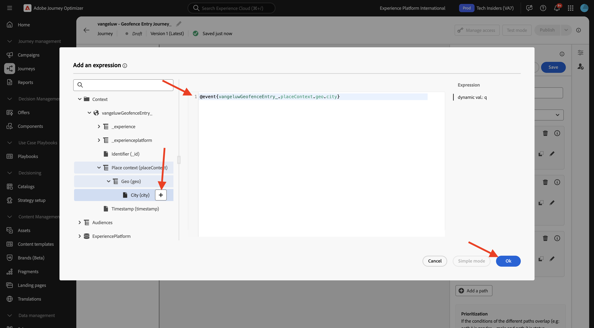

# 3.2.4 Criar a jornada e as mensagens

Neste exercício, você criará uma jornada e várias mensagens de texto usando o Adobe Journey Optimizer.

Para esse caso de uso, o objetivo é enviar mensagens diferentes com base nas condições meteorológicas da localização do seu cliente. Foram definidos três cenários:

- Mais frio que 10° Celsius
- Entre 10° e 25° Celsius
- Mais quente que 25° Celsius

Para essas três condições, será necessário definir três mensagens no Adobe Journey Optimizer.

## 3.2.4.1 Crie sua jornada

Faça login no Adobe Journey Optimizer em [Adobe Experience Cloud](https://experience.adobe.com). Clique em **Journey Optimizer**.


Você será redirecionado para a exibição **Página inicial** no Journey Optimizer. Primeiro, verifique se você está usando a sandbox correta. A sandbox a ser usada é chamada `--aepSandboxName--`. Você estará na exibição **Página inicial** da sua sandbox `--aepSandboxName--`.


No menu esquerdo, vá para **Jornadas** e clique em **Criar Jornada** para começar a criar sua Jornada.


Você deveria nomear sua jornada.

Como Nome da jornada, use `--aepUserLdap-- - Geofence Entry Journey`. Nenhum outro valor deve ser definido neste momento. Clique em **Salvar**.


À esquerda da tela, dê uma olhada em **Eventos**. Você deve ver seu evento criado anteriormente nessa lista, chamada `--aepUserLdap--GeofenceEntry`. Selecione-a e, em seguida, arraste-a e solte-a na tela de jornada. Sua jornada fica assim.


Em seguida, clique em **Orquestração**. Agora você vê os recursos disponíveis do **Orchestration**. Selecione **Condição** e arraste-a e solte-a na Tela de Jornada.


Agora é necessário configurar três caminhos para essa condição:

- Está mais frio que 10° Celsius
- Está entre 10° e 25° Celsius
- Está mais quente que 25° Celsius

Vamos definir a primeira condição.

### Condição 1: Mais frio que 10° Celsius

Clique na **Condição**.  Clique em **Caminho1** e edite o nome do caminho para **Mais frio que 10 C**. Clique no ícone **Editar** para a expressão de Path1.


Você verá uma tela vazia **Editor simples**. Sua consulta será um pouco mais avançada, portanto, você precisará do **Modo Avançado**. Clique em **Modo Avançado**.


Você verá o **Editor Avançado** que permite a entrada de código.


Selecione o código abaixo e cole-o no **Editor Avançado**.

`#{--aepUserLdap--WeatherApi.--aepUserLdap--WeatherByCity.main.temp} <= 10`

Você verá isso.


Para recuperar a temperatura como parte dessa condição, é necessário fornecer a cidade em que o cliente está atualmente.
A **Cidade** precisa ser vinculada ao parâmetro dinâmico `q`, da mesma forma que você viu anteriormente na Documentação da API de Abrir Tempo.

Clique no campo **val dinâmico: q** conforme indicado na captura de tela.


Em seguida, é necessário localizar o campo que contém a cidade atual do cliente em uma das Fontes de Dados disponíveis. Nesse caso, é necessário encontrá-la no **Contexto**.


Você pode encontrar o campo navegando até `--aepUserLdap--GeofenceEntry.placeContext.geo.city`.

Ao clicar nesse campo ou em **+**, ele será adicionado como valor dinâmico para o parâmetro `q`. Este campo será preenchido, por exemplo, pelo serviço de localização geográfica que você implementou no aplicativo móvel. Nesse caso, você simulará isso usando a propriedade de coleção de dados do site de demonstração. Clique em **OK**.



### Condição 2: Entre 10° e 25° Celsius

Depois de adicionar a primeira condição, você verá essa tela. Clique em **Adicionar um caminho**.


Clique duas vezes no **Caminho1** e edite o nome do caminho para **Entre 10 e 25 C**. Clique no ícone **Editar** para a expressão deste caminho.


Você verá uma tela vazia **Editor simples**. Sua consulta será um pouco mais avançada, portanto, você precisará do **Modo Avançado**. Clique em **Modo Avançado**.


Você verá o **Editor Avançado** que permite a entrada de código.


Selecione o código abaixo e cole-o no **Editor Avançado**.

`#{--aepUserLdap--WeatherApi.--aepUserLdap--WeatherByCity.main.temp} > 10 and #{--aepUserLdap--WeatherApi.--aepUserLdap--WeatherByCity.main.temp} <= 25`

Você verá isso.


Para recuperar a temperatura como parte dessa Condição, você precisa fornecer a cidade em que o cliente está atualmente.
A **Cidade** precisa estar vinculada ao parâmetro dinâmico **q**, da mesma forma que você viu anteriormente na Documentação da API de Abrir Meteorologia.

Clique no campo **val dinâmico: q** conforme indicado na captura de tela.


Em seguida, é necessário localizar o campo que contém a cidade atual do cliente em uma das Fontes de dados disponíveis.


Você pode encontrar o campo navegando até `--aepUserLdap--GeofenceEntry.placeContext.geo.city`. Ao clicar nesse campo, ele será adicionado como valor dinâmico para o parâmetro **q**. Este campo será preenchido, por exemplo, pelo serviço de localização geográfica que você implementou no aplicativo móvel. Nesse caso, você simulará isso usando a propriedade de coleção de dados do site de demonstração. Clique em **OK**.


Em seguida, você adicionará a terceira condição.

### Condição 3: mais quente que 25° Celsius

Depois de adicionar a segunda condição, você verá essa tela. Clique em **Adicionar um caminho**.


Clique duas vezes em Path1 para alterar o nome para **Warmer than 25 C**.
Em seguida, clique no ícone **Editar** da expressão neste caminho.


Você verá uma tela vazia **Editor simples**. Sua consulta será um pouco mais avançada, portanto, você precisará do **Modo Avançado**. Clique em **Modo Avançado**.


Você verá o **Editor Avançado** que permite a entrada de código.


Selecione o código abaixo e cole-o no **Editor Avançado**.

`#{--aepUserLdap--WeatherApi.--aepUserLdap--WeatherByCity.main.temp} > 25`

Você verá isso.


Para recuperar a temperatura como parte dessa Condição, você precisa fornecer a cidade em que o cliente está atualmente.
A **Cidade** precisa estar vinculada ao parâmetro dinâmico **q**, da mesma forma que você viu anteriormente na Documentação da API de Abrir Meteorologia.

Clique no campo **val dinâmico: q** conforme indicado na captura de tela.


Em seguida, é necessário localizar o campo que contém a cidade atual do cliente em uma das Fontes de dados disponíveis.


Você pode encontrar o campo navegando até ```--aepUserLdap--GeofenceEntry.placeContext.geo.city```. Ao clicar nesse campo, ele será adicionado como valor dinâmico para o parâmetro **q**. Este campo será preenchido, por exemplo, pelo serviço de localização geográfica que você implementou no aplicativo móvel. Nesse caso, você simulará isso usando a propriedade de coleção de dados do site de demonstração. Clique em **OK**.


Agora você tem três caminhos configurados. Clique em **Salvar**.


Como essa é uma jornada para fins de aprendizado, você configurará algumas ações para mostrar a variedade de opções que os profissionais de marketing agora têm para enviar mensagens.

## 3.2.4.2 Enviar mensagens para caminho: Mais frio que 10° Celsius

Para cada um dos contextos de temperatura, você tentará enviar uma mensagem de texto para um cliente. Neste exercício, você enviará uma mensagem real para um canal do Slack em vez de um número de celular.

Vamos focalizar o caminho **Mais frio que 10 C**.


No menu esquerdo, volte para **Ações**, selecione a Ação `--aepUserLdap--TextSlack` e arraste-a e solte-a depois da ação **Mensagem**.


Role para baixo até **Solicitar Parâmetros** e clique no ícone **Editar** do parâmetro `textToSlack`.


Na janela pop-up, clique em **Modo Avançado**.


Selecione o código abaixo, copie-o e cole-o no **Editor do Modo Avançado**. Clique em **Ok**.

`"Brrrr..." + #{ExperiencePlatform.ProfileFieldGroup.profile.person.name.firstName} + ",  it's cold and freezing outside. Get comfortable at home with a 20% discount on a Disney+ subscription!"`


Você verá sua ação concluída. Role para cima e clique em **Salvar**.


Esse caminho da jornada agora está pronto.

## 3.2.4.3 Enviar mensagens para caminho: Entre 10° e 25° Celsius

Para cada um dos contextos de temperatura, você tentará enviar uma mensagem ao cliente. Neste exercício, você enviará uma mensagem real para um canal do Slack em vez de um número de celular.

Vamos focalizar o caminho **Entre 10 e 25 C**.


No menu esquerdo, volte para **Ações**, selecione a Ação `--aepUserLdap--TextSlack` e arraste-a e solte-a depois da ação **Mensagem**.


Role para baixo até **Solicitar Parâmetros** e clique no ícone **Editar** do parâmetro `textToSlack`.


Na janela pop-up, clique em **Modo Avançado**.


Selecione o código abaixo, copie-o e cole-o no **Editor do Modo Avançado**. Clique em **Ok**.

`"What nice weather for the time of year, " + #{ExperiencePlatform.ProfileFieldGroup.profile.person.name.firstName} + " 20% discount on Apple AirPods so you can go for a walk and listen to your favorite podcast!"`


Você verá sua ação concluída. Role para cima e clique em **Salvar**.


Esse caminho da jornada agora está pronto.

## 3.2.4.4 Enviar mensagens para caminho: mais quente que 25° Celsius

Para cada um dos contextos de temperatura, você tentará enviar uma mensagem ao cliente. Neste exercício, você enviará uma mensagem real para um canal do Slack em vez de um número de celular.

Vamos focalizar o caminho **Mais quente que 25 C**.


No menu esquerdo, volte para **Ações**, selecione a Ação `--aepUserLdap--TextSlack` e arraste-a e solte-a depois da ação **Mensagens**.


Role para baixo até **Solicitar Parâmetros** e clique no ícone **Editar** do parâmetro `textToSlack`.


Na janela pop-up, clique em **Modo Avançado**.


Selecione o código abaixo, copie-o e cole-o no **Editor do Modo Avançado**. Clique em **Ok**.

`"So warm, " + #{ExperiencePlatform.ProfileFieldGroup.profile.person.name.firstName} + "! 20% discount on adding 10GB of extra data so you can get online at the beach!"`


Você verá sua ação concluída. Clique em **Salvar**.


Esse caminho da jornada agora está pronto.

## 3.2.4.5 Publique sua jornada

A jornada está totalmente configurada. Clique em **Publicar**.


Clique novamente em **Publicar**.


Sua jornada foi publicada.


## Próximas etapas

Ir para [3.2.5 Acionar sua jornada](./ex5.md){target="_blank"}

Voltar para [Adobe Journey Optimizer: Fontes de dados externas e ações personalizadas](journey-orchestration-external-weather-api-sms.md){target="_blank"}

Voltar para [Todos os módulos](./../../../../overview.md){target="_blank"}
