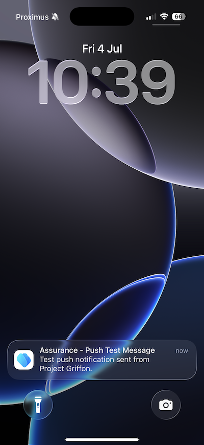

# 3.3.1 Introdução a notificações por push

Para usar notificações por push com o Adobe Journey Optimizer, há várias configurações a serem verificadas e conhecidas.

Estas são todas as configurações a serem verificadas:

- Conjuntos de dados e esquemas na Adobe Experience Platform
- Sequência de dados para dispositivos móveis
- Propriedade de coleção de dados para dispositivos móveis
- Superfície do aplicativo para certificados push
- Testar a configuração de push usando o AEP Assurance

Vamos analisar um por um.

Faça login no Adobe Journey Optimizer em [Adobe Experience Cloud](https://experience.adobe.com). Clique em **Journey Optimizer**.

Você será redirecionado para a exibição **Página inicial** no Journey Optimizer. Primeiro, verifique se você está usando a sandbox correta. A sandbox a ser usada é chamada `--aepSandboxName--`. Você estará na exibição **Página inicial** da sua sandbox `--aepSandboxName--`.

## 3.3.1.1 Enviar conjunto de dados

O Adobe Journey Optimizer usa conjuntos de dados para armazenar itens como os tokens de push de dispositivos móveis ou interações com mensagens de push (como: mensagem enviada, mensagem aberta etc.) em um conjunto de dados no Adobe Journey Optimizer.

Você pode encontrar esses conjuntos de dados acessando **Conjuntos de dados** no menu do lado esquerdo da tela. Para mostrar conjuntos de dados do sistema, clique no ícone **Habilitar filtros**.

Habilite a opção para **Sistema** e procure por **AJO**. Você verá os conjuntos de dados usados para notificações por push.

## 3.3.1.2 Datastream para dispositivos móveis

Ir para [https://experience.adobe.com/#/data-collection/](https://experience.adobe.com/#/data-collection/).

No menu esquerdo, vá para **Datastreams** e procure pela sua sequência de dados criada em [Introdução](./../../../../modules/getting-started/gettingstarted/ex2.md), chamada de `--aepUserLdap-- - One Adobe Datastream (Mobile)`. Clique em para abri-lo.

Clique em **Editar** no serviço **Adobe Experience Platform**.

Em seguida, você verá as configurações de sequência de dados que foram definidas e em quais conjuntos de dados, eventos e atributos de perfil serão armazenados.

Você também deve ativar as seguintes opções se elas ainda não estiverem ativadas:

- **Offer Decisioning**
- **Destinos de personalização**
- **Adobe Journey Optimizer**

Clique em **Salvar**.

## 3.3.1.3 Revise a propriedade da Coleção de dados para dispositivos móveis

Ir para [https://experience.adobe.com/#/data-collection/](https://experience.adobe.com/#/data-collection/), para **Marcas**. Como parte do módulo [Introdução](./../../../../modules/getting-started/gettingstarted/ex1.md), as propriedades das Marcas da Coleção de Dados foram criadas.

Você já está usando essas propriedades de Tags da coleção de dados como parte dos módulos anteriores.

Clique em para abrir a propriedade Coleção de dados para dispositivos móveis.

Na propriedade da Coleção de dados, vá para **Extensões**. Em seguida, você verá as várias extensões necessárias para o aplicativo móvel. Clique para selecionar a extensão **Adobe Experience Platform Edge Network** e selecione **Configurar**.

Em seguida, você verá que a sequência de dados para dispositivos móveis está vinculada aqui. Em seguida, clique em **Cancelar** para voltar para a visão geral das extensões.

Você estará de volta aqui. Você verá a extensão para **AEP Assurance**. O AEP Assurance ajuda a inspecionar, testar, simular e validar como você coleta dados ou fornece experiências em seu aplicativo móvel. Leia mais sobre o AEP Assurance aqui: [https://experienceleague.adobe.com/pt-br/docs/experience-platform/assurance/home](https://experienceleague.adobe.com/pt-br/docs/experience-platform/assurance/home).

Em seguida, clique em **Configurar** para abrir a extensão **Adobe Journey Optimizer**. Essa extensão permite notificações e medições por push para o Adobe Journey Optimizer.

Você verá que é aqui que o conjunto de dados para rastrear eventos de push é vinculado. Não há necessidade de fazer alterações na propriedade da Coleção de dados. Clique em **Cancelar** para voltar à tela anterior.

## 3.3.1.4 Examine a configuração da superfície do aplicativo

Ir para [https://experience.adobe.com/#/data-collection/](https://experience.adobe.com/#/data-collection/). No menu esquerdo, vá para **Superfícies do Aplicativo** e abra a Superfície do Aplicativo para o **DX Demo App APNS**.

Em seguida, você verá a Superfície do aplicativo configurada para o iOS e o Android.

## 3.3.1.5 Teste a configuração da notificação por push usando o AEP Assurance.

Você já instalou o aplicativo móvel **DX Demo** como parte do módulo **Introdução**. Depois que o aplicativo for instalado, você o encontrará na tela inicial do dispositivo. Clique no ícone para abrir o aplicativo.

Depois de fazer logon, você verá uma notificação solicitando sua permissão para enviar notificações. Enviaremos notificações como parte do tutorial, então clique em **Permitir**.

Você verá a página inicial do aplicativo. Vá para **Configurações**.

Nas configurações, você verá que, atualmente, um **Projeto público** está carregado no aplicativo. Clique em **Projeto personalizado**.

Agora você pode carregar um projeto personalizado. Clique no código QR para carregar facilmente seu projeto.

Depois de passar pela seção **Introdução**, você teve este resultado. Clique para abrir o **projeto do Mobile Retail** criado para você.

Caso tenha fechado acidentalmente a janela do navegador ou para futuras sessões de demonstração ou capacitação, você também pode acessar o projeto do seu site em [https://dsn.adobe.com/projects](https://dsn.adobe.com/projects). Depois de fazer logon com sua Adobe ID, você verá isso. Clique no projeto do aplicativo móvel para abri-lo.

Em seguida, clique em **Executar**.

Você verá este pop-up, que contém um código QR. Digitalize este código QR de dentro do aplicativo móvel.

Você verá sua ID de projeto exibida no aplicativo e depois poderá clicar em **Alternar**.

Seu aplicativo está pronto para ser usado.

Agora é necessário digitalizar um código QR para conectar o dispositivo móvel à sessão do Assurance.

Para iniciar uma sessão do AEP Assurance, vá para [https://experience.adobe.com/#/data-collection/](https://experience.adobe.com/#/data-collection/). Clique em **Assurance** no menu esquerdo. Em seguida, clique em **Criar sessão**.

Selecione **Conexão de deep link** e clique em **Iniciar**.

Preencha os valores:

- Nome da Sessão: `--aepUserLdap-- - Push Debugging`
- URL Base: `dxdemo://default`

Clique em **Next**.

Você verá um código QR na tela, que deve ser digitalizado com o dispositivo iOS.

Em seu dispositivo móvel, abra o aplicativo de câmera e verifique o código QR exibido pelo Assurance.

Você verá uma tela pop-up solicitando que você insira o código PIN. Copie o código PIN da tela do AEP Assurance e clique em **Conectar**.

Você verá isso.

No Assurance, você verá agora que um dispositivo cliente está conectado à sessão do Assurance. Em seguida, clique em **Configurar**.

Role para baixo até **Depuração de push**. Clique no ícone **+** e em **Salvar**.

Ir para **Depuração push**. Você deveria ver isto.

Alguma explicação:

- A primeira coluna, **Cliente**, mostra os identificadores disponíveis em seu dispositivo iOS. Você verá uma ECID e um token de push.
- A segunda coluna mostra as **Credenciais e Configuração do App Store**
- A segunda coluna mostra informações do **Perfil**, com informações adicionais sobre em qual plataforma está o token de push (APNS ou APNSSandbox). Se clicar no botão **Inspecionar Perfil**, você será levado para a Adobe Experience Platform e verá o Perfil completo do Cliente em Tempo Real.

Para testar a configuração de push, vá para o botão **Enviar Configuração de Push de Teste**. Clique em **Enviar notificação por push de teste**

Verifique se o aplicativo **DX Demo** não está aberto no momento de clicar no botão **Enviar notificação por push**. Se o aplicativo estiver aberto, a notificação por push pode ser recebida em segundo plano e não estará visível.

Você verá uma notificação por push como esta aparecer no seu dispositivo móvel.

Se você recebeu a notificação por push, significa que a configuração está correta e funcionando bem e agora é possível criar uma jornada real que resultará no envio de uma mensagem por push do Journey Optimizer.

## Próximas etapas

Ir para [3.3.2 Configurar uma jornada com mensagens de push](./ex2.md){target="_blank"}

Voltar para [Adobe Journey Optimizer: Mensagens por push e no aplicativo](ajopushinapp.md){target="_blank"}

Voltar para [Todos os módulos](./../../../../overview.md){target="_blank"}
