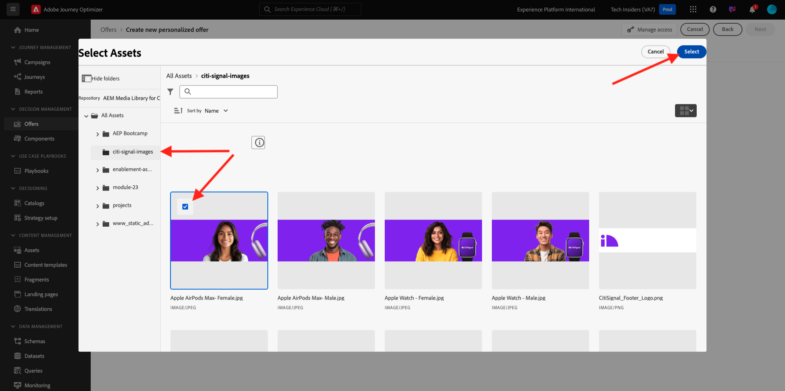
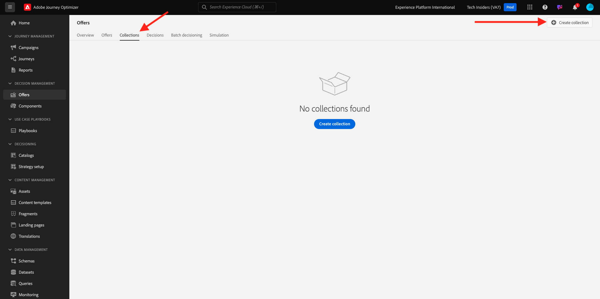

# 3.3.2 Configurar as ofertas e a decisão

## 3.3.2.1 Criar suas ofertas personalizadas

Neste exercício, você criará quatro **Ofertas personalizadas**. Estes são os detalhes a serem considerados ao criar essas ofertas:

| Nome | Date Range | Link de imagem para email | Link de imagem para a Web | Texto | Prioridade | Elegibilidade | Idioma | Frequência de limite | Nome da imagem |
|-----|------------|----------------------|--------------------|------|:--------:|--------------|:-------:|:-------:|:-------:|
| `--aepUserLdap-- - AirPods Max` | hoje - 1 mês depois | https://bit.ly/4a9RJ5d | Escolher da Biblioteca da Assets | `{{ profile.person.name.firstName }}, 10% discount on AirPods Max` | 25 | all - Clientes do sexo feminino | Inglês (Estados Unidos) | 3 | Apple AirPods Max - Female.jpg |
| `--aepUserLdap-- - Galaxy S24` | hoje - 1 mês depois | https://bit.ly/3W8yuDv | Escolher da Biblioteca da Assets | `{{ profile.person.name.firstName }}, 5% discount on Galaxy S24` | 15 | all - Clientes do sexo feminino | Inglês (Estados Unidos) | 3 | Galaxy S24 - Female.jpg |
| `--aepUserLdap-- - Apple Watch` | hoje - 1 mês depois | https://bit.ly/4fGwfxX | https://bit.ly/4fGwfxX | `{{ profile.person.name.firstName }}, 10% discount on Apple Watch` | 25 | todos - Clientes do sexo masculino | Inglês (Estados Unidos) | 3 | Apple Watch - Male.jpg |
| `--aepUserLdap-- - Galaxy Watch 7` | hoje - 1 mês depois | https://bit.ly/4gTrkeo | Escolher da Biblioteca da Assets | `{{ profile.person.name.firstName }}, 5% discount on Galaxy Watch 7` | 15 | todos - Clientes do sexo masculino | Inglês (Estados Unidos) | 3 | Galaxy Watch7 - Male.jpg |

{style="table-layout:auto"}

Faça login no Adobe Journey Optimizer em [Adobe Experience Cloud](https://experience.adobe.com). Clique em **Journey Optimizer**.

Você será redirecionado para a exibição **Página inicial** no Journey Optimizer. Primeiro, verifique se você está usando a sandbox correta. A sandbox a ser usada é chamada `--aepSandboxName--`. Você estará na exibição **Página inicial** da sua sandbox `--aepSandboxName--`.

No menu esquerdo, clique em **Ofertas** e vá para **Ofertas**. Clique em **+ Criar oferta**.

Você então verá esse pop-up. Selecione **Oferta personalizada** e clique em **Avançar**.

Agora você está na exibição **Detalhes**.

Nesse caso, você precisa configurar a oferta `--aepUserLdap-- - AirPods Max`. Use as informações na tabela acima para preencher os campos. Neste exemplo, o nome da Oferta personalizada é **vangeluw - AirPods Max**. Além disso, defina a **Data e hora de início** como hoje e defina a **Data e hora de término** como uma data em um mês a partir de agora.

Depois de concluído, você deve receber isto. Clique em **Next**.

Você verá isto:

Selecione **Por regra de decisão definida** e clique no ícone **+** para adicionar a regra **todas - Clientes do sexo feminino**.

Preencha a **Prioridade** conforme indicado na tabela acima. Em seguida, clique em **+ Criar limite** para definir o número de vezes que esta oferta pode ser mostrada a um cliente.

Para o limite, selecione o seguinte:

- **Escolher evento de limite**: **Evento de decisão**
- **Tipo de limite**: **Por perfil (Aplicar limite para cada perfil)**
- **Contagem de eventos de limite**: **3**
- **Redefinir frequência de limite**: **Diariamente**
- **A cada**: **1 dia**

Isso garantirá que essa oferta não seja exibida mais de 3 vezes por dia por cliente.

Clique em **Criar**.

Você estará de volta aqui. Clique em **Next**.

Agora é necessário criar **Representações**. As representações são uma combinação de um **Posicionamento** e um ativo real.

Para **Representação 1**, selecione:

- Canal: Web
- Posicionamento: Web - Imagem
- Conteúdo: URL
- Local público: copie a URL da coluna **Link de Imagem para a Web** na tabela acima

Como alternativa, você pode selecionar **Biblioteca de ativos** para o conteúdo e clicar em **Procurar**.

Você verá um pop-up da Biblioteca da Assets, irá para a pasta **enablement-assets** e selecionará o arquivo de imagem **Apple AirPods Max - Female.jpg**. Clique em **Selecionar**.

Você verá isso. Clique em **+ Adicionar representação**.

Para **Representação 2**, selecione:

- Canal: Email
- Posicionamento: Email - Imagem
- Conteúdo: URL
- Local público: selecione **Biblioteca de ativos**. Clique em **Procurar**

Você verá um pop-up da Biblioteca da Assets, irá para a pasta **enablement-assets** e selecionará o arquivo de imagem **Apple AirPods Max - Female.jpg**. Clique em **Selecionar**.

Você verá isso. Em seguida, clique em **+ Adicionar representação**.

Para **Representação 3**, selecione:

- Canal: não digital
- Posicionamento: Não digital - Texto

Em seguida, é necessário adicionar conteúdo. Nesse caso, isso significa adicionar o texto a ser usado como uma chamada para ação.

Selecione **Personalizado** e clique em **Adicionar Conteúdo**.

Você então verá esse pop-up.

Examine o campo **Texto** da tabela acima e insira esse texto aqui, neste caso: `{{ profile.person.name.firstName }}, 10% discount on AirPods Max`.

Você também observará que pode selecionar qualquer atributo de perfil e incluí-lo como um campo dinâmico no texto da oferta. Neste exemplo, o campo `{{ profile.person.name.firstName }}` garantirá que o nome do cliente que receberá esta oferta será incluído no texto da oferta.

Você verá isso. Clique em **Salvar**.

Agora você tem isto. Clique em **Next**.

Você verá uma visão geral da sua nova **Oferta personalizada**. Clique em **Concluir**.

Clique em **Salvar e aprovar**.

Em seguida, você verá que sua Oferta personalizada recém-criada fica disponível na Visão geral das ofertas:

Agora repita as etapas acima para criar as três outras Ofertas personalizadas para os produtos que você pode encontrar na tabela acima.

Quando terminar, sua tela **Visão geral das ofertas** para **Ofertas personalizadas** deverá mostrar todas as suas ofertas.

## 3.3.2.2 Criar sua oferta substituta

Depois de criar quatro Ofertas personalizadas, você deve configurar uma **Oferta substituta**.

Verifique se você está na exibição **Ofertas**. Clique em **+ Criar oferta**.

Você então verá esse pop-up. Selecione **Oferta de fallback** e clique em **Avançar**.

Você verá isso. Digite este nome para sua oferta substituta: `--aepUserLdap-- - CitiSignal Fallback Offer`. Clique em **Next**.

Agora é necessário criar **Representações**. As representações são uma combinação de um **Posicionamento** e um ativo real.

Para **Representação 1**, selecione:

- **Canal**: **Web**
- **Posicionamento**: **Web - Imagem**
- **Conteúdo**: **Biblioteca de ativos**

Clique em **Procurar** para selecionar sua imagem.

Você verá um pop-up da Biblioteca da Assets, irá para a pasta **citi-signal-images** e selecione o arquivo de imagem **App-Banner-Ad.jpg**. Clique em **Selecionar**.

Você verá isso. Clique em **+ Adicionar representação**.

Para **Representação 2**, selecione:

- **Canal**: **Email**
- **Posicionamento**: **Email - Imagem**
- **Conteúdo**: **Biblioteca de ativos**

Clique em **Procurar** para selecionar sua imagem.

Você verá um pop-up da Biblioteca da Assets, irá para a pasta **citi-signal-images** e selecione o arquivo de imagem **App-Banner-Ad.jpg**. Clique em **Selecionar**.

Você verá isso. Clique em **+ Adicionar representação**.

Para **Representação 3**, selecione:

- **Canal**: **Não digital**
- **Posicionamento**: **Não digital - Texto**
- **Conteúdo**: **Personalizado**

Clique em **Adicionar conteúdo**.

Você então verá esse pop-up. Insira o texto `{{ profile.person.name.firstName }}, download the CitiSignal app now!` e clique em **Salvar**.

Você verá isso. Clique em **Next**.

Você verá uma visão geral de sua nova **Oferta Substituta**. Clique em **Concluir**.

Finalmente, clique em **Salvar e aprovar**.

Na tela **Visão geral das ofertas**, você verá o seguinte:

## 3.3.2.3 Criar sua coleção

Uma Coleção é usada para **filtrar** um subconjunto de ofertas da lista de ofertas personalizadas e usá-la como parte de uma Decisão para acelerar o processo de decisão.

Ir para **Coleções**. Clique em **+ Criar coleção**.

Você então verá esse pop-up. Configure sua coleção desta forma. Clique em **Next**.

- Nome da coleção: use `--aepUserLdap-- - CitiSignal Collection`
- Selecione **Criar coleção estática**.

Clique em **Next**.

Na próxima tela, selecione as quatro **Ofertas personalizadas** que você criou no exercício anterior. Clique em **Salvar**.

Agora você verá isto:

## 3.3.2.4 Crie sua decisão

Uma decisão combina disposições, uma coleção de ofertas personalizadas e uma oferta substituta a ser usada pelo mecanismo do Offer Decisioning para encontrar a melhor oferta para um perfil específico, com base em cada uma das características de oferta personalizadas individuais, como prioridade, restrição de elegibilidade e limite total / usuário.

Para configurar sua **Decisão**, vá para **Decisões**. Clique em **+ Criar decisão**.

Você verá isso. Preencha os campos assim. Clique em **Next**.

- Nome: `--aepUserLdap-- - CitiSignal Decision`
- Data e hora de início: hoje
- Data e hora de término: hoje + 1 mês

Na próxima tela, você precisa adicionar disposições aos escopos de decisão. Você precisará criar escopos de decisão para os posicionamentos **Web - Imagem**, **Email - Imagem** e **Não digital - Texto**.

Primeiro, crie o escopo de decisão para **Não digital - Texto** selecionando esse posicionamento na lista suspensa. Em seguida, clique no botão **Adicionar** para adicionar critérios de avaliação.

Selecione sua coleção `--aepUserLdap-- - CitiSignal Collection` e clique em **Adicionar**.

Você verá isso. Clique no botão **+** para adicionar um novo escopo de decisão.

Selecione a **Web - Image** de posicionamento e adicione sua coleção `--aepUserLdap-- - CitiSignal Collection` nos critérios de avaliação. Em seguida, clique no botão **+** novamente para adicionar um novo escopo de decisão.

Selecione o posicionamento **Email - Image** e adicione sua coleção `--aepUserLdap-- - CitiSignal Collection` nos critérios de avaliação. Em seguida, clique em **Avançar**.

Agora é necessário selecionar sua **Oferta Substituta**, que se chama `--aepUserLdap-- - CitiSignal Fallback Offer`. Clique em **Next**.

Revise sua decisão. Clique em **Concluir**.

No pop-up, clique em **Salvar e ativar**.

E, finalmente, você verá sua decisão na visão geral:

Você configurou sua decisão com êxito. Sua decisão agora está ativa e pode ser usada para fornecer ofertas otimizadas e personalizadas aos seus clientes, em tempo real.

## Próximas etapas

Vá para [3.3.3 Preparar a propriedade do Cliente da Coleção de Dados e a configuração do Web SDK para o Offer Decisioning](./ex3.md){target="_blank"}

Voltar para [Offer Decisioning](offer-decisioning.md){target="_blank"}

Voltar para [Todos os módulos](./../../../../overview.md){target="_blank"}
