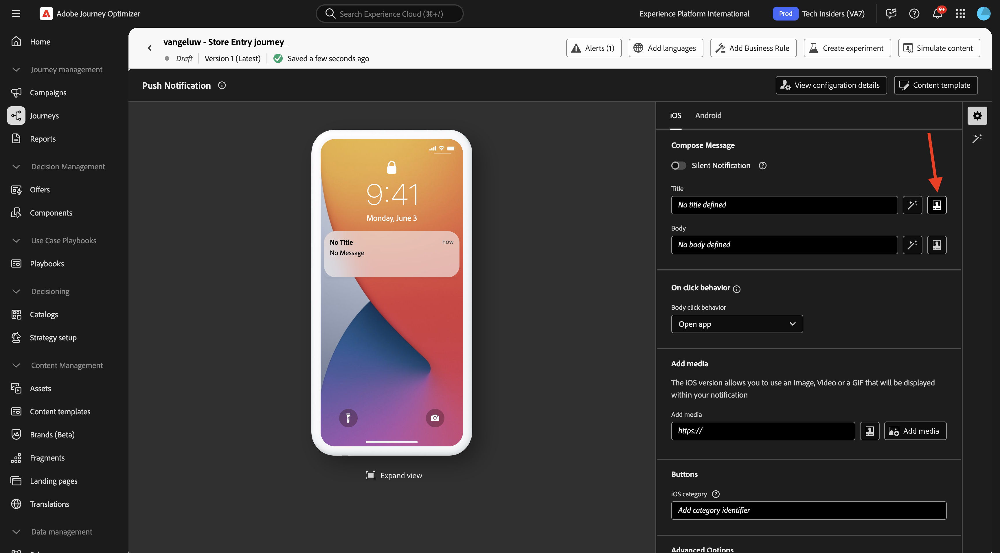

# 3.3.2 Configurar uma jornada com mensagens de push

Faça login no Adobe Journey Optimizer em [Adobe Experience Cloud](https://experience.adobe.com). Clique em **Journey Optimizer**.

Você será redirecionado para a exibição **Página inicial** no Journey Optimizer. Primeiro, verifique se você está usando a sandbox correta. A sandbox a ser usada é chamada `--aepSandboxName--`. Você estará na exibição **Página inicial** da sua sandbox `--aepSandboxName--`.

## 3.3.2.1 Criar um novo evento

No menu esquerdo, vá para **Configurações** e clique em **Gerenciar** em **Eventos**.

Na tela **Eventos**, você verá um modo de exibição semelhante a este. Clique em **Criar Evento**.

Em seguida, você verá uma configuração de evento vazia.
Primeiro, dê ao seu Evento um Nome como este: `--aepUserLdap--StoreEntryEvent` e defina a descrição como `Store Entry Event`.
A seguir está a seleção **Tipo de Evento**. Selecione **Unitário**.
A seguir está a seleção **Tipo de ID de Evento**. Selecione **Gerado pelo Sistema**.

O próximo é a seleção Esquema. Um esquema foi preparado para este exercício. Use o esquema `Demo System - Event Schema for Mobile App (Global v1.1) v.1`.

Depois de selecionar o esquema, você verá vários campos sendo selecionados na seção **Carga**. Verifique se o campo **Namespace** está definido como **ECID**. Seu evento está totalmente configurado.

Clique em **Salvar**.

Seu evento agora está configurado e salvo. Clique no evento novamente para abrir a tela **Editar Evento** novamente.

Passe o mouse sobre o campo **Carga** e clique no ícone **Exibir carga**.

Agora você verá um exemplo da carga útil esperada.

Seu Evento tem uma eventID de orquestração exclusiva, que você pode encontrar rolando para baixo nessa carga até ver `_experience.campaign.orchestration.eventID`.

A ID do evento é o que precisa ser enviado para o Adobe Experience Platform para acionar a Jornada que você criará na próxima etapa. Anote essa eventID, pois ela será necessária na próxima etapa.
`"eventID": "aa895251f76831e6440f169f1bb9d2a4388f0696d8e2782cfab192a275817dfa"`

Clique em **Ok**.

Clique em **Cancelar**.

## 3.3.2.2 Criar uma jornada

No menu esquerdo, vá para **Jornada** e clique em **Criar Jornada**.

Você verá isso. Nomeie sua jornada: `--aepUserLdap-- - Store Entry journey`. Clique em **Salvar**.

Primeiro, é necessário adicionar o evento como ponto de partida da jornada. Procure seu evento `--aepUserLdap--StoreEntryEvent` e arraste-o e solte-o na tela. Clique em **Salvar**.

Em seguida, em **Ações**, pesquise a ação **Push**. Arraste e solte a ação **Enviar** na tela.

Defina a **Categoria** como **Marketing** e selecione uma superfície de push que permita enviar notificações por push. Nesse caso, a superfície de email a ser selecionada é **Push-iOS-Android**.

>[!NOTE]
>
>É necessário que exista um Canal no Journey Optimizer que esteja usando a **Superfície do Aplicativo**, conforme revisado anteriormente.

A próxima etapa é criar a mensagem. Para fazer isso, clique em **Editar conteúdo**.

Você verá isso. Clique no ícone de **personalização** do campo **Título**.

Você verá isso. Agora é possível selecionar qualquer atributo de perfil diretamente do Perfil do cliente em tempo real.

Pesquise pelo campo **Nome** e clique no ícone **+** ao lado do campo **Nome**. Você verá o token de personalização para o Nome que está sendo adicionado: **{{profile.person.name.firstName}}**.

Em seguida, adicione o texto **, bem-vindo à nossa loja!** atrás de **{{profile.person.name.firstName}}**.

Clique em **Salvar**.

Agora você tem isto. Clique no ícone de **personalização** do campo **Corpo**.

Digite este texto **Clique aqui para obter um desconto de 10% ao comprar hoje!** e clique em **Salvar**.

Então você terá isto. Clique na seta no canto superior esquerdo para voltar à jornada.

Clique em **Salvar** para fechar sua ação de push.

Clique em **Publicar**.

Clique novamente em **Publicar**.

Sua jornada foi publicada.

## 3.3.2.3 Atualize sua propriedade de coleção de dados para dispositivos móveis

Em **Introdução**, o Sistema de demonstração em seguida criou propriedades de marcas para você: uma para o site e outra para o aplicativo móvel. Localize-os procurando por `--aepUserLdap--` na caixa **Pesquisar**. Clique para abrir a propriedade **Mobile**.

Você deverá ver isso.

No menu esquerdo, vá para **Regras** e clique para abrir a regra **Entrada de local**.

Você deverá ver isso. Clique na ação **Mobile Core - Attach Data**.

Você deverá ver isso.

Cole a eventID do seu evento `--aepUserLdap--StoreEntryEvent` na janela **Carga JSON**. Clique em **Manter alterações**.

Clique em **Salvar** ou **Salvar na Biblioteca**.

Vá para **Fluxo de Publicação** e clique para abrir a biblioteca **Principal**.

Clique em **Adicionar todos os recursos alterados** e em **Salvar e criar no desenvolvimento**.

## 3.3.2.4 Testar sua jornada e mensagem por push

Abra o aplicativo **DSN Mobile**.

Vá para a página **Localizador de Loja**.

Clique em **Simular entrada do POI**.

Após alguns segundos, você verá a notificação por push aparecer.

## Próximas etapas

Ir para [3.3.3 Configurar uma campanha com mensagens no aplicativo](./ex3.md){target="_blank"}

Voltar para [Adobe Journey Optimizer: Mensagens por push e no aplicativo](ajopushinapp.md){target="_blank"}

Voltar para [Todos os módulos](./../../../../overview.md){target="_blank"}