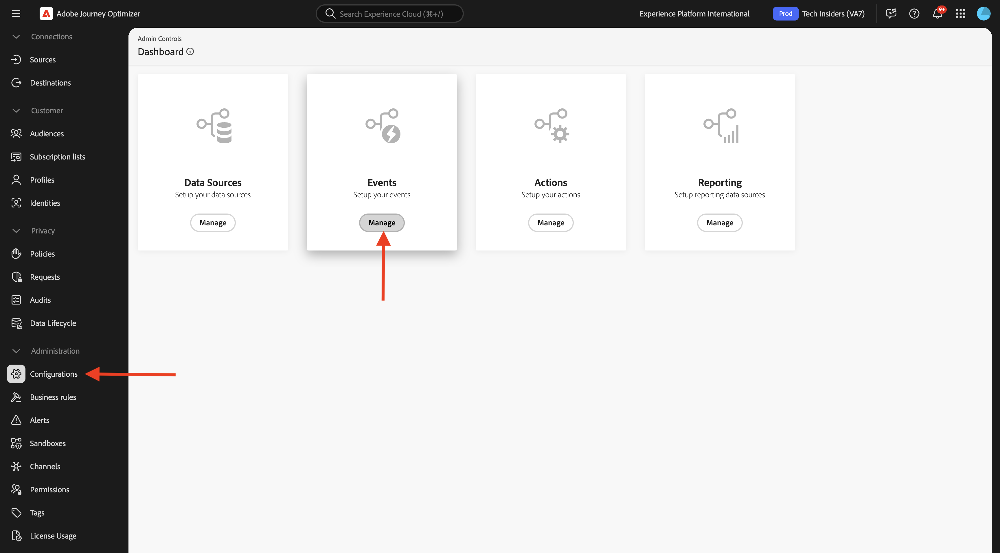
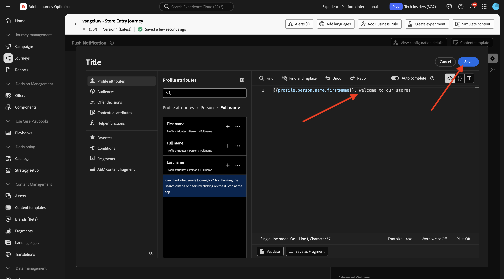

# 3.3.2 Configurar uma jornada com mensagens de push

## 3.4.4.6 Criar um novo evento

Ir para **Journey Optimizer**. No menu esquerdo, vá para **Configurações** e clique em **Gerenciar** em **Eventos**.

Na tela **Eventos**, você verá um modo de exibição semelhante a este. Clique em **Criar Evento**.

Em seguida, você verá uma configuração de evento vazia.
Primeiro, dê ao seu Evento um Nome como este: `--aepUserLdap--StoreEntryEvent` e defina a descrição como `Store Entry Event`.
A seguir está a seleção **Tipo de Evento**. Selecione **Unitário**.
A seguir está a seleção **Tipo de ID de Evento**. Selecione **Gerado pelo Sistema**.

O próximo é a seleção Esquema. Um esquema foi preparado para este exercício. Use o esquema `Demo System - Event Schema for Mobile App (Global v1.1) v.1`.

Depois de selecionar o esquema, você verá vários campos sendo selecionados na seção **Carga**. Seu evento está totalmente configurado.

Clique em **Salvar**.

O Evento agora está configurado e salvo. Clique no evento novamente para abrir a tela **Editar Evento** novamente.

Passe o mouse sobre o campo **Carga** e clique no ícone **Exibir carga**.

Agora você verá um exemplo da carga útil esperada.

Seu Evento tem uma eventID de orquestração exclusiva, que você pode encontrar rolando para baixo nessa carga até ver `_experience.campaign.orchestration.eventID`.

A ID do evento é o que precisa ser enviado para o Adobe Experience Platform para acionar a Jornada que você criará na próxima etapa. Anote essa eventID, pois ela será necessária na próxima etapa.
`"eventID": "89acd341ec2b7d1130c9a73535029debf2ac35f486bc99236b1a5091d6f4bc68"`

Clique em **Ok**, seguido de **Cancelar**.

## 3.4.4.7 Criar uma jornada

No menu, vá para **Jornadas** e clique em **Criar Jornada**.

Você verá isso. Dê um nome à sua jornada. Usar `--aepUserLdap-- - Store Entry journey`. Clique em **Salvar**.

Primeiro, é necessário adicionar o evento como ponto de partida da jornada. Procure seu evento `--aepUserLdap--StoreEntryEvent` e arraste-o e solte-o na tela. Clique em **Salvar**.

Em seguida, em **Ações**, pesquise a ação **Push**. Arraste e solte a ação **Enviar** na tela.

Defina a **Categoria** como **Marketing** e selecione uma superfície de push que permita enviar notificações por push. Nesse caso, a superfície de email a ser selecionada é **Push-iOS-Android**.

>[!NOTE]
>
>É necessário que exista um Canal no Journey Optimizer que esteja usando a **Superfície do Aplicativo**, conforme revisado anteriormente.

A próxima etapa é criar a mensagem. Para fazer isso, clique em **Editar conteúdo**.

Você verá isso. Clique no ícone de **personalização** do campo **Título**.

Você verá isso. Agora é possível selecionar qualquer atributo de Perfil diretamente do Perfil de cliente em tempo real.

Pesquise pelo campo **Nome** e clique no ícone **+** ao lado do campo **Nome**. Você verá o token de personalização para o Nome que está sendo adicionado: **{{profile.person.name.firstName}}**.

Em seguida, adicione o texto **, bem-vindo à nossa loja!** atrás de **{{profile.person.name.firstName}}**.

Clique em **Salvar**.

Agora você tem isto. Clique no ícone de **personalização** do campo **Corpo**.

Digite este texto **Clique aqui para obter um desconto de 10% ao comprar hoje!** e clique em **Salvar**.

Então você terá isto. Clique na seta no canto superior esquerdo para voltar à jornada.

Clique em **Salvar** para fechar sua ação de push.

Clique em **Publicar**.

Clique novamente em **Publicar**.

Sua jornada foi publicada.

## 3.4.4.8 Testar sua jornada e mensagem por push

No aplicativo móvel DX Demo 2.0, acesse a tela **Configurações**. Clique no botão **Armazenar entrada**.

>[!NOTE]
>
>O botão **Armazenar Entrada** está sendo implementado no momento. Você ainda não o encontrará no aplicativo.

Feche o aplicativo imediatamente após clicar no ícone **Entrada da loja**. Caso contrário, a mensagem de push não será exibida.

Após alguns segundos, você verá a mensagem ser exibida.

Você concluiu este exercício.

## Próximas etapas

Ir para [3.3.3 Configurar uma campanha com mensagens no aplicativo](./ex3.md){target="_blank"}

Voltar para [Adobe Journey Optimizer: Mensagens por push e no aplicativo](ajopushinapp.md){target="_blank"}

Voltar para [Todos os módulos](./../../../../overview.md){target="_blank"}
