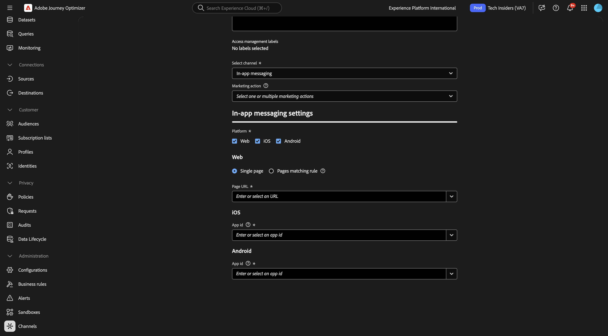
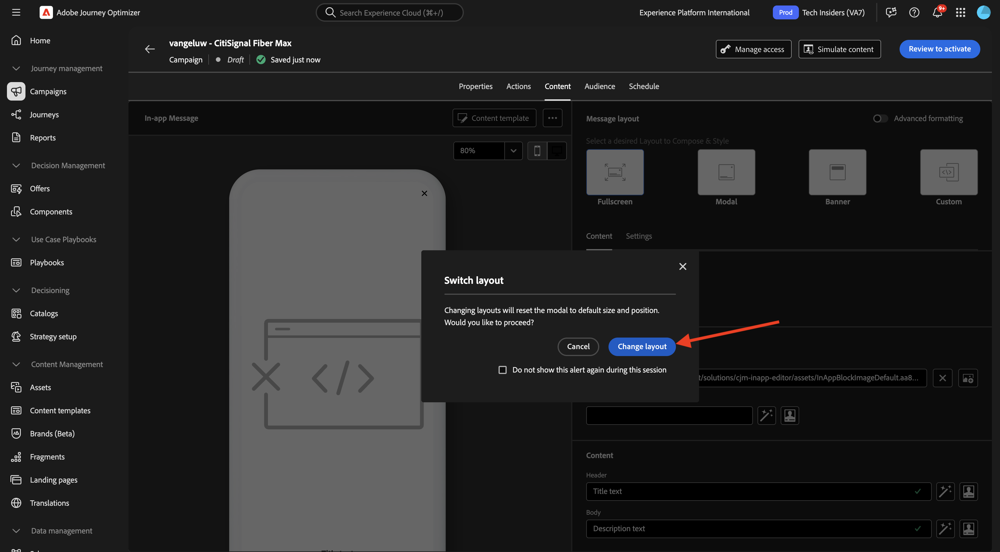
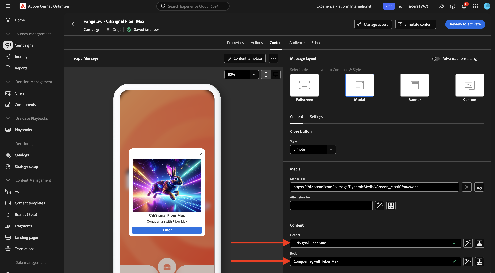

# 3.3.3 Configurar uma campanha com mensagens no aplicativo

Faça login no Adobe Journey Optimizer em [Adobe Experience Cloud](https://experience.adobe.com). Clique em **Journey Optimizer**.

Você será redirecionado para a exibição **Página inicial** no Journey Optimizer. Primeiro, verifique se você está usando a sandbox correta. A sandbox a ser usada é chamada `--aepSandboxName--`. Você estará na exibição **Página inicial** da sua sandbox `--aepSandboxName--`.

## 3.3.3.1 Configuração do canal de mensagens no aplicativo

No menu esquerdo, vá para **Canais** e selecione **Configurações de canal**. Clique em **Criar configuração de canal**.

Insira o nome: `--aepUserLdap--_In-app_Messages`, selecione o canal **Mensagens no aplicativo** e habilite as plataformas **Web**, **iOS** e **Android**.

Role para baixo para vê-lo.

Verifique se a **Página única** está habilitada.

Para **Web**, insira a URL do site que foi criado anteriormente como parte do módulo **Introdução**, que tem esta aparência: `https://dsn.adobe.com/web/--aepUserLdap---XXXX`. Não esqueça de alterar o **XXXX** para o código exclusivo do seu site.

Para **iOS** e **Android**, digite `com.adobe.dsn.dxdemo`.

Role para cima e clique em **Enviar**.

A configuração do canal agora está pronta para ser usada.

## 3.3.3.2 Configurar uma campanha agendada para Mensagens no aplicativo

No menu esquerdo, vá para **Campanhas** e clique em **Criar campanha**.

Selecione **Agendado - Marketing** e clique em **Criar**.

Insira o nome `--aepUserLdap-- - CitiSignal Fiber Max` e clique em **Ações**.

Clique em **+ Adicionar ação** e selecione **Mensagem no aplicativo**.

Selecione a configuração do canal de mensagens no aplicativo que você criou na etapa anterior, chamada: `--aepUserLdap--_In-app_Messages`. Clique em **Editar conteúdo**.

Você deverá ver isso. Clique em **Modal**.

Clique em **Alterar layout**.

Clique no ícone **URL de mídia** para escolher um ativo do AEM Assets.

Vá para a pasta **citisignal-images** e selecione o arquivo de imagem **neon-rabbit.jpg**. Clique em **Selecionar**.

Para o texto **Cabeçalho**, use: `CitiSignal Fiber Max`.
Para o texto **Corpo**, use: `Conquer lag with Fiber Max`.

Defina o **Botão #1 text** para: `Go to Plans`.
Defina o **target** para `com.adobe.dsn.dxdemo://plans`.

Clique em **Revisar para ativar**.

Clique em **Ativar**.

O status da sua campanha agora está definido como **Ativando**. Pode levar alguns minutos para que a campanha seja ativada.

Depois que o status for alterado para **Live**, você poderá testar sua campanha.

## 3.3.3.3 Testar sua campanha de Mensagens no aplicativo em dispositivos móveis

No dispositivo móvel, abra o aplicativo. Você deve ver a nova mensagem no aplicativo aparecer após iniciar o aplicativo. Clique no botão **Ir para Planos**.

Você será direcionado à página **Planos**.

## Próximas etapas

Voltar para [Adobe Journey Optimizer: Mensagens por push e no aplicativo](ajopushinapp.md){target="_blank"}

Voltar para [Todos os módulos](./../../../../overview.md){target="_blank"}
