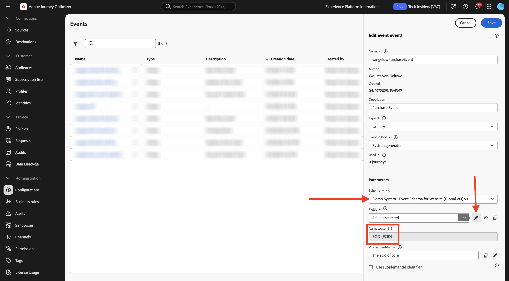
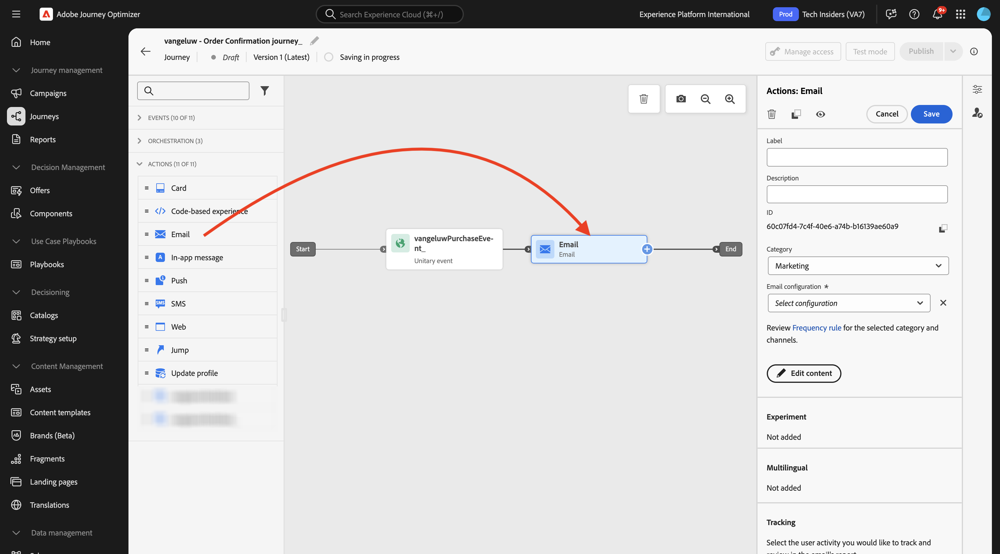
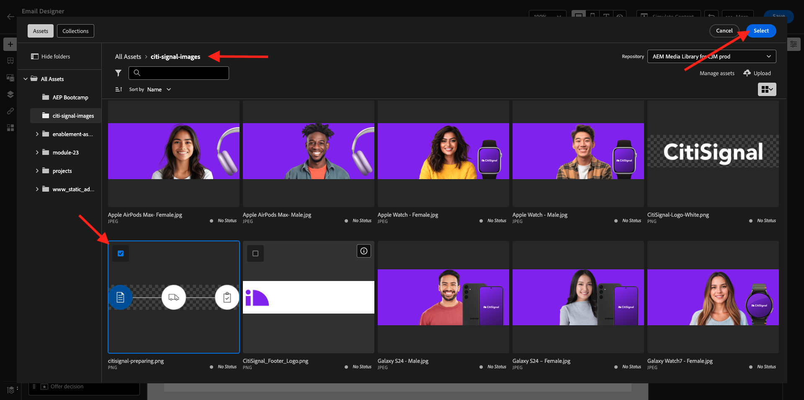
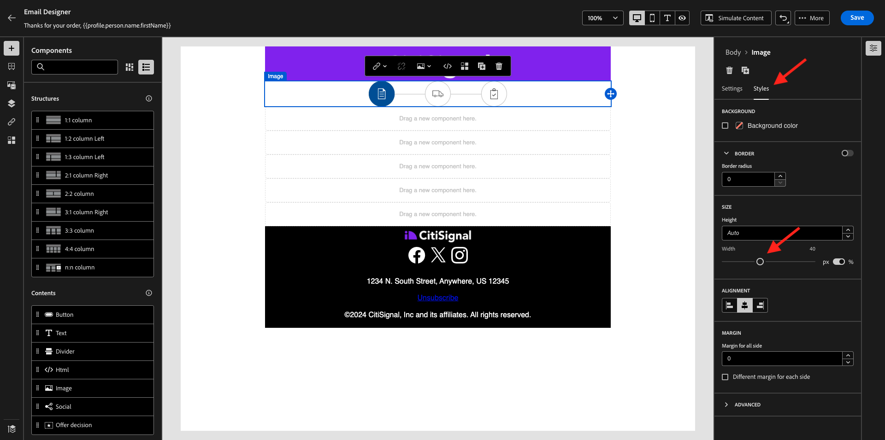
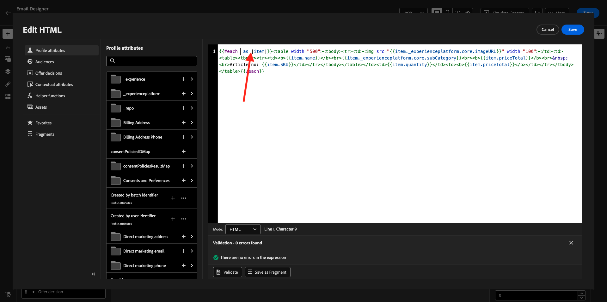
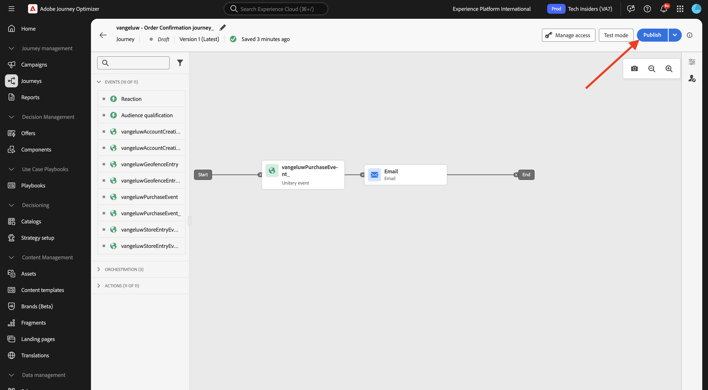
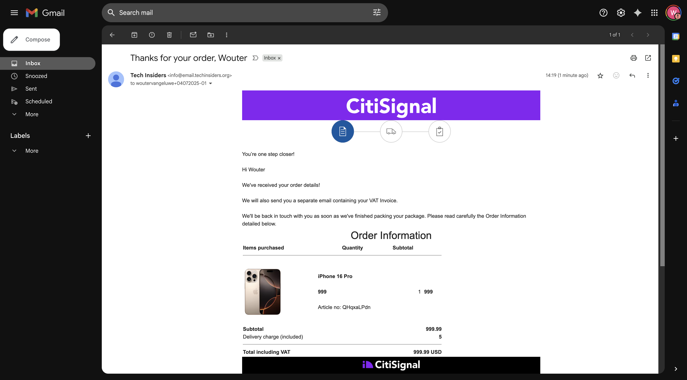

# 3.4.1 Configurar uma jornada com base em acionador - Confirmação de pedido

Faça login no Adobe Journey Optimizer em [Adobe Experience Cloud](https://experience.adobe.com). Clique em **Journey Optimizer**.


Você será redirecionado para a exibição **Página inicial** no Journey Optimizer. Primeiro, verifique se você está usando a sandbox correta. A sandbox a ser usada é chamada `--aepSandboxName--`. Você estará na exibição **Página inicial** da sua sandbox `--aepSandboxName--`.


## 3.4.1.1 Criar o evento

No menu, vá para **Configurações** e clique em **Gerenciar** em **Eventos**.


Na tela **Eventos**, você verá um modo de exibição semelhante a este. Clique em **Criar Evento**.


Em seguida, você verá uma configuração de evento vazia.

Primeiro, dê ao seu Evento um Nome como este: `--aepUserLdap--PurchaseEvent`, e adicione uma descrição como esta: `Purchase Event`.

Para **Type**, selecione **Unitary**.
Para o **Tipo de ID do Evento**, selecione **Gerado pelo Sistema**.


O próximo é a seleção Esquema. Um esquema foi preparado para este exercício. Use o esquema `Demo System - Event Schema for Website (Global v1.1) v.1`.

Depois de selecionar o esquema, você verá vários campos sendo selecionados na seção **Carga**. Clique no ícone **Editar/Lápis** para adicionar outros campos a este evento.



Você então verá esse pop-up. Agora é necessário marcar caixas de seleção adicionais para acessar dados adicionais quando esse evento for acionado.


Primeiro, marque a caixa de seleção na linha `--aepTenantId--`.


Em seguida, role para baixo e marque a caixa de seleção na linha `commerce`.


Em seguida, role para baixo e marque a caixa de seleção na linha `productListItems`. Clique em **Ok**.


Você verá que campos adicionais foram adicionados ao evento. Clique em **Salvar**.


O novo evento será salvo e você verá seu evento na lista de eventos disponíveis agora.

Clique no evento novamente para abrir a tela **Editar Evento** novamente.
Passe o mouse sobre o campo **Carga** novamente para ver os 3 ícones novamente. Clique no ícone **Exibir carga**.


Agora você verá um exemplo da carga útil esperada. Seu evento tem uma eventID de orquestração exclusiva, que você pode encontrar rolando para baixo nessa carga até ver `_experience.campaign.orchestration.eventID`.


A ID do evento é o que precisa ser enviado para o Adobe Journey Optimizer para acionar a jornada que você criará na próxima etapa. Anote essa eventID, pois ela será necessária em uma das próximas etapas.
`"eventID": "1c8148a8ab1993537d0ba4e6ac293dd4f2a88d80b2ca7be6293c3b28d4ff5ae6"`

Clique em **Ok**, seguido de **Cancelar**.

Seu evento agora está configurado e pronto para ser usado.

## 3.4.1.2 Criar a jornada

No menu, vá para **Jornadas** e clique em **Criar Jornada**.


Você verá isso. Dê um nome à sua jornada. Usar `--aepUserLdap-- - Order Confirmation journey`. Clique em **Salvar**.


Primeiro, é necessário adicionar o evento como ponto de partida da jornada. Procure seu evento `--aepUserLdap--PurchaseEvent` e arraste-o e solte-o na tela. Clique em **Salvar**.


Em seguida, em **Ações**, pesquise a ação **Email** e adicione-a à tela.



Defina a **Categoria** como **Marketing** e selecione uma superfície de email que permita o envio de emails. Nesse caso, a superfície de email a ser selecionada é **Email**. Verifique se as caixas de seleção para **Cliques no email** e **aberturas de email** estão habilitadas.


A próxima etapa é criar a mensagem. Para fazer isso, clique em **Editar conteúdo**.


Agora vocês podem ver isso. Clique no campo de texto **Linha de assunto**.


Na área de texto, comece a gravar **Obrigado por seu pedido** e clique no ícone **Personalization**.


A linha de assunto ainda não foi terminada. Em seguida, você precisa trazer o token de personalização para o campo **Nome**, que é armazenado em `profile.person.name.firstName`. No menu esquerdo, role para baixo para localizar o campo **Pessoa** > **Nome completo** > **Nome** e clique no ícone **+** para adicionar o token de personalização à linha de assunto. Clique em **Salvar**.


Você estará de volta aqui. Clique em **Editar corpo do email** para criar o conteúdo do email.


Na próxima tela, clique em **Design do zero**.


No menu esquerdo, você encontrará os componentes de estrutura que podem ser usados para definir a estrutura do email (linhas e colunas).

Arraste e solte 8 vezes uma **coluna 1:1** na tela, o que deve fornecer a você:


No menu esquerdo, vá para **Fragmentos**. Arraste o cabeçalho criado anteriormente no [exercício 3.1.2.1](./../ajob2c-1/ex2.md) até o primeiro componente na tela. Arraste o rodapé criado anteriormente no [exercício 3.1.2.2](./../ajob2c-1/ex2.md) até o último componente na tela.


Clique no ícone **+** no menu esquerdo. Vá para **Conteúdo** para começar a adicionar conteúdo à tela.


Vá para **Conteúdo** e arraste e solte um componente **Imagem** na segunda linha. Clique em **Procurar**.


Abra a pasta **citisignal-images**, clique para selecionar a imagem **citisignal-preparation.png** e clique em **Selecionar**.



Em **Estilos**, altere a largura para **40%**.



Em seguida, vá para **Conteúdo** e arraste e solte um componente de **Texto** na terceira linha.


Selecione o texto padrão nesse componente **Digite o texto aqui.** e substitua-o pelo texto abaixo:

```javascript
You’re one step closer!

Hi 

We've received your order details!

We will also send you a separate email containing your VAT Invoice.

We'll be back in touch with you as soon as we've finished packing your package. Please read carefully the Order Information detailed below.
```


Coloque o cursor próximo ao texto **Hi** e clique em **Adicionar Personalization**.


Navegue até o campo **Pessoa** > **Nome completo** > **Nome** e clique no ícone **+** para adicionar o token de personalização à linha de assunto. Clique em **Salvar**.


Você verá isto:


Em seguida, vá para **Conteúdo** e arraste e solte um componente de **Texto** na quarta linha.


Selecione o texto padrão nesse componente **Digite o texto aqui.** e substitua-o pelo texto abaixo:

`Order Information`

Altere o tamanho da fonte para **26px** e centralize o texto nesta célula. Você terá isto:


Em seguida, vá para **Conteúdo** e arraste e solte um componente do **HTML** na quinta linha. Clique no componente HTML e em **Mostrar o código-fonte**.


No pop-up **Editar HTML**, cole esta HTML:

```<table><tbody><tr><td><b>Items purchased</b></td><td></td><td><b>Quantity</b></td><td><b>Subtotal</b></td></tr><tr><td colspan="4" width="500"><hr></td></tr></tbody></table>```

Clique em **Salvar**.


Então você terá isto. Clique em **Salvar** para salvar seu progresso.


Vá para **Conteúdo** e arraste e solte um componente do **HTML** na sexta linha. Clique no componente HTML e em **Mostrar o código-fonte**.


No pop-up **Editar HTML**, cole esta HTML:

```{{#each xxx as |item|}}<table width="500"><tbody><tr><td></td><td><table><tbody><tr><td><b>{{item.name}}</b><br>{{item.--aepTenantId--.core.subCategory}}<br><b>{{item.priceTotal}}</b><br>&nbsp;<br>Article no: {{item.SKU}}</td></tr></tbody></table></td><td>{{item.quantity}}</td><td><b>{{item.priceTotal}}</b></td></tr></tbody></table>{{/each}}```

Você terá isto:


Agora é necessário substituir **xxx** por uma referência ao objeto productListItems que faz parte do evento que aciona a jornada.


Primeiro, exclua **xxx** em seu código HTML primeiro.



No menu esquerdo, clique em **Atributos contextuais**. Esse contexto é transmitido para a mensagem da jornada.

Você verá isso. Clique na seta ao lado de **Journey Orchestration** para detalhar.


Clique na seta ao lado de **Eventos** para detalhar.


Clique na seta ao lado de `--aepUserLdap--PurchaseEvent` para detalhar.


Clique na seta ao lado de **productListItems** para detalhar.


Clique no ícone **+** ao lado de **Nome** para adicioná-lo à tela. Então você terá isto. Agora é necessário selecionar **.name** conforme indicado na captura de tela abaixo e remover **.name**.


Então você terá isto. Clique em **Salvar**.


Você voltará para a Designer de email agora. Clique em **Salvar** para salvar seu progresso.


Em seguida, vá para **Conteúdo** e arraste e solte um componente do **HTML** na sétima linha. Clique no componente HTML e em **Mostrar o código-fonte**.


No pop-up **Editar HTML**, cole esta HTML:

```<table><tbody><tr><td><b>Subtotal</b><br>Delivery charge (included)</td><td align="right"><b>xxx</b><br><b>5</b></td></tr><tr><td colspan="2" width="500"><hr></td></tr><tr><td><b>Total including VAT</b></td><td align="right"><b>xxx</b></td></tr></tbody></table>```

Há duas referências de **xxx** neste código HTML. Agora é necessário substituir cada **xxx** por uma referência ao objeto productListItems que faz parte do evento que aciona a jornada.


Primeiro, exclua o primeiro **xxx** do código HTML.


No menu esquerdo, clique em **Atributos contextuais**.
Clique na seta ao lado de **Journey Orchestration** para detalhar.


Clique na seta ao lado de **Eventos** para detalhar.


Clique na seta ao lado de `--aepUserLdap--PurchaseEvent` para detalhar.


Clique na seta ao lado de **Commerce** para detalhar.


Clique na seta ao lado de **Ordem** para detalhar.


Clique no ícone **+** ao lado de **Preço total** para adicioná-lo à tela.


Então você terá isto. Agora exclua o segundo **xxx** do seu código HTML.


Clique no ícone **+** ao lado de **Preço total** novamente para adicioná-lo à tela.
Você também pode adicionar o campo **Moeda** de dentro do objeto **Ordem** na tela, como pode ver aqui.
Quando terminar, clique em **Salvar** para salvar suas alterações.


Você voltará para a Designer de email. Clique em **Salvar** novamente.


Volte para o painel da mensagem clicando na **seta** ao lado do texto da linha de assunto no canto superior esquerdo.


Clique na seta no canto superior esquerdo para voltar à jornada.


Clique em **Salvar** para fechar sua ação de email.


Clique em **Publicar** para publicar sua jornada.



Clique novamente em **Publicar**.


Sua jornada foi publicada.


## 3.4.1.5 Atualizar a propriedade do Cliente de coleta de dados do Adobe Experience Platform

Vá para [Coleção de dados do Adobe Experience Platform](https://experience.adobe.com/launch/) e selecione **Marcas**.

Esta é a página Propriedades da coleção de dados do Adobe Experience Platform que você viu antes.


Em **Introdução**, o Sistema de Demonstração criou duas propriedades do Cliente para você: uma para o site e outra para o aplicativo móvel. Localize-os procurando por `--aepUserLdap--` na caixa **[!UICONTROL Pesquisar]**. Clique para abrir a propriedade **Web**.


Vá para **Elementos de Dados**. Pesquise e abra o elemento de dados **XDM - Purchase**.


Você verá isso. Navegue até o campo **_experience.campaign.orchestration.eventID** e preencha sua eventID aqui. A eventID a ser preenchida aqui é a eventID que você criou como parte do exercício 3.4.1.1 Clique em **Salvar** ou **Salvar na biblioteca**.


Salve as alterações na propriedade e publique as alterações atualizando a biblioteca de desenvolvimento.


Suas alterações agora estão implantadas e podem ser testadas.

## 3.4.1.6 Teste o email de confirmação do seu pedido usando o site de demonstração

Vamos testar a jornada atualizada comprando um produto no site de demonstração.

Ir para [https://dsn.adobe.com](https://dsn.adobe.com). Depois de fazer logon com sua Adobe ID, você verá isso. Clique nos 3 pontos **...** do projeto do site e clique em **Executar** para abri-lo.


Você verá seu site de demonstração aberto. Selecione o URL e copie-o para a área de transferência.


Abra uma nova janela incógnita do navegador.


Cole o URL do site de demonstração que você copiou na etapa anterior. Você será solicitado a fazer logon usando sua Adobe ID.


Selecione o tipo de conta e conclua o processo de logon.


Em seguida, você verá seu site carregado em uma janela incógnita do navegador. Para cada exercício, será necessário usar uma janela do navegador nova e incógnita para carregar o URL do site de demonstração.


Consulte o painel Visualizador de perfis e o Perfil do cliente em tempo real com a **Experience Cloud ID** como o identificador principal para este cliente atualmente desconhecido.


Vá para a página Registro/Logon. Clique em **CRIAR UMA CONTA**.


Preencha seus detalhes e clique em **Registrar**; depois disso, você será redirecionado para a página anterior.


Adicionar qualquer produto ao carrinho


Vá para a página **Carrinho**. Clique em **Check-out**.


Em seguida, verifique os campos e preencha se necessário. Clique em **Continuar**.


Clique em **Confirmar Pedido**.


Seu pedido foi confirmado.


Em seguida, você receberá o email de confirmação do pedido em segundos.



Você concluiu este exercício.

## Próximas etapas

Ir para [3.4.2 Configurar uma jornada de informativo baseada em lote](./ex2.md){target="_blank"}

Voltar para [Adobe Journey Optimizer](journeyoptimizer.md){target="_blank"}

Voltar para [Todos os módulos](./../../../../overview.md){target="_blank"}
