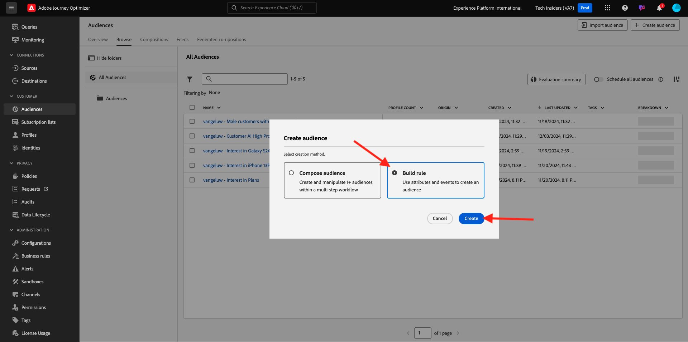
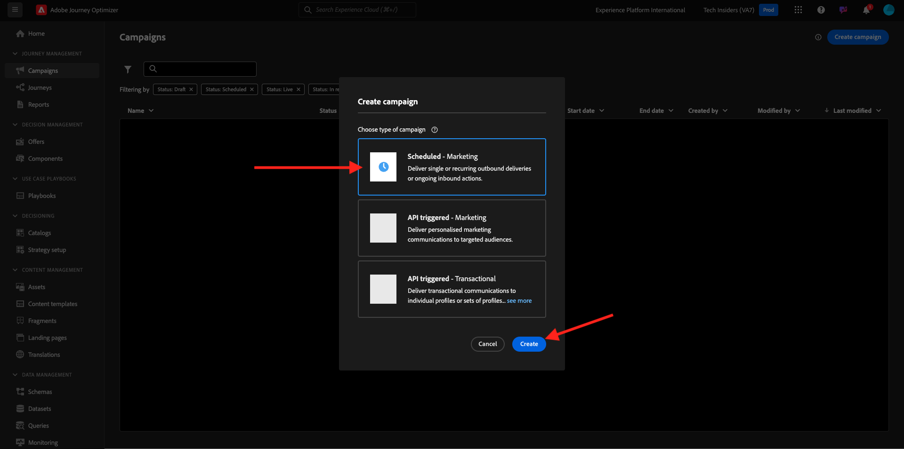

# 3.4.2 Configurar uma campanha

Faça login no Adobe Journey Optimizer em [Adobe Experience Cloud](https://experience.adobe.com). Clique em **Journey Optimizer**.


Você será redirecionado para a exibição **Página inicial** no Journey Optimizer. Primeiro, verifique se você está usando a sandbox correta. A sandbox a ser usada é chamada `--aepSandboxName--`. Você estará na exibição **Página inicial** da sua sandbox `--aepSandboxName--`.


## 3.4.2.1 Criar público

Antes de criar a campanha, você deve definir o público-alvo que deve receber a campanha. Para criar um público-alvo, vá para **Públicos-alvo** no menu esquerdo. Você verá todo o público-alvo criado anteriormente aqui.

Clique em **+ Criar público-alvo**.


Selecione **Regra de compilação** e clique em **Criar**.



Selecione o campo **Perfil Individual XDM > Email Pessoal > Endereço** e adicione-o à tela. Defina a condição da regra para **existe**.

Para evitar o envio de emails para outros usuários em seu ambiente de treinamento compartilhado, você também pode adicionar um filtro, como **Nome igual a -seu nome-**.

Defina o nome do público-alvo como `--aepUserLdap-- - All customers with email` e clique em **Publicar**.


Seu público-alvo agora está publicado e pode ser usado em uma campanha.

## 3.4.2.2 Criar campanha de informativo

Agora você criará uma campanha. Ao contrário da jornada baseada em eventos do exercício anterior, que depende de eventos de experiência de entrada, entradas de público-alvo ou saídas para acionar uma jornada para um cliente específico, as campanhas direcionam todo um público-alvo uma vez com conteúdo exclusivo, como boletins informativos, promoções únicas ou informações genéricas ou periodicamente com conteúdo semelhante enviado regularmente, como por exemplo campanhas de aniversário e lembretes.

No menu, vá para **Campanhas** e clique em **Criar campanha**.


Selecione **Agendado - Marketing** e clique em **Criar**.



Na tela de criação da campanha, configure o seguinte:

- **Nome**: `--aepUserLdap-- - CitiSignal Newsletter`.
- **Descrição**: informativo mensal
- **Tipo de identidade**: alterar para Email

Clique em **Selecionar audiência**.


Para o **Público-alvo**, selecione o público criado na etapa anterior, `--aepUserLdap-- - All customers with email`. Clique em **Salvar**.


Para a **Ação**, selecione **Email** e selecione uma **Configuração de email** existente. Você editará o conteúdo em alguns minutos.


Para o **Agendamento**, escolha **Em uma data e hora específicas** e defina uma hora de escolha.


Agora você pode começar a criar a própria mensagem de email. Role para cima um pouco e clique em **Editar conteúdo**.


Você verá isso. Para a **Linha de assunto**, use este: `Your monthly CitiSignal update has arrived.`. Em seguida, clique em **Editar corpo do email**.


Escolha **Design do zero**.


Você verá isso. No menu esquerdo, você encontrará os componentes de estrutura que podem ser usados para definir a estrutura do email (linhas e colunas).

Arraste e solte 3 vezes uma **coluna 1:1** na tela, 1 vez uma coluna 1:2 à esquerda e 1 vez uma coluna 2:1 à direita, o que deve fornecer esta estrutura:


No menu esquerdo, vá para **Fragmentos**. Arraste o cabeçalho criado anteriormente no [exercício 3.1.2.1](./../ajob2c-1/ex2.md) até o primeiro componente na tela. Arraste o rodapé criado anteriormente no [exercício 3.1.2.2](./../ajob2c-1/ex2.md) até o último componente na tela.


Clique no ícone **+** no menu esquerdo. Vá para **Conteúdo** para começar a adicionar conteúdo à tela.


Arraste e solte um componente **Texto** na segunda linha.


Selecione o texto padrão nesse componente **Digite o texto aqui.** e substitua-o pelo texto abaixo. Altere o alinhamento para **Alinhamento central**.

```javascript
Hi {{profile.person.name.firstName}}

As a CitiSignal member, you're part of a dynamic community that's constantly evolving to meet your needs. We're committed to delivering innovative solutions that enhance your digital lifestyle and keep you ahead of the curve.

Stay connected.
```


Arraste e solte um componente **Imagem** na 3ª e 4ª linhas. Clique em **Procurar** na 3ª linha.


Abra a pasta **citi-signal-images**, clique para selecionar a imagem **Offer_AirPods.jpg** e clique em **Selecionar**.


Clique em **Procurar** no espaço reservado para imagem na quarta linha.


Abra a pasta **citi-signal-images**, clique para selecionar a imagem **Offer_Phone.jpg** e clique em **Selecionar**.


Arraste e solte um componente **Texto** na 3ª e 4ª linhas.


Selecione o texto padrão no componente na terceira linha **Digite seu texto aqui.** e substitua-o pelo texto abaixo.

```javascript
Get AirPods for free:

Experience seamless connectivity like never before with CitiSignal. Sign up for select premium plans and receive a complimentary pair of Apple AirPods. Stay connected in style with our unbeatable offer.
```

Selecione o texto padrão no componente na quarta linha **Digite seu texto aqui.** e substitua-o pelo texto abaixo.

```javascript
We'll pay off your phone:

Make the switch to CitiSignal and say goodbye to phone payments! Switching to CitiSignal has never been more rewarding. Say farewell to hefty phone bills as we help pay off your phone, up to 800$!
```


O email básico do informativo agora está pronto. Clique em **Salvar**.


Volte para o painel de campanha clicando na **seta** ao lado do texto da linha de assunto no canto superior esquerdo.


Clique em **Revisar para ativar**.


Você poderá então receber esse erro. Se esse for o caso, talvez seja necessário aguardar até 24 horas até que o público-alvo seja avaliado e, em seguida, tentar ativar a campanha novamente. Talvez também seja necessário atualizar a programação da campanha para executá-la posteriormente.

Clique em **Ativar**.


Uma vez ativada, sua campanha será agendada para execução.


Sua campanha agora está ativada. Sua mensagem de email do informativo será enviada conforme você a definiu em sua programação, e sua campanha será interrompida assim que o último email for enviado.

Você também deve receber o email no endereço de email usado para o perfil de demonstração criado anteriormente.


Você concluiu este exercício.

## Próximas etapas

Ir para [3.4.3 Aplicar personalização baseada em segmento em uma mensagem de email](./ex3.md){target="_blank"}

Voltar para [Adobe Journey Optimizer](journeyoptimizer.md){target="_blank"}

Voltar para [Todos os módulos](./../../../../overview.md){target="_blank"}
