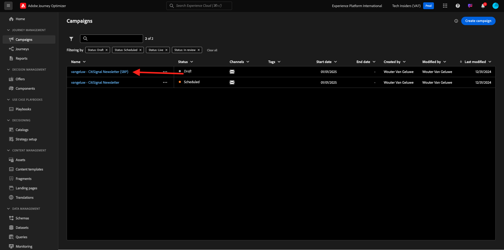

# 3.4.3 Aplicar personalização baseada em segmentos em uma mensagem de email

Faça login no Adobe Experience Cloud em [Adobe Experience Cloud](https://experience.adobe.com). Clique em **Adobe Journey Optimizer**.

Você será redirecionado para a exibição **Página inicial** no Journey Optimizer. Antes de continuar, você precisa selecionar uma **sandbox**. A sandbox a ser selecionada é chamada ``--aepTenantId--``.

## 3.4.3.1 Personalização baseada em segmentos

Neste exercício, você melhorará a mensagem de email do informativo criada no exercício anterior com um texto personalizado com base na associação do segmento.

Vá para **Campanhas**. Localize a jornada do informativo criada no exercício anterior. Pesquisar por `--aepUserLdap-- - CitiSignal Newsletter`. Clique com o botão direito do mouse nos 3 pontos **...** e clique em **Duplicar**.

Você verá isso. Use isso para o **Título**: `--aepUserLdap-- - CitiSignal Newsletter (SBP)`. Clique em **Duplicate**.

Clique na campanha duplicada para abri-la.

Clique em **Editar** para alterar o conteúdo.

Clique em **Editar corpo do email**.

Você verá isso.

Abra o **Content Components** e arraste uma **coluna 1:1** acima da oferta do AirPods.

Arraste e solte um componente **Texto** nessa coluna 1:1.

Selecione todo o texto padrão e exclua. Em seguida, clique no botão **Adicionar personalização** na barra de ferramentas.

Você verá isso. No menu esquerdo, clique em **Públicos-alvo**.

Selecione o segmento `--aepUserLdap-- - Interest in Plans` e clique no ícone **+** para adicioná-lo à tela.

Em seguida, você deve deixar a primeira linha como está e substituir as linhas 2 e 3 por este código:

&grave;&grave;
    PS: It may be a good idea to check if your plan still meets your needs! Click here to be contacted by one of our experts!

    PS: Thanks for taking the time to read our newsletter. Here is a 10% promo code to use on the website: NEWSLETTER10

&grave;&grave;

Então você terá isto. Clique em **Salvar**.

Altere o alinhamento do texto para **Alinhamento central**.

Agora você pode salvar esta mensagem clicando no botão **Salvar** no canto superior direito. Em seguida, clique em **seta** ao lado do texto da linha de assunto no canto superior esquerdo.

Clique em **Revisar para ativar**.

Clique em **Ativar**.

Seu informativo com personalização baseada em segmentos foi publicado. A mensagem de email do informativo será enviada de acordo com a sua programação. A jornada será interrompida assim que o último email for enviado.

Se você se qualificar para o segmento que foi usado, verá isso no email que receberá:

Você concluiu este exercício.

## Próximas etapas

Ir para [3.4.4 Instalação e usar notificações por push para iOS](./ex4.md){target="_blank"}

Voltar para [Adobe Journey Optimizer](journeyoptimizer.md){target="_blank"}

Voltar para [Todos os módulos](./../../../../overview.md){target="_blank"}
