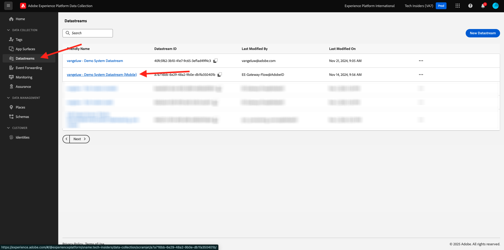
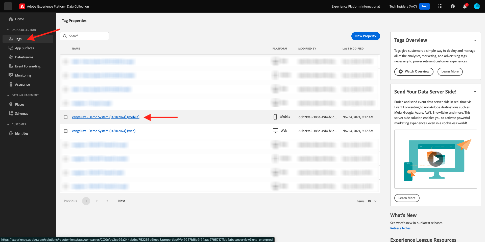
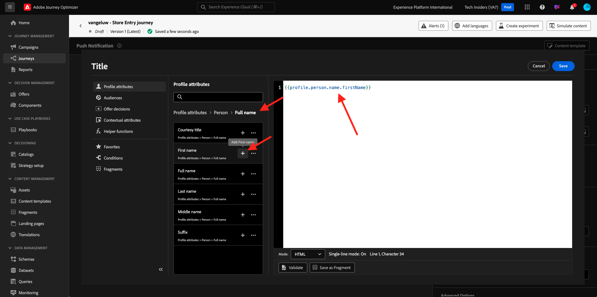
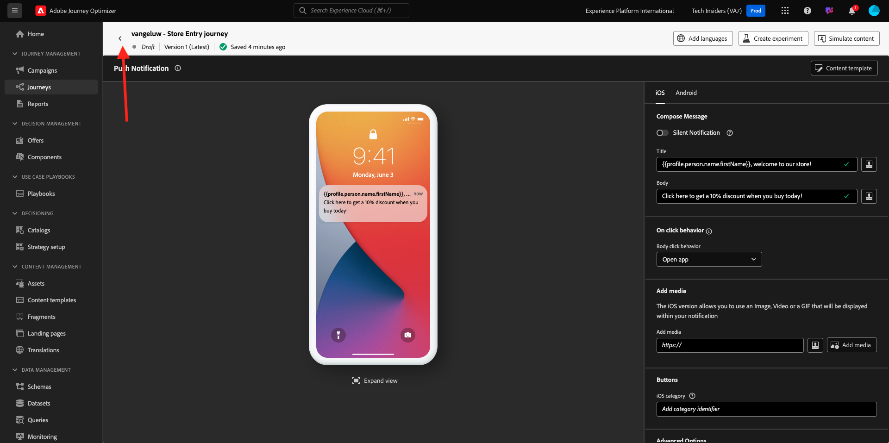
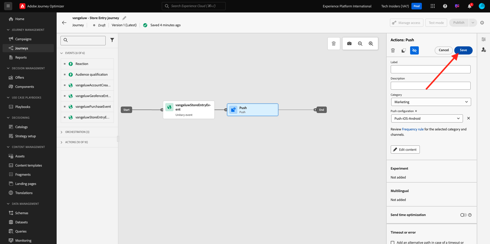
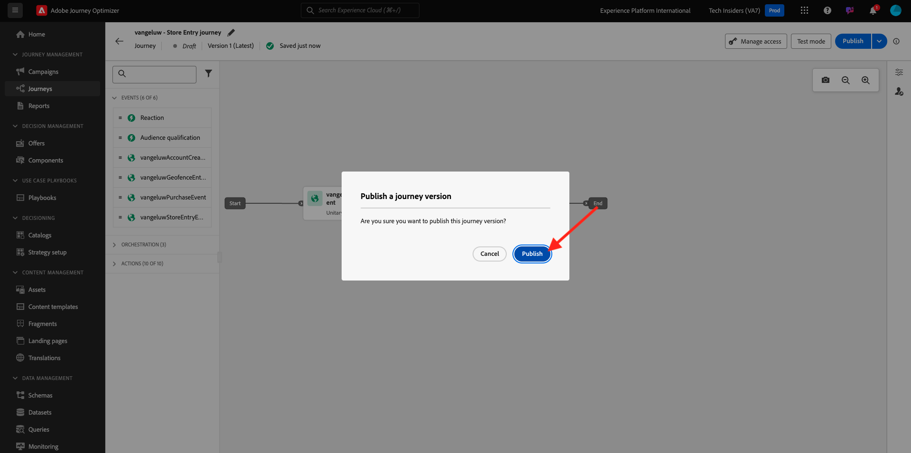

# 3.4.4 Configurar e usar notificações por push para iOS

Para usar notificações por push com o Adobe Journey Optimizer, há várias configurações a serem verificadas e conhecidas.

Estas são todas as configurações a serem verificadas:

- Conjuntos de dados e esquemas na Adobe Experience Platform
- Sequência de dados para dispositivos móveis
- Propriedade de coleção de dados para dispositivos móveis
- Superfície do aplicativo para certificados push
- Testar a configuração de push usando o AEP Assurance

Vamos analisar um por um.

Faça login no Adobe Journey Optimizer em [Adobe Experience Cloud](https://experience.adobe.com). Clique em **Journey Optimizer**.

Você será redirecionado para a exibição **Página inicial** no Journey Optimizer. Primeiro, verifique se você está usando a sandbox correta. A sandbox a ser usada é chamada `--aepSandboxName--`. Você estará na exibição **Página inicial** da sua sandbox `--aepSandboxName--`.

## 3.4.4.1 Conjunto de dados de push

O Adobe Journey Optimizer usa conjuntos de dados para armazenar itens como os tokens de push de dispositivos móveis ou interações com mensagens de push (como: mensagem enviada, mensagem aberta etc.) em um conjunto de dados no Adobe Journey Optimizer.

Você pode encontrar esses conjuntos de dados acessando **[!UICONTROL Conjuntos de dados]** no menu do lado esquerdo da tela. Para mostrar conjuntos de dados do sistema, clique no ícone de filtro.

Habilite a opção **Mostrar conjuntos de dados do sistema** e pesquisar por **AJO**. Você verá os conjuntos de dados usados para notificações por push.

## 3.4.4.2 Sequência de dados para dispositivos móveis

Ir para [https://experience.adobe.com/#/data-collection/](https://experience.adobe.com/#/data-collection/).

No menu esquerdo, vá para **[!UICONTROL Sequência de dados]** e procure a sequência de dados que você criou em [Introdução](./../../../../modules/getting-started/gettingstarted/ex2.md), chamada de `--aepUserLdap-- - Demo System Datastream (Mobile)`. Clique em para abri-lo.

Clique em **Editar** no serviço **Adobe Experience Platform**.

Em seguida, você verá as configurações de sequência de dados que foram definidas e em quais conjuntos de dados, eventos e atributos de perfil serão armazenados.

Você também deve ativar as seguintes opções se elas ainda não estiverem ativadas:

- **Offer Decisioning**
- **Destinos de personalização**
- **Adobe Journey Optimizer**

Clique em **Salvar**.

## 3.4.4.3 Revise a propriedade da Coleta de dados para dispositivos móveis

Ir para [https://experience.adobe.com/#/data-collection/](https://experience.adobe.com/#/data-collection/). Como parte da [Introdução](./../../../../modules/getting-started/gettingstarted/ex1.md), foram criadas duas propriedades de Coleção de Dados.
Você já usa essas propriedades do Cliente da coleção de dados como parte dos módulos anteriores.

Clique em para abrir a propriedade Coleção de dados para dispositivos móveis.

Na propriedade da Coleção de dados, vá para **Extensões**. Em seguida, você verá as várias extensões necessárias para o aplicativo móvel. Clique para abrir a extensão **Adobe Experience Platform Edge Network**.

Em seguida, você verá que a sequência de dados para dispositivos móveis está vinculada aqui. Em seguida, clique em **Cancelar** para voltar para a visão geral das extensões.

Você estará de volta aqui. Você verá a extensão para **AEP Assurance**. O AEP Assurance ajuda a inspecionar, testar, simular e validar como você coleta dados ou veicula experiências em seu aplicativo móvel. Você pode ler mais sobre a AEP Assurance e o Project Griffon aqui [https://aep-sdks.gitbook.io/docs/beta/project-griffon](https://aep-sdks.gitbook.io/docs/beta/project-griffon).

Em seguida, clique em **Configurar** para abrir a extensão **Adobe Journey Optimizer**.

Você verá que é aqui que o conjunto de dados para rastrear eventos de push é vinculado.

Não há necessidade de fazer alterações na propriedade da Coleção de dados.

## 3.4.4.4 Revise a configuração do aplicativo Surface

Ir para [https://experience.adobe.com/#/data-collection/](https://experience.adobe.com/#/data-collection/). No menu esquerdo, vá para **Superfícies do Aplicativo** e abra a Superfície do Aplicativo para o **DX Demo App APNS**.

Em seguida, você verá a Superfície do aplicativo configurada para o iOS e o Android.

## 3.4.4.5 Teste a configuração da notificação por push usando o AEP Assurance.

Depois que o aplicativo for instalado, você o encontrará na tela inicial do dispositivo. Clique no ícone para abrir o aplicativo.

Quando estiver usando o aplicativo pela primeira vez, você será solicitado a fazer logon usando sua Adobe ID. Conclua o processo de logon.

Depois de fazer logon, você verá uma notificação solicitando sua permissão para enviar notificações. Enviaremos notificações como parte do tutorial, então clique em **Permitir**.

Você verá a página inicial do aplicativo. Vá para **Configurações**.

Nas configurações, você verá que, atualmente, um **Projeto público** está carregado no aplicativo. Clique em **Projeto personalizado**.

Agora você pode carregar um projeto personalizado. Clique no código QR para carregar facilmente seu projeto.

Depois de passar pela seção **Introdução**, você teve este resultado. Clique para abrir o **projeto do Mobile Retail** criado para você.

Caso tenha fechado acidentalmente a janela do navegador ou para futuras sessões de demonstração ou capacitação, você também pode acessar o projeto do seu site em [https://dsn.adobe.com/projects](https://dsn.adobe.com/projects). Depois de fazer logon com sua Adobe ID, você verá isso. Clique no projeto do aplicativo móvel para abri-lo.

Em seguida, clique em **Executar**.

Você verá este pop-up, que contém um código QR. Digitalize este código QR de dentro do aplicativo móvel.

Você verá sua ID de projeto exibida no aplicativo e depois poderá clicar em **Salvar**.

Agora, volte para a **Página inicial** no aplicativo. Seu aplicativo está pronto para ser usado.

Agora é necessário digitalizar um código QR para conectar seu dispositivo móvel à sua sessão do AEP Assurance.

Para iniciar uma sessão do AEP Assurance, vá para [https://experience.adobe.com/#/data-collection/](https://experience.adobe.com/#/data-collection/). Clique em **Assurance** no menu esquerdo. Em seguida, clique em **Criar sessão**.

Clique em **Start**.

Preencha os valores:

- Nome da sessão: use `--aepUserLdap-- - push debugging` e substitua ldap pelo seu ldap
- URL base: use `dxdemo://default`

Clique em **Next**.

Você verá um código QR na tela, que deve ser digitalizado com o dispositivo iOS.

Em seu dispositivo móvel, abra o aplicativo de câmera e verifique o código QR exibido pelo AEP Assurance.

Você verá uma tela pop-up solicitando que você insira o código PIN. Copie o código PIN da tela do AEP Assurance e clique em **Conectar**.

Você verá isso.

No Assurance, você verá agora que um dispositivo está ativo na sessão do Assurance. Clique em **Concluído**.

Ir para **Depuração push**.

>[!NOTE]
>
>Caso não encontre **Push Debug** no menu esquerdo, clique em **Configurar** no canto inferior esquerdo da tela e adicione **Push Debug** ao menu.

Vocês verão algo assim.

Alguma explicação:

- A primeira coluna, **Cliente**, mostra os identificadores disponíveis em seu dispositivo iOS. Você verá uma ECID e um token de push.
- A 2ª coluna mostra as **Credenciais e Configuração do App Store**, que foram configuradas como parte do exercício **3.4.5.4 Criar Configuração de Aplicativo na Inicialização**
- A segunda coluna mostra informações do **Perfil**, com informações adicionais sobre em qual plataforma está o token de push (APNS ou APNSSandbox). Se clicar no botão **Inspecionar Perfil**, você será levado para a Adobe Experience Platform e verá o Perfil completo do Cliente em Tempo Real.

Para testar a configuração de push, vá para o botão **Enviar Configuração de Push de Teste**. Clique em **Enviar notificação por push de teste**

Verifique se o aplicativo **DX Demo** não está aberto no momento de clicar no botão **Enviar notificação por push**. Se o aplicativo estiver aberto, a Notificação por push pode ser recebida em segundo plano e não estará visível.

Você verá uma notificação por push como esta aparecer no seu dispositivo móvel.

Se você recebeu a notificação por push, significa que a configuração está correta e funcionando bem e agora é possível criar uma jornada real que resultará no envio de uma mensagem por push do Journey Optimizer.

## 3.4.4.6 Criar um novo evento

Ir para **Journey Optimizer**. No menu esquerdo, vá para **Configurações** e clique em **Gerenciar** em **Eventos**.

Na tela **Eventos**, você verá um modo de exibição semelhante a este. Clique em **Criar Evento**.

Em seguida, você verá uma configuração de evento vazia.
Primeiro, dê ao seu Evento um Nome como este: `--aepUserLdap--StoreEntryEvent` e defina a descrição como `Store Entry Event`.
A seguir está a seleção **Tipo de Evento**. Selecione **Unitário**.
A seguir está a seleção **Tipo de ID de Evento**. Selecione **Gerado pelo Sistema**.

O próximo é a seleção Esquema. Um esquema foi preparado para este exercício. Use o esquema `Demo System - Event Schema for Mobile App (Global v1.1) v.1`.

Depois de selecionar o esquema, você verá vários campos sendo selecionados na seção **Carga**. Seu evento está totalmente configurado.

Clique em **Salvar**.

O Evento agora está configurado e salvo. Clique no evento novamente para abrir a tela **Editar Evento** novamente.

Passe o mouse sobre o campo **Carga** e clique no ícone **Exibir carga**.

Agora você verá um exemplo da carga útil esperada.

Seu Evento tem uma eventID de orquestração exclusiva, que você pode encontrar rolando para baixo nessa carga até ver `_experience.campaign.orchestration.eventID`.

A ID do evento é o que precisa ser enviado para o Adobe Experience Platform para acionar a Jornada que você criará na próxima etapa. Anote essa eventID, pois ela será necessária na próxima etapa.
`"eventID": "89acd341ec2b7d1130c9a73535029debf2ac35f486bc99236b1a5091d6f4bc68"`

Clique em **Ok**, seguido de **Cancelar**.

## 3.4.4.7 Criar uma jornada

No menu, vá para **Jornadas** e clique em **Criar Jornada**.

Você verá isso. Dê um nome à sua jornada. Usar `--aepUserLdap-- - Store Entry journey`. Clique em **Salvar**.

Primeiro, é necessário adicionar o evento como ponto de partida da jornada. Procure seu evento `--aepUserLdap--StoreEntryEvent` e arraste-o e solte-o na tela. Clique em **Salvar**.

Em seguida, em **Ações**, pesquise a ação **Push**. Arraste e solte a ação **Enviar** na tela.

Defina a **Categoria** como **Marketing** e selecione uma superfície de push que permita enviar notificações por push. Nesse caso, a superfície de email a ser selecionada é **Push-iOS-Android**.

>[!NOTE]
>
>É necessário que exista um Canal no Journey Optimizer que esteja usando a **Superfície do Aplicativo**, conforme revisado anteriormente.

A próxima etapa é criar a mensagem. Para fazer isso, clique em **Editar conteúdo**.

Você verá isso. Clique no ícone de **personalização** do campo **Título**.

Você verá isso. Agora é possível selecionar qualquer atributo de Perfil diretamente do Perfil de cliente em tempo real.

Pesquise pelo campo **Nome** e clique no ícone **+** ao lado do campo **Nome**. Você verá o token de personalização para o Nome que está sendo adicionado: **{{profile.person.name.firstName}}**.

Em seguida, adicione o texto **, bem-vindo à nossa loja!** atrás de **{{profile.person.name.firstName}}**.

Clique em **Salvar**.

Agora você tem isto. Clique no ícone de **personalização** do campo **Corpo**.

Digite este texto **Clique aqui para obter um desconto de 10% ao comprar hoje!** e clique em **Salvar**.

Então você terá isto. Clique na seta no canto superior esquerdo para voltar à jornada.

Clique em **Salvar** para fechar sua ação de push.

Clique em **Publicar**.

Clique novamente em **Publicar**.

Sua jornada foi publicada.

## 3.4.4.8 Testar a jornada e a mensagem por push

No aplicativo móvel DX Demo 2.0, acesse a tela **Configurações**. Clique no botão **Armazenar entrada**.

>[!NOTE]
>
>O botão **Armazenar Entrada** está sendo implementado no momento. Você ainda não o encontrará no aplicativo.

Feche o aplicativo imediatamente após clicar no ícone **Entrada da loja**. Caso contrário, a mensagem de push não será exibida.

Após alguns segundos, você verá a mensagem ser exibida.

Você concluiu este exercício.

## Próximas etapas

Ir para [Resumo e benefícios](./summary.md){target="_blank"}

Voltar para [Adobe Journey Optimizer](journeyoptimizer.md){target="_blank"}

Voltar para [Todos os módulos](./../../../../overview.md){target="_blank"}
