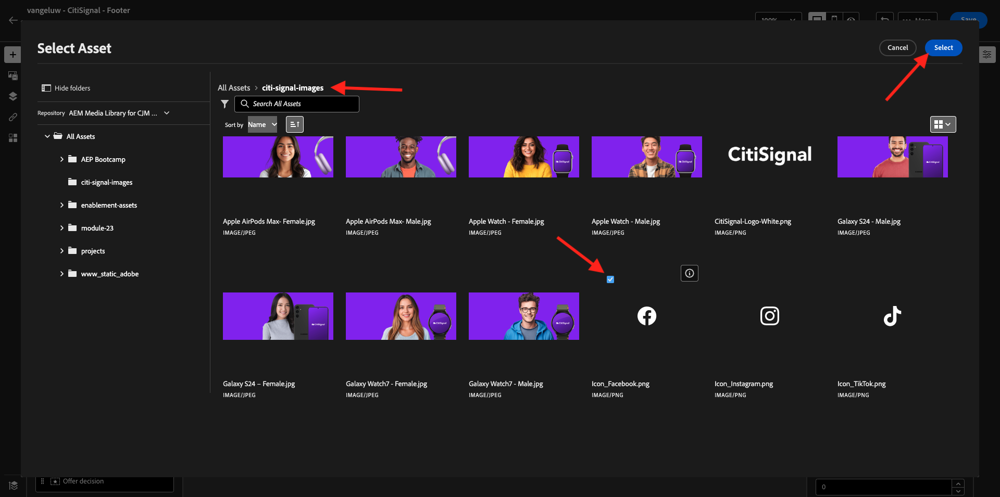
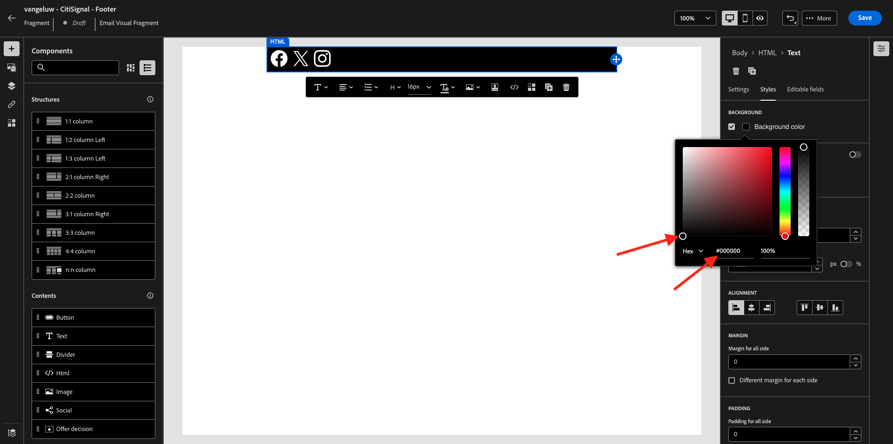
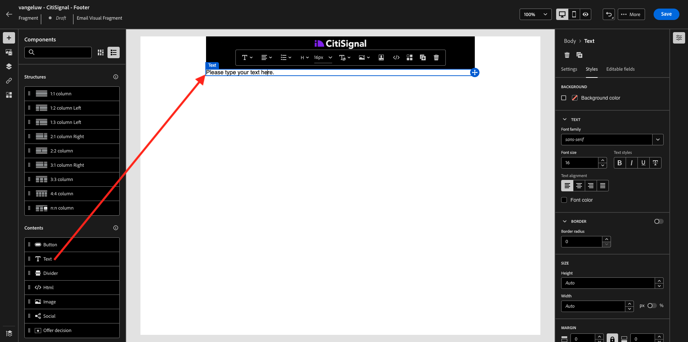
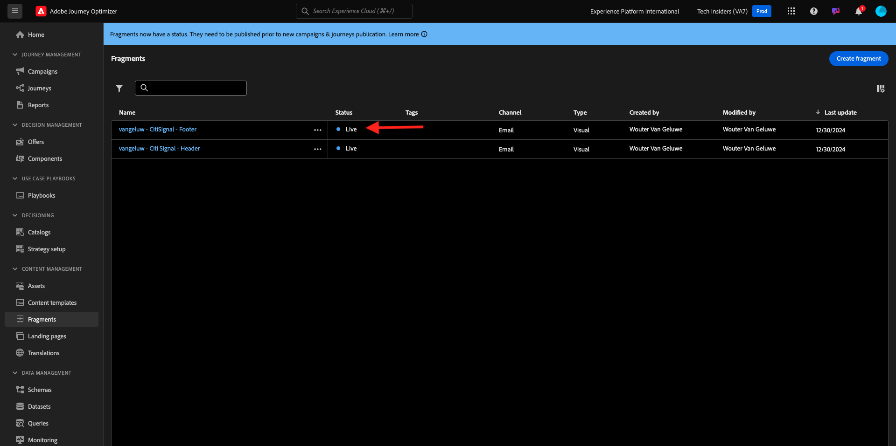
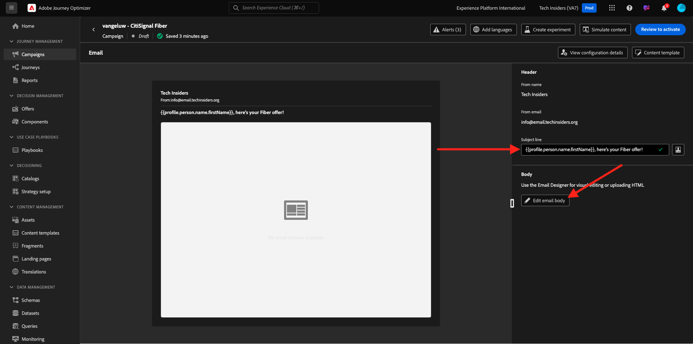
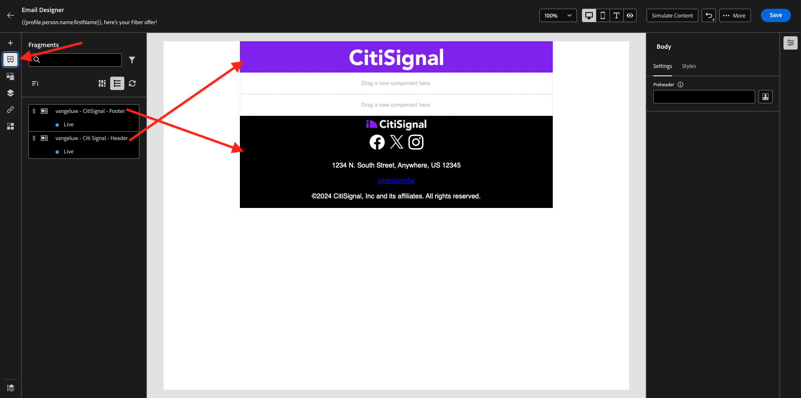
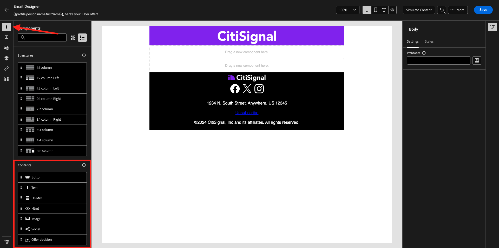
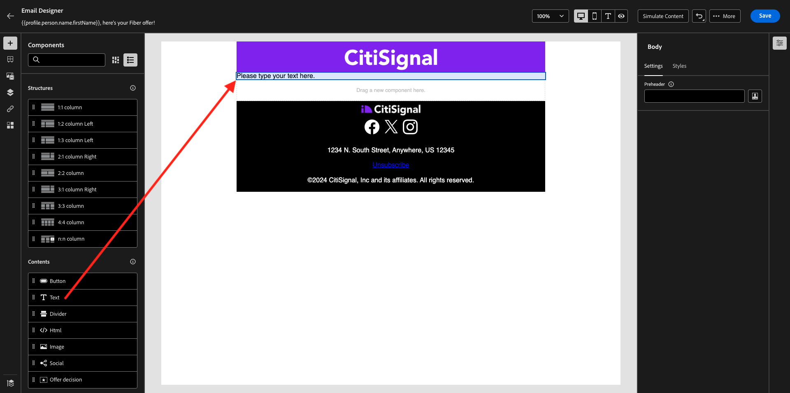

# 3.5.2 Criar a campanha

Ir para [https://experience.adobe.com/](https://experience.adobe.com/). Clique em **Journey Optimizer**.


Você será redirecionado para a exibição **Página inicial** no Journey Optimizer. Primeiro, verifique se você está usando a sandbox correta. A sandbox a ser usada é chamada `--aepSandboxName--`.


>[!NOTE]
>
>Caso já tenha criado os fragmentos de Cabeçalho e Rodapé como parte do exercício [exercício 3.1.2.1](./../ajob2c-1/ex2.md) e do [exercício 3.1.2.2](./../ajob2c-1/ex2.md), avance para o exercício 3.5.2.3 Criar campanha de Fibra. Não crie os fragmentos de Cabeçalho e Rodapé novamente.

## 3.5.2.1 Criar o fragmento de cabeçalho

No menu esquerdo, clique em **Fragmentos**. Um fragmento é um componente reutilizável no Journey Optimizer, o que evita a duplicação e facilita alterações futuras que devem afetar todas as mensagens, como alterações em um cabeçalho ou rodapé em uma mensagem de email.

Clique em **Criar fragmento**.


Insira o nome `--aepUserLdap-- - CitiSignal - Header` e selecione o **Tipo: Fragmento visual**. Clique em **Criar**.


Você verá isso. No menu esquerdo, você encontrará os componentes de estrutura que podem ser usados para definir a estrutura do email (linhas e colunas).

Arraste e solte uma **coluna 1:1** do menu na tela. Este será o espaço reservado para a imagem do logotipo.


Em seguida, você pode usar Componentes de Conteúdo para adicionar conteúdo dentro desses blocos. Arraste e solte um componente **Imagem** na primeira célula da primeira linha. Clique em **Procurar**.


Você verá um pop-up que abre, mostrando sua Biblioteca de mídia da AEM Assets. Vá para a pasta **citi-signal-images**, clique para selecionar a imagem **CitiSignal-Logo-White.png** e clique em **Selecionar**.

>[!NOTE]
>
>Se você não vir as imagens do Citi Signal na Biblioteca da AEM Assets, poderá encontrá-las [aqui](./../../../../assets/ajo/CitiSignal-images.zip). Baixe-as na área de trabalho, crie a pasta **citi-signal-images** e carregue todas as imagens nessa pasta.


Você verá isso. Sua imagem está branca e ainda não está sendo exibida. Agora você deve definir uma cor de plano de fundo para que a imagem seja exibida corretamente. Clique em **Estilos** e na caixa **Cor do plano de fundo**.


No pop-up, altere o código de cor **Hex** para **#8821F4** e altere o foco clicando no campo **100%**. Você verá a nova cor aplicada à imagem.


A imagem também é um pouco grande agora. Vamos alterar a largura deslizando o alternador **Largura** para **40%**.


O fragmento do cabeçalho agora está pronto. Clique em **Salvar** e na seta para voltar à tela anterior.


O fragmento precisa ser publicado antes de ser usado. Clique em **Publicar**.


Após alguns minutos, você verá que o status do seu fragmento mudou para **Live**.
Em seguida, você deve criar um novo fragmento para o rodapé das mensagens de email. Clique em **Criar fragmento**.


## 3.5.2.2 Criar o fragmento de Rodapé

Clique em **Criar fragmento**.


Insira o nome `--aepUserLdap-- - CitiSignal - Footer` e selecione o **Tipo: Fragmento visual**. Clique em **Criar**.


Você verá isso. No menu esquerdo, você encontrará os componentes de estrutura que podem ser usados para definir a estrutura do email (linhas e colunas).

Arraste e solte uma **coluna 1:1** do menu na tela. Este será o espaço reservado para o conteúdo do rodapé.


Em seguida, você pode usar Componentes de Conteúdo para adicionar conteúdo dentro desses blocos. Arraste e solte um componente **HTML** na primeira célula da primeira linha. Clique no componente para selecioná-lo e, em seguida, clique no ícone **&lt;/>** para editar o código-fonte do HTML.


Você verá isso.


Copie o fragmento de código do HTML abaixo e cole-o na janela **Editar HTML** no Journey Optimizer.

```html
<!--[if mso]><table cellpadding="0" cellspacing="0" border="0" width="100%"><tr><td style="text-align: center;" ><![endif]-->
<table style="width: auto; display: inline-block;">
  <tbody>
    <tr class="component-social-container">
      <td style="padding: 5px">
        <a style="text-decoration: none;" href="https://www.facebook.com" data-component-social-icon-id="facebook">
        
        </a>
      </td>
      <td style="padding: 5px">
        <a style="text-decoration: none;" href="https://x.com" data-component-social-icon-id="twitter">
        
        </a>
      </td>
      <td style="padding: 5px">
        <a style="text-decoration: none;" href="https://www.instagram.com" data-component-social-icon-id="instagram">
         
        </a>
      </td>
    </tr>
  </tbody>
</table>
<!--[if mso]></td></tr></table><![endif]-->
```

Então você terá isto. Nas linhas 7, 12 e 17, agora é necessário inserir um arquivo de imagem, usando os ativos na biblioteca do AEM Assets.


Verifique se o cursor está localizado na linha 7 e clique em **Assets** no menu esquerdo. Clique em **Abrir seletor de ativos** para selecionar sua imagem.


Abra a pasta **citi-signal-images** e clique para selecionar a imagem **Icon_Facebook.png**. Clique em **Selecionar**.



Verifique se o cursor está localizado na linha 12 e clique em **Abrir seletor de ativos** para selecionar sua imagem.


Abra a pasta **citi-signal-images** e clique para selecionar a imagem **Icon_X.png**. Clique em **Selecionar**.


Verifique se o cursor está localizado na linha 17 e clique em **Abrir seletor de ativos** para selecionar sua imagem.


Abra a pasta **citi-signal-images** e clique para selecionar a imagem **Icon_Instagram.png**. Clique em **Selecionar**.


Você verá isso. Clique em **Salvar**.


Você voltará ao editor. Seus ícones ainda não estão visíveis porque o plano de fundo e os arquivos de imagem estão todos em branco. Para alterar a cor do plano de fundo, vá para **Estilos** e clique na caixa de seleção **Cor do plano de fundo**.


Altere o código de cor **Hex** para **#000000**.



Alterar o alinhamento a ser centralizado.


Vamos adicionar outras partes ao rodapé. Arraste e solte um componente **Imagem** acima do componente HTML que você acabou de criar. Clique em **Procurar**.


Clique para selecionar o arquivo de imagem **`CitiSignal_Footer_Logo.png`** e clique em **Selecionar**.


Vá para **Estilos** e clique na caixa de seleção **Cor do plano de fundo**. Vamos alterá-la para preto novamente. Altere o código de cor **Hex** para **#000000**.


Altere a largura para **20%** e verifique se o alinhamento está definido para ser centralizado.


Em seguida, arraste e solte um componente **Texto** no componente do HTML que você criou. Clique em **Procurar**.



Copie e cole o texto abaixo substituindo o texto do espaço reservado.

```
1234 N. South Street, Anywhere, US 12345

Unsubscribe

©2024 CitiSignal, Inc and its affiliates. All rights reserved.
```

Defina o **Alinhamento do texto** para ser centralizado.


Altere a **Cor da fonte** para branco, **#FFFFFF**.


Altere a **cor do plano de fundo** para preto, **#000000**.


Selecione o texto **Cancelar inscrição** no rodapé e clique no ícone **Link** na barra de menus. Defina o **Tipo** como **Opção de não participação/Cancelamento de assinatura externo** e defina a URL como **https://aepdemo.net/unsubscribe.html** (não é permitido ter uma URL em branco para o link de cancelamento de assinatura).


Então você terá isto. O rodapé agora está pronto. Clique em **Salvar** e na seta para voltar à página anterior.


Clique em **Publicar** para publicar seu rodapé para que ele possa ser usado em um email.


Após alguns minutos, você verá que o status do seu rodapé mudou para **Live**.



## 3.5.2.3 Criar campanha de fibra

Agora você criará uma campanha. Ao contrário da jornada baseada em eventos do exercício anterior, que depende de eventos de experiência de entrada, entradas de público-alvo ou saídas para acionar uma jornada para um cliente específico, as campanhas direcionam todo um público-alvo uma vez com conteúdo exclusivo, como boletins informativos, promoções únicas ou informações genéricas ou periodicamente com conteúdo semelhante enviado regularmente, como por exemplo campanhas de aniversário e lembretes.

No menu, vá para **Campanhas** e clique em **Criar campanha**.


Selecione **Agendado - Marketing** e clique em **Criar**.


Na tela de criação da campanha, configure o seguinte:

- **Nome**: `--aepUserLdap-- - CitiSignal Fiber`.
- **Descrição**: campanha de fibra
- **Tipo de identidade**: alterar para Email


Role para baixo até **Ação**. Para a **Ação**, selecione **Email**.


Em seguida, selecione uma **configuração de email** existente. Você editará o conteúdo em alguns minutos.


Role até **Público-alvo**. Clique em **Selecionar audiência**.


Para o **Público-alvo**, selecione o público-alvo criado em [1.3.3 Criar uma composição federada](./../../datacollection/dc1.3/ex3.md), que se chama `--aepUserLdap-- - CitiSignal Eligible for Fiber`. Clique em **Salvar**.


Role para baixo até **Agendar**. Para o **Agendamento**, escolha **Em uma data e hora específicas** e defina uma hora de escolha.


Agora você pode começar a criar a própria mensagem de email. Role para cima e clique em **Editar conteúdo**.


Você verá isso. Para a **Linha de assunto**, use esta:

```
{{profile.person.name.firstName}}, here's your Fiber offer!
```

Em seguida, clique em **Editar corpo do email**.



Escolha **Design do zero**.


Você verá isso. No menu esquerdo, você encontrará os componentes de estrutura que podem ser usados para definir a estrutura do email (linhas e colunas).

Arraste e solte 4 vezes uma **coluna 1:1** na tela, o que deve fornecer esta estrutura:


No menu esquerdo, vá para **Fragmentos**. Arraste o cabeçalho criado anteriormente para o primeiro componente na tela. Arraste o rodapé criado anteriormente para o último componente na tela.



Clique no ícone **+** no menu esquerdo. Vá para **Conteúdo** para começar a adicionar conteúdo à tela.



Arraste e solte um componente **Texto** na segunda linha.



Selecione o texto padrão nesse componente **Digite o texto aqui.** e substitua-o pelo texto abaixo. Altere o alinhamento para **Alinhamento central**.

```javascript
Hi {{profile.person.name.firstName}}

As a CitiSignal customer, you're in pole position to discover our new Fiber offering. Have a look at the below offer and update your contract!

Stay connected.
```


Arraste e solte um componente **Imagem** na terceira linha. Clique em **Procurar**.


Selecione o repositório do AEM Assets que você criou como parte dos módulos anteriores. Esse repositório deve ser nomeado como `--aepUserLdap-- - Citi Signal dev`. Clique para abrir a pasta `--aepUserLdap-- - Workfront Assets`.


Clique para selecionar a imagem **2048x2048_buynow.png** e clique em **Selecionar**.


O email básico do informativo agora está pronto. Clique em **Salvar**.


Volte para o painel de campanha clicando na **seta** ao lado do texto da linha de assunto no canto superior esquerdo.


Clique em **Revisar para ativar**.


Você poderá então receber esse erro. Se esse for o caso, talvez seja necessário aguardar até 24 horas até que o público-alvo seja avaliado e, em seguida, tentar ativar a campanha novamente. Talvez também seja necessário atualizar a programação da campanha para executá-la posteriormente.


Clique em **Ativar**.


Uma vez ativada, sua campanha será agendada para execução.


Você concluiu este exercício.

## Próximas etapas

Ir para [3.5.3 Adicionar idiomas ao seu email](./ex3.md)

Voltar para [Adobe Journey Optimizer: Serviços de Tradução](./ajotranslationsvcs.md){target="_blank"}

Voltar para [Todos os módulos](./../../../../overview.md){target="_blank"}
