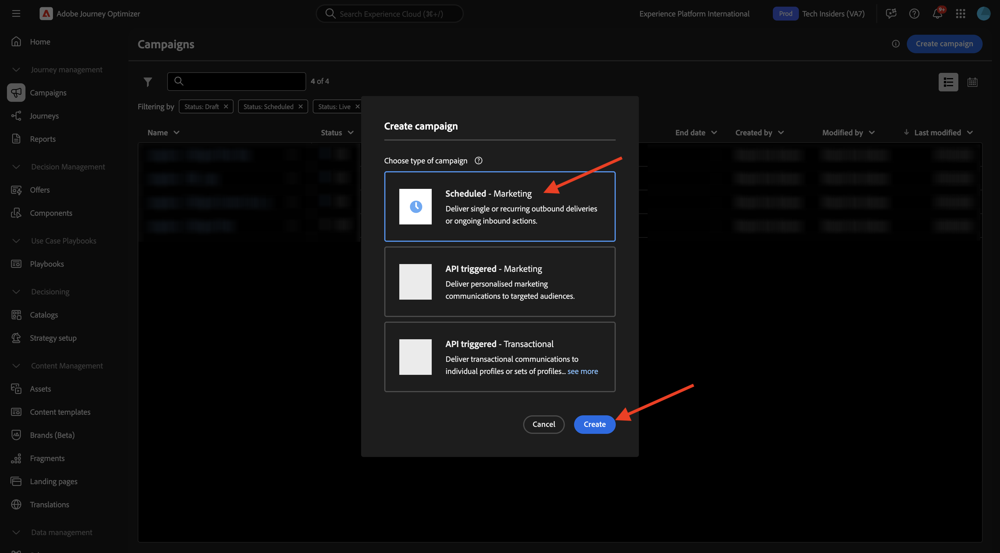
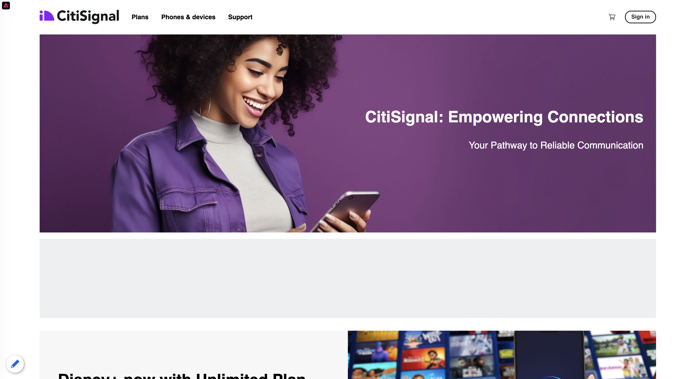
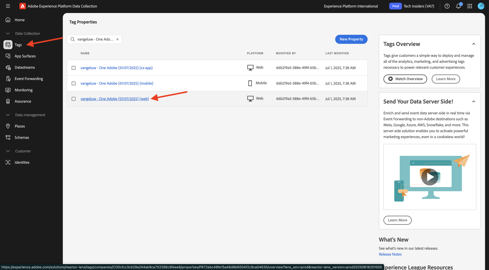
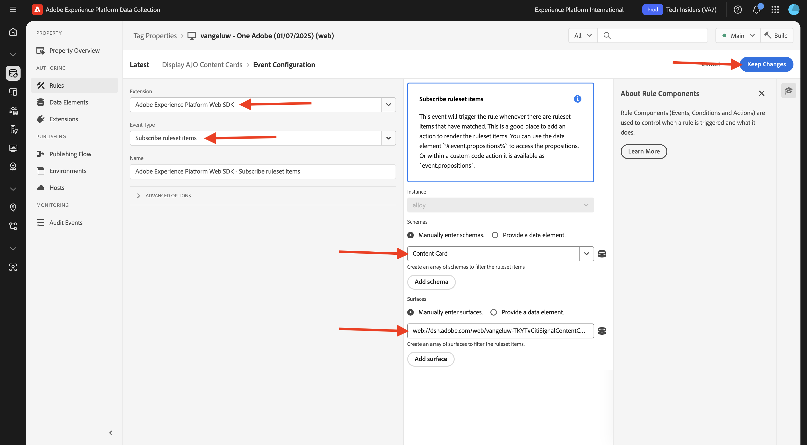

# 3.6.1 Cartões de conteúdo

Faça login no Adobe Journey Optimizer em [Adobe Experience Cloud](https://experience.adobe.com). Clique em **Journey Optimizer**.


Você será redirecionado para a exibição **Página inicial** no Journey Optimizer. Primeiro, verifique se você está usando a sandbox correta. A sandbox a ser usada é chamada `--aepSandboxName--`. Você estará na exibição **Página inicial** da sua sandbox `--aepSandboxName--`.


## Configuração do canal de cartões de conteúdo do 3.6.1.1

No menu esquerdo, vá para **Canais** e selecione **Configurações de canal**. Clique em **Criar configuração de canal**.


Insira o nome: `--aepUserLdap--_Content_Cards_Web`, selecione o canal **Cartões de Conteúdo** e habilite a plataforma **Web**.


Role para baixo e verifique se a opção **Página única** está habilitada.

Insira a URL do site que foi criado anteriormente como parte do módulo **Introdução**, que tem esta aparência: `https://dsn.adobe.com/web/--aepUserLdap---XXXX`. Não esqueça de alterar o **XXXX** para o código exclusivo do seu site.

>[!IMPORTANT]
>
>A referência acima para a URL do site de demonstração do CitiSignal `https://dsn.adobe.com/web/--aepUserLdap---XXXX` precisa ser alterada para sua URL real. Você pode encontrar a URL acessando o projeto do seu site em [https://dsn.adobe.com/](https://dsn.adobe.com/).

Defina o campo **Local na página** como `CitiSignalContentCardContainer`.


Role para cima e clique em **Enviar**.


A configuração do canal agora está pronta para ser usada.


## 3.6.1.2 Configurar uma campanha agendada para Cartões de Conteúdo

No menu esquerdo, vá para **Campanhas** e clique em **Criar campanha**.


Selecione **Agendado - Marketing** e clique em **Criar**.



Insira o nome `--aepUserLdap-- - CitiSignal Fiber Max Content Cards` e clique em **Ações**.


Clique em **+ Adicionar ação** e selecione **Cartão de Conteúdo**.


Selecione a configuração de canal de cartões de conteúdo criada na etapa anterior, chamada: `--aepUserLdap--_Content_Cards_Web`.

Em seguida, clique em **Editar regras**.


Clique em **X** para remover a regra atual.


Clique em **+ Adicionar Condição**.


Selecione a condição **Enviar dados para a Platform**. Clique em **Concluído**


Você deverá ver isso. Clique em **Editar conteúdo**.


Você deverá ver isso.


Defina as seguintes configurações:

- **Título**: `CitiSignal Fiber Max`
- **Corpo**: `Lightning speed for gamers`
- **URL de Destino**: `https://dsn.adobe.com/web/--aepUserLdap---XXXX/plans`

>[!IMPORTANT]
>
>A referência acima para a URL do site de demonstração do CitiSignal `https://dsn.adobe.com/web/--aepUserLdap---XXXX/plans` precisa ser alterada para sua URL real. Você pode encontrar a URL acessando o projeto do seu site em [https://dsn.adobe.com/](https://dsn.adobe.com/).

Clique no ícone para alterar o URL selecionando um ativo no AEM Assets.


Vá para a pasta **citisignal-images** e selecione o arquivo **`neon_rabbit_banner.jpg`**. Clique em **Selecionar**.


Você deveria ficar com isso. Clique em **+ no botão Adicionar**.


Defina as seguintes configurações para o botão:

- **Título do Botão**: `Upgrade now!`
- **Evento de interação**: `click`
- **Destino**: `https://dsn.adobe.com/web/--aepUserLdap---XXXX/plans`

>[!IMPORTANT]
>
>A referência acima para a URL do site de demonstração do CitiSignal `https://dsn.adobe.com/web/--aepUserLdap---XXXX/plans` precisa ser alterada para sua URL real. Você pode encontrar a URL acessando o projeto do seu site em [https://dsn.adobe.com/](https://dsn.adobe.com/).

Clique em **Revisar para ativar**.


Clique em **Ativar**.


Sua campanha será ativada, o que pode levar alguns minutos.


Após alguns minutos, sua campanha estará disponível.


## 3.6.1.3 Atualize seu site DSN

Para mostrar o cartão de conteúdo no site, você precisa fazer uma alteração no design da página inicial do site de demonstração do CitiSignal.

Ir para [https://dsn.adobe.com/](https://dsn.adobe.com/). Clique nos **3 pontos** do site e em **Editar**.


Clique para selecionar a página **Página inicial**. Clique em **Editar conteúdo**.


Passe o mouse sobre a imagem herói e clique no botão **+**.


Vá para **Geral**, selecione **Banner** e clique em **Adicionar**.


Clique em para selecionar o banner recém-criado. Vá para **Style** e insira `CitiSignalContentCardContainer` no campo **Classes CSS personalizadas**.


Ir para **Alinhamento**. Defina o campo **Alinhamento** como `left` e defina o campo **Alinhamento Vertical** como `middle`.

Clique no ícone **X** para fechar a janela da caixa de diálogo.


As alterações no design do site foram feitas.

Se você abrir seu site em uma nova janela do navegador agora, ele deverá ficar assim. a área cinza é o banner recém-criado, mas ainda não tem conteúdo.



Para garantir que o conteúdo seja carregado dinamicamente no banner recém-criado, é necessário fazer uma alteração na propriedade Tags da coleção de dados.

## 3.6.1.4 Atualize a propriedade Marcas da Coleção de Dados

Ir para [https://experience.adobe.com/#/data-collection/](https://experience.adobe.com/#/data-collection/), para **Marcas**. Como parte do módulo [Introdução](./../../../../modules/getting-started/gettingstarted/ex1.md), as propriedades das Marcas da Coleção de Dados foram criadas.

Você já está usando essas propriedades de Tags da coleção de dados como parte dos módulos anteriores.

Clique em para abrir a propriedade Coleção de dados para a Web.



No menu esquerdo, vá para **Regras** e clique para abrir a regra **Exibição de página**.


Clique na ação **Enviar Evento de Experiência de &quot;Exibição de Página&quot;**.


Como parte da regra **Exibição de página**, é necessário solicitar as instruções de personalização da Edge para uma superfície específica. A superfície é o banner que você configurou na etapa anterior. Para fazer isso, role para baixo até **Personalization** e insira `web://dsn.adobe.com/web/--aepUserLdap---XXXX#CitiSignalContentCardContainer` em **Superfícies**.

>[!IMPORTANT]
>
>A referência acima para a URL do site de demonstração do CitiSignal `web://dsn.adobe.com/web/--aepUserLdap---XXXX#CitiSignalContentCardContainer` precisa ser alterada para sua URL real. Você pode encontrar a URL acessando o projeto do seu site em [https://dsn.adobe.com/](https://dsn.adobe.com/).

Clique em **Manter alterações**.


Clique em **Salvar** ou **Salvar na Biblioteca**.


No menu esquerdo, vá para **Regras** e clique em **Adicionar regra**.


Digite o nome: `Display AJO Content Cards`. Clique em **+ Adicionar** para adicionar um novo evento.


Selecione a **extensão**: **Adobe Experience Platform Web SDK** e selecione o **Tipo de Evento**: **Assinar itens do conjunto de regras**.

Em **Esquemas**, selecione **Cartão de Conteúdo**.

Em **Superfícies**, digite `web://dsn.adobe.com/web/--aepUserLdap---XXXX#CitiSignalContentCardContainer`

>[!IMPORTANT]
>
>A referência acima para a URL do site de demonstração do CitiSignal `web://dsn.adobe.com/web/--aepUserLdap---XXXX#CitiSignalContentCardContainer` precisa ser alterada para sua URL real. Você pode encontrar a URL acessando o projeto do seu site em [https://dsn.adobe.com/](https://dsn.adobe.com/).

Clique em **Manter alterações**.



Você deverá ver isso. Clique em **+ Adicionar** para adicionar uma nova ação.


Selecione a **Extensão**: **Núcleo** e selecione o **Tipo de Ação**: **Código Personalizado**.

Habilite a caixa de seleção para o **Idioma**: **JavaScript** e clique em **Abrir Editor**.


Você deverá ver uma janela vazia do editor.


Cole o código abaixo no editor e clique em **Salvar**.

```javascript
if (!Array.isArray(event.propositions)) {
  console.log("No personalization content");
  return;
}

console.log(">>> Content Card response from Edge: ", event.propositions);

event.propositions.forEach(function (payload) {
  payload.items.forEach(function (item) {
    if (!item.data || !item.data.content || item.data.content === "undefined") {
      return;
    }
    console.log(">>> Content Card response from Edge: ", item);
    const { content } = item.data;
    const { title, body, image, buttons } = content;
    const titleValue = title.content;
    const description = body.content;
    const imageUrl = image.url;
    const buttonLabel = buttons[0]?.text.content;
    const buttonLink = buttons[0]?.actionUrl;
    const html = `<div  class="Banner Banner--alignment-left Banner--verticalAlignment-left hero-banner ContentCardContainer"  oxygen-component-id="cmp-0"  oxygen-component="Banner"  role="presentation"  style="color: rgb(255, 255, 255); height: 60%;">  <div class="Image" role="presentation">      </div>  <div class="Banner__content">    <div class="Title Title--alignment-left Title--textAlignment-left">      <div class="Title__content" role="presentation">        <strong class="Title__pretitle">${titleValue}</strong>        <h2>${description}</h2>      </div>    </div>    <div class="Button Button--alignment-left Button--variant-cta">              <button          class="Dniwja_spectrum-Button Dniwja_spectrum-BaseButton Dniwja_i18nFontFamily Dniwja_spectrum-FocusRing Dniwja_spectrum-FocusRing-ring"          type="button"          data-variant="accent"          data-style="fill"          onclick="window.open('${buttonLink}')"       style="color:#FFFFFF;padding: 12px 28px;font-size: 24px;font-family: adobe-clean;font-weight: bolder;" >          <span            id="react-aria5848951631-49"            class="Dniwja_spectrum-Button-label"            >${buttonLabel}</span          >        </button>            </div>  </div></div>`;
    if (document.querySelector(".CitiSignalContentCardContainer")) {
      const contentCardContainer = document.querySelector(
        ".CitiSignalContentCardContainer"
      );
      contentCardContainer.innerHTML = html;
      contentCardContainer.style.height = "60%";
    }
  });
});
```


Clique em **Manter alterações**.


Clique em **Salvar** ou **Salvar na Biblioteca**.


No menu esquerdo, vá para **Fluxo de Publicação** e clique para abrir a biblioteca **Principal**.


Clique em **Adicionar todos os recursos alterados** e em **Salvar e criar no desenvolvimento**.


## 3.6.1.5 Teste seu cartão de conteúdo em seu site

Ir para [https://dsn.adobe.com](https://dsn.adobe.com). Depois de fazer logon com sua Adobe ID, você verá isso. Clique nos 3 pontos **...** do projeto do site e clique em **Executar** para abri-lo.


Você verá seu site de demonstração aberto. Selecione o URL e copie-o para a área de transferência.


Abra uma nova janela incógnita do navegador.


Cole o URL do site de demonstração que você copiou na etapa anterior. Você será solicitado a fazer logon usando sua Adobe ID.


Selecione o tipo de conta e conclua o processo de logon.


Agora você deve carregar o site do CitiSignal, e o cartão de conteúdo configurado agora deve ser exibido em vez da área cinza vazia que você tinha lá antes.


## Próximas etapas

Ir para [3.6.2 Páginas de Aterrissagem](./ex2.md)

Voltar para [Adobe Journey Optimizer: Gerenciamento de Conteúdo](./ajocontent.md){target="_blank"}

Voltar para [Todos os módulos](./../../../../overview.md){target="_blank"}
