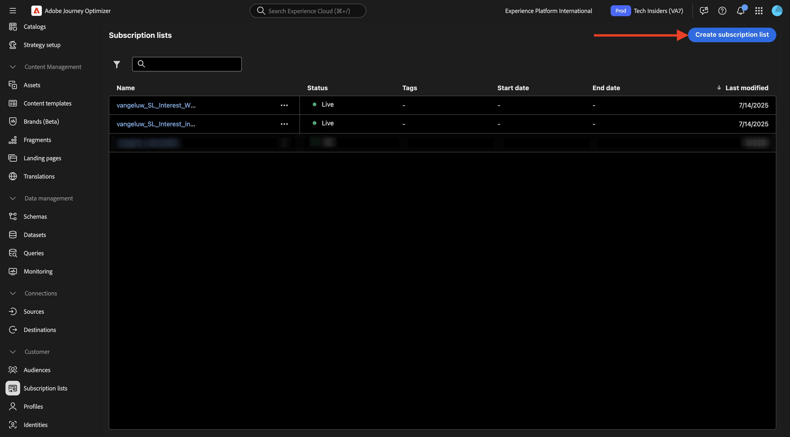
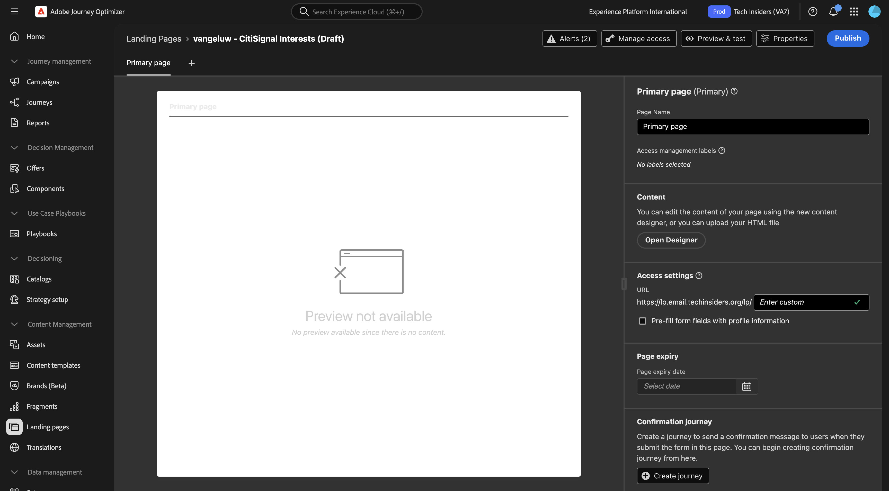
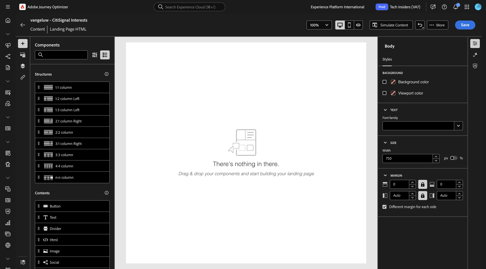
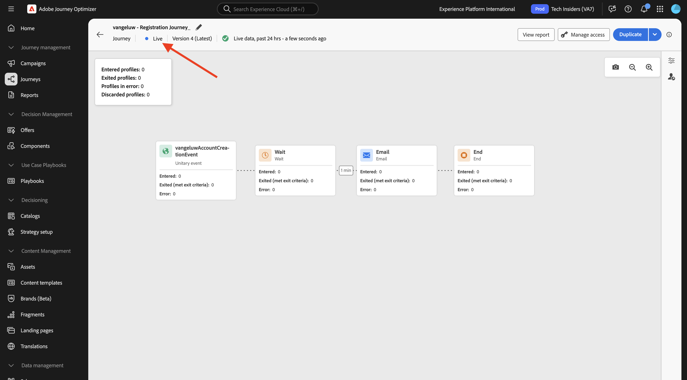

# 3.6.2 Landing Pages

Faça login no Adobe Journey Optimizer em [Adobe Experience Cloud](https://experience.adobe.com). Clique em **Journey Optimizer**.

Você será redirecionado para a exibição **Página inicial** no Journey Optimizer. Primeiro, verifique se você está usando a sandbox correta. A sandbox a ser usada é chamada `--aepSandboxName--`. Você estará na exibição **Página inicial** da sua sandbox `--aepSandboxName--`.

## Listas de assinaturas 3.6.2.1

As Páginas de aterrissagem no Adobe Journey Optimizer funcionam em conjunto com **Listas de assinaturas**. Para configurar páginas de aterrissagem, você precisa configurar **Listas de assinaturas** primeiro.

A CitiSignal gostaria de perguntar aos seus clientes sobre o seu interesse nos seguintes domínios:

- Página inicial inteligente
- Trabalhar de Casa
- Jogos online

Depois que um cliente indicar seu interesse em um desses domínios, ele deverá ser adicionado a uma lista específica para que possa ser direcionado com conteúdo específico posteriormente como parte das campanhas futuras.

Agora você criará três listas de assinaturas.

No menu esquerdo, vá para **Listas de assinaturas**. Clique em **Criar lista de assinaturas**.

Para **Título**, use: `--aepUserLdap--_SL_Interest_in_Smart_Home`.
Para **Descrição**, use: `Interest in Smart Home`.

Clique em **Enviar**.

Clique em **Criar lista de assinaturas** para criar outra lista.

Para **Título**, use: `--aepUserLdap--_SL_Interest_WFH`.
Para **Descrição**, use: `Interest in Work From Home`.

Clique em **Enviar**.

Clique em **Criar lista de assinaturas** para criar outra lista.

Para **Título**, use: `--aepUserLdap--_SL_Interest_Online_Gaming`.
Para **Descrição**, use: `Interest in Online Gaming`.

Clique em **Enviar**.

Agora você criou as três listas necessárias.

## Predefinição de página de aterrissagem 3.6.2.2

Para usar landing pages no Adobe Journey Optimizer, uma predefinição precisa ser criada.

No menu esquerdo, vá para **Administração** > **Canais** e selecione **Predefinições de página de aterrissagem**.

Clique em **Criar predefinição de página de destino**.

Para o campo **Nome**, use: `--aepUserLdap-- - CitiSignal LP` e selecione o subdomínio que está disponível na sua instância.

>[!NOTE]
>
>Se você não vir um subdomínio em sua instância, verifique com o administrador do AJO para adicionar um.

Clique em **Enviar**.

Sua predefinição de página de aterrissagem foi criada.

## Página de aterrissagem 3.6.2.3

Agora você pode criar sua landing page. No menu esquerdo, vá para **Gerenciamento de Conteúdo** > **Páginas de Aterrissagem**.

Clique em **Criar página de aterrissagem**.

Para o campo **Título**, use: `vangeluw - CitiSignal Interests`. Em seguida, selecione a **Predefinição de página de aterrissagem** que você configurou na etapa anterior.

Clique em **Criar**.

Você deverá ver isso.

Alterar o campo **Nome da Página** para `--aepUserLdap-- - CitiSignal Interests`.

Digite este nome personalizado em **Acessar configurações**: `--aepUserLdap---citisignal-interests`.

Clique em **Abrir Designer**.

Selecione **Design do zero**.

Você deverá ver isso.

Adicionar um componente de estrutura **1:1 coluna** à tela.

Adicione um componente de conteúdo **Formulário** à tela.

Atualize o campo **Rótulo** para **Caixa de seleção 1** para `Keep me updated about CitiSignal's offering for Smart Home`.

Verifique se a caixa de seleção **Aceitar se marcada** está habilitada e se a **Lista de assinaturas** está selecionada.

Clique em **Selecionar lista de assinaturas**.

Em seguida, selecione a lista `--aepUserLdap--_SL_Interest_in_Smart_Home` e clique em **Selecionar**.

Clique em **+ Adicionar campo** e marque **Caixa de seleção**.

Você deverá ver isso.

Atualize o campo **Rótulo** para **Caixa de seleção 2** para `Keep me updated about CitiSignal's offering for Work From Home`.

Verifique se a caixa de seleção **Aceitar se marcada** está habilitada e se a **Lista de assinaturas** está selecionada.

Clique em **Selecionar lista de assinaturas**.

Em seguida, selecione a lista `--aepUserLdap--_SL_Interest_WFH` e clique em **Selecionar**.

Clique em **+ Adicionar campo** e marque **Caixa de seleção**.

Você deverá ver isso.

Atualize o campo **Rótulo** para **Caixa de seleção 3** para `Keep me updated about CitiSignal's offering for Online Gaming`.

Verifique se a caixa de seleção **Aceitar se marcada** está habilitada e se a **Lista de assinaturas** está selecionada.

Clique em **Selecionar lista de assinaturas**.

Em seguida, selecione a lista `--aepUserLdap--_SL_Interest_Online_Gaming` e clique em **Selecionar**.

Você deverá ver isso.

Vá para o campo de formulário **CALL TO ACTION**.

Atualize os seguintes campos:

- **Texto** - Rótulo do botão: `Save`.
- **Ação de confirmação**: selecione **Texto de confirmação**.
- **Texto de confirmação**: use: `Thanks for updating your preferences!`
- **Ação de erro**: selecionar **Texto de erro**.
- **No texto de erro**: use: `There was an error updating your preferences.`

Clique em **Salvar** e, em seguida, clique na seta no canto superior esquerdo para voltar à tela anterior.

Clique em **Publicar**.

Clique novamente em **Publicar**.

Sua landing page agora está publicada e pode ser usada em um email.

## 3.6.2.4 Incluir página de aterrissagem no email

No exercício 3.1 você criou uma jornada chamada `--aepUserLdap-- - Registration Journey`.

Agora você deve atualizar a mensagem de email nessa jornada para incluir o link para a landing page.

No menu esquerdo, vá para **Jornadas** e clique para abrir a jornada `--aepUserLdap-- - Registration Journey`.

Clique em **Mais...** e selecione **Criar uma nova versão**.

Clique em **Criar uma nova versão**.

Clique para selecionar a ação **Email** e selecione **Editar conteúdo**.

Clique em **Editar corpo do email**.

Você deveria ver algo assim. Adicione um novo componente de estrutura **1:1 coluna** à tela.

Adicione um novo componente de conteúdo **Text** no componente de estrutura recém-criado.

Cole o seguinte texto no componente de conteúdo **Texto**.

`Would you like to hear from us about Smart Home news? Do you work from home and would you like to hear our tips? Or are you an avid online gamer and do you want to receive our game reviews? Click here to update your preferences and interests!`

Estilize o texto para que ele tenha a aparência a seguir e selecione a palavra `here`. Clique no ícone **link**.

Defina o **Tipo** do link para **Página de aterrissagem** e defina o campo **Destino** como **Em branco**.

Clique no ícone **editar** para selecionar a landing page a ser vinculada.

Selecione a página de aterrissagem `--aepUserLdap-- - CitiSignal Interests`. Clique em **Selecionar**.

Você deverá ver isso. Clique em **Salvar**.

Clique na seta no canto superior esquerdo para voltar à tela anterior.

Clique na seta no canto superior esquerdo para voltar à tela anterior novamente.

Clique em **Salvar**.

Clique em **Publicar**.

Clique novamente em **Publicar**.

As alterações foram publicadas e você pode testar a jornada.

## 3.6.2.5 Testar sua jornada e página de aterrissagem

Ir para [https://dsn.adobe.com](https://dsn.adobe.com). Depois de fazer logon com sua Adobe ID, você verá isso. Clique nos 3 pontos **...** do projeto do site e clique em **Executar** para abri-lo.

Você verá seu site de demonstração aberto. Selecione o URL e copie-o para a área de transferência.

Abra uma nova janela incógnita do navegador.

Cole o URL do site de demonstração que você copiou na etapa anterior. Você será solicitado a fazer logon usando sua Adobe ID.

Selecione o tipo de conta e conclua o processo de logon.

Em seguida, você verá seu site carregado em uma janela incógnita do navegador. Para cada exercício, será necessário usar uma janela do navegador nova e incógnita para carregar o URL do site de demonstração. Ir para **Entrar**

Clique em **CRIAR UMA CONTA**. Preencha seus detalhes e clique em **Registrar**.

Agora você será redirecionado para a página inicial. Abra o painel Visualizador de perfis e vá para Perfil do cliente em tempo real. No painel Visualizador de perfis, você deve ver todos os seus dados pessoais exibidos, como emails recém-adicionados e identificadores de telefone.

1 minuto após a criação da sua conta, você receberá um email da Adobe Journey Optimizer sobre a criação da conta.

Clique no link no email para atualizar suas preferências.

Você deverá ver o formulário criado. Ative algumas caixas de seleção e clique em **Salvar**.

Você deverá ver uma mensagem de confirmação.

## Relatório de Lista de Assinaturas de 3.6.2.6

Para exibir os relatórios disponíveis sobre listas de assinaturas, vá para **Listas de assinaturas** no menu esquerdo e clique para abrir uma das listas de assinaturas configuradas anteriormente.

Clique em **Relatório**.

Você deverá ver a visão geral da lista, com a quantidade de pessoas que assinaram ou cancelaram a assinatura dela.

## Próximas etapas

Ir para [3.6.3 AJO e GenStudio for Performance Marketing](./ex3.md)

Voltar para [Adobe Journey Optimizer: Gerenciamento de Conteúdo](./ajocontent.md){target="_blank"}

Voltar para [Todos os módulos](./../../../../overview.md){target="_blank"}
