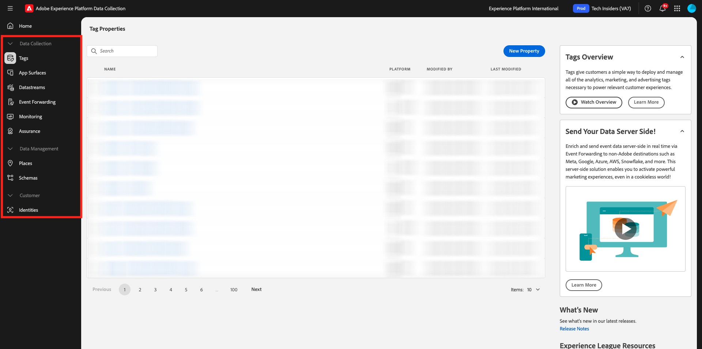

# 1.1.1 Noções básicas sobre a coleta de dados do Adobe Experience Platform

## Contexto

A Coleção de dados da Adobe Experience Platform é usada pelas marcas para vários casos de uso. É um Tag Management System (TMS) de última geração que oferece aos clientes uma forma simples de implantar e gerenciar todas as soluções de análise, marketing e publicidade necessárias para potencializar experiências de cliente relevantes. Não há custo adicional para a coleta de dados da Adobe Experience Platform e ela está disponível para qualquer cliente da Adobe Experience Cloud. Uma marca poderia usar a Coleção de dados da Adobe Experience Platform para:

- Implemente os aplicativos da Adobe Experience Cloud e o Adobe Experience Platform.
- Gerencie os diferentes requisitos de diferentes partes da organização fornecendo a cada uma sua própria **Propriedade** para gerenciar.
- Permitir testes e gerenciamento do ciclo de vida.
- Insira tags personalizadas do JavaScript e de terceiros, todas gerenciadas em um único local.

## Explore a interface

Vá para [Coleção de dados do Adobe Experience Platform](https://experience.adobe.com/#/data-collection/). Verifique se você está usando o ambiente correto, que deveria ser `--aepImsOrgName--`.

>[!NOTE]
>
>Este tutorial é documentado usando o ambiente **Experience Platform International**. O nome do seu ambiente provavelmente é diferente, portanto, sempre que você vir o nome **Experience Platform International** em uma captura de tela, deverá substituí-lo pelo nome do seu próprio ambiente, que deve ser `--aepImsOrgName--`.

Ir para **Marcas**. Você está vendo a exibição **[!UICONTROL Propriedades]**. As propriedades listadas aqui são para gerenciamento de tutorial. Essas propriedades representam:

- Propriedades do aplicativo e da Web
- Sites diferentes atendendo clientes de maneiras diferentes. Por exemplo, o Luma Retail teria uma propriedade, a Luma Travel teria outra.
- Sites herdados e atuais
- Um design específico do Adobe Analytics comum a vários sites diferentes
- Páginas da intranet interna ao lado de sites externos

Agora, olhe para o painel esquerdo.

- **[!UICONTROL Marcas]** fornece uma visão geral de todas as propriedades do lado do cliente
- **[!UICONTROL Superfícies do Aplicativo]** fornece uma visão geral de todas as Configurações de Aplicativo para habilitar Notificações por Push (que é usada/habilitada em combinação com o Project Sierra)
- **[!UICONTROL As sequências de dados]** são exploradas no [próximo exercício](./ex2.md)
- **[!UICONTROL Encaminhamento de Eventos]** fornece uma visão geral de todas as propriedades do lado do servidor exploradas no [Módulo 2.5 - Conexões Real-Time CDP: Encaminhamento de Eventos](./../../../../modules/delivery-activation/rtcdp-b2c/rtcdpb2c-5/aep-data-collection-ssf.md)
- **[!UICONTROL Monitoramento]** fornece uma visão geral do tráfego de eventos de entrada e saída por meio do Encaminhamento de Eventos
- O **[!UICONTROL Assurance]** fornece acesso para depurar e implementar usando o Adobe Debugger
- **[!UICONTROL Places]** fornecem acesso ao gerenciamento de POIs que se tornam acessíveis para personalização baseada em localização em aplicativos móveis
- **[!UICONTROL Esquemas]** fornece acesso ao editor de esquema da Adobe Experience Platform
- **[!UICONTROL Identidades]** fornece acesso à configuração do Gráfico de identidade da Adobe Experience Platform

## Informações adicionais

A Coleção de dados do Adobe Experience Platform é uma ferramenta muito avançada com escopo além de um tutorial do Adobe Experience Platform. As organizações podem não usar a Coleção de dados da Adobe Experience Platform para seus recursos de gerenciamento de tags e, em vez disso, usar soluções de gerenciamento de tags que não sejam da Adobe para inserir código e gerenciar tags. O uso de uma solução de gerenciamento de tags que não seja da Adobe é compatível com a Adobe e a Adobe Professional Services.
Algumas leituras adicionais para os interessados em entender melhor a Coleção de dados da Adobe Experience Platform estão incluídas abaixo.

- [Guia do Usuário da Coleção de Dados da Adobe Experience Platform](https://experienceleague.adobe.com/docs/experience-platform/tags/home.html?lang=pt-BR)
- [Tutorial Implementar a Adobe Experience Cloud com o SDK da web](https://experienceleague.adobe.com/docs/platform-learn/implement-web-sdk/overview.html?lang=pt-BR)
- [Configurar permissões de usuário](https://experienceleague.adobe.com/docs/experience-platform/tags/admin/user-permissions.html?lang=pt-BR)
- [Documentação da API](https://experienceleague.adobe.com/pt-br/docs/experience-platform/tags/api/overview)

## Próximas etapas

Ir para [1.1.2 Edge Network, Fluxos de dados e Coleção de dados do lado do servidor](./ex2.md){target="_blank"}

Retorne à [Instalação da Coleção de Dados da Adobe Experience Platform e da extensão de marca da Web SDK](./data-ingestion-launch-web-sdk.md){target="_blank"}

Voltar para [Todos os módulos](./../../../../overview.md){target="_blank"}
