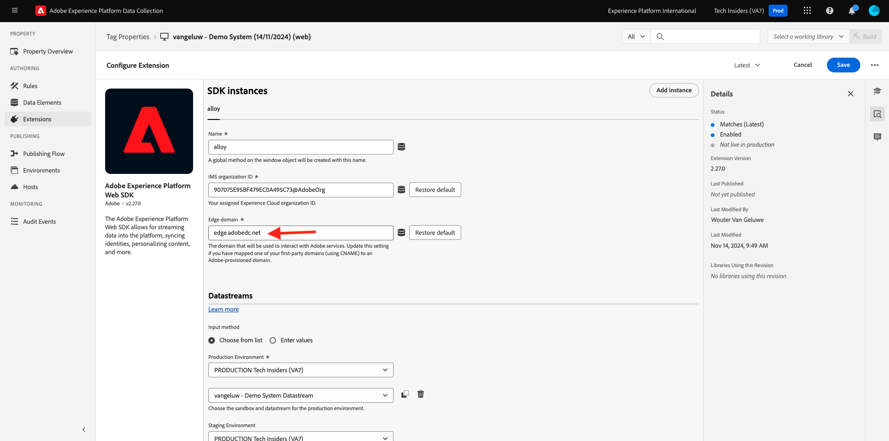
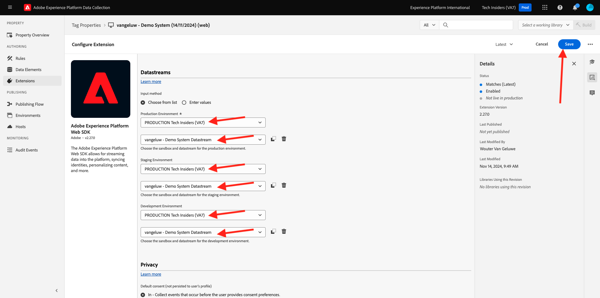
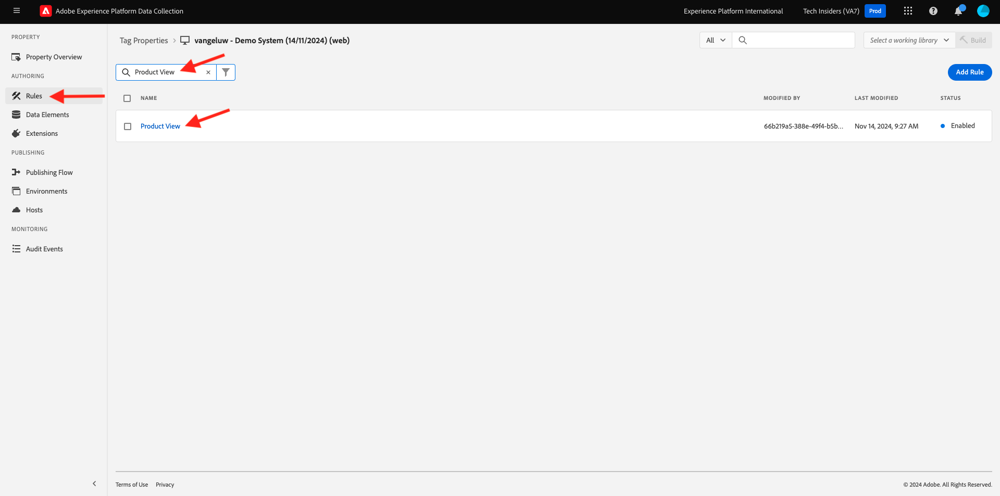

# 1.1.3 Introdução à coleta de dados do Adobe Experience Platform

## Contexto

Agora vamos dar uma olhada mais profunda nos componentes da Coleção de dados da Adobe Experience Platform para entender o que está instalado em seu site de demonstração. Você verá de perto a Extensão para SDK na Web do Adobe Experience Platform, configurará um elemento de dados e uma regra e aprenderá a publicar uma biblioteca.

## Extensão de tag do Adobe Experience Platform Web SDK

Uma extensão de tag é um conjunto de código empacotado que estende a interface da Coleção de dados da Adobe Experience Platform e a funcionalidade da biblioteca. A Coleção de dados da Adobe Experience Platform é a plataforma e as extensões de tag são como aplicativos que são executados na plataforma. Todas as extensões usadas no tutorial são criadas e gerenciadas pelo Adobe, mas terceiros podem criar suas próprias extensões para limitar a quantidade de código personalizado que os usuários da Coleção de dados do Adobe Experience Platform precisam gerenciar.

Vá para [Coleção de dados do Adobe Experience Platform](https://experience.adobe.com/launch/) e selecione **Marcas**.

Esta é a página Propriedades da coleção de dados do Adobe Experience Platform que você viu antes.

Em **Introdução**, o Sistema de Demonstração criou duas propriedades do Cliente para você: uma para o site e outra para o aplicativo móvel. Localize-os procurando por `--aepUserLdap--` na caixa **[!UICONTROL Pesquisar]**.
Clique para abrir a propriedade **Web**.

Em seguida, você verá a página Visão geral da propriedade. Clique em **[!UICONTROL Extensões]** no painel esquerdo, clique em **Adobe Experience Platform Web SDK** e em **[!UICONTROL Configurar]**.

Bem-vindo à Adobe Experience Platform Web SDK! Aqui você pode configurar a extensão com a sequência de dados criada em [Introdução](./../../../../modules/getting-started/gettingstarted/ex2.md), bem como algumas configurações mais avançadas.

O domínio de borda padrão é sempre **edge.adobedc.net**. Se você implementou uma configuração CNAME em seu ambiente Adobe Experience Cloud ou Adobe Experience Platform, será necessário atualizar o **[!UICONTROL Domínio do Edge]**.

Se o domínio de borda da sua instância for diferente do padrão, atualize o domínio de borda aqui. Se não tiver certeza, use o domínio padrão. Um domínio de borda possibilita configurar um servidor de rastreamento próprio, que usa uma configuração CNAME no back-end para garantir que os dados sejam coletados no Adobe.

Em **[!UICONTROL Sequências de dados]**, você já selecionou a sequência de dados na seção **Introdução**. Você selecionou esta sequência de dados: `--aepUserLdap-- - Demo System Datastream`, na lista da caixa **[!UICONTROL Sequência de Dados]**, para cada um dos ambientes.

Clique em **[!UICONTROL Salvar]** para voltar para o modo de exibição Extensões.

## Elementos de dados

Os elementos de dados são os blocos fundamentais do seu dicionário de dados (ou mapa de dados). Use elementos de dados para coletar, organizar e entregar dados em toda a tecnologia de marketing e anúncios.

Um único elemento de dados é uma variável cujo valor pode ser mapeado para consultar strings, URLs, valores de cookie, variáveis JavaScript e assim por diante. Você pode fazer referência a esse valor pelo nome da variável em toda a Coleção de dados da Adobe Experience Platform. Esta coleção de elementos de dados se torna o dicionário de dados definidos que você pode usar para criar suas regras (eventos, condições e ações). Esse dicionário de dados é compartilhado em toda a Coleção de dados da Adobe Experience Platform para uso com qualquer extensão adicionada à propriedade.

Agora você editará um elemento de dados já existente em um formato compatível com o Web SDK.

Clique em Elementos de dados no painel à esquerda para ser levado para a página Elementos de dados.

>[!NOTE]
>
>Você está editando apenas um elemento de dados neste exercício, mas pode ver o botão **[!UICONTROL Adicionar elemento de dados]** nesta página, que seria usado para adicionar uma nova variável ao dicionário de dados. Isso poderia ser usado em toda a Coleção de dados da Adobe Experience Platform. Fique à vontade para examinar alguns dos outros elementos de dados já existentes, principalmente usando o armazenamento local como a fonte de dados.

Na barra de pesquisa, digite **XDM - Exibição do produto** e clique no Elemento de Dados que ele retorna.

Esta tela mostra o Objeto XDM que você editará. O Experience Data Model (XDM) é um conceito que será explorado muito mais detalhadamente neste tutorial técnico, mas, por enquanto, é suficiente entendê-lo como o formato exigido pelo Adobe Experience Platform Web SDK. Você adicionará um pouco mais de informações aos dados coletados nas páginas de Artigo do site de demonstração.

Clique no botão de mais ao lado de **web**, na parte inferior da árvore.

Clique no botão de mais ao lado de **webPageDetails**.

Clique em **siteSection**. Agora você vê que **siteSection** ainda não está vinculado a nenhum elemento de dados. Vamos mudar isso.

Role para cima e insira o texto `%Product Category%`. Clique em **[!UICONTROL Salvar]**.

Neste ponto, a extensão Adobe Experience Platform Web SDK está instalada e você atualizou um elemento de dados para coletar dados em uma estrutura XDM. Em seguida, vamos verificar as regras que enviarão dados na hora correta.

## Regras

A coleta de dados do Adobe Experience Platform é um sistema baseado em regras. Busca a interação do usuário e dados associados. Quando os critérios definidos nas regras são cumpridos, a regra aciona a extensão, o script ou o código do lado do cliente identificado.

Crie regras para integrar os dados e a funcionalidade de tecnologia de marketing e de anúncios que unifique produtos diferentes em uma única solução.

Vamos detalhar a regra que envia dados nas páginas do artigo.

Clique em **[!UICONTROL Regras]** no painel esquerdo.

**[!UICONTROL Pesquisar]** por `Product View`.

Clique na regra retornada.

Vamos analisar os elementos individuais que compõem essa regra.

Para todas as regras: Se um **[!UICONTROL Evento]** especificado ocorrer, as **[!UICONTROL Condições]** serão avaliadas e, em seguida, as **[!UICONTROL Ações]** especificadas ocorrerão, se necessário.

Clique em Evento **Core - Evento personalizado**. Esta é a visualização que é carregada.

Clique na lista suspensa **Tipo de evento**.

Isso lista algumas das interações padrão que você pode usar para sinalizar a coleta de dados do Adobe Experience Platform para executar as ações, se as condições forem verdadeiras.

Clique em **[!UICONTROL Cancelar]** para voltar para a Regra.

Clique no **Enviar Evento de Experiência &quot;Exibição do Produto&quot;** da Ação.

Aqui você pode ver os dados que estão sendo enviados para a borda pelo Adobe Experience Platform Web SDK. Mais especificamente, isso está usando a **liga** **[!UICONTROL instância]** do Web SDK. O evento **[!UICONTROL Tipo]** está definido como **Exibições do produto (carrinho) do Commerce** e os Dados XDM que você está enviando são o elemento de dados **XDM - Exibição de produto** alterado anteriormente.

Agora que você visualizou a Regra, é possível publicar todas as alterações na Coleção de dados da Adobe Experience Platform.

## Publicar em uma biblioteca

Por fim, para validar a regra e o elemento de dados que você acabou de atualizar, é necessário publicar uma biblioteca contendo os itens editados em nossa propriedade. Você precisa seguir algumas etapas rápidas na seção **[!UICONTROL Publicação]** da Coleção de dados da Adobe Experience Platform.

Clique em **[!UICONTROL Fluxo de publicação]** na navegação à esquerda

Clique na biblioteca existente, chamada **Principal**.

Clique no botão **Adicionar todos os recursos alterados**. Em seguida,
Clique no botão **Salvar e criar para desenvolvimento**.

A biblioteca pode levar alguns minutos para ser criada e, quando estiver concluída, exibirá um ponto verde à esquerda do nome da biblioteca.

Como você pode ver na tela Fluxo de publicação, há muito mais processo de publicação na Coleção de dados da Adobe Experience Platform que está além do escopo deste tutorial. Vamos usar uma única biblioteca em nosso ambiente de desenvolvimento.

## Próximas etapas

Ir para [1.1.4 Coleção de dados da Web do lado do cliente](./ex4.md){target="_blank"}

Retorne à [Instalação da Coleção de Dados da Adobe Experience Platform e da extensão de marca da Web SDK](./data-ingestion-launch-web-sdk.md){target="_blank"}

Voltar para [Todos os módulos](./../../../../overview.md){target="_blank"}
