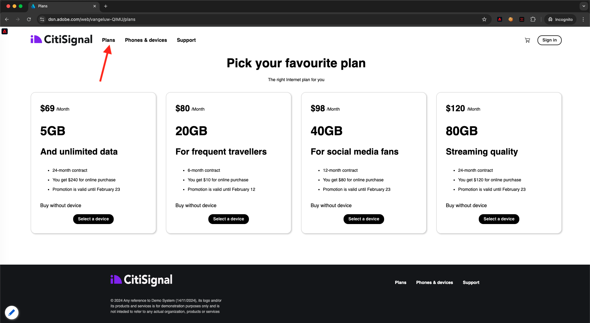

# 1.1.4 Coleta de dados da Web no lado do cliente

## Validar os dados na solicitação

### Instalar o Adobe Experience Platform Debugger

O Experience Platform Debugger é uma extensão disponível para os navegadores Chrome e Firefox que ajuda a visualizar a tecnologia do Adobe implementada nas páginas da Web. Instale a versão do seu navegador preferido:

- [Extensão do Firefox](https://addons.mozilla.org/pt-BR/firefox/addon/adobe-experience-platform-dbg/)

- [Extensão do Chrome](https://chrome.google.com/webstore/detail/adobe-experience-platform/bfnnokhpnncpkdmbokanobigaccjkpob)

Se você nunca tiver usado o Debugger antes (e este é diferente do Adobe Experience Cloud Debugger anterior), assista a este vídeo de visão geral de cinco minutos:

>[!VIDEO](https://video.tv.adobe.com/v/32156?quality=12&learn=on)

Como você carregará o site de demonstração no modo anônimo, é necessário garantir que o Experience Platform Debugger também esteja disponível no modo anônimo. Para fazer isso, vá para **chrome://extensions** em seu navegador e abra a extensão do Experience Platform Debugger.

Verifique se essas duas configurações estão ativadas:

- Modo de desenvolvedor
- Permitir em incógnito

### Abrir o site de demonstração

Ir para [https://dsn.adobe.com](https://dsn.adobe.com). Depois de fazer logon com sua Adobe ID, você verá isso. Clique nos 3 pontos **...** do projeto do site e clique em **Executar** para abri-lo.

Você verá seu site de demonstração aberto. Selecione o URL e copie-o para a área de transferência.

Abra uma nova janela incógnita do navegador.

Cole o URL do site de demonstração que você copiou na etapa anterior. Você será solicitado a fazer logon usando sua Adobe ID.

Selecione o tipo de conta e conclua o processo de logon.

Em seguida, você verá seu site carregado em uma janela incógnita do navegador. Para cada demonstração, será necessário usar uma janela do navegador nova e incógnita para carregar o URL do site de demonstração.

### Use o Experience Platform Debugger para ver as chamadas que vão para o Edge

Verifique se o site de demonstração está aberto e clique no ícone da extensão do Experience Platform Debugger.

O Debugger abrirá e mostrará os detalhes da implementação criada na propriedade Coleção de dados da Adobe Experience Platform. Lembre-se de que você está depurando a extensão e as regras que acabou de editar.

Clique no botão **[!UICONTROL Entrar]** na parte superior direita para autenticar. Se você já tiver uma guia do navegador aberta com a interface da Coleção de dados da Adobe Experience Platform, a etapa de autenticação será automática e você não precisará inserir seu nome de usuário e senha novamente.

Você fará logon no Debugger.

Clique no botão Recarregar no site de demonstração para conectar o depurador a essa guia específica.

Confirme se o Depurador está **[!UICONTROL Conectado à Página Inicial]**, como mostrado acima, e clique no ícone **[!UICONTROL bloquear]** para bloquear o Depurador para o site de demonstração. Se você não fizer isso, o Debugger continuará alternando para expor os detalhes de implementação de qualquer guia do navegador em foco, o que pode ser confuso. Depois que o depurador for bloqueado, o ícone será alterado para **Desbloquear**.

Em seguida, vá para qualquer página no site de demonstração como, por exemplo, a página de categoria **Planos**.

Agora clique em **[!UICONTROL Experience Platform Web SDK]** na navegação à esquerda, para ver as **[!UICONTROL Solicitações de Rede]**.

Cada solicitação contém uma linha **[!UICONTROL events]**.

Clique para abrir uma linha **[!UICONTROL events]**. Observe como você pode ver o evento **web.webpagedetails.pageViews**, bem como outras variáveis prontas para uso que seguem o formato **Web SDK ExperienceEvent XDM**.

Esses tipos de detalhes de solicitação também estão visíveis na guia Rede. Filtre solicitações com **interaja** para localizar as solicitações enviadas pelo Web SDK. Você pode encontrar todos os detalhes da carga XDM na seção Carga:

## Próximas etapas

Ir para [1.1.5 Implementar Adobe Analytics e Adobe Audience Manager](./ex5.md){target="_blank"}

Retorne à [Instalação da Coleção de Dados da Adobe Experience Platform e da extensão de marca da Web SDK](./data-ingestion-launch-web-sdk.md){target="_blank"}

Voltar para [Todos os módulos](./../../../../overview.md){target="_blank"}
