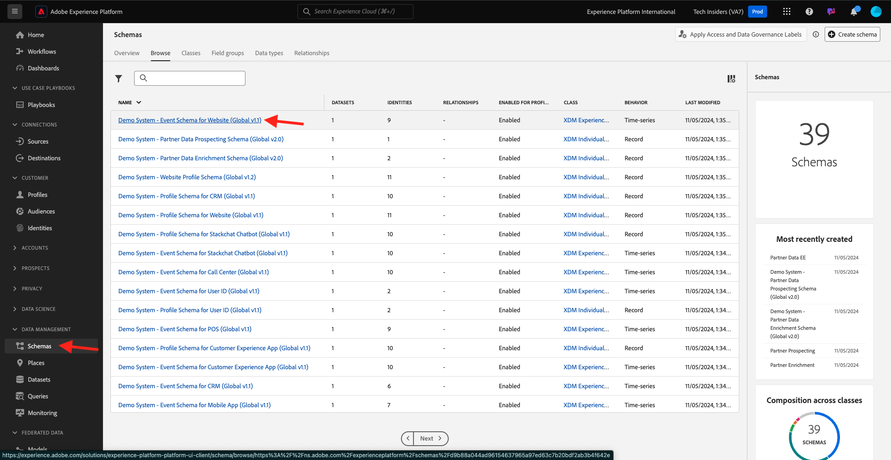

# Requisitos do esquema XDM do 1.1.7 no Adobe Experience Platform

Para garantir que o Web SDK possa assimilar dados na Adobe Experience Platform, há um requisito para que um mixin XDM específico faça parte do esquema XDM no Adobe Experience Platform.

Vá para [https://experience.adobe.com/platform](https://experience.adobe.com/platform) e faça logon.

Depois de fazer logon, selecione a sandbox apropriada clicando no texto **Produção** na linha azul na parte superior da tela. Selecione a sandbox `--aepSandboxName--`.

Depois de selecionar sua sandbox, você verá a alteração da tela e agora estará em sua sandbox.

No menu esquerdo, vá para **Esquemas** e abra o **Sistema de Demonstração - Esquema de Evento para o Site (Global v1.1)** Esquema.

Nesse esquema, você verá que o grupo de campos **AEP Web SDK ExperienceEvent** foi adicionado. Este grupo de campos adiciona todos os campos mínimos obrigatórios ao esquema. Todo esquema do evento de experiência no Adobe Experience Platform que será usado pelo Web SDK sempre exigirá que esse grupo de campos faça parte do esquema.

Em [Módulo 1.2 Assimilação de dados](./../dc1.2/data-ingestion.md), você aprenderá a adicionar grupos de campos a esquemas.

Próxima etapa:

## Próximas etapas

Retorne à [Instalação da Coleção de Dados da Adobe Experience Platform e da extensão de marca da Web SDK](./data-ingestion-launch-web-sdk.md){target="_blank"}

Voltar para [Todos os módulos](./../../../../overview.md){target="_blank"}
