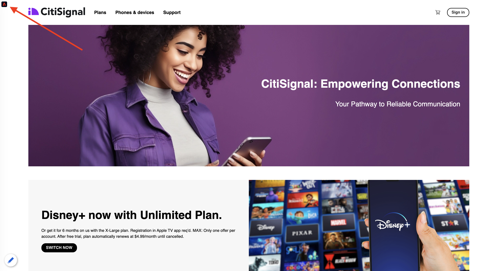
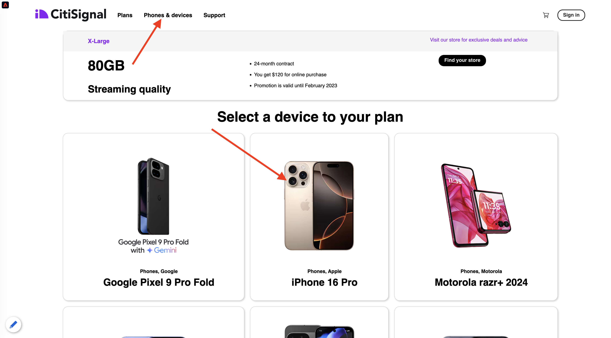

# 2.1.1 De desconhecido para conhecido no site

## Contexto

A jornada do desconhecido para o conhecido é um dos tópicos mais importantes entre as marcas atualmente, assim como a jornada do cliente, desde a aquisição até a retenção.

O Adobe Experience Platform desempenha um papel importante nessa jornada. Plataforma é o cérebro para a comunicação, o &quot;sistema de experiência do registro&quot;.

Plataforma é um ambiente no qual a palavra cliente é mais ampla do que apenas os clientes conhecidos. Um visitante desconhecido no site também é um cliente da perspectiva da Platform e, como tal, todo o comportamento como um visitante desconhecido também é enviado para a Platform. Graças a essa abordagem, quando esse visitante eventualmente se torna um cliente conhecido, uma marca também pode visualizar o que aconteceu antes desse momento. Isso ajuda de uma perspectiva de atribuição e otimização de experiência.

## Fluxo de jornada do cliente

Ir para [https://dsn.adobe.com](https://dsn.adobe.com). Depois de fazer logon com sua Adobe ID, você verá isso. Clique nos 3 pontos **...** do projeto do site e clique em **Executar** para abri-lo.

Você verá seu site de demonstração aberto. Selecione o URL e copie-o para a área de transferência.

Abra uma nova janela incógnita do navegador.

Cole o URL do site de demonstração que você copiou na etapa anterior. Você será solicitado a fazer logon usando sua Adobe ID.

Selecione o tipo de conta e conclua o processo de logon.

Em seguida, você verá seu site carregado em uma janela incógnita do navegador. Para cada exercício, será necessário usar uma janela do navegador nova e incógnita para carregar o URL do site de demonstração.

Clique no ícone do logotipo do Adobe no canto superior esquerdo da tela para abrir o Visualizador de perfis.

Consulte o painel Visualizador de perfis e o Perfil do cliente em tempo real com a **Experience Cloud ID** como o identificador principal para este cliente atualmente desconhecido.

Você também pode ver todos os Eventos de experiência que foram coletados com base no comportamento do cliente. A lista está vazia no momento, mas isso será alterado em breve.

Vá para a categoria de produto **Celulares e dispositivos**. Em seguida, clique no produto **iPhone 15 Pro**.

Você verá a página de detalhes do produto. Um Evento de Experiência do tipo **Exibição do Produto** foi enviado ao Adobe Experience Platform usando a implementação do Web SDK que você analisou no Módulo 1.

Abra o painel Visualizador de Provedores e veja seus **Eventos de experiência**.

Volte para a página de categoria **Telefones e dispositivos** e clique em outro produto. Outro evento de experiência foi enviado para o Adobe Experience Platform. Abra o painel Visualizador de perfis. Você verá dois Eventos de Experiência do tipo **Exibição do Produto**. Embora o comportamento seja anônimo, com o consentimento adequado em vigor, você pode rastrear cada clique e armazená-lo no Adobe Experience Platform. Assim que o cliente anônimo se tornar conhecido, poderemos unir todos os comportamentos anônimos automaticamente ao perfil conhecido.

Vá para a página Registro/Logon. Clique em **Fazer logon**.

Clique em **Criar uma conta**.

Preencha seus detalhes e clique em **Registrar**; depois disso, você será redirecionado para a página anterior.

Abra o painel Visualizador de perfis e vá para Perfil do cliente em tempo real. No painel Visualizador de perfis, você deve ver todos os seus dados pessoais exibidos, como emails recém-adicionados e identificadores de telefone.

No painel Visualizador de perfis, acesse Eventos de experiência. Você verá os dois produtos que visualizou antes no painel Visualizador de perfis. Ambos os eventos agora também estão conectados ao seu perfil &quot;conhecido&quot;.

Agora você assimilou dados na Adobe Experience Platform e vinculou esses dados a identificadores como ECIDs e endereços de email. O objetivo disso é entender o contexto de negócios do que você está prestes a fazer. No próximo exercício, você começará a configurar tudo o que precisa para tornar possível toda a assimilação de dados.

### Navegar pelo aplicativo móvel

Depois de se tornar um cliente conhecido, é hora de começar a usar o aplicativo móvel. Abra o aplicativo móvel no iPhone e faça logon no aplicativo.

Se você não tiver mais o aplicativo instalado ou se não conseguir lembrar como instalá-lo, confira aqui: [Usar o aplicativo móvel](../../../getting-started/gettingstarted/ex5.md)

Depois de instalar o aplicativo conforme instruído, você verá a página de aterrissagem do aplicativo com a marca Citi Signal carregada. Clique no ícone de conta na parte superior esquerda da tela.

Na tela de Login, faça login com o endereço de e-mail usado no site da área de trabalho. Clique em **Logon**.

Vá para a tela inicial do aplicativo e clique para abrir qualquer produto.

Você verá a página de detalhes do produto.

Vá para a tela inicial no aplicativo e deslize o dedo para a esquerda na tela para exibir o painel Visualizador de perfil. Você verá o produto que acabou de visualizar na seção **Eventos de experiência**, juntamente com todas as visualizações de produto da sessão de site anterior.

>[!NOTE]
>
>Pode levar alguns minutos para que você veja a exibição consolidada no aplicativo e no site.

Agora, volte para o computador desktop e atualize a página inicial, onde o produto também aparecerá.

>[!NOTE]
>
>Pode levar alguns minutos para que você veja a exibição consolidada no aplicativo e no site.

Agora você assimilou dados na Adobe Experience Platform e vinculou esses dados a identificadores como ECIDs e endereços de email. O objetivo desse exercício era entender o contexto de negócios do que você está prestes a fazer. Agora você criou efetivamente um perfil de cliente em tempo real entre dispositivos. No próximo exercício, você visualizará seu perfil no Adobe Experience Platform.

## Próximas etapas

Ir para [2.1.2 Visualizar seu próprio perfil de cliente em tempo real - IU](./ex2.md){target="_blank"}

Voltar para [Perfil de cliente em tempo real](./real-time-customer-profile.md){target="_blank"}

Voltar para [Todos os módulos](./../../../../overview.md){target="_blank"}
