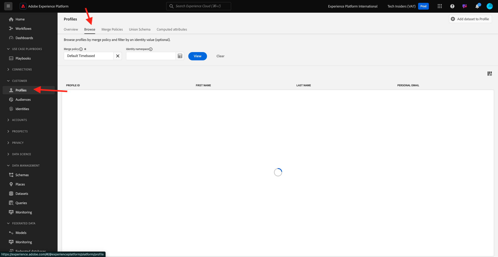
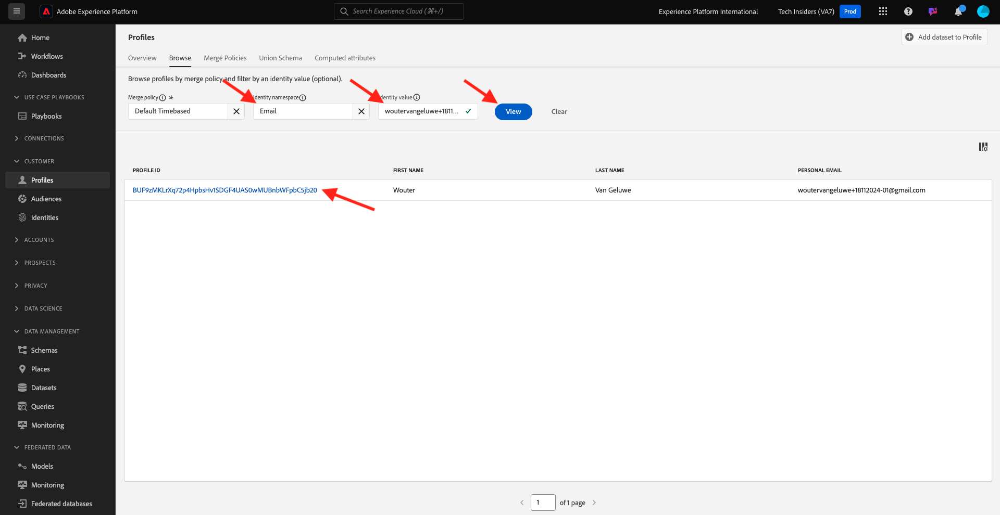

# 2.1.2 Visualizar seu próprio Perfil de cliente em tempo real - Interface do usuário

Neste exercício, você fará logon no Adobe Experience Platform e visualizará seu próprio Perfil de cliente em tempo real na interface do.

## Contexto

No Perfil do cliente em tempo real, todos os dados do perfil são mostrados junto com os dados do evento, bem como com as associações de segmento existentes. Os dados mostrados podem vir de qualquer lugar, de aplicativos Adobe e soluções externas. Essa é a visualização mais eficiente no Adobe Experience Platform, o verdadeiro sistema de experiência de registro.

## Usar a visualização de perfil do cliente no Adobe Experience Platform

Ir para [Adobe Experience Platform](https://experience.adobe.com/platform). Depois de fazer logon, você chegará à página inicial do Adobe Experience Platform.

Antes de continuar, você precisa selecionar uma **sandbox**. A sandbox a ser selecionada é chamada ``--aepSandboxName--``. Depois de selecionar a [!UICONTROL sandbox] apropriada, você verá a alteração da tela e agora estará na [!UICONTROL sandbox] dedicada.

No menu esquerdo, vá para **Perfis** e para **Procurar**.

No painel Visualizador de perfis do seu site, você pode encontrar várias identidades. Cada identidade está vinculada a um namespace.

No painel Visualizador de perfis, você pode ver estas combinações de IDs e Namespaces:

| Identidade | Namespace |
|:-------------:| :---------------:|
| Experience Cloud ID (ECID) | 79943948563923140522865572770524243489 |
| Experience Cloud ID (ECID) | 70559351147248820114888181867542007989 |
| ID de e-mail | woutervangeluwe+18112024-01@gmail.com |
| ID do número de celular | +32473622044+18112024-01 |

Com o Adobe Experience Platform, todas as IDs são igualmente importantes. Anteriormente, a ECID era a ID mais importante no contexto do Adobe e todas as outras IDs estavam vinculadas à ECID em uma relação hierárquica. Com o Adobe Experience Platform, esse não é mais o caso e cada ID pode ser considerada um identificador principal.

Normalmente, o identificador principal depende do contexto. Se você perguntar à Central de Atendimento, **Qual é a ID mais importante?** eles provavelmente responderão, **o número do telefone!** Mas se você perguntar à sua equipe de CRM, ela responderá: **o endereço de email!O** Adobe Experience Platform entende essa complexidade e a gerencia para você. Cada aplicativo, seja um aplicativo do Adobe Adobe ou não, falará com o Adobe Experience Platform referindo-se à ID que ele considera primária. E simplesmente funciona.

Para o campo **Namespace de identidade**, selecione **Email** e, para o campo **Valor de identidade**, insira o endereço de email usado para se registrar no exercício anterior. Clique em **Exibir**. Você verá seu perfil na lista. Clique na **ID do Perfil** para abrir seu perfil.

Você agora está vendo uma visão geral de alguns **Atributos do perfil** importantes do seu perfil de cliente. Para ver todos os atributos de perfil disponíveis para o seu perfil, clique em **Atributos**.

Você verá uma lista completa de todos os atributos.

Vá para **Eventos**, onde você pode ver entradas para cada evento de experiência vinculado ao seu Perfil.

Finalmente, vá para a opção de menu **Audience association**. Aqui, você encontrará todos os públicos-alvo qualificados para esse cliente. A lista pode estar vazia atualmente, mas isso será alterado nos próximos módulos.

Agora que você aprendeu a visualizar o perfil em tempo real de qualquer cliente usando a interface do usuário do Adobe Experience Platform, vamos fazer o mesmo por meio das APIs, usando o Postman e o Adobe I/O para consultar as APIs do Adobe Experience Platform.

## Próximas etapas

Vá para [2.1.3 Visualizar seu próprio perfil de cliente em tempo real - API](./ex3.md){target="_blank"}

Voltar para [Perfil de cliente em tempo real](./real-time-customer-profile.md){target="_blank"}

Voltar para [Todos os módulos](./../../../../overview.md){target="_blank"}
