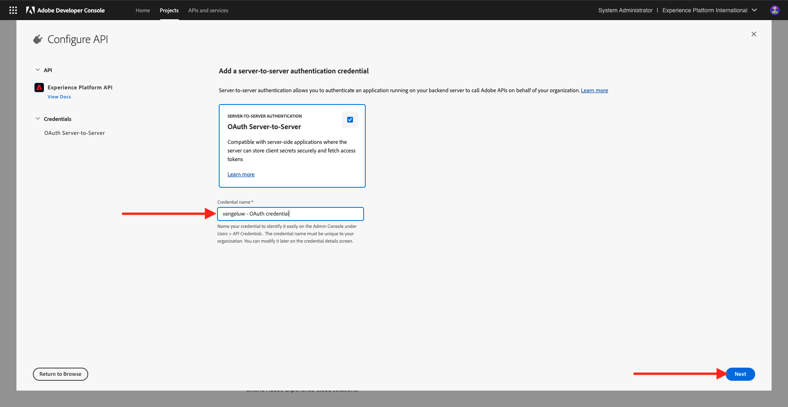
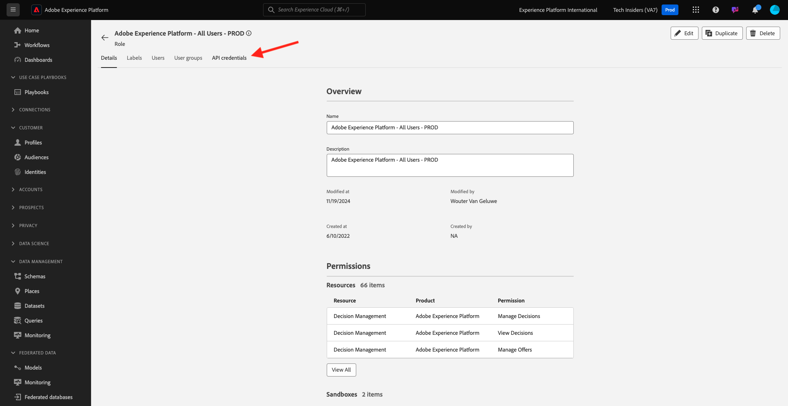
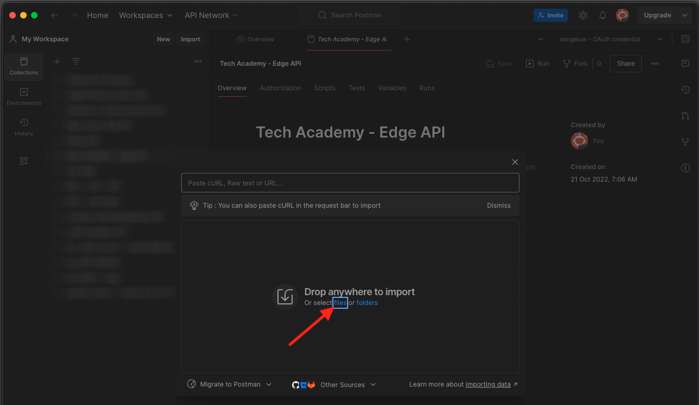
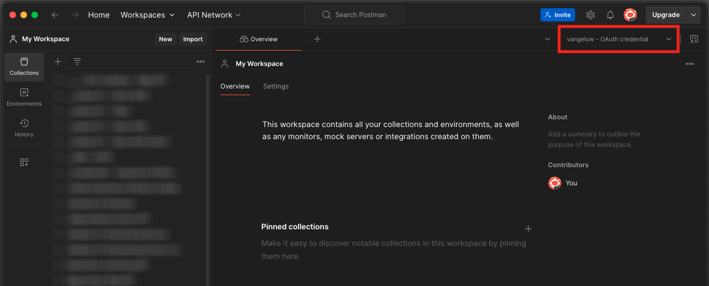
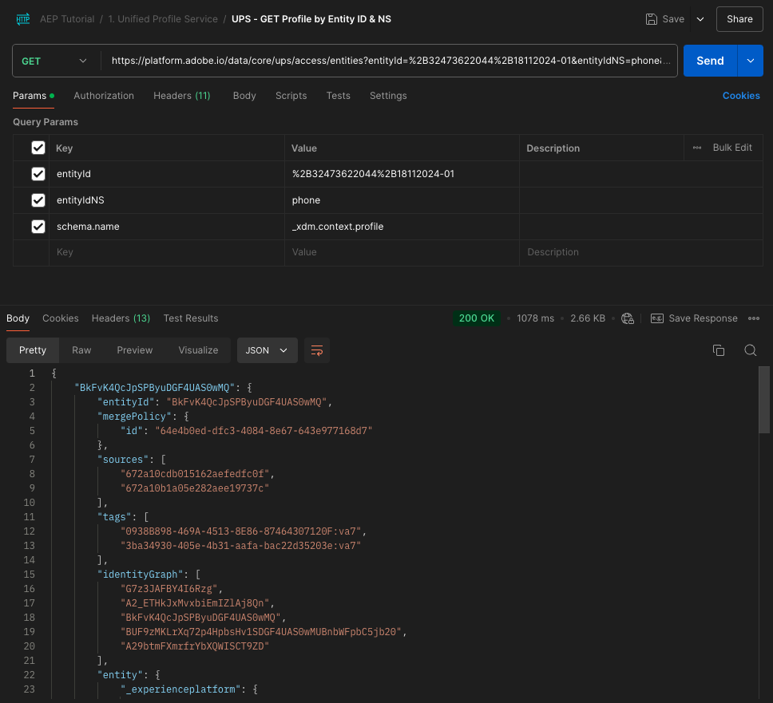
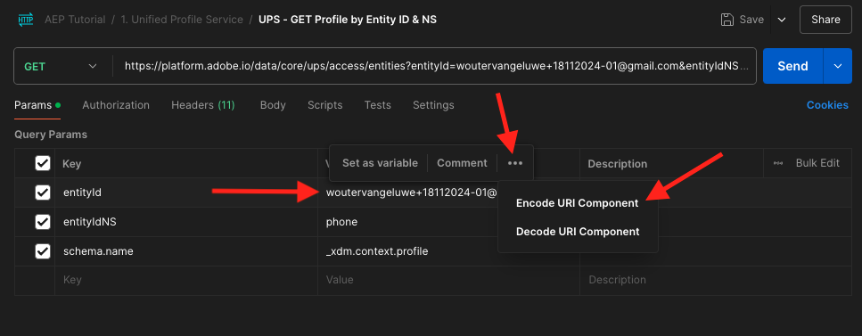
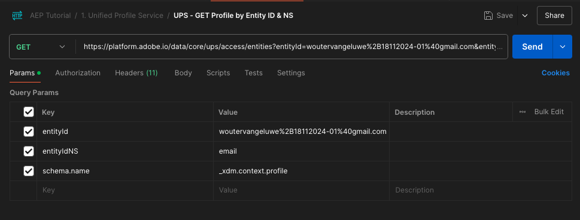
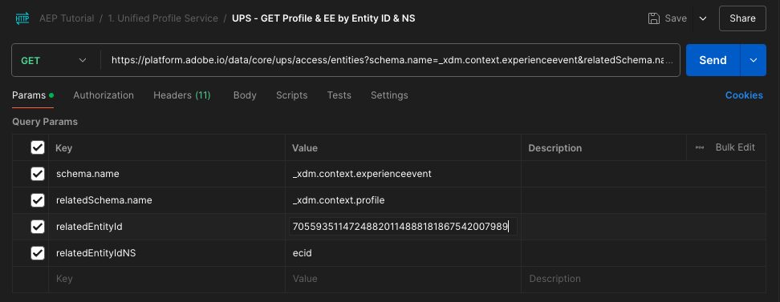

# 2.1.3 Visualizar seu próprio perfil de cliente em tempo real - API

Neste exercício, você usará o Postman e o Adobe I/O para consultar as APIs da Adobe Experience Platform e exibir seu próprio perfil do cliente em tempo real.

## Contexto

No Perfil do cliente em tempo real, todos os dados do perfil são mostrados junto com os dados do evento, bem como com as associações de público-alvo existentes. Os dados mostrados podem vir de qualquer lugar, de aplicativos Adobe e soluções externas. Essa é a visualização mais eficiente no Adobe Experience Platform, o sistema de experiência de registro.

O Perfil do cliente em tempo real pode ser consumido por todos os aplicativos da Adobe, mas também por soluções externas, como call centers ou aplicativos de clientela na loja. A maneira de fazer isso é conectar essas soluções externas às APIs do Adobe Experience Platform.

## Seus identificadores

No painel Visualizador de perfis no site, você pode encontrar várias identidades. Cada identidade está vinculada a um namespace.


No painel Raio X, podemos ver quatro combinações diferentes de IDs e Namespaces:

| Identidade | Namespace |
|:-------------:| :---------------:|
| Experience Cloud ID (ECID) | 79943948563923140522865572770524243489 |
| Experience Cloud ID (ECID) | 70559351147248820114888181867542007989 |
| ID de e-mail | woutervangeluwe+18112024-01@gmail.com |
| ID do número de celular | +32473622044+18112024-01 |

Lembrar desses identificadores na próxima etapa.

## Configurar o projeto do Adobe I/O

Neste exercício, você usará o Adobe I/O de forma bastante intensa para consultar as APIs da plataforma. Siga as etapas abaixo para configurar o Adobe I/O.

Ir para [https://developer.adobe.com/console/home](https://developer.adobe.com/console/home)


Selecione a instância correta do Adobe Experience Platform no canto superior direito da tela. Sua instância é `--aepImsOrgName--`. Clique em **Criar novo projeto**.


Selecione **+ Adicionar ao Projeto** e selecione **API**.


Você verá isto:


Selecione **API do Experience Platform** e clique em **Avançar**.


Agora vocês verão isto. Forneça um nome para a credencial: `--aepUserLdap-- - OAuth credential`. Clique em **Next**.



Em seguida, é necessário selecionar um perfil de produto que definirá quais permissões estão disponíveis para essa integração.

Selecione os Perfis de produto necessários.

>[!NOTE]
>
> Os nomes dos perfis de produtos variam na instância do Adobe Experience Platform, pois são específicos da instância. É necessário selecionar pelo menos um perfil de produto com os direitos de acesso adequados, que são configurados na Adobe Admin Console e na interface de permissões da AEP.

Clique em **Salvar API configurada**.


A integração do Adobe I/O está pronta.


Clique no botão **Baixar para Postman** e em **OAuth Server-to-Server** para baixar um ambiente do Postman (aguarde até que o ambiente seja baixado, isso pode levar alguns segundos).


Seu projeto IO atualmente tem um nome genérico. É necessário dar um nome amigável à integração. Clique em **Projeto X** (ou nome semelhante) conforme indicado


Clique em **Editar projeto**.


Insira um Nome e uma Descrição para sua integração: `--aepUserLdap-- AEP Tutorial`.

Clique em **Salvar**.


A integração do Adobe I/O foi concluída.


>[!NOTE]
>
>Há uma etapa adicional para garantir que esse projeto do Adobe I/O tenha acesso às configurações de permissão do Adobe Experience Platform. A credencial da API do seu projeto precisa ser adicionada à interface de permissões do Adobe Experience Platform, para a qual são necessários direitos de acesso de administrador do sistema. As etapas estão documentadas abaixo, mas talvez seja necessário entrar em contato com o administrador do sistema para que isso seja processado, caso você não tenha os direitos de acesso necessários.

## Permissões da AEP para credencial de API

>[!IMPORTANT]
>
>Se você não tiver direitos de acesso de Administrador do Sistema, não poderá executar essa etapa sozinho e não terá permissão para acessar a interface do usuário **Permissões**. Nesse caso, entre em contato com o administrador do sistema ou publique sua pergunta no canal de suporte da organização.

Ir para [Adobe Experience Platform](https://experience.adobe.com/platform). Depois de fazer logon, você chegará à página inicial do Adobe Experience Platform.

Vá para **Permissões**, para **Funções** e clique no perfil de produto relevante.

>[!NOTE]
>
> Os nomes dos perfis de produtos variam na instância do Adobe Experience Platform, pois são específicos da instância. É necessário selecionar pelo menos um perfil de produto com os direitos de acesso adequados, que são configurados na Adobe Admin Console e na interface de permissões da AEP.


Clique em **Credenciais da API**.



Clique em **+ Adicionar credenciais de API**.


Selecione o projeto Adobe I/O recém-criado e clique em **Salvar**.


## Autenticação para o Adobe I/O

>[!IMPORTANT]
>
>Se você for um funcionário da Adobe, siga as instruções aqui para usar o [PostBuster](./../../../../modules/getting-started/gettingstarted/ex8.md).

Ir para [https://www.postman.com/downloads/](https://www.postman.com/downloads/).

Baixe e instale a versão relevante do Postman para seu sistema operacional.


Após a instalação do Postman, inicie o aplicativo.

No Postman, há dois conceitos: Ambientes e Coleções.

- O Ambiente contém todas as variáveis de ambiente mais ou menos consistentes. No Ambiente, você encontrará informações como o IMSOrg do nosso ambiente de plataforma, além de credenciais de segurança como a sua Chave privada e outras. O arquivo de ambiente é o que você baixou durante a configuração do Adobe I/O no exercício anterior. Seu nome é assim: **`oauth_server_to_server.postman_environment.json`**.

- A coleção contém várias solicitações de API que podem ser usadas. Usaremos 2 coleções
   - 1 coleção para autenticação no Adobe I/O
   - 1 Coleta para os exercícios neste módulo
   - 1 coleção para os exercícios no módulo Real-Time CDP, para criação de destino

Baixe o arquivo [postman.zip](./../../../../assets/postman/postman_profile.zip) no desktop local.

Neste arquivo **postman.zip**, você encontrará os seguintes arquivos:

- `Adobe IO - OAuth.postman_collection.json`
- `AEP Tutorial.postman_collection.json`
- `Destination_Authoring_API.json`

Descompacte o arquivo **postman.zip** e armazene esses 3 arquivos em uma pasta na sua área de trabalho, juntamente com o ambiente Postman baixado da Adobe I/O. Você precisa ter estes 4 arquivos nessa pasta:


Volte para o Postman. Clique em **Importar**.


Clique em **arquivos**.



Navegue até a pasta na área de trabalho em que você extraiu os 4 arquivos baixados. Selecione estes 4 arquivos ao mesmo tempo e clique em **Abrir**.


Depois de clicar em **Abrir**, o Postman mostrará uma visão geral do Ambiente e das Coleções que você está prestes a importar. Clique em **Importar**.


Agora você tem tudo o que precisa no Postman para começar a interagir com o Adobe Experience Platform por meio das APIs.

A primeira coisa a fazer é verificar se você está autenticado corretamente. Para ser autenticado, é necessário solicitar um token de acesso.

Verifique se você selecionou o ambiente correto antes de executar qualquer solicitação. Você pode verificar o Ambiente selecionado no momento verificando a lista suspensa Ambiente no canto superior direito.

O Ambiente selecionado deve ter um nome semelhante a este, `--aepUserLdap-- OAuth Credential`.



O ambiente e as coleções do Postman agora estão configurados e funcionando. Agora você pode autenticar do Postman para o Adobe I/O.

Na coleção **Adobe IO - OAuth**, selecione a solicitação com o nome **POST - Obter Token de Acesso**. Clique em **Enviar**.


Após alguns segundos, você deve ver uma resposta exibida na seção **Body** do Postman:


Se a configuração tiver sido bem-sucedida, você verá uma resposta semelhante que contém as seguintes informações:

| Chave | Valor |
|:-------------:| :---------------:| 
| token_type | **portador** |
| access_token | **eyJhbGciOiJSU...jrNZ6mdaQ** |
| expires_in | **86399** |

O Adobe I/O forneceu um **bearer**-token, com um valor específico (o access_token muito longo) e uma janela de expiração.

O token que recebemos agora é válido por 24 horas. Isso significa que, após 24 horas, se você quiser usar o Postman para autenticar no Adobe I/O, precisará gerar um novo token executando essa solicitação novamente.

## API de perfil do cliente em tempo real, esquema: perfil

Agora você pode enviar sua primeira solicitação para as APIs de perfil do cliente em tempo real da plataforma.

No Postman, localize a coleção **Tutorial da AEP**.


Em **1. Serviço de Perfil Unificado**, clique na primeira solicitação com o nome **UPS - Perfil do GET por ID de Entidade &amp; NS**.


Para essa solicitação, há três variáveis necessárias:

| Chave | Valor | Definição |
|:-------------:| :---------------:| :---------------:| 
| entityId | **id** | a ID específica do cliente |
| entityIdNS | **namespace** | o namespace específico aplicável à ID |
| schema.name | **_xdm.context.profile** | o schema específico para o qual deseja receber informações |

Portanto, se você quiser solicitar que as APIs da Adobe Experience Platform forneçam todas as informações de perfil de sua própria ECID, será necessário configurar a solicitação da seguinte maneira:

| Chave | Valor |
|:-------------:| :---------------:| 
| entityId | **yourECID** |
| entityIdNS | **ecid** |
| schema.name | **_xdm.context.profile** |


Você também deve verificar os campos **Cabeçalho** - da sua solicitação. Ir para **Cabeçalhos**. Você verá isto:


>[!NOTE]
>
>É necessário especificar o nome da sandbox da Adobe Experience Platform que você está usando. Seu x-sandbox-name deve ser `--aepSandboxName--`.

| Chave | Valor |
| ----------- | ----------- |
| x-sandbox-name | `--aepSandboxName--` |


Depois de verificar o nome da sandbox, clique em **Enviar** para enviar sua solicitação à Platform.

Você deve obter uma resposta imediata da Platform, mostrando algo como isto:


Esta é a resposta completa da Platform:

```javascript
{
    "A2_ETHkJxMvxbiEmIZlAj8Qn": {
        "entityId": "A2_ETHkJxMvxbiEmIZlAj8Qn",
        "mergePolicy": {
            "id": "64e4b0ed-dfc3-4084-8e67-643e977168d7"
        },
        "sources": [
            "672a10cdb015162aefedfc0f",
            "672a10b1a05e282aee19737c"
        ],
        "tags": [
            "0938B898-469A-4513-8E86-87464307120F:va7",
            "3ba34930-405e-4b31-aafa-bac22d35203e:va7"
        ],
        "identityGraph": [
            "G7z3JAFBY4I6Rzg",
            "A2_ETHkJxMvxbiEmIZlAj8Qn",
            "BkFvK4QcJpSPByuDGF4UAS0wMQ",
            "BUF9zMKLrXq72p4HpbsHv1SDGF4UAS0wMUBnbWFpbC5jb20",
            "A29btmFXmrfrYbXQWISCT9ZD"
        ],
        "entity": {
            "_experienceplatform": {
                "identification": {
                    "core": {
                        "ecid": "79943948563923140522865572770524243489",
                        "phoneNumber": "+32473622044+18112024-01",
                        "email": "woutervangeluwe+18112024-01@gmail.com"
                    }
                }
            },
            "userAccount": {
                "ID": "3688250"
            },
            "pushNotificationDetails": [
                {
                    "denylisted": false,
                    "token": "2E0945F186CE5ED8CBFD1EB519A8CF38BA2B28A67FB381D45AA15EE37D289214",
                    "identity": {
                        "namespace": {
                            "code": "ECID"
                        },
                        "id": "70559351147248820114888181867542007989"
                    },
                    "platform": "apns",
                    "appID": "com.adobe.demosystem.dxdemo"
                }
            ],
            "personalEmail": {
                "address": "woutervangeluwe+18112024-01@gmail.com"
            },
            "_repo": {
                "createDate": "2024-11-18T10:39:12.296Z"
            },
            "extSourceSystemAudit": {
                "lastUpdatedDate": "2024-11-19T07:46:52.001Z"
            },
            "testProfile": true,
            "mobilePhone": {
                "number": "+32473622044"
            },
            "consents": {
                "metadata": {
                    "time": "2024-11-19T07:46:52.001Z"
                },
                "idSpecific": {
                    "ECID": {
                        "70559351147248820114888181867542007989": {
                            "collect": {
                                "val": "y"
                            }
                        }
                    }
                }
            },
            "person": {
                "name": {
                    "lastName": "Van Geluwe",
                    "firstName": "Wouter"
                }
            },
            "userActivityRegions": {
                "IRL1": {
                    "captureTimestamp": "2024-11-19T07:46:51.239Z"
                }
            },
            "identityMap": {
                "ecid": [
                    {
                        "id": "70559351147248820114888181867542007989"
                    },
                    {
                        "id": "79943948563923140522865572770524243489"
                    }
                ],
                "email": [
                    {
                        "id": "woutervangeluwe+18112024-01@gmail.com"
                    }
                ],
                "phone": [
                    {
                        "id": "+32473622044+18112024-01"
                    }
                ],
                "userid": [
                    {
                        "id": "3688250"
                    }
                ]
            }
        },
        "lastModifiedAt": "2024-11-19T07:47:23Z"
    }
}
```

Atualmente, todos os dados de Perfil disponíveis na Plataforma para esta ECID.

Você não é obrigado a usar a ECID para solicitar dados de perfil do Perfil do cliente em tempo real da plataforma. Você pode usar qualquer ID em qualquer namespace para solicitar esses dados.

Vamos voltar para a Postman e fingir que somos a central de atendimento, e enviar uma solicitação para a Platform especificando o namespace do **Telefone** e seu número de celular.

Portanto, se você quiser solicitar que as APIs da Platform forneçam todas as informações de perfil de um telefone específico, será necessário configurar a solicitação da seguinte maneira:

| Chave | Valor |
|:-------------:| :---------------:| 
| entityId | **seu telefone** |
| entityIdNS | **telefone** (substituir ecid por telefone) |
| schema.name | **_xdm.context.profile** |

Se o seu número de telefone contiver símbolos especiais como **+**, você precisará selecionar seu número de telefone completo, clicar com o botão direito do mouse e clicar em **EncodeURIComponent**.


Você terá isto:


Você também deve verificar os campos **Cabeçalho** - da sua solicitação. Ir para **Cabeçalhos**. Você verá isto:


>[!NOTE]
>
>É necessário especificar o nome da sandbox da Adobe Experience Platform que você está usando. Seu x-sandbox-name deve ser `--aepSandboxName--`.

| Chave | Valor |
| ----------- | ----------- |
| x-sandbox-name | `--aepSandboxName--` |


Clique em **Enviar** e verifique a resposta. Você verá que é a mesma de antes quando estava usando a ECID como identidade.



Vamos fazer o mesmo com seu endereço de email especificando o namespace do **email** e seu endereço de email.

Portanto, se você quiser solicitar que as APIs da Platform forneçam todas as informações de perfil de um endereço de email específico, será necessário configurar a solicitação da seguinte maneira:

| Chave | Valor |
|:-------------:| :---------------:| 
| entityId | **seu email** |
| entityIdNS | **email** (substituir Telefone por email) |
| schema.name | **_xdm.context.profile** |

Se seu endereço de email contiver símbolos especiais como **+**, você precisará selecionar seu endereço de email completo, clicar com o botão direito do mouse e clicar em **EncodeURIComponent**.



Você terá isto:



Você também deve verificar os campos **Cabeçalho** - da sua solicitação. Ir para **Cabeçalhos**. Você verá isto:

>[!NOTE]
>
>É necessário especificar o nome da sandbox da Adobe Experience Platform que você está usando. Seu x-sandbox-name deve ser `--aepSandboxName--`.


| Chave | Valor |
| ----------- | ----------- |
| x-sandbox-name | `--aepSandboxName--` |

Clique em **Enviar** e verifique a resposta. Você verá novamente que é o mesmo de antes com ECID e número de telefone.


Esse é um tipo muito importante de flexibilidade oferecida às marcas. Isso significa que qualquer ambiente pode enviar uma solicitação para a Platform, usando sua própria ID e namespace, sem precisar entender a complexidade de vários namespaces e IDs.

Como exemplo:

- a Central de Atendimento pode solicitar dados da Plataforma usando o namespace **telefone**
- o Sistema de Fidelidade pode solicitar dados da Platform usando o namespace **email**
- os aplicativos online podem usar o namespace **ecid**

A central de atendimento não sabe necessariamente que tipo de identificador é usado no Sistema de fidelidade e o Sistema de fidelidade não sabe necessariamente que tipo de identificador é usado por aplicativos online. Cada sistema individual pode usar as informações que tem e que entende para obter as informações de que precisa, quando precisa.

## API de perfil do cliente em tempo real, esquema: Profile e ExperienceEvent

Depois de consultar com êxito as APIs da plataforma para obter dados de perfil, vamos fazer o mesmo com os dados do ExperienceEvent.

No Postman, localize a coleção **Tutorial da AEP**.


Em **1. Serviço de Perfil Unificado**, selecione a segunda solicitação com o nome **UPS - GET Profile &amp; EE por ID de Entidade &amp; NS**.


Para essa solicitação, há quatro variáveis necessárias:

| Chave | Valor | Definição |
|:-------------:| :---------------:|  :---------------:| 
| schema.name | **_xdm.context.experienceevent** | o schema específico para o qual deseja receber informações. Nesse caso, estamos procurando dados que são mapeados em relação ao esquema ExperienceEvent. |
| relatedSchema.name | **_xdm.context.profile** | Enquanto estamos procurando dados mapeados em relação ao esquema ExperienceEvent, precisamos especificar uma identidade para a qual queremos receber esses dados. O esquema que tem acesso à identidade é o Perfil-esquema, então o relacionado Esquema aqui é o Perfil-esquema. |
| relatedEntityId | **id** | a ID específica do cliente |
| relatedEntityIdNS | **namespace** | o namespace específico aplicável à ID |

Portanto, se você quiser solicitar que as APIs da Platform forneçam todas as informações de perfil de sua própria ECID, será necessário configurar a solicitação da seguinte maneira:

| Chave | Valor |
|:-------------:| :---------------:| 
| schema.name | **_xdm.context.experienceevent** |
| relatedSchema.name | **_xdm.context.profile** |
| relatedEntityId | **yourECID** |
| relatedEntityIdNS | **ecid** |



Você também deve verificar os campos **Cabeçalho** - da sua solicitação. Ir para **Cabeçalhos**. Você verá isto:


>[!NOTE]
>
>É necessário especificar o nome da sandbox da Adobe Experience Platform que você está usando. Seu x-sandbox-name deve ser `--aepSandboxName--`.

| Chave | Valor |
| ----------- | ----------- |
| x-sandbox-name | `--aepSandboxName--` |

Clique em **Enviar** para enviar sua solicitação à Platform.

Você deve obter uma resposta imediata da Platform, mostrando algo como isto:


Abaixo está a resposta completa da Platform. Neste exemplo, há oito ExperienceEvents vinculados à ECID desse cliente. Observe os itens abaixo para ver as diferentes variáveis na solicitação, pois o que você vê abaixo é a consequência direta da sua configuração no Launch em exercícios anteriores.

Além disso, quando o painel Raio X mostra informações do ExperienceEvent, ele está usando a carga abaixo para analisar e recuperar as informações, como Nome do produto (procure por productName na carga abaixo) e URL da imagem do produto (procure por productImageUrl na carga abaixo).

```javascript
{
    "_page": {
        "orderby": "timestamp",
        "start": "b1325606-9b96-4e51-b7dd-73aacf527c72-0",
        "count": 14,
        "next": ""
    },
    "children": [
        {
            "relatedEntityId": "A2_ETHkJxMvxbiEmIZlAj8Qn",
            "entityId": "b1325606-9b96-4e51-b7dd-73aacf527c72-0",
            "sourceId": "672a10b1074ceb2af0aa7034",
            "timestamp": 1731923802848,
            "entity": {
                "environment": {
                    "ipV4": "141.134.241.99",
                    "type": "browser",
                    "browserDetails": {
                        "userAgentClientHints": {
                            "mobile": false,
                            "platform": "macOS",
                            "brands": [
                                {
                                    "brand": "Chromium",
                                    "version": "130"
                                },
                                {
                                    "brand": "Google Chrome",
                                    "version": "130"
                                },
                                {
                                    "brand": "Not?A_Brand",
                                    "version": "99"
                                }
                            ]
                        },
                        "userAgent": "Mozilla/5.0 (Macintosh; Intel Mac OS X 10_15_7) AppleWebKit/537.36 (KHTML, like Gecko) Chrome/130.0.0.0 Safari/537.36",
                        "viewportHeight": 992,
                        "viewportWidth": 1920
                    }
                },
                "web": {
                    "webPageDetails": {
                        "name": "Home",
                        "viewName": "Home",
                        "pageViews": {
                            "value": 1
                        },
                        "URL": "https://dsn.adobe.com/web/vangeluw-QIMU"
                    },
                    "webReferrer": {
                        "URL": "https://auth.services.adobe.com/"
                    }
                },
                "_experienceplatform": {
                    "interactionDetails": {
                        "core": {
                            "channel": "web"
                        }
                    },
                    "demoEnvironment": {
                        "brandName": "vangeluw-QIMU"
                    },
                    "identification": {
                        "core": {
                            "ecid": "79943948563923140522865572770524243489"
                        }
                    }
                },
                "implementationDetails": {
                    "name": "https://ns.adobe.com/experience/alloy/reactor",
                    "version": "2.24.0+2.27.0",
                    "environment": "browser"
                },
                "identityMap": {
                    "ECID": [
                        {
                            "id": "79943948563923140522865572770524243489",
                            "authenticatedState": "ambiguous",
                            "primary": true
                        }
                    ]
                },
                "eventType": "web.webpagedetails.pageViews",
                "_id": "b1325606-9b96-4e51-b7dd-73aacf527c72-0",
                "placeContext": {
                    "localTime": "2024-11-18T10:56:42.848+01:00",
                    "localTimezoneOffset": -60
                },
                "device": {
                    "screenOrientation": "landscape",
                    "screenWidth": 1920,
                    "screenHeight": 1080
                },
                "timestamp": "2024-11-18T09:56:42.848Z"
            },
            "lastModifiedAt": "2024-11-18T09:56:45Z"
        },
    "_links": {
        "next": {
            "href": ""
        }
    }
}
```

Atualmente, todos os dados ExperienceEvent disponíveis na Platform para esta ECID.

Você não precisa usar a ECID para solicitar dados do ExperienceEvent do Perfil em tempo real da Adobe Experience Platform. Você pode usar qualquer ID em qualquer namespace para solicitar esses dados.

## Próximas etapas

Ir para [2.1.4 Criar um público-alvo - IU](./ex4.md){target="_blank"}

Voltar para [Perfil de cliente em tempo real](./real-time-customer-profile.md){target="_blank"}

Voltar para [Todos os módulos](./../../../../overview.md){target="_blank"}
