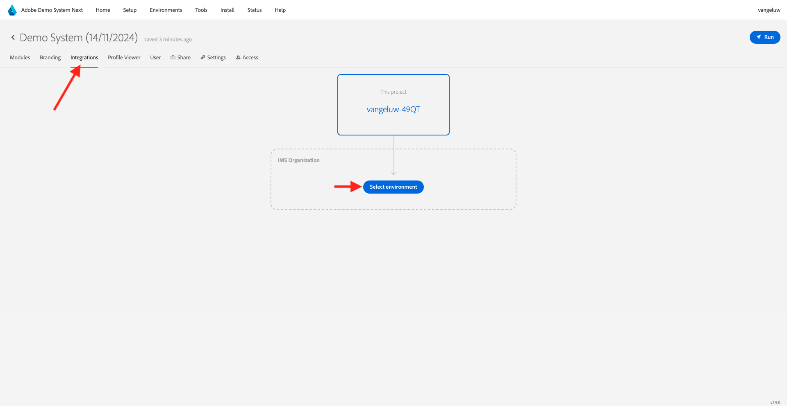

# 2.1.5 Veja seu Perfil de cliente em tempo real em ação na central de atendimento

Neste exercício, o objetivo é fazer você percorrer a jornada do cliente e agir como um cliente real.

Neste site, implementamos o Adobe Experience Platform. Cada ação é considerada um evento de experiência e é enviada para a Adobe Experience Platform em tempo real, hidratando o Perfil do cliente em tempo real.

Em um exercício anterior, você começou como um cliente anônimo que estava navegando no site e, após algumas etapas, você se tornou um cliente conhecido.

Quando o mesmo cliente eventualmente atende o telefone e liga para a central de atendimento, é fundamental que as informações de outros canais sejam disponibilizadas imediatamente, para que a experiência da central de atendimento possa ser relevante e personalizada.

## Use seu aplicativo CX

Ir para [https://dsn.adobe.com](https://dsn.adobe.com). Depois de fazer logon com sua Adobe ID, você verá isso. Clique nos 3 pontos **...** no projeto do aplicativo CX e clique em **Editar** para abri-lo.

No projeto do aplicativo CX, acesse **Integrações**. Clique em **Selecionar ambiente**.

Selecione a propriedade Coleção de dados do Adobe Experience Platform que foi criada em Introdução. É necessário selecionar a propriedade que tem **(cx-app)** em seu nome.

Você verá isso. Clique em **Executar**.

Em seguida, selecione uma de suas identidades e o namespace correspondente e clique no **ícone de pesquisa**.

| Identidade | Namespace |
|:-------------:| :---------------:|
| Experience Cloud ID (ECID) | 79943948563923140522865572770524243489 |
| Experience Cloud ID (ECID) | 70559351147248820114888181867542007989 |
| ID de e-mail | woutervangeluwe+18112024-01@gmail.com |
| ID do número de celular | +32473622044+18112024-01 |

Agora você verá as informações que seriam exibidas na central de atendimento, para que os agentes da central de atendimento tenham todas as informações relevantes disponíveis imediatamente ao conversar com um cliente.

## Próximas etapas

Ir para [Resumo e benefícios](./summary.md){target="_blank"}

Voltar para [Perfil de cliente em tempo real](./real-time-customer-profile.md){target="_blank"}

Voltar para [Todos os módulos](./../../../../overview.md){target="_blank"}
