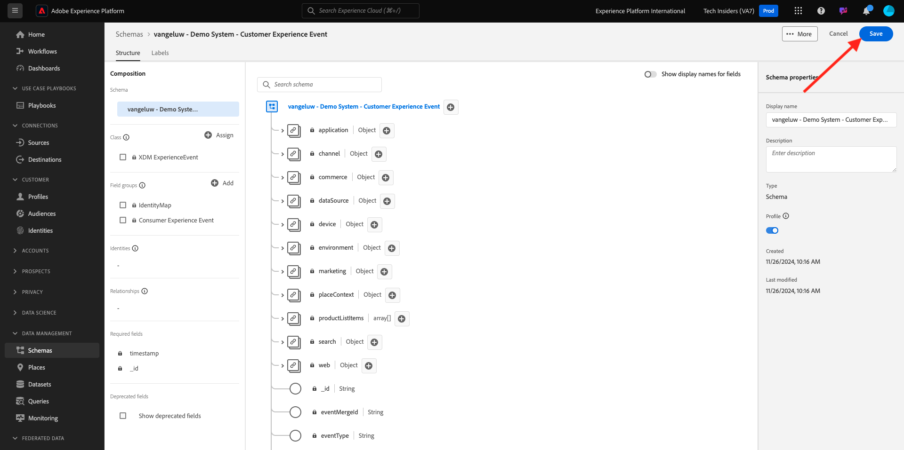
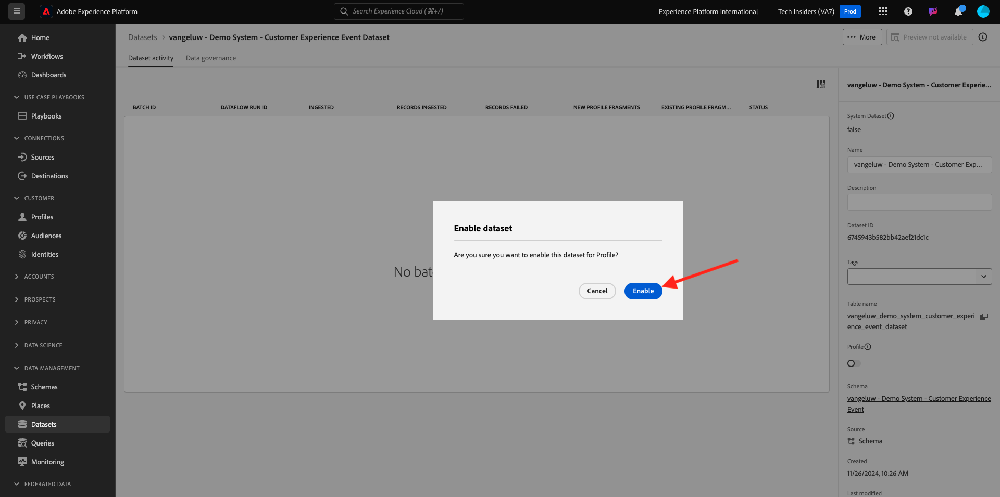

# 2.2.1 IA do cliente: preparação de dados (assimilação)

Para que os Serviços inteligentes descubram insights dos dados de eventos de marketing, os dados devem ser semanticamente enriquecidos e mantidos em uma estrutura padrão. Para isso, os Serviços inteligentes aproveitam os esquemas do Experience Data Model (XDM) da Adobe.
Especificamente, todos os conjuntos de dados usados em Serviços inteligentes devem estar em conformidade com o esquema XDM do **Evento de experiência do consumidor**.

## Criar esquema

Neste exercício, você criará um esquema que contém o **mixin do Evento de Experiência do Consumidor**, que é exigido pelo Serviço Inteligente da **IA do Cliente**.

Faça logon no Adobe Experience Platform acessando esta URL: [https://experience.adobe.com/platform](https://experience.adobe.com/platform).

Depois de fazer logon, você chegará à página inicial do Adobe Experience Platform.

Antes de continuar, você precisa selecionar uma **sandbox**. A sandbox a ser selecionada é chamada ``--aepSandboxName--``. Depois de selecionar a sandbox apropriada, você verá a alteração da tela e agora estará em sua sandbox dedicada.

No menu esquerdo, clique em **Esquemas** e vá para **Procurar**. Clique em **Criar Esquema**.

Na janela pop-up, selecione **Manual** e clique em **Selecionar**.

Em seguida, selecione **Evento de experiência** e clique em **Avançar**.

É necessário fornecer um nome para o esquema agora. Como o nome do nosso esquema, use este: `--aepUserLdap-- - Demo System - Customer Experience Event` e clique em **Concluir**.

Você verá isso. Clique em **+ Adicionar** em Grupos de campos.

Pesquise e selecione os **Grupos de Campos** a seguir para adicionar a este Esquema:

- Evento de experiência do consumidor

- IdentityMap

Clique em **Adicionar grupos de campos**.

Você verá isso. Em seguida, selecione o nome do schema. Agora você deve habilitar seu esquema para o **Perfil**, clicando na opção **Perfil**.

Você verá isso. Marque a caixa de seleção de **Os dados deste esquema conterão uma identidade primária no campo identityMap.**. Clique em **Habilitar**.

Agora você deve ter isso. Clique em **Salvar** para salvar seu esquema.

## Criar conjunto de dados

No menu esquerdo, clique em **Conjuntos de Dados** e vá para **Procurar**. Clique em **Criar conjunto de dados**.

Clique em **Criar conjunto de dados do esquema**.

Na próxima tela, selecione o conjunto de dados criado no exercício anterior, denominado `--aepUserLdap-- - Demo System - Customer Experience Event`. Clique em **Next**.

Como um nome para seu conjunto de dados, use `--aepUserLdap-- - Demo System - Customer Experience Event Dataset`. Clique em **Concluir**.

Seu conjunto de dados foi criado. Habilitar a alternância **Perfil**.

Clique em **Habilitar**.

Agora você deve ter:

Agora você está pronto para começar a assimilar dados do Evento de experiência do consumidor e começar a usar o serviço de IA do cliente.

## Baixar dados de teste do Evento de experiência

Depois que o **Esquema** e o **Conjunto de dados** estiverem configurados, você estará pronto para assimilar dados do Evento de Experiência. Como a IA do cliente exige que o tenha requisitos de dados específicos, você precisará assimilar dados preparados externamente.

Os dados preparados para os eventos de experiência neste exercício devem estar em conformidade com os requisitos e o esquema do [Grupo de Campos XDM de Evento de Experiência do Consumidor](https://github.com/adobe/xdm/blob/797cf4930d5a80799a095256302675b1362c9a15/docs/reference/context/experienceevent-consumer.schema.md).

Baixe o arquivo zip com dados de demonstração deste local: [https://tech-insiders.s3.us-west-2.amazonaws.com/CUSTOM-CAI-EVENTS-WEB.zip](https://tech-insiders.s3.us-west-2.amazonaws.com/CUSTOM-CAI-EVENTS-WEB.zip).

Você baixou um arquivo chamado **CUSTOM-CAI-EVENTS-WEB.zip**. Coloque o arquivo na área de trabalho do seu computador e descompacte-o, e você verá uma pasta chamada **CUSTOM-CAI-EVENTS-WEB**.

Nessa pasta, você encontrará vários arquivos json sequenciados, que precisam ser assimilados no próximo exercício.

## Assimilar dados de teste do Evento de experiência

No Adobe Experience Platform, vá para **Conjuntos de Dados** e abra seu conjunto de dados, denominado **[!UICONTROL ldap - Sistema de demonstração - Conjunto de Dados de Eventos de Experiência do Cliente]**.

No seu conjunto de dados, clique em **Escolher arquivos** para adicionar dados.

Na janela pop-up, selecione os arquivos **WEBSITE-EE-1.json** até **WEBSITE-EE-5.json** e clique em **Abrir**.

Repita esse processo de assimilação para os arquivos **WEBSITE-EE-6.json** e **WEBSITE-EE-7.json**.

Você verá os dados sendo importados e um novo lote será criado no estado **Carregando**. Não saia desta página até que o arquivo seja carregado.

Após carregar o arquivo, você verá a alteração do status do lote de **Carregando** para **Processando**.

A assimilação e o processamento de dados podem levar de 10 a 20 minutos.

Quando a assimilação de dados for bem-sucedida, o status do lote dos vários uploads será alterado para **Sucesso**.

## Próximas etapas

Ir para a API do Cliente do [2.2.2 - Criar uma Nova Instância (Configurar)](./ex2.md){target="_blank"}

Volte para os [Serviços inteligentes](./intelligent-services.md){target="_blank"}

Voltar para [Todos os módulos](./../../../../overview.md){target="_blank"}
