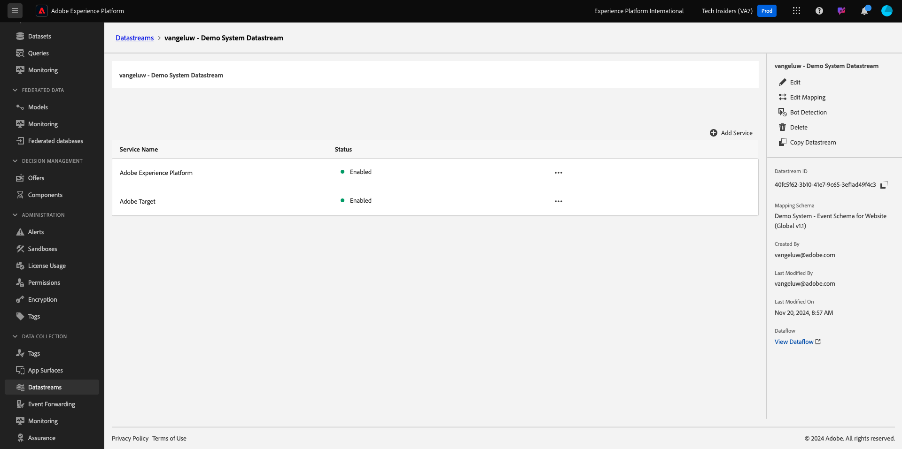
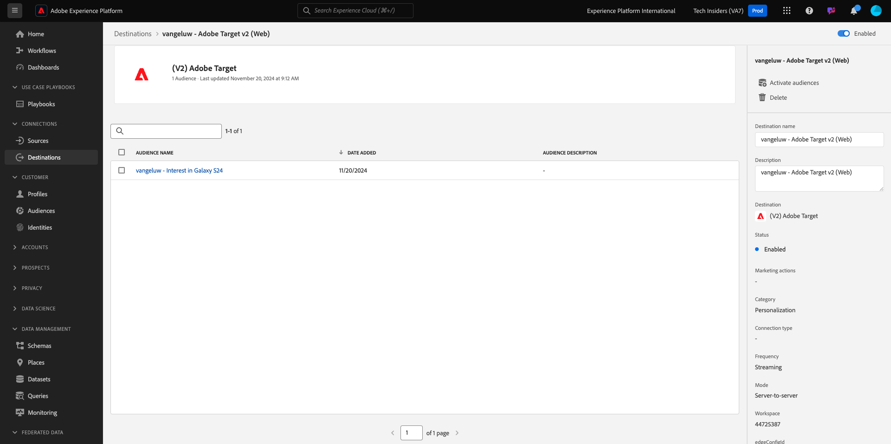
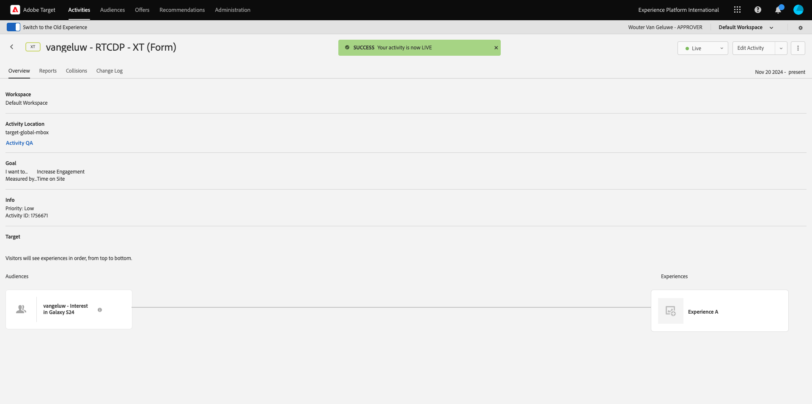

# 2.3.5 Realizar ação: enviar o público-alvo para a Adobe Target

Ir para [Adobe Experience Platform](https://experience.adobe.com/platform). Depois de fazer logon, você chegará à página inicial do Adobe Experience Platform.


Antes de continuar, você precisa selecionar uma **sandbox**. A sandbox a ser selecionada é chamada ``--aepSandboxName--``. Depois de selecionar a [!UICONTROL sandbox] apropriada, você verá a alteração da tela e agora estará na [!UICONTROL sandbox] dedicada.


## Verificar o fluxo de dados

O destino do Adobe Target no Real-Time CDP é conectado ao fluxo de dados usado para assimilar dados na rede de borda da Adobe. Se quiser configurar o destino do Adobe Target, primeiro verifique se o fluxo de dados já está ativado para o Adobe Target. Seu datastream foi configurado no [Exercício 0.2 Criar seu Datastream](./../../../modules/../getting-started/gettingstarted/ex2.md) e foi nomeado como `--aepUserLdap-- - Demo System Datastream`.

No menu esquerdo, role para baixo e clique em **Datastreams**. Em Datastreams, pesquise por seu datastream chamado `--aepUserLdap-- - Demo System Datastream`. Clique na sequência de dados para abri-la.


Você verá isto, clique em **...** ao lado de **Adobe Experience Platform** e em **Editar**.


Marque as caixas de seleção para **Segmentação do Edge** e **Destinos do Personalization**. Clique em **Salvar**.


Em seguida, clique em **+ Adicionar Serviço**.


Selecione o serviço **Adobe Target**. Clique em **Salvar**.


A sequência de dados agora está configurada para o Adobe Target.



## Configurar o destino do Adobe Target

O Adobe Target está disponível como um destino no Real-Time CDP. Para configurar sua integração com o Adobe Target, vá para **Destinos**, para **Catálogo**.

Clique em **Personalization** no menu **Categorias**. Você verá o cartão de destino **(v2) do Adobe Target**.


Clique em **Conectar ao destino**.


Você verá isso. Se precisar criar seu próprio destino do Adobe Target, siga estas diretrizes:

- Nome: use o nome `--aepUserLdap-- - Adobe Target v2  (Web)`.
- ID da sequência de dados: é necessário selecionar a sequência de dados configurada no [Exercício 0.2 Criar sequência de dados](./../../../modules/../getting-started/gettingstarted/ex2.md). O nome da sequência de dados deve ser: `--aepUserLdap-- - Demo System Datastream`.
- Workspace: está relacionado aos espaços de trabalho do Adobe Target. Se não houver um espaço de trabalho específico que você precise usar, selecione **Workspace Padrão**.

Clique em **Next**.


Agora, é possível selecionar uma política de governança de dados. Clique em **Next**.


Na lista de públicos disponíveis, selecione o público criado no exercício anterior [Criar um público](./ex1.md), denominado `--aepUserLdap-- - Interest in Galaxy S24`. Em seguida, clique em **Avançar**.


Na tela **Mapeamento**, você pode mapear atributos de perfil para ficarem disponíveis no Adobe Target. Isso ajuda você a adicionar uma camada extra de personalização ao seu site. Clique em **Adicionar novo campo**.


Para o novo campo, selecione o campo **person.name.firstName**. Clique em **Salvar**.


Então você terá isto. Clique em **Next**.


Clique em **Concluir**.


Seu público-alvo agora está ativado para o Adobe Target.



>[!IMPORTANT]
>
>Quando você acaba de criar seu destino do Adobe Target no Real-Time CDP, pode levar até uma hora para o destino ficar ativo. Esse é um tempo de espera único, devido à definição da configuração de back-end. Quando o tempo de espera inicial de uma hora e a configuração de backend forem concluídos, os públicos-alvo recém-adicionados enviados ao destino do Adobe Target estarão disponíveis para direcionamento em tempo real.

## Configurar a atividade baseada em formulário do Adobe Target

Agora que seu público-alvo do Real-Time CDP está configurado para ser enviado para o Adobe Target, você pode configurar sua atividade de Direcionamento de experiência no Adobe Target. Neste exercício, você configurará uma atividade baseada em formulário.

Vá para a página inicial do Adobe Experience Cloud em [https://experiencecloud.adobe.com/](https://experiencecloud.adobe.com/). Clique em **Target** para abri-lo.


Na página inicial do **Adobe Target**, você verá todas as atividades existentes. Clique em **Criar atividade** e em **Direcionamento de experiência**.


Selecione **Web**, **Formulário** e **Nenhuma Restrição de Propriedade**. Clique em **Criar**.


Agora você está no compositor de atividades baseado em formulários.


Para o campo **LOCATION 1**, selecione **target-global-mbox**.


O público-alvo padrão é atualmente **Todos os visitantes**. Clique nos **3 pontos** ao lado de **Todos os visitantes** e clique em **Alterar público**.


Você está vendo a lista de públicos-alvo disponíveis, e o público-alvo da Adobe Experience Platform criado anteriormente e enviado para o Adobe Target agora faz parte dessa lista. Selecione o público criado anteriormente no Adobe Experience Platform. Clique em **Atribuir público**.


Seu público-alvo do Adobe Experience Platform agora faz parte dessa atividade de direcionamento de experiência.


Agora vamos alterar a Imagem do Herói na página inicial do site. Clique para abrir a lista suspensa ao lado de **Conteúdo padrão** e clique em **Criar oferta do HTML**.


Cole o código a seguir.

```javascript
<script>document.querySelector("#SpectrumProvider > div.App > div > div.Page.home > main > div.Banner.Banner--alignment-right.Banner--verticalAlignment-middle.main-banner > div.Image > img").src="https://tech-insiders.s3.us-west-2.amazonaws.com/citisignal-new-hero.png"; document.querySelector("#SpectrumProvider > div.App > div > div.Page.home > main > div.Banner.Banner--alignment-right.Banner--verticalAlignment-middle.main-banner > div.Banner__content > div > div > h1").innerHTML="Hi there ";
document.querySelector("#SpectrumProvider > div.App > div > div.Page.home > main > div.Banner.Banner--alignment-right.Banner--verticalAlignment-middle.main-banner > div.Banner__content > div > div > div > div > p").innerHTML="What about 10% off of your next Galaxy S24 smartphone?";
</script>
```


Em seguida, você precisa adicionar um token de personalização dos atributos de perfil do Adobe Experience Platform. Lembre-se de que quando você ativou o público-alvo para o Adobe Target, também é selecionado o campo **person.name.firstName** a ser compartilhado com o Adobe Target. Para recuperar o campo, selecione a origem **Adobe Experience Platform**, selecione sua sandbox (que deve ser `--aepSandboxName--`) e selecione o atributo **person.name.firstName**.


Antes de clicar no botão **Adicionar**, vá para a linha onde você vê `... > h1").innerHTML="Hi there ";` e coloque o cursor entre colchetes após a palavra `there`, desta forma:

```
... > h1").innerHTML="Hi there ";
```

Em seguida, clique no botão **Adicionar**, que deve então adicionar o token, que atualizará o código da seguinte maneira:

```
... > h1").innerHTML="Hi there ${aep.person.name.firstName}";
```


Clique em **Next**.


Você verá a visão geral de sua experiência com a nova imagem para o Público-alvo selecionado. Clique em **Next**.


Clique no título da atividade no canto superior esquerdo para renomeá-la, desta forma: `--aepUserLdap-- - RTCDP - XT (Form)`


Na página **Metas e configurações** -, vá para **Métricas de meta**. Defina a Meta primária como **Envolvimento** - **Tempo no site**. Clique em **Salvar e fechar**.


Agora você está na página **Visão geral da atividade**. Você ainda precisa ativar sua Atividade. Clique no campo **Inativo** e selecione **Ativar**.


Em seguida, você receberá uma confirmação visual de que sua atividade está online.



Sua atividade agora está ao vivo e pode ser testada no site de demonstração.

>[!IMPORTANT]
>
>Quando você acaba de criar seu destino do Adobe Target no Real-Time CDP, pode levar até uma hora para o destino ficar ativo. Esse é um tempo de espera único, devido à definição da configuração de back-end. Quando o tempo de espera inicial de uma hora e a configuração de backend forem concluídas, os públicos-alvo de borda recém-adicionados enviados para o destino do Adobe Target estarão disponíveis para direcionamento em tempo real.

Se agora você voltar para o site de demonstração e visitar a página do produto do Galaxy S24, você se qualificará para o público-alvo criado e verá a atividade do Adobe Target ser exibida na página inicial em tempo real.


## Próximas etapas

Ir para [2.3.6 Destinos SDK](./ex6.md){target="_blank"}

Voltar para a [CDP em tempo real - Criar um público-alvo e executar ações](./real-time-cdp-build-a-segment-take-action.md){target="_blank"}

Voltar para [Todos os módulos](./../../../../overview.md){target="_blank"}
