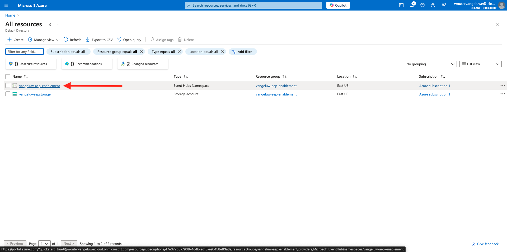

# 2.4.3 Configurar o destino do Hub de eventos do Azure no Adobe Experience Platform

## Identificar parâmetros de Conexão do Azure obrigatórios

Para configurar um destino do Hub de eventos no Adobe Experience Platform, você precisa de:

- Namespace dos Hubs de Eventos
- Hub de eventos
- Nome da chave SAS do Azure
- Chave SAS do Azure

O Hub de Eventos e o namespace do EventHub foram definidos no exercício anterior: [Configurar Hub de Eventos no Azure](./ex2.md)

### Namespace dos Hubs de Eventos

Para pesquisar as informações acima no Portal do Azure, navegue até [https://portal.azure.com/#home](https://portal.azure.com/#home). Verifique se você está usando a conta correta do Azure.

Clique em **Todos os recursos** no portal do Azure:

Localize seu **Namespace dos Hubs de Eventos** na lista e clique nele.

O nome do **Namespace de Hubs de Eventos** agora está claramente visível. Deve ser semelhante a `--aepUserLdap---aep-enablement`.

### Hub de eventos

Na página **Namespace de Hubs de Eventos**, clique em **Entidades > Hubs de Eventos** para obter uma lista de Hubs de Eventos definidos no Namespace de Hubs de Eventos. Se você seguir as convenções de nomenclatura usadas no exercício anterior, encontrará um Hub de Eventos chamado `--aepUserLdap---aep-enablement-event-hub`. Anote-o, você precisará dele no próximo exercício.

### Nome da chave SAS

Na página **Namespace de Hubs de Eventos**, clique em **Configurações > Políticas de acesso compartilhado**. Você verá uma lista de Políticas de acesso compartilhado. A Chave SAS que estamos procurando é **RootManageSharedAccessKey**, que é o **Nome de Chave SAS. Anote isso.

### Valor da chave SAS

Em seguida, clique em **RootManageSharedAccessKey** para obter o Valor da Chave SAS. E pressione o ícone **Copiar para a área de transferência** para copiar a **Chave primária**, neste caso `pqb1jEC0KLazwZzIf2gTHGr75Z+PdkYgv+AEhObbQEY=`.

### Resumo dos valores de destino

Neste ponto, você deve ter identificado todos os valores necessários para definir o destino do Azure Event Hub na CDP em tempo real do Adobe Experience Platform.

| Nome do atributo de destino | Valor do atributo de destino | Exemplo de valor |
|---|---|---|
| sasKeyName | Nome da chave SAS | RootManageSharedAccessKey |
| sasKey | Valor da chave SAS | pqb1jEC0KLazwZzIf2gTHGr75Z+PdkYgv+AEhObbQEY= |
| namespace | Namespace dos Hubs de Eventos | `--aepUserLdap---aep-enablement` |
| eventHubName | Hub de eventos | `--aepUserLdap---aep-enablement-event-hub` |

## Criar destino do Azure Event Hub no Adobe Experience Platform

Faça logon no Adobe Experience Platform acessando esta URL: [https://experience.adobe.com/platform](https://experience.adobe.com/platform).

Depois de fazer logon, você chegará à página inicial do Adobe Experience Platform.

Antes de continuar, você precisa selecionar uma **sandbox**. A sandbox a ser selecionada é chamada ``--aepSandboxName--``. Depois de selecionar a sandbox apropriada, você verá a alteração da tela e agora estará em sua sandbox dedicada.

Vá para **Destinos** e vá para **Catálogo**. Selecione **Armazenamento na nuvem**, vá para **Hubs de Eventos do Azure** e clique em **Configurar**.

Selecione **Autenticação padrão**. Preencha os detalhes da conexão coletados no exercício anterior. Em seguida, clique em **Conectar ao Destino**.

Se suas credenciais estiverem corretas, você verá uma confirmação: **Conectado**.

Agora é necessário inserir o nome e a descrição no formato `--aepUserLdap---aep-enablement`. Insira o **eventHubName** (veja o exercício anterior, ele tem a seguinte aparência: `--aepUserLdap---aep-enablement-event-hub`) e clique em **Avançar**.

Opcionalmente, é possível selecionar uma Política de governança de dados. Clique em **Salvar e sair**.

Seu destino foi criado e está disponível no Adobe Experience Platform.

## Próximas etapas

Ir para [2.4.4 Criar um público-alvo](./ex4.md){target="_blank"}

Voltar para [Real-Time CDP: Audience Activation para o Hub de Eventos do Microsoft Azure](./segment-activation-microsoft-azure-eventhub.md){target="_blank"}

Voltar para [Todos os módulos](./../../../../overview.md){target="_blank"}
