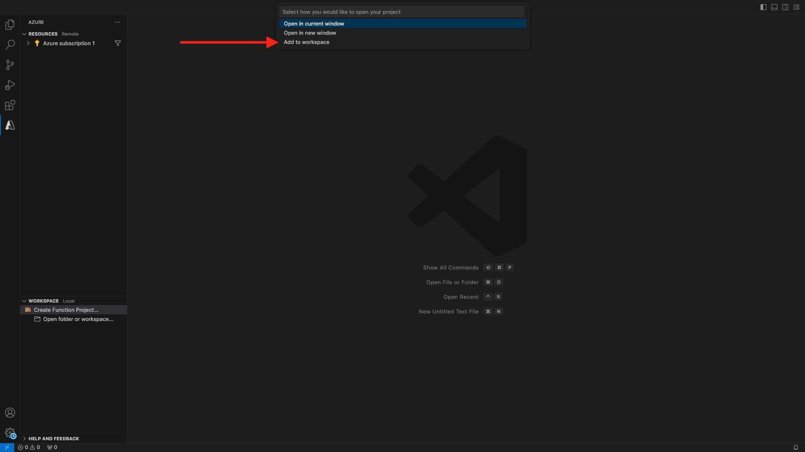

# 2.4.6 Criar seu projeto do Microsoft Azure

## Familiarizando-se com as funções do Azure Event Hub

As Funções do Azure permitem executar pequenos pedaços de código (chamados **funções**) sem se preocupar com a infraestrutura do aplicativo. Com as Funções do Azure, a infraestrutura em nuvem fornece todos os servidores atualizados necessários para manter seu aplicativo em execução em escala.
Uma função é **acionada** por um tipo específico de evento. Os acionadores compatíveis incluem responder a alterações nos dados, responder a mensagens (por exemplo, Hubs de Eventos), executadas em uma programação ou como o resultado de uma solicitação HTTP.
As Funções do Azure são um serviço de computação sem servidor que permite executar código acionado por eventos sem precisar provisionar ou gerenciar explicitamente a infraestrutura.
Os Hubs de Eventos do Azure se integram às Funções do Azure para uma arquitetura sem servidor.

## Abrir código do Visual Studio e fazer logon no Azure

O Visual Studio Code facilita...
- definir e vincular funções do Azure aos Hubs de Eventos- testar localmente- implantar no Azure- execução da função de log remoto

### Abrir Visual Studio Code

### Fazer logon no Azure

Ao fazer logon com sua conta do Azure usada para registrar no exercício anterior, o Visual Studio Code permitirá localizar e vincular todos os recursos do Hub de Eventos.
Abra o Visual Studio Code e clique no ícone **Azure**.
Próxima seleção **Entrar no Azure**:

Você será redirecionado ao seu navegador para fazer logon. Lembre-se de selecionar a conta do Azure que você usou para registrar.
Ao ver a tela a seguir no navegador, você está conectado com o Visual Code Studio:

Retorne ao Visual Code Studio (você verá o nome da sua assinatura do Azure, por exemplo **Assinatura do Azure 1**):


## Criar um projeto do Azure

Clique em **Criar projeto de função...**:

Selecione ou crie uma pasta local de sua escolha para salvar o projeto e clique em **Selecionar**:

Agora você entrará no assistente de criação de projeto. Clique em **Javascript** como a linguagem do projeto:

Em seguida, selecione **Modelo v4**.

Selecione **Acionador do Hub de Eventos do Azure** como o primeiro modelo de função do seu projeto:

Digite um nome para a função, use o seguinte formato `--aepUserLdap---aep-event-hub-trigger` e pressione enter:

Selecione **Criar nova configuração de aplicativo local**:

Clique para selecionar o Namespace do Hub de Eventos que você criou anteriormente, que se chama `--aepUserLdap---aep-enablement`.

Em seguida, clique para selecionar o Hub de Eventos criado anteriormente, chamado `--aepUserLdap---aep-enablement-event-hub`.

Clique para selecionar **RootManageSharedAccessKey** como sua política do Hub de Eventos:

Selecione **Adicionar ao espaço de trabalho** para saber como abrir seu projeto:

Você pode então receber uma mensagem como esta. Nesse caso, clique em **Sim, eu confio nos autores**.

Após criar o projeto, abra o arquivo `--aepUserLdap---aep-event-hub-trigger.js` no editor:

A carga enviada pelo Adobe Experience Platform para o Hub de eventos será semelhante a:

```json
{
  "identityMap": {
    "ecid": [
      {
        "id": "36281682065771928820739672071812090802"
      }
    ]
  },
  "segmentMembership": {
    "ups": {
      "94db5aed-b90e-478d-9637-9b0fad5bba11": {
        "createdAt": 1732129904025,
        "lastQualificationTime": "2024-11-21T07:33:52Z",
        "mappingCreatedAt": 1732130611000,
        "mappingUpdatedAt": 1732130611000,
        "name": "vangeluw - Interest in Plans",
        "status": "realized",
        "updatedAt": 1732129904025
      }
    }
  }
}
```

Atualize o código em seu `--aepUserLdap---aep-event-hub-trigger.js` do Visual Studio Code com o código abaixo. Esse código será executado sempre que a Real-time CDP enviar qualificações de público-alvo para o destino do Hub de eventos. Neste exemplo, o código é apenas para exibir a carga útil recebida, mas você pode imaginar qualquer tipo de função adicional para processar as qualificações do público-alvo em tempo real e usar o ecossistema do pipeline de dados.
A linha 11 no seu arquivo `--aepUserLdap---aep-event-hub-trigger.js` atualmente mostra isto:

```javascript
context.log('Event hub message:', message);
```

Altere a linha 11 em `--aepUserLdap---aep-event-hub-trigger.js` para que tenha esta aparência:

```javascript
context.log('Event hub message:', JSON.stringify(message));
```

A carga útil total deve ser desta forma:

```javascript
const { app } = require('@azure/functions');

app.eventHub('--aepUserLdap---aep-event-hub-trigger', {
    connection: '--aepUserLdap--aepenablement_RootManageSharedAccessKey_EVENTHUB',
    eventHubName: '--aepUserLdap---aep-enablement-event-hub',
    cardinality: 'many',
    handler: (messages, context) => {
        if (Array.isArray(messages)) {
            context.log(`Event hub function processed ${messages.length} messages`);
            for (const message of messages) {
                context.log('Event hub message:', message);
            }
        } else {
            context.log('Event hub function processed message:', messages);
        }
    }
});
```


O resultado deve ficar assim:


## Executar projeto do Azure

Agora é hora de executar o projeto. Nesta etapa, não implantaremos o projeto no Azure. Vamos executá-lo localmente no modo de depuração. Selecione o ícone Executar e clique na seta verde.

Na primeira vez que você executar seu projeto no modo de depuração, precisará anexar uma conta de armazenamento do Azure, clique em **Selecionar conta de armazenamento**.

e selecione a conta de armazenamento criada anteriormente, chamada `--aepUserLdap--aepstorage`.

Seu projeto está em execução e está listando eventos no Hub de eventos. No próximo exercício, você demonstrará o comportamento no site de demonstração do CitiSignal que o qualificará para públicos-alvo. Como resultado, você receberá uma carga de qualificação de público-alvo no terminal da função de acionador do Hub de eventos.


## Parar Projeto do Azure

Para interromper o projeto, vá para a **PILHA DE CHAMADAS** no VSC, clique na seta do projeto em execução e clique em **Parar**.


## Próximas etapas

Ir para [2.4.7 Cenário completo](./ex7.md){target="_blank"}
Voltar para [Real-Time CDP: Audience Activation para o Hub de Eventos do Microsoft Azure](./segment-activation-microsoft-azure-eventhub.md){target="_blank"}
Voltar para [Todos os módulos](./../../../../overview.md){target="_blank"}
