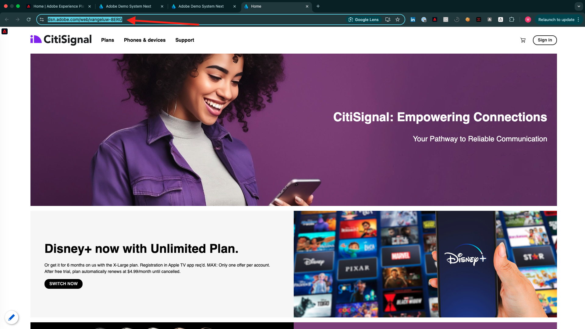
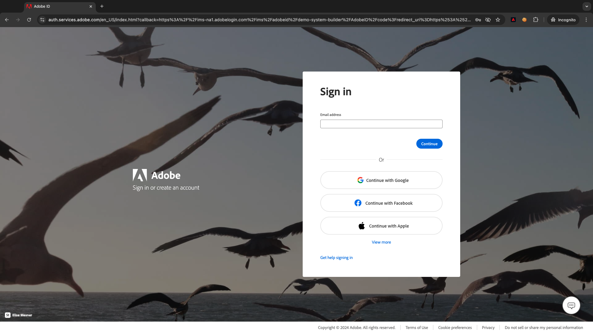
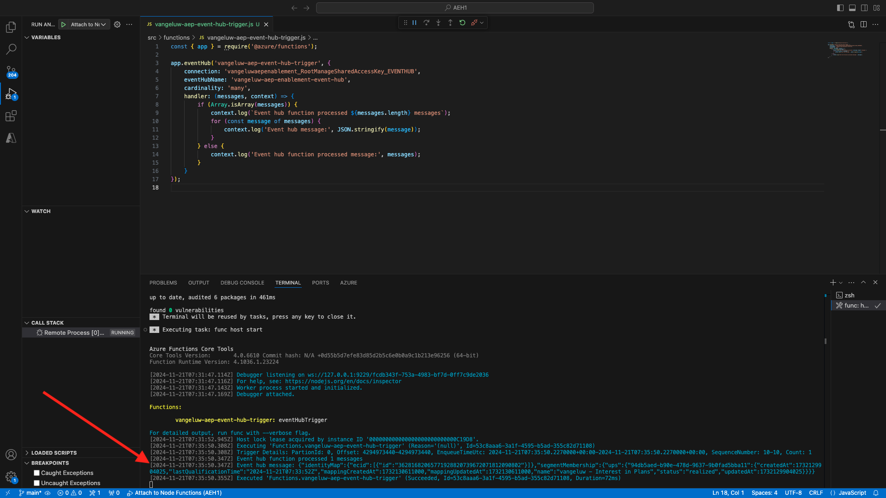

# 2.4.7 Cenário completo

## Iniciar acionador do Hub de Eventos da Azure

Para mostrar o conteúdo enviado pela Adobe Experience Platform Real-time CDP ao nosso Azure Event Hub após a qualificação do público, precisamos iniciar nossa simples função de acionador do Azure Event Hub. Esta função irá &quot;despejar&quot; a carga para o console no Visual Studio Code. Mas lembre-se de que essa função pode ser estendida de qualquer maneira para fazer interface com todos os tipos de ambientes usando APIs e protocolos dedicados.

### Inicie o Visual Studio Code e inicie o projeto

Verifique se o projeto do Visual Studio Code está aberto e em execução

Para iniciar/parar/reiniciar sua função do Azure no Visual Studio Code, consulte o exercício anterior.

Seu **Terminal** do Visual Studio Code deve mencionar algo semelhante a isto:

```code
[2024-11-20T20:07:12.316Z] Debugger listening on ws://127.0.0.1:9229/86c8e251-8e2f-4c65-a063-cda77edbf2ca
[2024-11-20T20:07:12.318Z] For help, see: https://nodejs.org/en/docs/inspector
[2024-11-20T20:07:12.343Z] Worker process started and initialized.
[2024-11-20T20:07:12.359Z] Debugger attached.

Functions:

        vangeluw-aep-event-hub-trigger: eventHubTrigger

For detailed output, run func with --verbose flag.
[2024-11-20T20:07:18.150Z] Host lock lease acquired by instance ID '000000000000000000000000000C19D8'.
```

## Carregue seu site Citi Signal

Ir para [https://dsn.adobe.com](https://dsn.adobe.com). Depois de fazer logon com sua Adobe ID, você verá isso. Clique nos 3 pontos **...** do projeto do site e clique em **Executar** para abri-lo.


Você verá seu site de demonstração aberto. Selecione o URL e copie-o para a área de transferência.



Abra uma nova janela incógnita do navegador.


Cole o URL do site de demonstração que você copiou na etapa anterior. Você será solicitado a fazer logon usando sua Adobe ID.



Selecione o tipo de conta e conclua o processo de logon.


Em seguida, você verá seu site carregado em uma janela incógnita do navegador. Para cada exercício, será necessário usar uma janela do navegador nova e incógnita para carregar o URL do site de demonstração.


## Qualifique-se para o seu público

Navegue até a página **Planos**. Esta ação o qualificará para o público-alvo `--aepUserLdap-- - Interest in Plans`.


Para verificar, abra o painel Visualizador de perfis. Agora você deve ser membro de `--aepUserLdap-- - Interest in Plans`. Se as associações de público-alvo ainda não tiverem sido atualizadas no painel do Visualizador de perfis, clique no botão Recarregar.


Retorne ao Visual Studio Code e observe a guia **TERMINAL**. Você deve ver uma lista de públicos-alvo para a sua **ECID** específica. Essa carga de ativação é entregue ao hub de eventos assim que você se qualifica para o público-alvo do `--aepUserLdap-- - Interest in Plans`.



Ao analisar mais de perto a carga do público, você pode ver que `--aepUserLdap-- - Interest in Plans` está no status **realizado**.

```json
{
  "identityMap": {
    "ecid": [
      {
        "id": "36281682065771928820739672071812090802"
      }
    ]
  },
  "segmentMembership": {
    "ups": {
      "94db5aed-b90e-478d-9637-9b0fad5bba11": {
        "createdAt": 1732129904025,
        "lastQualificationTime": "2024-11-21T07:33:52Z",
        "mappingCreatedAt": 1732130611000,
        "mappingUpdatedAt": 1732130611000,
        "name": "vangeluw - Interest in Plans",
        "status": "realized",
        "updatedAt": 1732129904025
      }
    }
  }
}
```

Um status de público-alvo de **realizado** significa que seu perfil faz parte do público-alvo, enquanto o status **encerrado** significa que seu perfil foi removido do público-alvo.

## Próximas etapas

Voltar para [Real-Time CDP: Audience Activation para o Hub de Eventos da Microsoft Azure](./segment-activation-microsoft-azure-eventhub.md){target="_blank"}

Voltar para [Todos os módulos](./../../../../overview.md){target="_blank"}
