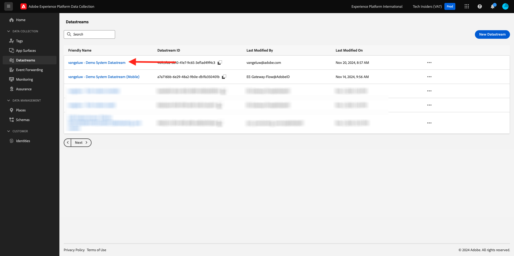
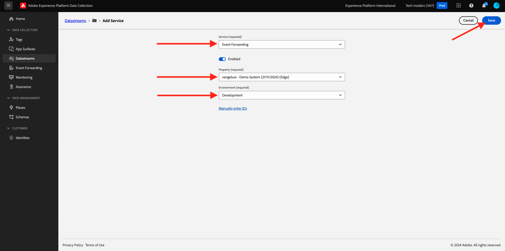

# 2.5.2 Atualize sua sequência de dados para disponibilizar os dados para sua propriedade do Servidor de coleta de dados da Adobe Experience Platform

## Atualizar a sequência de dados

Em [Introdução](./../../../getting-started/gettingstarted/ex2.md), você criou seu próprio **[!UICONTROL Datastream]**. Você usou o nome `--aepUserLdap-- - Demo System Datastream`.

Neste exercício, você precisa configurar o **[!UICONTROL Datastream]** para funcionar com sua **propriedade do Servidor de Coleta de Dados**.

Para fazer isso, vá para [https://experience.adobe.com/#/data-collection/](https://experience.adobe.com/#/data-collection/). Você verá isso. No menu esquerdo, clique em **[!UICONTROL Datastreams]**.

No canto superior direito da tela, selecione o nome da sandbox, que deve ser `--aepSandboxName--`.

Procure pela sua **[!UICONTROL Sequência de dados]**, chamada `--aepUserLdap-- - Demo System Datastream`. Clique na **[!UICONTROL Sequência de dados]** para abri-la.

Você verá isso. Clique em **[!UICONTROL + Adicionar Serviço]**.

Selecione o serviço **Encaminhamento de Eventos**. Isso mostrará duas configurações adicionais. Selecione a propriedade Encaminhamento de eventos, que você criou no exercício anterior e que se chama `--aepUserLdap-- - Demo System (DD/MM/YYYY) (Edge)`. Em seguida, selecione **Desenvolvimento** em **Ambiente**. Clique em **Salvar**.

Sua sequência de dados foi atualizada e está pronta para uso.

A sequência de dados agora está pronta para funcionar com o **[!DNL Event Forwarding property]**.

## Próximas etapas

Ir para [2.5.3 Criar e configurar um webhook personalizado](./ex3.md){target="_blank"}

Voltar para [Conexões do Real-Time CDP: Encaminhamento de Eventos](./aep-data-collection-ssf.md){target="_blank"}

Voltar para [Todos os módulos](./../../../../overview.md){target="_blank"}
