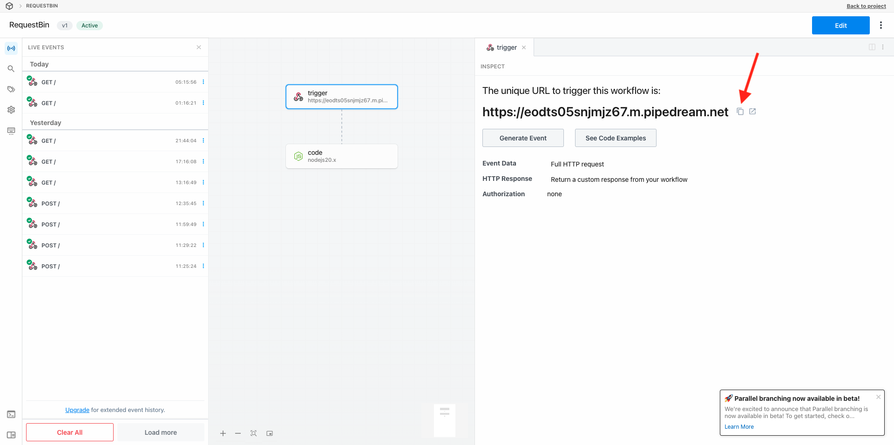
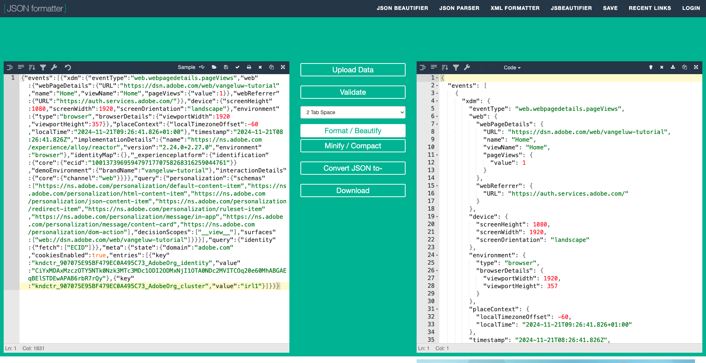

# 2.5.3 Criar e configurar um webhook personalizado

## Criar seu webhook personalizado

Ir para [https://pipedream.com/requestbin](https://pipedream.com/requestbin). Você já usou este aplicativo no [Exercício 2.3.6 Destinos SDK](./../../../../modules/delivery-activation/rtcdp-b2c/rtcdpb2c-3/ex6.md)

Se você ainda não tiver usado esse serviço, crie uma conta e um espaço de trabalho. Depois que o espaço de trabalho for criado, você verá algo semelhante a isso.

Clique em **copiar** para copiar a url. Você precisará especificar esse url no próximo exercício. A URL neste exemplo é `https://eodts05snjmjz67.m.pipedream.net`.

Este site criou este webhook para você e você poderá configurar este webhook no **[!DNL Event Forwarding property]** para começar a testar o encaminhamento de eventos.

## Atualizar a propriedade de encaminhamento de eventos: Criar um elemento de dados

Vá para [https://experience.adobe.com/#/data-collection/](https://experience.adobe.com/#/data-collection/) e vá para **Encaminhamento de Eventos**. Pesquise na propriedade de encaminhamento de eventos e clique nela para abri-la.

No menu esquerdo, vá para **Elementos de Dados**. Clique em **Criar novo elemento de dados**.

Você verá um novo elemento de dados para configurar.

Faça a seguinte seleção:

- Como o **Nome**, digite **Evento XDM**.
- Como a **Extensão**, selecione **Principal**.
- Como o **Tipo de Elemento de Dados**, selecione **Caminho**.
- Como o **Caminho**, selecione **Ler dados do XDM (arc.event.xdm)**. Ao selecionar este caminho, você filtrará a seção **XDM** da carga do evento enviada pelo site ou aplicativo móvel para o Adobe Edge.

Agora você terá isto. Clique em **Salvar**.

>[!NOTE]
>
>No caminho acima, é feita uma referência a **arc**. **arc** significa Contexto de Recursos do Adobe e **arc** sempre significa o maior objeto disponível no contexto do Server Side. Enriquecimentos e transformações podem ser adicionados a esse objeto **arc** usando as funções do Servidor de Coleta de Dados da Adobe Experience Platform.
>
>No caminho acima, é feita uma referência ao **evento**. **event** significa um evento exclusivo e o Adobe Experience Platform Data Collection Server sempre avaliará cada evento individualmente. Às vezes, você pode ver uma referência a **eventos** na carga enviada pelo Web SDK Client Side, mas no Adobe Experience Platform Data Collection Server, cada evento é avaliado individualmente.

## Atualizar a propriedade do Servidor de coleta de dados da Adobe Experience Platform: Criar uma regra

No menu esquerdo, vá para **Regras**. Clique em **Criar nova regra**.

Você verá uma nova regra a ser configurada. Insira o **Nome**: **Todas as páginas**. Para este exercício, não será necessário configurar uma condição. Em vez disso, você configurará uma ação. Clique no botão **+ Adicionar** em **Ações**.

Você verá isso. Faça a seguinte seleção:

- Selecione a **Extensão**: **Adobe Cloud Connector**.
- Selecione o **Tipo de ação**: **Fazer chamada de busca**.

Isso deve fornecer a você este **Nome**: **Conector de nuvem do Adobe - Fazer chamada de busca**. Agora você deve ver isso:

Em seguida, configure o seguinte:

- Altere o método de solicitação do GET para **POST**
- Insira a URL do webhook personalizado que você criou em uma das etapas anteriores, com esta aparência: `https://eodts05snjmjz67.m.pipedream.net`

Agora você deve ter isso. Em seguida, vá para **Corpo**.

Você verá isso. Clique no ícone do elemento de dados conforme indicado abaixo.

Na janela pop-up, selecione o elemento de dados **XDM Event** que você criou na etapa anterior. Clique em **Selecionar**.

Você verá isso. Clique em **Manter alterações**.

Você verá isso. Clique em **Salvar**.

Agora você configurou sua primeira regra em uma propriedade de encaminhamento de eventos. Vá para **Fluxo de Publicação** para publicar suas alterações.
Abra a biblioteca de desenvolvimento **Principal** clicando em **Editar** conforme indicado.

Clique no botão **Adicionar todos os recursos alterados**, após o qual você verá sua Regra e Elemento de Dados aparecerem nesta biblioteca. Em seguida, clique em **Salvar e criar para desenvolvimento**. Suas alterações estão sendo implantadas.

Após alguns minutos, você verá que a implantação foi concluída e está pronta para ser testada.

## Testar sua configuração

Ir para [https://dsn.adobe.com](https://dsn.adobe.com). Depois de fazer logon com sua Adobe ID, você verá isso. Clique nos 3 pontos **...** do projeto do site e clique em **Executar** para abri-lo.

Você verá seu site de demonstração aberto. Selecione o URL e copie-o para a área de transferência.

Abra uma nova janela incógnita do navegador.

Cole o URL do site de demonstração que você copiou na etapa anterior. Você será solicitado a fazer logon usando sua Adobe ID.

Selecione o tipo de conta e conclua o processo de logon.

Em seguida, você verá seu site carregado em uma janela incógnita do navegador. Para cada exercício, será necessário usar uma janela do navegador nova e incógnita para carregar o URL do site de demonstração.

Ao abrir a Exibição do desenvolvedor do seu navegador, você pode inspecionar as solicitações de Rede conforme indicado abaixo. Ao usar o filtro **interagir**, você verá as solicitações de rede enviadas pelo Cliente de Coleção de Dados da Adobe Experience Platform para o Adobe Edge.

Se você selecionar a carga bruta, vá para [https://jsonformatter.org/json-pretty-print](https://jsonformatter.org/json-pretty-print) e cole a carga. Clique em **Minificar/Embelhar**. Você verá a carga JSON, o objeto **events** e o objeto **xdm**. Em uma das etapas anteriores, ao definir o Elemento de dados, você usou a referência **arc.event.xdm**, que resultará na análise do objeto **xdm** desta carga.

Mude sua exibição para o webhook personalizado [https://pipedream.com/requestbin](https://pipedream.com/requestbin) que você usou em uma das etapas anteriores. Agora você deve ter uma visualização semelhante a esta, com solicitações de rede sendo mostradas no menu esquerdo. Você está vendo a carga **xdm** que foi filtrada para fora da solicitação de rede mostrada acima.

Role para baixo na carga para encontrar o nome da página, que neste caso é **inicial**.

Agora, ao navegar pelo site, você verá solicitações de rede adicionais tornando-se disponíveis neste webhook personalizado em tempo real.

Agora você configurou o encaminhamento de eventos do lado do servidor de cargas do Web SDK/XDM para um webhook personalizado externo. Nos próximos exercícios, você configurará uma abordagem semelhante e enviará esses mesmos dados para a Google Cloud Platform e a AWS.

## Próximas etapas

Ir para [2.5.4 Encaminhar eventos para GCP Pub/Sub](./ex4.md){target="_blank"}

Voltar para [Conexões do Real-Time CDP: Encaminhamento de Eventos](./aep-data-collection-ssf.md){target="_blank"}

Voltar para [Todos os módulos](./../../../../overview.md){target="_blank"}
