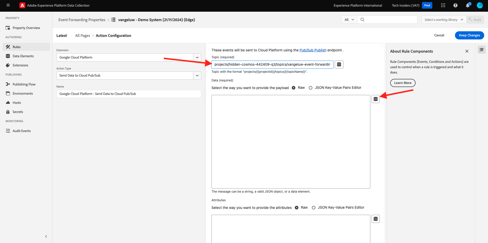

# 2.5.4 Encaminhar eventos para GCP Pub/Sub

>[!NOTE]
>
>Para este exercício, você precisa acessar um ambiente da Google Cloud Platform. Se você ainda não tiver acesso ao GCP, crie uma nova conta usando seu endereço de email pessoal.

## Criar seu Pub/Subtópico da Google Cloud

Ir para [https://console.cloud.google.com/](https://console.cloud.google.com/). Na barra de pesquisa, digite `pub/sub`. Clique no resultado da pesquisa **Pub/Sub - Mensagens globais em tempo real**.

Você verá isso. Clique em **CRIAR TÓPICO**.

Você verá isso. Para sua ID de Tópico, use `--aepUserLdap---event-forwarding`. Clique em **Criar**.

Seu tópico foi criado. Clique no **ID de assinatura** do tópico.

Você verá isso. Copie o **Nome do tópico** para a área de transferência e armazene-o, como você precisará dele nos próximos exercícios.

Agora vamos até Encaminhamento de evento de coleta de dados da Adobe Experience Platform para atualizar sua propriedade de Encaminhamento de eventos para iniciar o encaminhamento de eventos para Pub/Sub.

## Atualize sua propriedade de encaminhamento de eventos: Segredos

**Segredos** nas propriedades de Encaminhamento de Eventos são usados para armazenar credenciais que serão usadas para a autenticação em relação às APIs externas. Neste exemplo, é necessário configurar um segredo para armazenar o token OAuth da Google Cloud Platform, que será usado para autenticar ao usar Pub/Sub para transmitir dados em direção ao GCP.

Vá para [https://experience.adobe.com/#/data-collection/](https://experience.adobe.com/#/data-collection/) e vá para **Segredos**. Clique em **Criar Novo Segredo**.

Você verá isso. Siga estas instruções:

- Nome: use `--aepUserLdap---gcp-secret`
- Ambiente de Destino: selecione **Desenvolvimento**
- Tipo: **Google OAuth 2**
- Marque a caixa de seleção de **Pub/Sub**

Clique em **Criar Segredo**.

Depois de clicar em **Criar Segredo**, você verá um pop-up para configurar a autenticação entre o segredo da propriedade de Encaminhamento de Eventos e o Google. Clique em **Criar e autorizar segredo `--aepUserLdap---gcp-secret` com o Google**.

Clique em para selecionar sua conta do Google.

Clique em **Continuar**.

>[!NOTE]
>
>A mensagem pop-up pode variar. Autorize/permita o acesso solicitado para continuar com o exercício.

Após a autenticação bem-sucedida, você verá isso.

Seu segredo agora foi configurado com sucesso e pode ser usado em um elemento de dados.

## Atualizar a propriedade de encaminhamento de eventos: Elemento de dados

Para usar o segredo na propriedade de encaminhamento de eventos, é necessário criar um elemento de dados que armazenará o valor do segredo.

Vá para [https://experience.adobe.com/#/data-collection/](https://experience.adobe.com/#/data-collection/) e vá para **Encaminhamento de Eventos**. Pesquise na propriedade de encaminhamento de eventos e clique nela para abri-la.

No menu esquerdo, vá para **Elementos de Dados**. Clique em **Adicionar elemento de dados**.

Configure o elemento de dados da seguinte maneira:

- Nome: **Segredo GCP**
- Extensão: **Core**
- Tipo de Elemento de Dados: **Segredo**
- Segredo de desenvolvimento: selecione o segredo que você criou, chamado `--aepUserLdap---gcp-secret`

Clique em **Salvar**

## Atualize sua propriedade de encaminhamento de eventos: Extensão

Com seu Segredo e Elemento de dados configurados, agora é possível configurar a extensão para a Google Cloud Platform na propriedade Encaminhamento de eventos.

Vá para [https://experience.adobe.com/#/data-collection/](https://experience.adobe.com/#/data-collection/), vá para **Encaminhamento de Eventos** e abra sua propriedade de Encaminhamento de Eventos.

Em seguida, vá para **Extensões**, para **Catálogo**. Clique na extensão **Google Cloud Platform** e em **Instalar**.

Você verá isso. Clique no ícone Elemento de dados.

Selecione o elemento de dados criado no exercício anterior, denominado **Segredo GCP**. Clique em **Selecionar**.

Você verá isso. Clique em **Salvar**.

## Atualizar a propriedade de encaminhamento de eventos: atualizar uma regra

Agora que sua extensão da Google Cloud Platform está configurada, é possível definir uma regra para começar a encaminhar dados do evento para o seu Pub/Subtópico. Para fazer isso, você precisará atualizar a regra **Todas as páginas** que criou em um dos exercícios anteriores.

No menu esquerdo, vá para **Regras**. No exercício anterior, você criou a regra **Todas as páginas**. Clique nessa regra para abri-la.

Então você vai ver isso. Clique no ícone **+** em **Ações** para adicionar uma nova ação.

Você verá isso. Faça a seguinte seleção:

- Selecione a **Extensão**: **Google Cloud Platform**.
- Selecione o **Tipo de Ação**: **Enviar Dados para o Pub/Sub** da Nuvem.

Isso deve fornecer a você este **Nome**: **Plataforma de Nuvem da Google - Enviar Dados para o Pub/Sub** da Nuvem. Agora você deve ver isso:

Agora é necessário configurar o Pub/Sub tópico criado anteriormente.

Você pode encontrar o **Nome do tópico** aqui, copie-o.

Cole o **Nome do tópico** na sua configuração de Regra. Em seguida, clique no ícone Elemento de dados ao lado do campo **Dados (obrigatórios)**.

Selecione **Evento XDM** e clique em **Selecionar**.

Você verá isso. Clique em **Manter alterações**.

Clique em **Salvar**.

Você verá isso.

## Publicar suas alterações

Sua configuração foi concluída. Vá para **Fluxo de Publicação** para publicar suas alterações. Abra a biblioteca de desenvolvimento **Principal** clicando em **Editar** conforme indicado.

Clique no botão **Adicionar todos os recursos alterados**, após o qual você verá sua Regra e Elemento de Dados aparecerem nesta biblioteca. Em seguida, clique em **Salvar e criar para desenvolvimento**. Suas alterações estão sendo implantadas.

Após alguns minutos, você verá que a implantação foi concluída e está pronta para ser testada.

## Testar sua configuração

Ir para [https://dsn.adobe.com](https://dsn.adobe.com). Depois de fazer logon com sua Adobe ID, você verá isso. Clique nos 3 pontos **...** do projeto do site e clique em **Executar** para abri-lo.

Você verá seu site de demonstração aberto. Selecione o URL e copie-o para a área de transferência.

Abra uma nova janela incógnita do navegador.

Cole o URL do site de demonstração que você copiou na etapa anterior. Você será solicitado a fazer logon usando sua Adobe ID.

Selecione o tipo de conta e conclua o processo de logon.

Em seguida, você verá seu site carregado em uma janela incógnita do navegador. Para cada exercício, será necessário usar uma janela do navegador nova e incógnita para carregar o URL do site de demonstração.

Alterne sua exibição para o Pub/Sub da Google Cloud e vá para **MESSAGES**. Clique em **PULL** e após alguns segundos você verá algumas mensagens na lista. Clique em uma mensagem para visualizar seu conteúdo.

Agora você pode ver a carga XDM do seu evento no Google Pub/Sub. Agora você enviou com êxito os dados coletados pela Coleção de dados da Adobe Experience Platform, em tempo real, para um Pub/Sub endpoint da Google Cloud. A partir daí, esses dados podem ser usados por qualquer aplicativo da Google Cloud Platform, como o BigQuery para armazenamento e relatórios ou para casos de uso de aprendizado de máquina.

## Próximas etapas

Ir para [2.5.5 Encaminhar eventos para AWS Kinesis e AWS S3](./ex5.md){target="_blank"}

Voltar para [Conexões do Real-Time CDP: Encaminhamento de Eventos](./aep-data-collection-ssf.md){target="_blank"}

Voltar para [Todos os módulos](./../../../../overview.md){target="_blank"}
