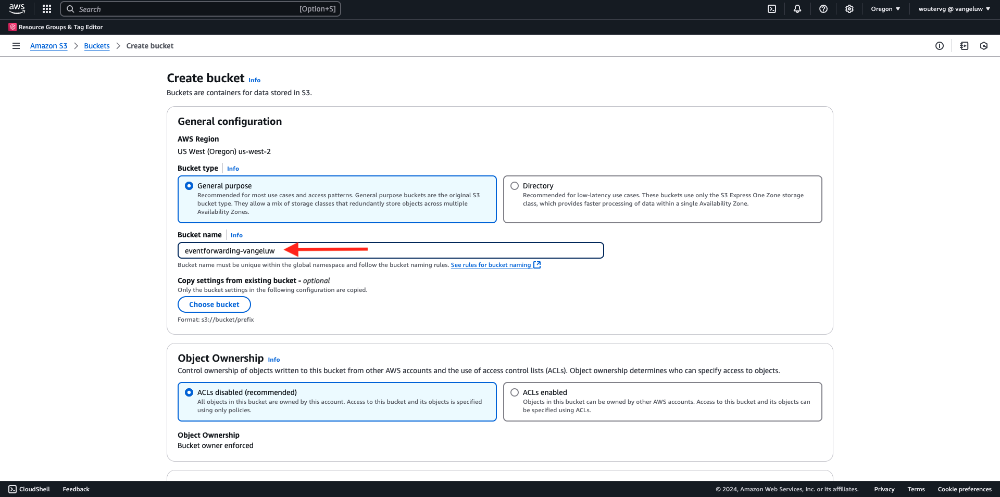
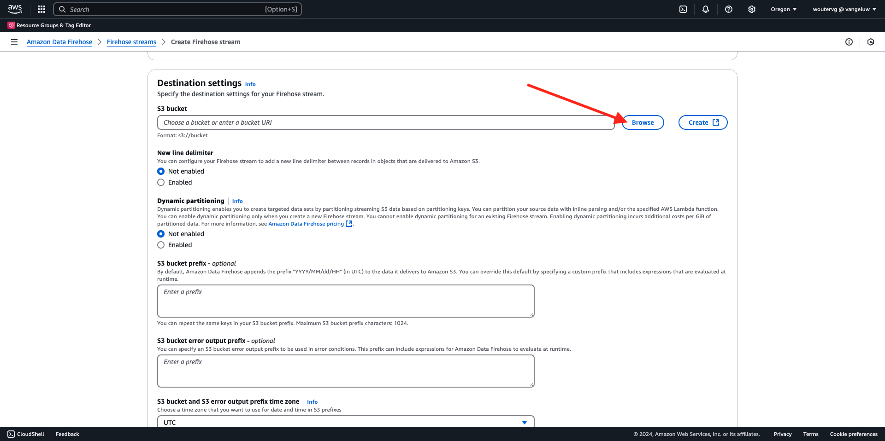
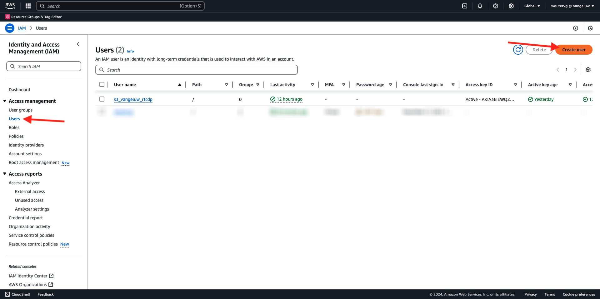
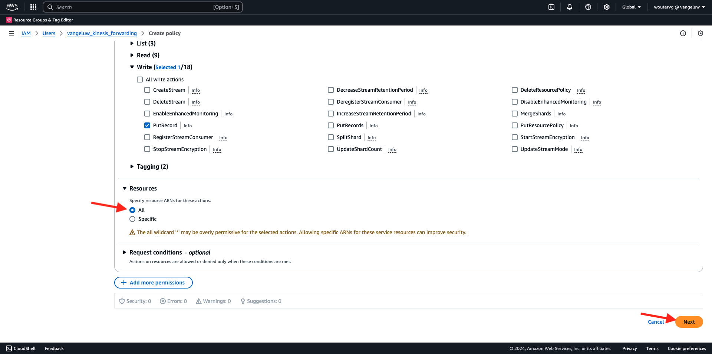

# 2.5.5 Encaminhar eventos para o AWS Kinesis e o AWS S3

>[!IMPORTANT]
>
>A conclusão deste exercício é opcional e envolve um custo para usar o AWS Kinesis. Embora a AWS forneça uma conta de camada gratuita que permite testar e configurar muitos serviços sem um custo, o AWS Kinesis não faz parte dessa conta de camada gratuita. Portanto, para implementar e testar esse exercício, um custo será envolvido para usar o AWS Kinesis.

## É bom saber

O Adobe Experience Platform oferece suporte a vários serviços da Amazon como destino.
Kinesis e S3 são [destinos de exportação de perfil](https://experienceleague.adobe.com/docs/experience-platform/destinations/destination-types.html?lang=en) e podem ser usados como parte do Real-Time CDP da Adobe Experience Platform.
Você pode alimentar facilmente eventos de segmento de alto valor e atributos de perfil associados em seus sistemas de escolha.

Neste exercício, você aprenderá a configurar seu próprio fluxo do Amazon Kinesis para transmitir dados do evento provenientes do ecossistema do Adobe Experience Platform Edge para um destino de armazenamento na nuvem, como o Amazon S3. Isso é útil caso você queira coletar eventos de experiência de propriedades da Web e de dispositivos móveis e enviá-los para o seu datalake para análise e relatórios operacionais. As soluções de dados geralmente assimilam dados em lote com grandes importações diárias de arquivos. Elas não expõem o endpoint http público que pode ser usado em conjunto com o encaminhamento de eventos.

O suporte aos casos de uso acima implica que os dados transmitidos precisam ser armazenados em buffer ou colocados em uma fila antes de serem gravados em um arquivo. Tenha cuidado para não abrir arquivos para acesso de gravação em vários processos. Delegar esta tarefa para sistema dedicado é ideal para escalar bem, garantindo um grande nível de serviço, é aqui que Kinesis vem para o resgate.

O Amazon Kinesis Data Streams concentra-se na assimilação e no armazenamento de fluxos de dados. O Kinesis Data Firehose concentra no fornecimento de fluxos de dados para destinos selecionados, como buckets do S3.

Como parte desse exercício, você...

- Executar uma configuração básica de um fluxo de dados Kinesis
- Criar um fluxo de entrega do Firehose e usar o bucket do S3 como destino
- Configure o gateway da API do Amazon como um endpoint da API rest para receber os dados do evento
- Encaminhar dados brutos do evento do Edge do Adobe para o fluxo do Kinesis

## Configurar o bucket do AWS S3

Vá para [https://console.aws.amazon.com](https://console.aws.amazon.com) e entre com sua conta da Amazon.

Depois de fazer logon, você será redirecionado para o **Console de Gerenciamento do AWS**.

No menu **Localizar Serviços**, procure **s3**. Clique no primeiro resultado da pesquisa: **S3 - Armazenamento Escalável na Nuvem**.

Você verá a página inicial do **Amazon S3**. Clique em **Criar bloco**.

Na tela **Criar bloco**, você precisa configurar dois itens:

- Nome: use o nome `eventforwarding---aepUserLdap--`.

Deixe todas as outras configurações padrão como estão. Role para baixo e clique em **Criar bloco**.

Você verá seu bucket ser criado e será redirecionado para a página inicial do Amazon S3.

## Configurar o fluxo de dados do AWS Kinesis

No menu **Localizar Serviços**, procure **kinesis**. Clique no primeiro resultado da pesquisa: **Kinesis - Trabalhar com dados de transmissão em tempo real**.

Selecione **Fluxos De Dados Kinesis**. Clique em **Criar fluxo de dados**.

Para o **Nome do fluxo de dados**, use `--aepUserLdap---datastream`.

Não há necessidade de alterar nenhuma das outras configurações. Role para baixo e clique em **Criar fluxo de dados**.

Você verá isso. Depois que o fluxo de dados for criado com êxito, você poderá avançar para o próximo exercício.

## Configurar o fluxo de entrega do AWS Firehose

No menu **Localizar Serviços**, procure **kinesis**. Clique em **Fogão de Dados Kinesis**.

Clique em **Criar fluxo do Firehose**.

Para **Source**, selecione **Amazon Kinesis Data Streams**. Para **Destino**, selecione **Amazon S3**. Clique em **Procurar** para selecionar seu fluxo de dados.

Selecione o fluxo de dados. Clique em **Escolher**.

Você verá isso. Lembre-se do **nome do fluxo do Firehose**, pois ele será necessário posteriormente.

Role para baixo até ver **Configurações de destino**. Clique em **Procurar** para selecionar seu bucket do S3.

Selecione seu bucket de S3 e clique em **Escolher**.

Então você verá algo assim. Atualize as seguintes configurações:

- Novo delimitador de linha: definido como **Habilitado**
- Particionamento dinâmico: definido como **Não habilitado**

Role para baixo um pouco mais e clique em **Criar fluxo do Firehose**

Após alguns minutos, o fluxo do Firehose será criado e **ficará ativo**.

## Criar usuário do IAM

No menu esquerdo do AWS IAM, clique em **Usuários**. Você verá a tela **Usuários**. Clique em **Criar usuário**.

Em seguida, configure o usuário:

- Nome de Usuário: use `--aepUserLdap--_kinesis_forwarding`

Clique em **Next**.

Em seguida, você verá essa tela de permissões. Clique em **Anexar políticas diretamente**.

Insira o termo de pesquisa **kinesisfirehose** para ver todas as políticas relacionadas. Selecione a política **AmazonKinesisFirehoseFullAccess**. Role para baixo e clique em **Próximo**.

Revise sua configuração. Clique em **Criar Usuário**.

Você verá isso. Clique em **Exibir Usuário**.

Clique em **Adicionar permissões** e em **Criar política embutida**.

Você verá isso. Selecione o serviço **Kinesis**.

Vá para **Gravar** e marque a caixa de seleção **ColocarRegistro**.

Role para baixo até **Recursos** e selecione **Todos**. Clique em **Next**.

Nomeie sua política como esta: **Kinesis_PutRecord** e clique em **Criar política**.

Você verá isso. Clique em **Credenciais de segurança**.

Clique em **Criar chave de acesso**.

Selecione o **Aplicativo em execução fora do AWS**. Role para baixo e clique em **Próximo**.

Clique em **Criar chave de acesso**

Você verá isso. Clique em **Mostrar** para ver sua chave de acesso secreta:

Sua **Chave de acesso secreta** está sendo mostrada agora.

>[!IMPORTANT]
>
>Armazene suas credenciais em um arquivo de texto no computador.
>
> - ID da chave de acesso: ...
> - Chave de acesso secreta: ...
>
> Depois de clicar em **Concluído**, você nunca verá suas credenciais novamente!

Clique em **Concluído**.

Agora você criou um usuário do IAM com as permissões apropriadas, que você precisará especificar ao configurar a extensão do AWS na propriedade de encaminhamento de eventos.

## Atualize sua propriedade de encaminhamento de eventos: Extensão

Com seu Segredo e Elemento de dados configurados, agora é possível configurar a extensão para a Google Cloud Platform na propriedade Encaminhamento de eventos.

Vá para [https://experience.adobe.com/#/data-collection/](https://experience.adobe.com/#/data-collection/), vá para **Encaminhamento de Eventos** e abra sua propriedade de Encaminhamento de Eventos.

Em seguida, vá para **Extensões**, para **Catálogo**. Clique na extensão **AWS** e em **Instalar**.

Insira as credenciais de usuário do IAM geradas no exercício anterior. Clique em **Salvar**.

Em seguida, é necessário configurar uma regra que inicie o encaminhamento dos dados do evento para o Kinesis.

## Atualizar a propriedade de encaminhamento de eventos: Regra

No menu esquerdo, vá para **Regras**. Clique para abrir a regra **Todas as páginas** que você criou em um dos exercícios anteriores.

Você verá isso. Clique no ícone **+** para adicionar uma nova ação.

Você verá isso. Faça a seguinte seleção:

- Selecione a **Extensão**: **AWS**
- Selecione o **Tipo de ação**: **Enviar dados para o fluxo de dados Kinesis**
- Nome: **AWS - Enviar Dados para o Fluxo de Dados Kinesis**

Agora você deve ver isso:

Em seguida, configure o seguinte:

- Nome do Fluxo: `--aepUserLdap---datastream`
- Região do AWS: verifique sua região na configuração do Fluxo de dados do AWS
- Chave de Partição: **0**

Você pode ver sua região do AWS aqui:

Agora você deve ter isso. Em seguida, clique no ícone do elemento de dados do campo **Dados**.

Selecione **Evento XDM** e clique em **Selecionar**.

Então você terá isto. Clique em **Manter alterações**.

Você verá isso. Clique em **Salvar**.

Vá para **Fluxo de Publicação** para publicar suas alterações.
Abra a biblioteca de desenvolvimento clicando em **Principal**.

Clique no botão **Adicionar todos os recursos alterados**, após o qual você verá suas alterações de Regra e Elemento de Dados aparecerem nesta biblioteca. Em seguida, clique em **Salvar e criar para desenvolvimento**. Suas alterações estão sendo implantadas.

Após alguns minutos, você verá que a implantação foi concluída e está pronta para ser testada.

## Testar sua configuração

Ir para [https://dsn.adobe.com](https://dsn.adobe.com). Depois de fazer logon com sua Adobe ID, você verá isso. Clique nos 3 pontos **...** do projeto do site e clique em **Executar** para abri-lo.

Você verá seu site de demonstração aberto. Selecione o URL e copie-o para a área de transferência.

Abra uma nova janela incógnita do navegador.

Cole o URL do site de demonstração que você copiou na etapa anterior. Você será solicitado a fazer logon usando sua Adobe ID.

Selecione o tipo de conta e conclua o processo de logon.

Em seguida, você verá seu site carregado em uma janela incógnita do navegador. Para cada exercício, será necessário usar uma janela do navegador nova e incógnita para carregar o URL do site de demonstração.

Mudar sua exibição para **AWS**. Ao abrir seu fluxo de dados e entrar na guia **Monitoramento**, você verá o tráfego de entrada.

Ao abrir o fluxo do Data Firehose e ir para a guia **Monitoramento**, você também verá o tráfego de entrada.

Por fim, ao examinar o S3 bucket, agora você notará arquivos que estão sendo criados nele como consequência da assimilação de dados.

Ao baixar esse arquivo e abri-lo usando um editor de texto, você verá que ele contém a carga XDM dos eventos que foram encaminhados.

>[!IMPORTANT]
>
>Assim que a configuração estiver funcionando como esperado, não se esqueça de desligar seu AWS Kinesis Data Stream e Data Firehose para evitar ser cobrado!

## Próximas etapas

Ir para [Resumo e benefícios](./summary.md){target="_blank"}

Voltar para [Conexões do Real-Time CDP: Encaminhamento de Eventos](./aep-data-collection-ssf.md){target="_blank"}

Voltar para [Todos os módulos](./../../../../overview.md){target="_blank"}
